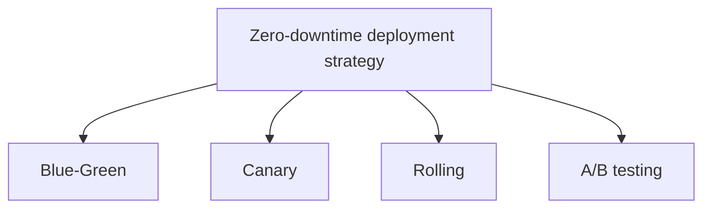

# Deployment and Testing Strategies for Running Applications

## 1. Overview

### A. Definition
> A strategy that **safely applies a new version to a production (zero-downtime) application without service impact** and verifies defects and performance before and after deployment to control release risk. It is a core axis of CI/CD and DevOps practice.

### B. Background and Necessity of Its Emergence
The old way of stopping the service and uploading a new version wholesale means immediate loss of revenue and trust for today's services that run 24/365. Moreover, as deployment cycles shorten (multiple times a day) and deployment units are finely divided into microservices, the approach of "change everything at once and roll back if a problem arises" is too risky. Thus a gradual deployment strategy became necessary—one that **exposes a change to a small number of users and instances first to detect risk early, and immediately rolls back if there is a problem (zero-downtime, fast rollback)**. The core idea is **minimizing the blast radius**—that is, keeping the affected scope as narrow as possible even if a problem erupts.

## 2. Deployment Strategies

Zero-downtime deployment strategies diverge in "how the new version is exposed," and each has a different balance of rollback speed, resource cost, and risk-detection power.

| Strategy | Method | Advantage | Trade-off |
|---|---|---|---|
| **Blue-Green** | Operate new (green) and old (blue) environments simultaneously, then switch traffic all at once | Instant rollback (just revert the switch) | 2x infrastructure cost |
| **Canary** | Expose the new version to a portion of traffic, then gradually expand | Early risk detection, minimal impact | Long deployment time, managing version coexistence |
| **Rolling** | Replace instances sequentially | Minimal extra resources | Slow rollback, brief version mixing |
| **A/B testing** | Split traffic by version to compare outcomes | Experiment on feature/business outcomes | Requires statistical design |

**Blue-Green** brings up an identical production environment, completes the new version there, and switches traffic all at once via a load balancer, so if a problem arises rollback is instantaneous—just switch back to the old environment. In return, resources double because two environments are maintained simultaneously. **Canary**, as its name derived from miners taking a canary ahead to detect toxic gas suggests, exposes the new version bit by bit at 5% → 25% → 100% while watching metrics, so it can catch risk earliest. **Rolling** replaces instances one at a time with the new version, requiring almost no extra infrastructure, but if a problem is discovered late it takes time to revert the already-replaced instances. **A/B testing** is less a deployment technique than an experiment aimed at comparing business outcomes such as the conversion rate of two versions.

## 3. Testing Strategies (Linked to Deployment Stages)

No matter how sophisticated the deployment strategy, it cannot filter out risk unless it is backed by what is verified at each stage. So tests are arranged by dividing them into **pre-, during-, and post-deployment**.

| Stage | Test | Purpose |
|---|---|---|
| **Pre-deployment** | Unit, integration, regression tests (CI); performance, security tests | Block defects in the release candidate in advance |
| **During deployment** | Canary analysis (monitoring error rate, latency), smoke tests | Detect anomalies early while exposed to real users |
| **Post-deployment (operation)** | Shadow/dark launch, feature toggles, chaos tests, A/B outcome measurement | Verification and outcome confirmation in the production environment |

The core of the pre-deployment stage is the **regression test**, which confirms that a change has not broken existing functionality, securing the reliability of the release candidate. During deployment, **canary analysis** compares the error rate and response latency of the new and old versions in real time, and if a statistically significant deterioration appears, it halts expansion and induces a rollback. Among post-deployment techniques, **shadow (dark launch)** replicates real traffic and also sends it to the new version but does not return its response to users, verifying behavior under production load without user impact. A **feature toggle (feature flag)** deploys the code but controls feature exposure separately with a switch, thereby **separating deployment from release**, so in case of a problem one can respond immediately by just turning off the switch without redeployment.

## 4. Elements That Underpin Safe Deployment

For gradual deployment and testing to be effective, there must be a foundation to "see" anomalies and to "automatically roll back" in case of a problem.

| Element | Role |
|---|---|
| **Observability** | Detect anomalies early through logs, metrics, tracing |
| **Automatic rollback** | Automatically revert to the previous version if error rate or latency exceeds a threshold |
| **Feature toggle** | Separate deployment from release to control exposure independently |
| **Gradual deployment** | Reduce incident impact by minimizing the blast radius |

In particular, **observability and automatic rollback are prerequisites for safe deployment**. Even if a canary exposes at 5%, if the metrics fail to detect a surge in the error rate in that 5%, the very purpose of early risk detection collapses; and even if it is detected, if a human responds manually, harm grows in the meantime. So a structure that automatically reverts traffic when a threshold is violated is needed.

## 5. Considerations and Implications
- **Observability + automatic rollback are prerequisites**: Without metric-based judgment and automatic recovery, no gradual deployment strategy can guarantee safety.
- **Progressive delivery automation**: It is evolving in the direction of declaratively automating canary expansion, analysis, and rollback with GitOps and tools such as Argo Rollouts and Flagger.
- **Zero-downtime handling of DB schema changes**: Even if the application is zero-downtime, a DB schema change briefly has old and new versions coexisting, so backward compatibility must be maintained with the **Expand-Contract** pattern—adding columns first and removing them later—to prevent failures during deployment.

---

> **In one line**: Zero-downtime deployment controls risk by minimizing the blast radius with *Blue-Green, Canary, Rolling, and A/B*, links tests stage by stage across *pre- (regression), during (canary analysis), and post- (shadow, feature toggle)*, and, on the premise of observability and automatic rollback, realizes safe releases through progressive delivery and Expand-Contract DB changes.
