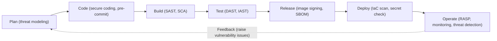
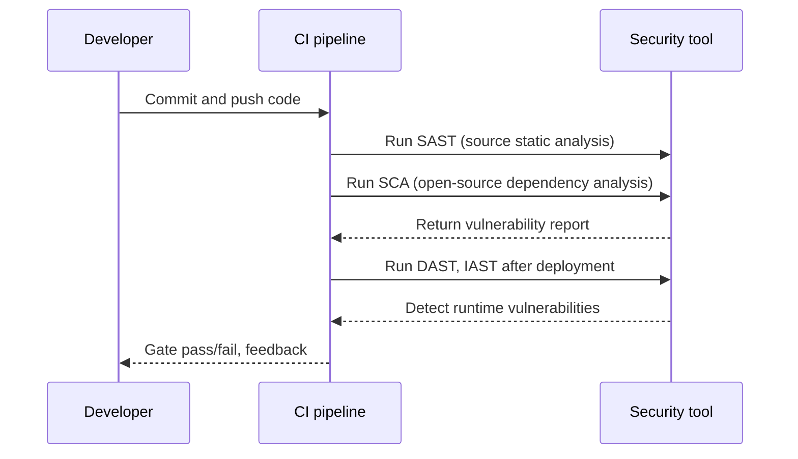

# DevSecOps

## 1. Overview

> **DevSecOps** is a development and operations culture and methodology that integrates Development, Security, and Operations into one continuous flow and **embeds security across the entire software lifecycle (SDLC) in an automated form**. Its core idea is to "make security not the final gate of development but everyone's responsibility from the start (Security as Code, Shift-Left)."

The background to DevSecOps's emergence lies in the structural conflict between existing DevOps and the traditional security regime. While DevOps shortened deployment cycles to daily and hourly units through CI/CD pipelines, security still remained a **trailing gate** where a separate security team manually inspected just before release, after development ended. As a result, security inspection became a bottleneck for fast deployment, or was formally skipped due to schedule pressure. Given that the cost of fixing a discovered vulnerability just before production deployment reaches tens of times the cost of fixing it at the design stage (the economics of early defect discovery), the structure of deferring security increased cost and risk simultaneously.

Also, as open source, containers, and cloud became universal, the attack surface exploded. Today, when a single application is composed of hundreds of open-source dependencies, container images, and IaC scripts, it is physically impossible for humans to manually inspect these for every release. DevSecOps solves this problem by **coding and automating security activities and pushing them into the pipeline (Shift-Left)**. That is, the essence of DevSecOps is converting security from control by a separate organization into a quality attribute for which developers receive immediate feedback on every commit.

## 2. DevSecOps Pipeline Architecture

The skeleton of DevSecOps is a structure that arranges a corresponding security activity at each stage of the existing CI/CD pipeline and uses the result as a gate to automatically judge whether it passes. The concept diagram below shows the overall flow in which security is inserted at each stage from planning to operation.

Each stage of this pipeline verifies security from a different perspective. In the **plan stage**, threat modeling (STRIDE, etc.) that identifies threats at the blueprint level is performed to filter out structural flaws before code is written. In the **code stage**, IDE plugins and pre-commit hooks warn the developer of vulnerable patterns and hardcoded secrets the moment they are typing. Because the discovery cost decreases the further left (earlier) one goes, DevSecOps aims to move activities as far forward as possible.

The **build and test stages** are the sections where automatic analysis tools are concentrated. Source-code static analysis (SAST) and open-source composition analysis (SCA) run at build time, and once a deployable artifact is produced, dynamic analysis (DAST) that attacks the running application from the outside, and interactive analysis (IAST) that combines instrumentation inside the runtime, follow. In the **release and deploy stages**, vulnerability scanning and digital signing of container images, generation of a software bill of materials (SBOM), and misconfiguration checks of IaC (Terraform, etc.) are performed. In the final **operate stage**, runtime self-protection (RASP) and continuous monitoring detect post-deployment threats, and discovered problems are fed back to the plan stage to complete the cyclic structure.

## 3. Core Security Analysis Techniques (SAST, DAST, IAST, SCA)

At the center of DevSecOps automation are four application security testing (AST) techniques, which work complementarily from different points in time and different perspectives. The sequence diagram below shows the process by which one commit passes through the pipeline and undergoes each analysis.

**SAST (Static Application Security Testing)** analyzes source code or bytecode without executing it to find coding vulnerabilities such as SQL injection and buffer overflow. It has the advantages of being applicable from early development and pinpointing the vulnerable spot down to the code line, but it has the limitation of many **false positives**, spewing warnings regardless of actual exploitability. Conversely, **DAST (Dynamic AST)** scans a running application from the outside like a real attacker, so it has few false positives and can confirm actual exploitability, but it cannot tell the source-code location of a vulnerability and its test coverage depends on screens and endpoints.

**IAST (Interactive AST)** is a compromise between the two: it plants instrumentation sensors (agents) inside the application to observe data flow while tests run. As a result, it can judge "whether external input actually reached a vulnerable code path," so it has low false positives and can also pinpoint the location. **SCA (Software Composition Analysis)** has a different perspective; it detects **known vulnerabilities (CVEs) and license violations in the open-source and third-party libraries** the project pulls in, not the directly written code. Given that 70-90% of today's code is composed of open source, SCA is effectively essential, and combined with SBOM it becomes the foundation of supply-chain security.

| Technique | Analysis target | Execution | Strength | Limitation |
|------|-----------|-----------|------|------|
| SAST | Source, bytecode | Static (non-executing) | Early application, pinpoints location | Many false positives |
| DAST | Running app (external) | Dynamic (executing) | Low false positives, confirms actual exploit | Location unknown, trailing |
| IAST | App-internal instrumentation | Dynamic (executing) | Both accuracy and location excellent | Performance overhead, language constraints |
| SCA | Open-source dependencies | Static (metadata analysis) | Supply-chain, license management | Misses own-code vulnerabilities |

## 4. Comparison with DevOps and the Cultural Shift

DevSecOps is often misunderstood as "DevOps with security tools added," but its essence lies not in tools but in a **shift of the responsibility model**. In the traditional model, security was the exclusive domain of a separate team, and developers focused only on feature implementation. Under the principle that "everyone is responsible for security," DevSecOps grants developers security capability and changes the security team's role from controller to **guardrail provider and enabler**. That is, instead of directly blocking each release, the security team provides automated tools, policies (Policy as Code), and standard templates that let developers make things safely on their own.

| Category | DevOps | DevSecOps |
|------|--------|-----------|
| Security position | Trailing inspection just before release | Embedded in all stages (Shift-Left) |
| Security responsibility | Separate security team | Development, operations, security jointly |
| Method | Manual gate | Automation (Security as Code) |
| Goal | Fast deployment | Fast and safe deployment |

The practical difficulty of this shift lies not in tool adoption but in **taking root in culture and process**. If automated tools spew false positives, developers come to ignore warnings (alert fatigue), and if gates are too strict, the DevOps-native value of deployment speed is damaged. Therefore, successful DevSecOps takes a gradual approach—differentiating gate strength based on risk (blocking deployment only for critical vulnerabilities) and establishing a security champion system to place security evangelists within development teams.

## 5. Application Case

Looking at the case of a large fintech financial firm, in the past it inspected vulnerabilities in a batch through external mock hacking each quarter, taking an average of over 40 days from discovery to remediation. After transitioning to DevSecOps, when it automatically ran SAST and SCA on every GitHub commit and set container-image scanning as a deployment gate, about 80% of vulnerabilities were automatically detected and blocked at the development stage, and the average remediation time was shortened from 40 days to under 2 days. In particular, right after a Critical CVE in an open-source library (e.g., remote code execution such as Log4Shell) was disclosed, the fact that it identified affected services within hours through SBOM lookup alone and deployed an emergency patch demonstrates the real utility of DevSecOps in supply-chain security.

## 6. Considerations and Implications

From a professional engineer's perspective, DevSecOps adoption must comprehensively consider the following strategic elements.

- **Gradual adoption strategy**: Putting all security tools into the pipeline at once invites resistance from the development organization due to false positives and delays. It is realistic to first apply tools with few false positives and clear effect, such as SCA and secret scanning, and to introduce gates gradually in two stages of "warn then block."
- **Managing the speed-security trade-off**: The success of DevSecOps depends on the balance of securing security without harming deployment speed. Separate full scans into a nightly pipeline and place only incremental analysis in the per-commit pipeline to minimize developer feedback delay.
- **Governance and regulatory linkage**: The pipeline must be linked with regulations such as ISMS-P, the Personal Information Protection Act, and SBOM requirements strengthened after the U.S. executive order. Coding regulatory requirements into automatic verification rules with Policy as Code also automatically accumulates audit evidence.
- **Expansion to supply-chain security**: Not only own code but also open source, containers, and CI tools themselves become attack targets (SolarWinds-type supply-chain attacks). Real defense is completed only when SBOM, image signing, and artifact integrity verification (the SLSA framework) are also included.
- **Outlook**: Going forward, DevSecOps is expected to develop by combining with AI-based automatic vulnerability detection and automatic patch generation, and with runtime threat detection in cloud-native environments (CNAPP); combined with a zero-trust architecture, it will likely converge into an integrated security system that "verifies trust from design to operation."

---

> **In one line**: DevSecOps is a development, security, and operations integration methodology that embeds security across the entire SDLC in automated form (Security as Code) and moves it as far forward as possible (Shift-Left), achieving both fast deployment and safety simultaneously.
