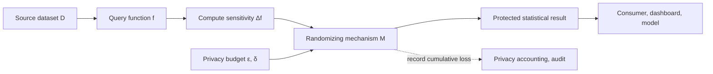
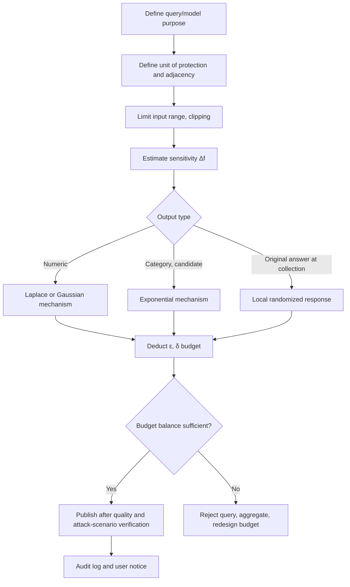

# Differential Privacy and the Privacy Budget

## 1. Overview

> **Definition**: Differential Privacy (DP) is a privacy-enhancing technology (PET) that provides randomized mechanisms and mathematical guarantees so that the probability distribution of an analysis result does not change greatly whether a single individual's data is included or excluded.

Data-driven decision-making becomes more accurate the more personal data it uses, but publishing raw data or repeated queries increases the risk of re-identification and attribute inference.
De-identification that merely deletes names and resident registration numbers is vulnerable to linkage attacks with external data, and if new attack knowledge emerges after publication, safety must be reassessed.
Differential privacy differs from existing techniques at its starting point in that it does not restrict the attacker's background knowledge but limits, by a probability ratio, the very effect that one individual's participation has on the result.

The core of DP is not to erase data permanently but to impose a guarantee condition on the public mechanism that produces results from the data.
Therefore, even for the same source data, different noise and budgets must be designed according to the query type, sensitivity, tolerable accuracy, and number of repeated disclosures.
The privacy officer must manage the privacy budget like a security setting, and the data scientist must verify statistical utility and error together.
The professional engineer must not present the algorithm alone but design governance that includes the purpose of personal data processing, the unit of protection, the result consumer, audit trails, and control of budget exhaustion during operation.

### 1.1 Background and Necessity of Its Emergence

The hardest problem in large-scale statistical publication is to provide useful aggregate results while making it impossible to infer a specific individual's contribution.
For example, when publishing the average income of a specific region, if the result changes greatly when one household is added or removed, that household's existence or characteristics can be revealed.
Introducing a certain randomness into query results dilutes the effect of individual contributions, but the randomness must not be added arbitrarily; it must be calculated from the function's sensitivity and the privacy parameters.

DP is not a claim that the dataset itself is anonymous, but a claim that the public analysis process leaks only limited information about personal data.
Therefore, even a result to which DP is applied does not remove all of the existence of a sensitive group, already-public facts, and model bias.
Unless one first decides whether the unit of protection is a person, a household, an account, or an event, the actual level of protection differs even for the same numeric ε.

## 2. Principle and Formal Definition of Differential Privacy

### 2.1 Adjacent Datasets and the Mechanism

DP compares two datasets that are adjacent to each other.
An adjacent dataset is a dataset in which one person's record has been added or deleted, or, depending on the applied policy, one person's value has been changed.
Here, instead of publishing the entire database, a query is input to a randomizing function, the mechanism \(M\), and only its output is provided externally.

The output of the mechanism can differ even when the same query is repeated.
What matters is limiting the difference in the probability that a specific output appears in the two adjacent datasets, making it difficult to determine, from the output alone, which dataset a specific individual belongs to.
This probabilistic perspective connects to a worst-case guarantee that requires no prior assumption about what auxiliary data the attacker holds.

The basic structure is to leave the source data within an authorized, controlled domain, compute the query and sensitivity, and then deliver only the protected result beyond the boundary.
The budget manager records the cost of each individual query, and if the cumulative cost exceeds the limit, rejects the query or applies a stronger protection setting.
Because the result consumer uses statistical results rather than raw records, data minimization and access control work together.

### 2.2 Formal Definition of ε-DP

A randomizing mechanism \(M\) is said to satisfy ε-differential privacy if, for all adjacent datasets \(D_1,D_2\) and all possible output events \(S\), it satisfies the following condition.

\[
Pr[M(D_1) \in S] \le e^{\varepsilon} Pr[M(D_2) \in S]
\]

ε denotes the privacy loss or privacy budget; the smaller it is, the more similar the two output distributions become and the stronger the protection.
However, ε is not an absolute safety grade or the probability of every risk, and it must be interpreted together with the mechanism, the unit of protection, and the query set.
As ε grows, the required noise generally decreases and accuracy rises, but the effect of a single individual can remain more in the result.

In practice, (ε,δ)-DP, which allows a δ, is also widely used.
This definition limits the probability ratio for most output events while additionally allowing a very small exception probability δ, enabling the use of the Gaussian mechanism and advanced composition.
δ must not be set to an arbitrarily large value; it must be documented in line with the data scale, attack model, and expected regulatory level.

### 2.3 What DP Guarantees and Does Not Guarantee

Because DP limits the change in the output distribution depending on participation, it reduces the additional risk that a specific individual's data poses to the result.
Even if an attacker combines it with other public data, the guarantee logic holds as long as the definition itself holds, and the cumulative loss over multiple processing results can also be calculated.
There is also post-processing immunity, meaning that performing post-processing on a DP result does not weaken the privacy guarantee.

On the other hand, DP does not automatically solve the source data's bias, the statistical representativeness of minority groups, the fairness of results, or system access-permission issues.
The problem of an analysis result being combined with already-public information to estimate a group's sensitive characteristics also requires separate risk assessment.
Therefore, DP is not a substitute for access control, encryption, security logs, purpose limitation, and retention-period control, but one layer of defense in depth.

|Category|Description|Key question from the professional engineer's perspective|
|---|---|---|
|Unit of protection|Deciding which of person, household, account, or event to treat as one unit|When one person creates multiple records, how is the contribution bundled?|
|ε|A pure privacy parameter limiting the probability ratio|By what policy is the cumulative ε limited across the whole service?|
|δ|A relaxation parameter allowing a very small exception probability|Is δ sufficiently small relative to the number of protected subjects and the attack likelihood?|
|Sensitivity|The maximum effect that one individual's data change has on the query result|Has sensitivity been controlled by input-range limits and clipping?|
|Utility|The degree to which the result, after noise is added, can be used for decision-making|How are error, confidence intervals, and subgroup quality verified?|

## 3. Sensitivity and Randomizing Mechanisms

### 3.1 Sensitivity Design

The global sensitivity of a function \(f\) is defined as the maximum amount by which the output can change across adjacent datasets.
A count query changes by at most 1 with the addition of one person, so its sensitivity is small, but a sum query has large sensitivity unless the range of individual values is limited.
Therefore, before publishing sums and averages, one must set an upper bound on large values such as income or usage and clip the values into the range.

Clipping is not a measure to discard outliers but a measure to confine one individual's influence within a certain range, making the protection cost computable.
However, if the upper bound is set too low, the tail of the actual distribution is cut off, creating statistical bias, and if set too high, the noise grows and utility drops.
The upper bound should be chosen based on domain knowledge, a prior distribution, sensitivity analysis, and policy criteria, and the change history must be kept.

### 3.2 The Laplace Mechanism

The Laplace mechanism adds Laplace-distributed noise to a numeric query.
Representatively, a scale proportional to the sensitivity and inversely proportional to ε is used, as in \(M(D)=f(D)+Lap(Δf/ε)\).
It is an easy-to-understand choice when the output is numeric, as in counts, sums, and averages, and one wants to apply pure ε-DP.

Applying a small ε to a count query with sensitivity 1 makes the variance of the noise large, and the result can leave the domain constraint, such as becoming negative.
Here, post-processing such as negative truncation or rounding can maintain the DP guarantee, but accuracy and bias must be measured separately.
Publishing multiple statistics simultaneously requires dividing and allocating ε among the statistics, so individual results can become less accurate as the number of queries increases.

### 3.3 The Gaussian Mechanism

The Gaussian mechanism generally targets (ε,δ)-DP and adds normally distributed noise.
It combines well with advanced composition analysis when handling multiple dimensions and iterative operations, as in vector-form statistics or machine-learning training.
However, because it introduces an exception probability δ, one must review whether δ is appropriate relative to the dataset scale and unit of protection, and specify the budget calculation model.

### 3.4 Randomized Response and the Exponential Mechanism

Randomized response is a method in which a survey respondent flips their actual answer with a certain probability before transmitting it.
It is suitable for local DP, which hides an individual's original answer at the collection stage, but noise accumulates, requiring many samples and a careful estimation procedure.
In situations where the central server does not hold raw data, one must first examine statistical error and the possibility of response manipulation rather than operational convenience.

The exponential mechanism probabilistically selects a candidate with a high utility score when the output is not a number but a candidate, policy, or recommendation item.
For example, to select a work-priority candidate without directly exposing an individual, one can compute the sensitivity of each candidate's score and then adjust the selection probability.
This method is used in decision systems where the demand to raise recommendation quality conflicts with the demand for personal-data protection.

### 3.5 Composition and Privacy Accounting

Running multiple queries on the same dataset accumulates the privacy loss of each query.
In the simplest sequential composition, the ε of each query is summed to compute the overall budget as an upper bound.
Advanced composition can provide a smaller upper bound by using the number of queries and the parameters, but the implemented accounting method and assumptions must be verified.

Privacy accounting must include the call volume of the data pipeline, dashboard refreshes, model-training iterations, and retries after failures.
Reusing cached results can reduce unnecessary budget deductions, but one must check whether cached results are inconsistent with source-data changes.
Do not treat budget exhaustion as an operational failure but as a normal protection control, and explain to users the change in aggregation level or the delay.

## 4. Application Procedure and Operational Architecture

### 4.1 Defining the Analysis Purpose and Threat Model

The first step is to specify what result is published to support whose decision-making.
Depending on whether it is an internal operational dashboard, external public statistics, or features for model training, the scope of publication and the attacker's capability differ.
Record in the threat model whether the attacker can repeatedly request the result, whether they can circumvent via multiple accounts, and whether they can combine other datasets.

If noise is added first while the analysis purpose is unclear, the level of protection is hard to explain, and the cause of reduced accuracy also cannot be traced.
First set the minimum required aggregation level and publication frequency, and confirm whether raw-data access need not be allowed.
Agree on the protection subjects and stakeholders together with the personal-data protection officer, the data owner, the statistics expert, and the service operator.

### 4.2 Budget Allocation and Query Policy

Separating the overall ε budget by service, department, dataset, and period can prevent excessive queries by one function from infringing on the protection of another function.
Pre-approving query templates and prohibiting arbitrary SQL simplifies sensitivity estimation and accounting.
Lengthening a dashboard's automatic refresh interval or caching identical results are operational techniques that save budget while maintaining accuracy.

Budget allocation is not a matter of declaring a single number but a decision that adjusts the risk-acceptance criteria and accuracy target.
When minority-group statistics are important, one must not allocate based only on the accuracy of the overall average, but use the minimum sample size and confidence-interval width together as criteria.
For budget changes, record the approver, the reason for change, the affected reports, and reproducibility in the audit log.

### 4.3 Quality Verification and the Publication Gate

Protected results are checked against the original ground truth for mean absolute error, relative error, distribution distortion, rank preservation, and per-subgroup quality.
Test domain invariants such as whether a count becomes less than 0, whether the probabilities sum to 1, and whether the relationship between sums and partial sums is maintained.
Invariant correction can be performed as post-processing, but one must analyze whether the correction creates correlations among results that enlarge the attack surface.

From a re-identification perspective, one simulates attacks that combine not only a single result but results across multiple periods and multiple dimensions.
Check whether the theoretical upper bound computed by budget accounting matches the number of calls in the actual system logs.
Publish only when quality, protection, and operational verification have all passed; if it fails, raise the aggregation level or reject the query.

## 5. Comparison of Techniques and Selection Criteria

De-identification is a data-centric approach that deletes or pseudonymizes direct identifiers.
DP is an output-centric approach that limits the sensitivity of an analysis result on a dataset, so the two techniques are not competing but can be used together.
The key difference is that even pseudonymized source data can, if aggregated repeatedly without DP, allow an individual's contribution to be inferred.

k-anonymity generalizes and suppresses so that a quasi-identifier combination looks the same as the records of at least k people, but it may not sufficiently block homogeneity attacks or background-knowledge attacks.
DP provides a probabilistic guarantee independent of attacker knowledge, but if the budget is set incorrectly or the utility demand is excessive, practical application becomes difficult.
Homomorphic encryption is a confidentiality technique that computes on encrypted data; its computational cost and implementation complexity are high, but it has the advantage that the server need not see the plaintext.
Federated learning has multiple participants jointly train a model without moving the data, but to prevent information leakage from the updates themselves, DP or secure aggregation is additionally needed.

|Technique|Protection location|Advantage|Limitation and relationship to DP|
|---|---|---|---|
|Pseudonymization, masking|Stored data, identifiers|Easy to implement, retains some operational identifiability|Vulnerable to linkage/inference attacks; does not replace DP|
|k-anonymity, l-diversity|Public tables|Intuitively explains structural identification risk|Can be vulnerable to background-knowledge/homogeneity attacks and repeated publication|
|Differential privacy|Query, model output|Quantitative, composable worst-case guarantee|Requires accuracy loss due to noise and budget design|
|Homomorphic encryption|Data during computation|Server can compute without seeing plaintext|High cost; DP can still be useful when results are published|
|Federated learning|Distributed training process|Does not gather raw data centrally|Needs DP/secure aggregation to prevent update leakage|

The selection criteria are the storage location of sensitive source data, the scope of publication of analysis results, real-time performance, computational cost, the number of repeated queries, and regulatory explainability.
When results are published repeatedly, as in public statistics, DP's budget accounting shows its strength.
For collaborative analysis with a small number of participants, a multilayered structure that combines federated learning and secure aggregation and protects the final statistics with DP is realistic.

## 6. Industry Application Cases

### 6.1 Public Population and Economic Statistics

Population censuses and regional statistics must not publish individual-level raw data but provide aggregates by region, age, and household type.
Subdividing regions too finely reveals the existence of a small number of households, while grouping them too broadly lowers policy usefulness.
Applying DP allows allocating budget to each detailed cross-tabulation and applying stronger protection or publication suppression to small cells.

The publishing agency must explain ε, δ, the unit of protection, the error range, and the publication version to statistics users.
Also, because the totals of different tables may not exactly match, consistency correction and the resulting statistical bias must be published together.
The lesson of this case is that DP should not be applied once to a single dataset but that the entire publication program should be operated as a budget unit.

### 6.2 Service-Usage Analysis and Product Improvement

Online services use click, search, and purchase events to compute per-feature usage and churn rates.
Rather than sharing individual users' action sequences directly, protecting per-period, per-feature counts and ratios with DP lets the product team confirm trends.
If the same user generates multiple events, event-unit protection can be weaker than actual individual protection, so a per-user contribution upper bound must be set.

For example, if one user can generate thousands of events a day, limit the number of events per user, clip the excess, and then compute the count's sensitivity.
This reduces the problem of one heavy user simultaneously dominating the result and the budget.
When judging differences between experiment groups, the product team should include the confidence intervals of the DP noise so as not to hastily conclude that a small improvement is significant.

### 6.3 Privacy-Preserving Machine Learning

Because the influence of individual records can remain in the model parameters during machine-learning training, one can use DP-SGD-family approaches that clip gradients and add noise.
Based on the clipping norm and noise scale of each training step, the sampling rate, and the number of iterations, the overall ε and δ of training are estimated.
The stronger the protection level, the more training convergence and accuracy can degrade, so one must evaluate not only model performance but also exposure to membership-inference attacks.

On small datasets, using the same budget makes the relative effect of noise larger.
Therefore, before training a model with DP, using a public, non-sensitive pretrained model or redesigning the training objective and unit of protection can be more cost-effective.
DP training does not eliminate all bias of the model or the harmfulness of generated outputs, so fairness and safety evaluations are performed separately.

## 7. In-Depth: NIST Evaluation Guidelines and Latest Practical Trends

In its guidelines for evaluating differential privacy guarantees, NIST describes DP as a mathematical framework that quantifies the privacy risk when personal data appears in an analysis result.
These guidelines go beyond declaring that a definition is satisfied and treat the unit of protection and adjacency, the mechanism, the parameters, composition, and implementation assumptions as objects of evaluation.
Therefore, an organization should not simply write "DP applied" in the product documentation but leave evidence of what guarantee was applied to which data-processing step.

The recent direction in practice has moved from promoting a single ε to measuring privacy guarantee and utility together.
A budget-accounting service, automatic query rejection, model-training logs, and management of parameters per publication version must be integrated as platform features.
In particular, when multiple teams share the same data, if each team uses the budget independently without central accounting, the overall guarantee can break, so an organization-level budget ledger is needed.

In a professional engineer's answer, rather than memorizing only the defining formula, it is effective to present the lifecycle from setting the unit of protection to the publication gate.
Whichever context the problem gives—public statistics, recommendation, machine learning, or data sharing—one must explain by connecting sensitivity, mechanism, budget, utility, and audit.
Also, revealing the limitations of DP together avoids the fallacy that de-identification is a cure-all and shows a design perspective that combines access control and cryptographic techniques.

## 8. Considerations and Implications

### 8.1 Unit of Protection and Contribution

In a service where one person generates multiple records, using only record-unit adjacency weakens actual individual protection.
One must limit contribution at the user or household level and first define the maximum number of events per session and per period.
Changing the unit of protection can have a more substantial effect than changing the numeric ε, so it should be reviewed together with a privacy impact assessment.

### 8.2 Making the Budget a Policy

To prevent developers from arbitrarily choosing ε and δ, create a criteria table according to data grade, publication target, period, and purpose of use.
Separate the budget by function and include reuse, retries, and batch jobs all in the accounting.
Displaying the budget balance and the reason for exhaustion on an operational dashboard lets the analysis team plan queries without circumventing protection controls.

### 8.3 Utility and Fairness

Noise can create a larger relative error in minority-group results than in the overall average.
Check per-subgroup error, confidence intervals, and variations in decision thresholds to confirm that a specific group is not systematically disadvantaged because of the protection.
Before increasing ε to raise accuracy, prioritize a design that reduces the aggregation level, publication frequency, and query duplication.

### 8.4 Implementation, Verification, and Reproducibility

Because random-number generators, clipping, sampling, and composition calculations can differ from implementation to implementation, use verified libraries and pin versions.
Fixing the seed helps test reproducibility, but separate test and production random numbers so that operational public results do not become predictable.
Preserve the parameters, the access permissions of the source data, the result-generation time, and the budget-deduction records as audit logs.

### 8.5 Combined Defense

Even if DP limits the additional risk of the output, the source-data access, transmission, and storage processes require encryption and permission control.
Only minimal personnel access the original, and pseudonymization, retention period, key management, and breach response are operated as separate controls.
Which to choose among DP, secure aggregation, homomorphic encryption, and federated learning is decided based on the attack surface and cost, not by uniformly applying a trending technology.

### 8.6 Explainability and User Notice

Because non-expert users may misunderstand ε as a protection probability, notify them of the meaning of the parameters and the statistical error together in plain language.
Record the version of the published result, the aggregation scope, the location where noise was applied, reuse restrictions, and the inquiry contact in the data catalog.
Internal approvers should confirm the computational basis and quality-measurement results rather than a declaration that protection is sufficient.

### 8.7 Outlook and Related Technologies

When generative AI and analysis platforms automatically run multiple statistics via natural-language queries, privacy accounting and query-duplication removal become even more important.
Rather than giving AI agents arbitrary query permission, allowed templates, budget tokens, result grades, and audit events should be enforced by a policy engine.
In the future, it is desirable to manage DP-guarantee figures together with model safety, fairness, and data-quality metrics in a single AI-governance dashboard.

## References

1. NIST, "Guidelines for Evaluating Differential Privacy Guarantees," https://nvlpubs.nist.gov/nistpubs/SpecialPublications/NIST.SP.800-226.pdf
2. NIST, "NIST Finalizes Guidelines for Evaluating 'Differential Privacy' Guarantees," https://www.nist.gov/news-events/news/2025/03/nist-finalizes-guidelines-evaluating-differential-privacy-guarantees-de
3. NIST, "Differential Privacy for Privacy-Preserving Data Analysis," https://www.nist.gov/blogs/cybersecurity-insights/differential-privacy-privacy-preserving-data-analysis-introduction-our
4. NIST, "Differential Privacy: Future Work & Open Challenges," https://www.nist.gov/blogs/cybersecurity-insights/differential-privacy-future-work-open-challenges
5. Dwork, C., "Differential Privacy," International Colloquium on Automata, Languages, and Programming, https://link.springer.com/chapter/10.1007/11787006_1

---

> **In one line**: Differential privacy is an output-centric PET that limits, via ε, δ, and the privacy budget, the degree to which one individual's contribution changes the analysis result, designing utility and quantitative personal-data protection together.
