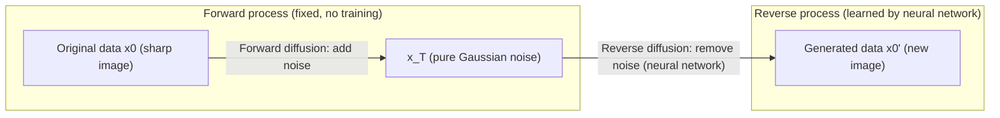
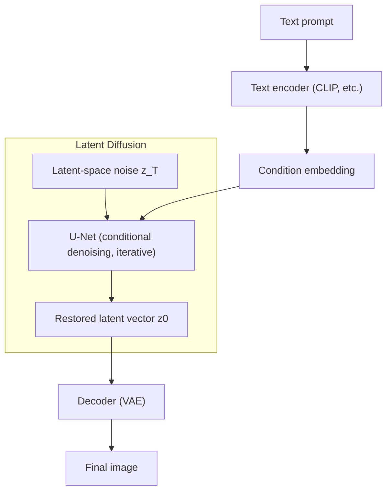

# Diffusion Model

## 1. Overview

> A **diffusion model** is a generative deep-learning model composed of a **Forward Diffusion** process, which progressively adds noise to data until it becomes pure Gaussian noise, and a **Reverse Denoising** process, which learns the inverse of that process with a neural network to restore and generate data from noise.

The goal of generative AI is to approximate the probability distribution p(x) of the training data and draw new samples from that distribution. The GAN (Generative Adversarial Network) that emerged in 2014 created high-quality images through the adversarial competition of a generator and a discriminator, but its training was unstable and it was vulnerable to mode collapse (loss of diversity). The VAE (Variational Autoencoder) trains stably but had the limitation of blurry generated images. The diffusion model solved this dilemma with the idea of "not generating in one shot, but decomposing generation into a gradual-restoration problem of hundreds of steps that peel off noise little by little." Because each step is divided into a small, tractable problem, training is stable, and it secures both sample diversity and fidelity simultaneously.

The fundamental reason diffusion draws attention is its **balance of quality, diversity, and stability**. After the 2020 DDPM (Denoising Diffusion Probabilistic Models) paper showed image quality rivaling GANs, it became the de facto standard base technology for text-to-image generation services such as Stable Diffusion, DALL·E 2, Imagen, and Midjourney through 2021-2022. Today, applications are expanding not only to images but also to audio (speech synthesis), video, 3D, and protein-structure generation, so from a professional engineer's perspective it is a subject that must be understood as a core principle of generative AI.

## 2. Principle of the Forward and Reverse Diffusion Processes

The **forward diffusion process** is a Markov chain that adds small Gaussian noise to the original data x0 at each step t to produce x1, x2, …, x_T. The strength of the noise is determined by a predefined schedule (β1…βT, a variance schedule), and T typically reaches hundreds to thousands of steps. The key point is that this process is a **fixed process** with no learnable parameters. Also, through reparameterization, the state x_t at an arbitrary step t can be computed at once from x0, giving the computational advantage that one need not sequentially simulate every step during training. For a sufficiently large T, x_T converges to a standard normal distribution in which traces of the original have vanished.

The **reverse diffusion process** learns, with a neural network, to estimate the previous step x_(t-1) from the noisy x_t. Intuitively, it is the problem of "predict what noise was mixed into this blurry image and peel off that much." In actual DDPM, the neural network is trained to predict the noise ε added at each step, and the loss takes the very simple form of the mean squared error (MSE) between the predicted noise and the actual noise. This simplicity is the secret of training stability. Once training ends, it starts from pure noise x_T and generates new data by removing noise T times with the neural network.

For the reverse-process neural network structure, the **U-Net** is widely used. The U-Net places skip connections between the encoder and decoder to preserve both the global structure and the local detail of the image simultaneously, and injects the current step t into each layer as a time embedding so that the neural network recognizes "how noisy a step it is now." Recently, methods that use the transformer-based DiT (Diffusion Transformer) as a backbone instead of the U-Net have also been spreading, and notably OpenAI's Sora video generation is known to have adopted this family.

## 3. Conditional Generation and Latent Diffusion

Early diffusion models were limited to unconditional generation, that is, making "any image." The key to practical use is **conditional generation**, which makes "what one wants." In text-to-image generation, the prompt is embedded with a text encoder such as CLIP and injected into the U-Net's cross-attention layers, so that each step of denoising follows the text condition. Combining this with the **Classifier-Free Guidance (CFG)** technique amplifies the difference between the conditioned prediction and the unconditioned prediction, greatly raising prompt fidelity. Raising the CFG strength (guidance scale) follows the prompt more faithfully but has a trade-off of lower diversity and naturalness.

Another innovation that decided the practical use of diffusion models is the **Latent Diffusion Model (LDM)**. Performing diffusion directly in pixel space (e.g., 512×512×3) requires enormous computation. LDM first compresses an image into a low-dimensional latent space (e.g., 64×64) with a VAE encoder, **performs diffusion and restoration in that latent space**, and then restores an image at the original resolution with a VAE decoder. This reduces computation by dozens of times, making high-resolution generation possible even on ordinary GPUs, and this is exactly the core structure of Stable Diffusion. Latent-space compression also has the effect of focusing on perceptually important information and relieving the burden of handling fine high-frequency noise.

| Category | Pixel-space diffusion (DDPM) | Latent diffusion (LDM/Stable Diffusion) |
|------|------|------|
| Diffusion space | Original pixels (high-dimensional) | Compressed latent vector (low-dimensional) |
| Computation, memory | Very large | Greatly reduced (dozens of times) |
| High-resolution generation | Difficult | Possible even on consumer GPUs |
| Representative model | DDPM, ADM | Stable Diffusion, SDXL |

## 4. Comparison with Other Generative Models Such as GAN

Comparing the characteristics of generative models makes clear why diffusion became mainstream. GAN generates in a single forward pass (one-shot), so **inference is fast**, but if the balance with the discriminator breaks, training diverges or repeatedly generates only a specific pattern due to mode collapse. Diffusion, conversely, has stable training and excellent sample diversity, but because it must repeat dozens to hundreds of steps during generation, its **slow inference speed** is a fundamental weakness. This shows that quality and stability conflict with speed, as the price paid for diffusion "decomposing into many small problems."

To alleviate this speed problem, techniques that greatly reduce the number of sampling steps have developed. DDIM (a deterministic non-Markovian sampler) achieves decent quality in dozens of steps, and further, the latent consistency model (LCM) and distillation techniques realize generation in as few as 1-4 steps, approaching real-time generation. In other words, the early notion of being "slow" is being rapidly resolved.

| Comparison item | GAN | VAE | Diffusion model |
|-----------|-----|-----|-------------|
| Generation quality (fidelity) | High | Medium (blurry) | Very high |
| Sample diversity | Low (risk of mode collapse) | High | High |
| Training stability | Low | High | High |
| Inference speed | Fast (1-step) | Fast | Slow (multi-step, improving) |
| Representative use | Faces, super-resolution | Representation learning | Text-to-image, video, audio |

As actual industrial application cases, in drug and materials development, diffusion is used to generate molecular structures with desired properties (protein design such as RFdiffusion); in manufacturing, when defect images are scarce, training defect data is augmented; and in media and advertising, the time to produce concept art and drafts is shortened. For one example, text-to-image services are reported to reduce a designer's initial-draft work time from hours to minutes.

## 5. Considerations and Implications

When introducing and using diffusion models, the following should be considered from a professional engineer's perspective.

- **Managing the performance-cost trade-off**: Generation quality (number of steps, resolution, guidance scale) is directly tied to inference latency and GPU cost. For a real-time service, reduce the number of steps with DDIM, LCM, and model distillation; for batch generation, prioritize quality—that is, one must design the optimal point per purpose. Structurally lowering infrastructure cost by adopting latent diffusion is also a key strategy.

- **Copyright and data governance**: Because training uses large-scale web-crawled data, issues of copyright infringement, imitation of a specific artist's style, and training-data poisoning are ever-present. One must establish in advance data-provenance management, license compliance, opt-out reflection, and policies for commercial use of generated content.

- **Countering abuse and watermarking**: Realistic generation ability can be abused for deepfakes and disinformation generation. A multilayered defense is needed—embedding invisible watermarks (e.g., SynthID) in generated content, applying provenance standards (C2PA, etc.), and blocking harmful generation with content filters and safety classifiers.

- **Selecting evaluation metrics**: Generation quality should be quantitatively evaluated with FID (Fréchet Inception Distance, distance from the real distribution), IS, and the like, while text alignment is measured with CLIP Score and user satisfaction with qualitative evaluation in parallel, enabling reliable judgment.

- **Outlook and related technologies**: It is expanding to diffusion-based video, 3D, and world models and, combined with the transformer backbone (DiT), its scaling is being strengthened. It is expected to develop into a pipeline that automates generation-verification-editing by combining with RAG, multimodal LLMs, and agents, so it needs to be understood in an integrated way in connection with foundation models and multimodal AI.

## References

- Ho et al., "Denoising Diffusion Probabilistic Models" (DDPM), 2020: https://arxiv.org/abs/2006.11239
- Rombach et al., "High-Resolution Image Synthesis with Latent Diffusion Models", 2022: https://arxiv.org/abs/2112.10752
- Stability AI, Stable Diffusion: https://stability.ai/

---

> **In one line**: A diffusion model is a generative model composed of a forward process that progressively adds noise to data and a reverse process that undoes it with a neural network; it secures training stability along with quality and diversity simultaneously, and through latent diffusion and conditional-generation techniques has established itself as the standard base technology for text-to-image and video generation.
