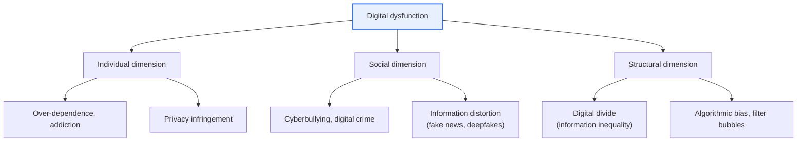
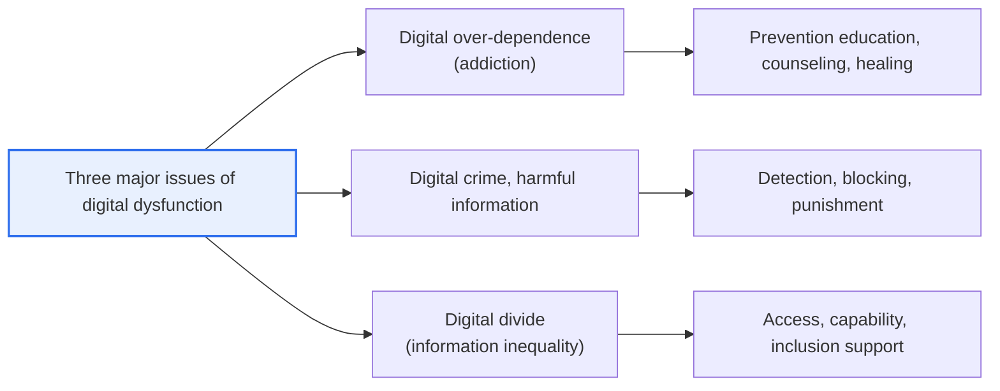

# Digital Dysfunction

## 1. Overview

### A. Definition
> **Digital Dysfunction** collectively refers to the **social and personal harms** that arise on the flip side of the benefits brought by the spread of digital technology. It is a concept encompassing smartphone and internet over-dependence (addiction), cyberbullying and digital crime, information distortion such as fake news and deepfakes, the digital divide, and privacy infringement.

The fundamental reason digital dysfunction has emerged as a serious social problem today is that **the greater the benefits of technology, the more its side effects also expand and become more sophisticated**. As smartphones, social media, and generative AI penetrate deep into daily life, on the flip side of convenience and connection, over-dependence, cyberbullying, disinformation, and privacy infringement harm individuals' health and relationships and, further, threaten the trust and safety of society as a whole. Technology is neutral in itself, but in that failing to manage the shadows of its use and diffusion erodes the very benefits the digital transformation would bring, managing dysfunction is elevated to a sustainability issue of the digital society.

In particular, recently the **very nature of dysfunction has changed qualitatively.** If past dysfunction was at the level of an individual's overuse or simple malicious comments, now deepfakes and disinformation created by generative AI have become so sophisticated as to be hard to distinguish from the real thing, and **filter bubbles and echo chambers**, in which recommendation algorithms select and show only information the user will like, fuel social polarization. That is, dysfunction is spreading beyond the individual level to structural layers such as **public opinion, democracy, and social integration**. For this reason, the response too must evolve from an individual's self-restraint or fragmentary regulation into comprehensive measures encompassing institutions, technology, education, and the social safety net.

### B. Background and Necessity of Its Emergence
Behind the prominence of digital dysfunction lie three structural changes. First, the spread of smartphones has made online access **constant and personalized**, removing the physical barrier to over-dependence. Second, as platform companies' revenue models depend on users' **engagement (dwell time)**, stimulating and addictive designs (infinite scroll, notifications, recommendations) have been structurally reinforced. Third, as the cost of producing and distributing content converges to zero, a channel opened for disinformation and harmful content to **spread explosively**.

Against this background, the reason a response to digital dysfunction is needed is clear. Because dysfunction grows proportionally as the digital transformation accelerates, leaving it unattended accumulates **social trust costs and conflict** beyond deteriorating individual mental health and crime damage. In the end, to fully realize the benefits digital technology offers, balanced management that minimizes its shadows must be a prerequisite.

## 2. Types and Cases of Digital Dysfunction

Digital dysfunction is not a single phenomenon but appears simultaneously across several layers. The concept diagram below surveys the overall landscape by dividing dysfunction into the individual, social, and structural dimensions.

The representative dysfunctions of the **individual dimension** are over-dependence and privacy infringement. Over-immersion in smartphones, games, and social media harms sleep, studies, and interpersonal relationships and, in severe cases, leads to mental-health problems such as depression and anxiety. As noted earlier, this is interlocked with platforms' engagement-maximizing design, and in that it is hard to escape by individual willpower alone, it has a structural character. Privacy infringement, as location, search, and consumption histories are extensively collected and combined, creates a situation in which individuals cannot control how their information is used.

In the **social dimension**, cyberbullying and information distortion stand out. Malicious comments, group ostracism, and digital sex crimes combine anonymity and spreadability, so harm amplifies in an instant and is hard to recover from. Information distortion is the problem of fake news, deepfakes, and manipulated statistics circulating as if they were the truth and misleading public opinion, escalating social confusion especially in situations such as elections and disasters.

The dysfunctions of the **structural dimension** are the digital divide and algorithmic bias. Differences in access and utilization ability become entrenched as inequality of opportunity in education, the economy, and welfare, and recommendation algorithms deepen confirmation bias and polarization by exposing only biased information. These are problems at the level of the social system that are not resolved by individual effort.

What is important is that these three dimensions are not independent of one another but produce a **synergy**. For example, a vulnerable group with low digital literacy (the divide of the structural dimension) is more easily deceived by fake news and deepfakes (information distortion of the social dimension), and as a result suffers economic harm from judgments based on wrong information, widening the divide further. Conversely, a group with high information capability recognizes and filters out even algorithmic bias. Because the harms of the individual, social, and structural dimensions are thus intertwined as both cause and effect, measures targeting only one layer are limited in effect, and an integrated approach is required.

| Type | Representative case | Nature |
|---|---|---|
| **Over-dependence, addiction** | Over-immersion in smartphones, games, social media | Harm to individual health and daily life |
| **Privacy infringement** | Personal-data leaks, excessive collection, surveillance | Loss of control over one's own information |
| **Cyberbullying** | Malicious comments, ostracism, digital sex crimes | Harm from anonymity and spreadability |
| **Information distortion** | Fake news, deepfakes, filter bubbles | Misleading opinion, collapse of trust |
| **Digital divide** | Access and utilization gaps between generations and classes | Structural inequality of opportunity |

## 3. The Three Major Issues of Digital Dysfunction

From an administrative and policy perspective, digital dysfunction is often condensed into and handled as **three major issues**. If the preceding typology spread out the phenomena broadly, the three major issues are a classification for focusing the policy response.

**Digital over-dependence** is the problem of losing the ability to self-regulate and harming daily life and health through over-immersion in smartphones and the internet. Because the vulnerability of children and adolescents in their growth period is particularly high, along with individual support such as prevention education, counseling, and healing programs, discussions to regulate the very design of services that induce addiction (mandating over-immersion prevention features, etc.) continue. The key is to not reduce it merely to a matter of the user's willpower but to address **environmental and design factors** together.

**Digital crime and harmful information** are problems that directly harm others and society, such as cyberbullying, digital sex crimes, illegal content, and deepfakes. The response has two axes: technology to **detect and block** harmful information, and laws and institutions to **punish** perpetrating acts. However, because there is room for conflict with freedom of expression, social consensus on what to regulate and to what extent is also required.

**The digital divide (information inequality)** is the problem of differences in access, utilization, and participation ability leading to gaps in life opportunities. Substantive resolution is possible only by encompassing not just infrastructure provision (access) but also digital capability education (utilization) and vulnerable groups' service participation (inclusion). The three issues each represent the harms of the individual, social, and structural dimensions, and in that they are intertwined and produce synergy, an integrated approach is needed.

| Issue | Core content | Response focus |
|---|---|---|
| **Digital over-dependence** | Over-immersion, loss of self-regulation | Prevention education, counseling, design regulation |
| **Digital crime, harmful information** | Cyberbullying, deepfakes, illegal content | Detection, blocking, punishment |
| **Digital divide** | Inequality of access, utilization, participation | Access, capability, inclusion support |

## 4. Response Measures and Actual Cases

Digital dysfunction **is not solved by a single means.** Technical blocking is easily circumvented, regulation alone conflicts with freedom of expression and innovation, and education alone cannot prevent immediate harm. Therefore, the standard is a multilayered response in which **institutions, technology, education, and the social safety net** work complementarily. Below, we examine each of the four axes separately, along with why that means is needed and what limitations it has.

### A. Institutional and Policy Response
Institutions become the framework for all other responses. Only when the legal basis for punishing cyberbullying, digital sex crimes, deepfakes, and privacy infringement, and platforms' management obligations, are made clear by law do technical and educational efforts become effective. At the same time, a **digital inclusion** policy that supports infrastructure, devices, and fees so that vulnerable groups are not marginalized is pursued in parallel.

However, institutional responses always have room to **conflict with freedom of expression and industrial innovation**. If the definition of harmful information is vague or regulation is excessive, it chills even legitimate expression, and there is a limitation that domestic law alone cannot regulate global platforms that cross borders. So regulation requires a **proportional and transparent design** based on social consensus.

### B. Technical Response
Technology is the realistic first line of defense that primarily filters out the flood of harmful content. Representative examples are AI filtering that automatically detects and blocks harmful information and deepfakes, identification of child-harmful material, and **watermarking and provenance** technology that indicates content is AI-generated. In that it handles a scale impossible for humans to review one by one, a technical response is essential.

However, technology does not always stay ahead in the **competition of spear and shield**. The more sophisticated generation technology becomes, the harder detection becomes, and complete blocking is nearly impossible because circumvention and re-uploading are easy. Therefore, one must use technology on the premise that it is not a cure-all but produces effect only when combined with the other axes.

### C. Educational and Social Response
The most fundamental yet slowest-acting axis is education and the social safety net. Providing **digital literacy and digital ethics education**—discerning the authenticity of information oneself and using technology with discernment—across the life cycle from children to the elderly gives users themselves immunity to dysfunction. Added to this, over-dependence prevention, counseling, and healing infrastructure and public-private cooperative governance must back it up as a social safety net.

The strength of this axis is **sustainability**. If regulation and technology are external controls, education builds users' internal judgment to create fundamental resilience. However, because the effect is not immediate, it must be pursued in parallel with institutions and technology that prevent short-term harm.

Looking at actual cases, the European Union (EU) has enacted the **Digital Services Act (DSA)**, which imposes obligations to manage harmful and illegal content on large online platforms, institutionalizing the social responsibility of platforms, and through discussion of the **AI Act**, which grades and regulates AI risks, it addresses matters such as deepfake labeling obligations. Domestically as well, internet and smartphone over-dependence prevention and counseling projects through bodies such as the National Information Society Agency (NIA), and digital capability education for vulnerable groups, continue. What these cases have in common is that they **bind together platform responsibility, technical response, and strengthening user capability**.

| Category | Response measure | Example |
|---|---|---|
| **Institutions, policy** | Laws, regulation; digital inclusion policy | EU DSA, AI Act; domestic over-dependence prevention policy |
| **Technology** | Harmful-information and deepfake detection; labeling AI-generated content | AI filtering, watermarking |
| **Education** | Digital literacy, ethics education | Life-cycle media education |
| **Society, counseling** | Prevention, counseling; public-private cooperation | Over-dependence counseling centers, governance |

## 5. In-Depth — Sophistication of Dysfunction in the Generative AI Era

The most urgent recent issue in the discussion of digital dysfunction is that **generative AI has simultaneously raised the scale and sophistication of dysfunction.** In the past, deepfakes required considerable skill and time to produce, but now that anyone can easily create realistic fake video, audio, and images, **deepfake sex crimes, impersonation of celebrities and politicians, and voice-forgery voice phishing** are surging. As authenticity discrimination becomes difficult, the problem of a situation where "you cannot believe what you see"—that is, the very foundation of social trust being shaken—emerges.

Response technologies are also evolving alongside. **Provenance and lineage standards (e.g., C2PA content credentials)** that embed invisible **watermarks** in AI-created content or record the generation history, and AI that reverse-detects deepfakes, are being developed. But because generation technology and detection technology compete like spear and shield, complete resolution by technology alone is difficult. In the end, it is emphasized that **institutions such as labeling obligations, platforms' distribution responsibility, and users' critical-reception capability** must go together.

Also, discussion of regulating the **filter bubbles and addictive design** induced by recommendation algorithms is deepening. The current of demanding that designs which trap users in specific information or induce over-immersion be transparently disclosed and that choice be guaranteed is an important shift of perspective that moves the responsibility for dysfunction **from the individual to the service design subject (the platform)**.

## 6. Considerations and Implications

1. **Technical control alone has limits.** Harmful-information blocking and deepfake detection technologies are essential but circumventable, so the fundamental solution lies in pursuing, in parallel, digital literacy education that builds users' discernment and the social safety net.
2. **The threat is qualitatively sophisticating with generative AI.** As deepfakes and disinformation become sophisticated and authenticity discrimination difficult, institutional devices such as AI-generated-content labeling obligations and provenance-verification standards must be arranged together with detection technology.
3. **A perspective that moves the center of gravity of dysfunction responsibility from the individual to the platform is needed.** Structurally induced problems such as addictive design and algorithmic bias are not solved by an individual's self-restraint alone, so the transparency of service design and operators' social responsibility must be institutionalized.
4. **Pursue a balance of digital inclusion and safety.** Achieving both inclusion, which reduces the divide so everyone enjoys digital benefits, and safety, which protects from harm, is the core of the sustainability of the digital society.
5. **The balance between regulation and freedom of expression/innovation is the key.** Because excessive harmful-information regulation can chill freedom of expression and industrial innovation, a proportional and transparent regulatory design based on social consensus is required.

## References
- National Information Society Agency (NIA), Digital Dysfunction Response: https://www.nia.or.kr/
- EU Digital Services Act (DSA) Overview: https://commission.europa.eu/strategy-and-policy/priorities-2019-2024/europe-fit-digital-age/digital-services-act_en
- C2PA (Content Provenance and Authenticity Standard): https://c2pa.org/

---

> **In one line**: Digital dysfunction appears as the three major issues of *over-dependence, digital crime (harmful information), and the digital divide*; now that deepfakes and disinformation are sophisticating with generative AI, technical control alone is insufficient, so it is a sustainability challenge of the digital society requiring institutions, technology, education, and the social safety net in parallel and extending responsibility even to platforms.
