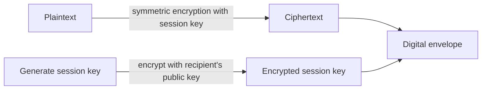

# Digital Envelope Creation and Opening Procedure

## 1. Overview

### A. Definition
> A **hybrid encryption** technique that combines the **fast encryption performance of a symmetric key** with the **secure key distribution of a public key**: the data is encrypted with a symmetric session key, and only that session key is encrypted with the recipient's public key and delivered together.

The digital envelope is clear when understood, as the name suggests, through the "envelope" metaphor. The letter body (plaintext) is locked with a cheap and fast lock (a symmetric session key), and the key to that lock (the session key) is placed in a special envelope that only the recipient can open (the recipient's public key) and sent together. This way, bulk data is processed with the fast symmetric key, while the truly difficult **key-delivery problem is safely solved with the public key**.

### B. Background and Necessity of Its Emergence
Symmetric-key encryption (AES, etc.) is fast and suitable for large volumes, but its fundamental weakness is the **key-distribution problem**, whereby sender and recipient must share the same key in advance. Simply sending a symmetric key over the network invites eavesdropping, and safely dividing it up in advance is unrealistic in large-scale communication. Conversely, public-key encryption (RSA, etc.) is elegant for key distribution since one only needs to know the counterpart's public key, but its operations are heavy, so it is **too slow to directly encrypt large volumes of data**. The digital envelope offsets the weaknesses of both approaches through the role division of "fast encryption by the symmetric key, secure key exchange by the public key." Thanks to this structure, no matter how large the amount of data actually encrypted, the public-key operation is used only once on the **short session key**, minimizing the performance burden.

## 2. Creation Procedure (Sender)

The key is that **a new session key is generated each time**. The session key is a temporary symmetric key used only once for a given communication and then discarded, so even if exposed it does not affect past or future communications, raising safety.

| Order | Content | Reason |
|---|---|---|
| 1 | Generate a random **session key (symmetric key)** | One-time per communication → minimize damage from exposure |
| 2 | **Symmetrically encrypt** the plaintext with the session key → ciphertext | Process large volumes quickly |
| 3 | Encrypt the session key with the **recipient's public key** | So only the recipient can decrypt it with their private key |
| 4 | Transmit ciphertext + encrypted session key = **digital envelope** | Deliver the data and the key together |

## 3. Opening Procedure (Recipient)

Opening is the reverse of creation. The recipient first extracts the session key inside the envelope with the **private key** that only they hold, and then symmetrically decrypts the ciphertext with that session key to restore the plaintext. Because what was locked with the public key can be opened only with the matching private key, a third party who intercepts the envelope along the way cannot obtain the session key without the private key.

| Order | Content |
|---|---|
| 1 | Decrypt the encrypted session key with the **recipient's private key** → obtain the session key |
| 2 | **Symmetrically decrypt** the ciphertext with the session key → restore the plaintext |

## 4. Combining with Digital Signatures (Security Services)

The digital envelope alone secures only **confidentiality** (hiding content). Actual secure communication also requires "whether this message has not been forged or tampered with (integrity)," "whether it was really sent by that person (authentication)," and "whether the fact of sending cannot be denied (non-repudiation)." For this, the sender sends, along with the envelope, a digital signature in which the message hash is **signed with the sender's own private key**. The recipient verifies the signature with the sender's public key, and if the signature holds, it simultaneously confirms that the holder of that private key sent it (authentication, non-repudiation) and that the hashes match, so there was no tampering (integrity).

| Service | How it is realized |
|---|---|
| **Confidentiality** | Digital envelope (encrypt the session key with the recipient's public key) |
| **Integrity** | Compare message hashes |
| **Authentication, non-repudiation** | Digital signature with the sender's private key, verification with the public key |

Thus, combining the digital envelope (using the recipient's keys) and the digital signature (using the sender's keys) can provide the **four major security services—confidentiality, integrity, authentication, and non-repudiation**—in a single message.

## 5. Considerations and Implications
The digital envelope is not an abstract theory but the actual skeleton of the secure communication we use every day. **TLS key exchange** (the RSA method) and **the email encryption of S/MIME and PGP** all follow this structure. The key from a professional engineer's perspective is managing the root of trust. First, to guarantee that the recipient's public key is truly that person's, a trust system based on **PKI and certificates (CA)** must be a prerequisite; otherwise, the session key is stolen through a man-in-the-middle attack. Second, to safely generate, store, and destroy private keys and session keys, an **HSM and key lifecycle management** are essential. Third, the RSA method risks past traffic also being decrypted if the server's private key is leaked, so the latest TLS is moving to DH-family key exchange that provides **forward secrecy (PFS)**. Furthermore, in the era when quantum computers threaten RSA, the transition to replacing the public-key part that opens the envelope with **post-quantum cryptography (PQC)** emerges as a challenge.

---

> **In one line**: A digital envelope is a hybrid technique that *quickly symmetrically encrypts plaintext with a one-time session key and encrypts only that session key with the recipient's public key* to send them together; the recipient unlocks the session key with the private key to restore the plaintext, and combined with a digital signature it provides confidentiality, integrity, authentication, and non-repudiation all together.
