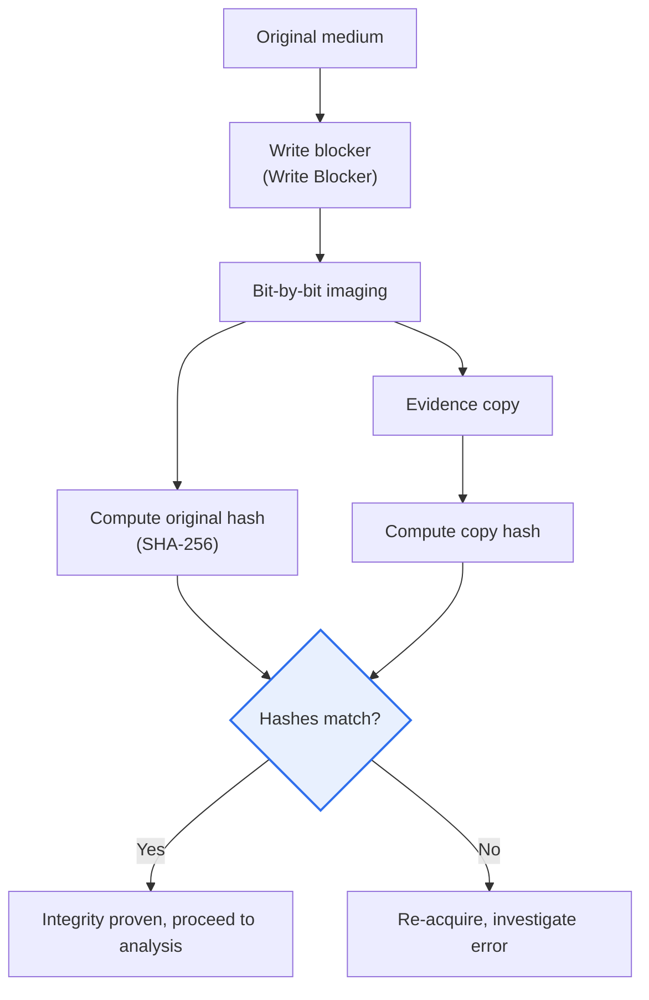

# Digital Forensics

## 1. Overview

### A. Concept and Background of Digital Forensics

> **Digital Forensics** is a scientific investigation technique that **collects, preserves, analyzes, and submits, as legal evidence, data stored and circulated on digital devices** such as computers, mobile devices, networks, and cloud. It is widely used not only in criminal investigation but also in corporate internal audits, incident response (DFIR), and electronic discovery (e-Discovery) in litigation.

The core of digital forensics lies in **admissibility (the power to be recognized as evidence in court)**. No matter how decisive the data found, if the process of collecting and analyzing it was improper, it will not be adopted as evidence in court. For example, if an investigator boots the original disk of a seized laptop as is and opens files, at that moment the access times (atime), temporary files, and logs change, arousing suspicion that "someone may have tampered with the evidence." As a result, even if the material actually belongs to the true culprit, it loses its evidentiary value. So digital forensics keeps strict procedures: **preserving the original as is and analyzing a copy (image) (integrity)**, recording without omission the entire history of movement, storage, and handling from the evidence's acquisition to its submission in court (**Chain of Custody**), and ensuring that repeating the same procedure yields the same result (**reproducibility**).

Behind the rise of this field is the "digitization" of crime and disputes. In almost all cases—financial fraud, technology leaks, sex crimes, insider wrongdoing—decisive clues remain on smartphones, PCs, cloud, and messengers. At the same time, unlike physical evidence, data is **invisible, easily tampered with, deleted, or hidden, and volatile**. Turning off the power erases the encryption keys and execution traces in memory (RAM), and a single overwrite makes recovering deleted data difficult. Because of these characteristics, the rigor of the procedure of "how to secure evidence without damaging it" became the central theme of the discipline and practice. Korea, too, institutionalizes these principles through the due process for seizure and search of electronic information under the Criminal Procedure Act, and the standard procedures for digital evidence handling of the Supreme Prosecutors' Office and the police.

### B. Basic Principles — Five Requirements

Because of the characteristics mentioned above, for digital evidence, adhering to the principles for securing admissibility is its very lifeblood. The five principles are not independent of one another but are in a chain relationship in which, if one collapses, the entire admissibility is shaken.

| Principle | Content | Practical means |
|---|---|---|
| **Legitimacy (lawfulness)** | Collected through a lawful procedure such as a warrant | Seizure/search warrant, guarantee of the right to participate |
| **Integrity** | Proving that the original was not changed | Acquiring and comparing hash values (SHA-256), write blockers |
| **Chain of Custody** | Tracing the history of the entire process from acquisition to submission | Sealing and handover records, access logs |
| **Reproducibility** | Reproducing the same result with the same procedure | Documenting verified tools and procedures |
| **Timeliness** | Promptly securing volatile evidence | Prioritizing collection of RAM and network sessions |

Among these, **integrity and chain of custody** are the core of legal disputes. Integrity, by computing the hash values (e.g., SHA-256) of the original and the copy at the time of collection and later recomputing the copy's hash at any time to show it matches the initial value, mathematically proves that "not a single bit has changed since." Chain of custody, by leaving a seamless record—sealing, signatures, handover records—of "whose hands this evidence passed through and where it was stored," shows there was no room for switching or tampering in between. Legitimacy is the premise of all of this. Evidence collected illegally can be denied admissibility, no matter how decisive its content, under the so-called **exclusionary rule for illegally obtained evidence**.

## 2. Types and Procedures

### A. Types by Target Medium

In digital forensics, because the physical and logical characteristics of the media handled differ, the techniques and procedures are divided by target. There are **disk forensics**, which handles storage devices; **mobile forensics**, in which a closed OS and app data are intertwined; **network forensics**, which captures flowing traffic and logs; **memory forensics**, which handles volatile memory (RAM) that vanishes when the power is off; and **DB and cloud forensics**, where physical seizure is impossible and jurisdiction and ownership relationships are complex.

| Type | Target | Distinctive difficulty |
|---|---|---|
| **Disk forensics** | Storage media such as HDD, SSD | SSD TRIM and wear-leveling make deleted-data recovery hard |
| **Mobile forensics** | Smartphones, tablets | Encryption, locks, per-app storage structures, vendor dependence |
| **Network forensics** | Traffic, firewall/proxy logs | Highly volatile, encrypted traffic |
| **Memory forensics** | Volatile memory (RAM) | Lost when power is cut, needs real-time securing |
| **DB and cloud forensics** | DB and cloud-stored data | Physical seizure impossible, overseas jurisdiction, multi-tenancy |

The reason each type splits into a separate technique is that "where, and for how long, evidence remains" differs. For example, in memory forensics, the decryption keys of ransomware and fileless malware or running processes exist only in RAM, so one must dump them live before turning off the power. On the other hand, because SSDs have the characteristic that deleted blocks are immediately cleared by the TRIM command, traditional disk-recovery techniques do not work well, and the immediacy of deletion becomes, rather, a risk of evidence loss. Such differences lead to the practical judgment of "what to collect first according to the order of volatility."

### B. Standard Procedure

The procedure follows a flow of securing and preserving evidence at the scene (volatility first), making an integrity-maintained copy of the original and transporting it (imaging and hash verification), recovering and analyzing the data, and then documenting and submitting the results. Below is a concept diagram of the entire procedure.

| Procedure | Content | Integrity control |
|---|---|---|
| **Collection, preservation** | Secure scene evidence, observe order of volatility | Sealing, photography, scene records |
| **Acquisition, transport** | Bit-by-bit imaging (create a copy) | Write blocking, comparing original/copy hashes |
| **Analysis** | Data recovery, timeline, keyword analysis | Analyze only the copy, no access to the original |
| **Reporting** | Document analysis results, submit evidence | Specify a reproducible procedure |

Digging further into the key control points of the procedure in a diagram, "how to make a copy without touching the original and prove its integrity" runs through the entire process. Below is the detailed architecture of the acquisition and verification stage.

Here, the **write blocker** physically and logically blocks write commands from reaching the original medium, guaranteeing that not a single bit of the original changes during imaging. Imaging is taken not by file but **bit-by-bit (sector-by-sector)**, including even deleted areas and slack space. Only after confirming that the hashes of the original and copy match does one proceed to the next stage. This single flow is the practical skeleton that simultaneously satisfies integrity, reproducibility, and chain of custody.

## 3. Core Technologies and Application Fields

Digital forensics mobilizes several specialized technologies. There are **imaging and duplication**, which makes a copy while maintaining the original's integrity; **data recovery (carving)**, which revives deleted and damaged data; **timeline analysis**, which weaves file-system metadata in chronological order to reconstruct the incident; and technology to **counter anti-forensics**, which tries to erase evidence through hiding, encryption, and deletion.

| Technology | Content | Application example |
|---|---|---|
| **Imaging, duplication** | Create an integrity-maintained copy of the original | Legal copy of a seized disk |
| **Data recovery (carving)** | Signature-based recovery of deleted/damaged data | Recovering deleted photos and documents |
| **Timeline analysis** | Reconstruct time information of files and logs | Identifying the breach path and sequence of acts |
| **Anti-forensics countering** | Circumventing/detecting hiding, deletion, encryption | Detecting steganography and wiping |

**Data recovery (file carving)**, even when file-system information is erased, scans the entire disk for a file's unique signature (e.g., the header/footer pattern of a JPEG) and stitches the fragments together to recover it. **Timeline analysis** places a file's creation, modification, and access times (MAC time) and various logs on a single time axis to reconstruct "when what was executed, transmitted, or deleted." It is decisive in an incident for revealing the sequence from an attacker's initial infiltration to privilege escalation, lateral movement, and data exfiltration. **Anti-forensics countering** is the technology to reverse-detect and recover from attempts to eliminate evidence—log deletion, complete file deletion (wiping), steganographic hiding, and timestamp manipulation.

The application fields are also broad. Criminal investigation is representative, but in enterprises it is used for trade-secret and technology-leak investigations, internal fraud and embezzlement audits, and **incident response (DFIR, Digital Forensics & Incident Response)** to hacking and ransomware. In civil and criminal litigation, **e-Discovery**, which reviews and submits large volumes of electronic documents, has developed into a separate specialized field. For example, in ransomware incident response, memory forensics is used to secure decryption keys and malicious processes, network forensics to reveal C2 (command-and-control) communication and exfiltration paths, and disk forensics to identify the initial infection vector—several technologies mobilized together.

## 4. In-Depth — Cloud/Mobile Expansion and Challenges in the AI Era

The latest trend in digital forensics stems from evidence being scattered "everywhere, yet harder to grasp." First, the rise of **cloud forensics**. Data is distributed and stored not on a specific physical server but across multiple regions and multi-tenant environments, and is often accessible only to the service provider, so the traditional "physical seizure" does not hold. The jurisdiction and sovereignty issues of data stored on overseas servers, the short retention period of logs, and the volatility of snapshots are new difficulties. Accordingly, provider-cooperation procedures, API- and account-based collection, and verification of log reliability have become important.

Second, the surge of **mobile, messengers, and IoT**. Smartphones are protected by strong full-disk encryption and per-app sandboxes, so unlocking and interpreting app data have become major technical barriers. The end-to-end encryption of messengers, auto-delete messages, and the mixing of cloud backups make securing evidence even more complex. As evidence sources widen to include IoT devices such as wearables, vehicles, and smart homes, the types of devices to collect and the data formats are increasing explosively.

Third, the **two-sidedness of large volumes, automation, and AI**. As the data to be analyzed per case grows to the terabyte scale, the method of a human sifting through it one by one has hit a limit. So there is a clear trend of applying AI and machine learning to keyword, image classification, and anomalous-behavior detection to automate and accelerate analysis. However, there are simultaneously the problem that if AI cannot explain the basis of its judgment (a black box), it is hard to contest the reliability of the evidence in court, and the new challenge of having to discern **AI-manipulated evidence such as deepfakes**. That is, AI takes on the two-sidedness of being both an analysis tool and a target of response. In this trend, the need for tool reliability and verification (e.g., standardized tool testing) is further emphasized.

## 5. Considerations and Implications (Professional Engineer's Perspective)

1. **Procedural compliance and tool reliability are the prerequisites of admissibility.** One must keep integrity and chain of custody and use verified (reproducible) tools to be recognized as evidence in court. No matter how excellent the analysis, it is useless if the procedure collapses, so an organization must have standard operating procedures (SOP) and a tool-verification system.

2. **A balance of due process (legitimacy) and privacy is needed.** Because electronic information is vast in scope, there is a high risk of collecting even unrelated personal data. Failing to keep due process—selective seizure within the warrant's scope, guaranteeing the right to participate, and immediate disposal of unrelated information—can result in exclusion as illegally obtained evidence. Designing a balance of privacy protection and investigative effectiveness is the key.

3. **Securing capability to respond to the spread of cloud, mobile, and IoT is urgent.** As data is distributed, encrypted, and stored overseas, the collection scope and technical difficulty have surged. One must preemptively secure a cloud-provider cooperation system, international cooperation (jurisdiction), and the capability to handle new-technology devices to reduce evidentiary blind spots.

4. **A technical response to anti-forensics and large volumes is needed.** Evidence-destruction techniques such as hiding, wiping, and timestamp manipulation are becoming sophisticated, and the data to be analyzed is surging. One should introduce anti-forensics detection technology and AI-based automatic analysis, while securing the AI's explainability and reliability together to maintain the legal value of the evidence.

5. **Cultivating expert personnel and a standard/certification system determines sustainability.** Because forensics is a field fusing law and technology, skilled expert personnel and standardized procedures and tool certification must back it up. An organizational education and qualification system and alignment with national and international standards determine long-term competitiveness.

## References
- NIST SP 800-86, "Guide to Integrating Forensic Techniques into Incident Response": https://csrc.nist.gov/pubs/sp/800/86/final
- NIST Computer Forensics Tool Testing (CFTT) program: https://www.nist.gov/itl/ssd/software-quality-group/computer-forensics-tool-testing-program-cftt
- ISO/IEC 27037 (Guidelines for identification, collection, and preservation of digital evidence) overview: https://www.iso.org/standard/44381.html
- Supreme Prosecutors' Office, Digital Forensics (Digital Investigation) guide: https://www.spo.go.kr/

---

> **In one line**: Digital forensics is a scientific investigation that *collects, preserves, analyzes, and submits digital evidence while keeping integrity and chain of custody*; performed on the principles of legitimacy, integrity, chain of custody, reproducibility, and timeliness, across the disk, mobile, network, memory, and cloud types and the collection → acquisition → analysis → reporting procedure, amid the new challenges of cloud/mobile expansion and the AI era, procedural compliance and tool reliability are the lifeblood of admissibility.
