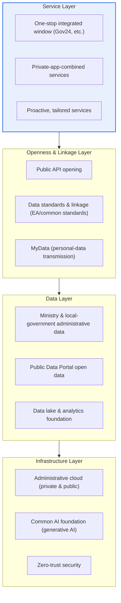
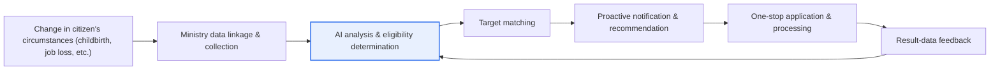

# Digital Platform Government

## 1. Overview

### A. Definition
> A government operating paradigm that **integrates all of the government's data and services onto a single digital platform** so that citizens, businesses, and government can jointly solve social problems and create new value; a government innovation model that transforms the government from a "service provider" into a "platform operator and data opener."

The core idea of Digital Platform Government (DPG) is to transform the government from a "**Service Provider**" into a "**Platform Operator**." Whereas in the past e-Government built separate systems by ministry, forcing citizens to move between multiple websites, Digital Platform Government gathers data and services onto a single logical platform and opens it up so that the private sector can build innovative services on top of it. Just like a smartphone app store, when the government opens up data and functions through standard APIs, the private sector combines them to build the customized services citizens want.

The significance of this transformation lies in the fact that it is not merely system integration but **changes the very operating principle of administration**. Existing e-Government was based on an "application principle" under which citizens could receive a service only if they knew they were eligible and came to apply for it themselves. DPG, by contrast, shares and links data across ministries so that the government recognizes changes in a citizen's circumstances (childbirth, job loss, disaster, etc.) first and **proactively recommends and provides services**. Citizens resolve everything in one place without visiting multiple agencies (one-stop), and the government shares data across ministry silos to realize scientific, tailored administration.

### B. Background and Necessity
Three structural pressures overlap in the background of DPG's rise. First, **service fragmentation caused by ministry silos**. Because each ministry and local government has built its own information systems independently, data has been trapped within agency boundaries, forcing citizens to repeatedly submit the same documents to multiple agencies and making cross-ministry collaborative administration virtually impossible. Second, **rising expectations for the digital experience**. Citizens have come to demand from public services the level of hyper-personalization and immediacy provided by private-sector platforms (finance, shopping, mobility). Third, **the maturation of data, AI, and cloud technology**. As large-scale data linkage, generative-AI-based consultation, and cloud-native scaling became technically feasible, the foundation was laid to actually implement an integrated, open government.

In Korea's case, although it has long maintained a world-leading e-Government (ranking at the top of the UN e-Government surveys), it has been pointed out that the excellence of individual systems does not translate into "an integrated experience that citizens feel." DPG can be understood as a national attempt to bridge this gap with a data-centered integrated, open architecture.

## 2. Overall Structure and Components

Digital Platform Government can be viewed as a multi-layer structure in which a data layer, an openness and linkage layer, a service layer, and an infrastructure layer are stacked vertically. The conceptual diagram below shows this overall structure.

The **data layer** consists of administrative data scattered across ministries and local governments, open data from the Public Data Portal (data.go.kr), and the data lake and analytics foundation that gather these into an analyzable form. Since all of DPG's value ultimately originates from data, the **quality, standardization, and linkability** of this layer determine overall success or failure. If data is not standardized or cannot leave an agency, the upper layers do not function.

The **openness and linkage layer** is the "touchpoint" that makes data and functions usable by the outside. It opens public APIs in a standard manner, reconciles the data models that differ by agency into common standards and enterprise architecture (EA), and enables citizens to move their own administrative information wherever they want through MyData (the right to demand transmission of one's own information). The thicker this layer, the greater the room for private-sector innovation.

The **service layer** is the point where citizens actually meet the government. Matters are processed one-stop at an integrated window such as Gov24, private apps combine public APIs to create new services, and eligible citizens are proactively informed of services based on data analysis. The **infrastructure layer** consists of the cloud-native foundation that supports all of this, the common AI foundation, and the zero-trust security that controls the risks that inevitably grow with openness.

| Component | Core Content | Representative Means |
|---|---|---|
| **Data foundation** | Ministry data linkage, standardization, opening | Public Data Portal, data standards, EA |
| **Open ecosystem** | API opening, public-private collaborative service creation | Open API, MyData |
| **Services** | One-stop, proactive, tailored citizen services | Gov24, integrated login |
| **Infrastructure** | Cloud-native, AI, security | Administrative cloud, generative AI, zero trust |

## 3. Core Principle — Data Flow and Service-Generation Process

The process by which DPG actually produces "proactive tailored services" is explained as a cycle in which data is collected, linked, and analyzed and then fed back into services. The detailed process diagram below shows how a change in a citizen's circumstances leads to a service.

The starting point of this flow is an **event (change in circumstances)**. For example, when a birth is registered, that fact is linked with the data of multiple ministries so that "the support this household is eligible for" is derived automatically. In the past, parents had to apply separately at different agencies for childbirth grants, child allowances, electricity-fee reductions, and so on, but in the DPG vision a single registration triggers the full set of related services. In practice, the government has been expanding such life-cycle bundled services (one-stop services such as "Happy Childbirth" and "Secure Inheritance"), and DPG aims to automate these more broadly through data linkage.

In the second stage, **AI analysis and eligibility determination**, the linked data is used as the basis to judge which services a citizen is eligible to receive. What matters here is "the accuracy and currency of the data on which the judgment is based." If income, household, and residence information is managed differently by each ministry, incorrect eligibility determinations can result, so data standardization and quality management determine the reliability of this stage.

The third stage, **matching, notification, and processing**, connects the determination result to an actual service. The target is proactively notified (push), and if the citizen consents, the application is processed one-stop. In the final **feedback** stage, the processing result is again accumulated as data, improving the accuracy of the next analysis. In this way, DPG aims for a **virtuous cycle in which data gives rise to services and services in turn give rise to data**, rather than one-off computerization — and this is fundamentally different from e-Government.

## 4. Comparison with e-Government — Why the Difference Arises

DPG is often called "the next step of e-Government," but the difference between the two is not a matter of technological generation but a matter of **operating philosophy**. e-Government focused on "computerizing and putting government work online," with the goal of enabling civil-affairs matters previously handled offline to be processed on the web. As a result, each agency computerized its own work well, but the boundaries between agencies remained intact. DPG, by contrast, focuses on "integrating and opening data and services," with the goal of dissolving the agency boundaries themselves through data flow.

| Category | e-Government (e-Gov) | Digital Platform Government (DPG) |
|---|---|---|
| **Perspective** | Computerization / putting government work online | Integration & opening of data and services |
| **Structure** | Individual systems by ministry (silos) | A single logical platform |
| **Service mode** | Application principle (citizen comes) | Proactive, tailored (government notifies first) |
| **Private-sector role** | User (service consumption) | Collaborator (joint service creation) |
| **Infrastructure** | Self-built (on-premises) | Cloud-native |
| **Data** | Closed within agencies | Linked, standardized, open |

The reason this difference matters in practice is that **moving to DPG requires changing governance and institutions before technology**. For example, for ministry B to use ministry A's data, a legal basis under the Personal Information Protection Act, a data ownership and responsibility relationship, and standard reconciliation must come first. In other words, the bottleneck of DPG usually lies not in "technical implementation" but in "the laws, institutions, and standards that make data shareable." Without understanding this point, no matter how good the cloud and AI adopted, the result ends up as just another e-Government.

As a **concrete example**, the data opened through the Public Data Portal amounts to tens of thousands of kinds, and the private sector has used it to build various apps for real estate, transportation, weather, startups, and more. Also, "Gov24" has established itself as an integrated service that handles the civil-affairs matters of multiple agencies at one window, and the National Tax Service's Hometax year-end tax settlement simplification is cited as a representative example of a "government that gathers your data for you," by automatically collecting and providing scattered income and expenditure records. These can all be seen as early forms of the "citizen benefit through data linkage and opening" that DPG aims for.

## 5. Deep Dive — Direction of Advancement and Recent Trends

Because DPG is not a single system but a **medium-to-long-term national strategy combining various policies, standards, and infrastructure**, recent trends divide into several strands. However, since the detailed schedule and budget scale of advancement can change over time, here they are generalized around directionality.

First, **the cloud-native transformation of administration**. Beyond simply moving aging ministry systems to the cloud (Lift & Shift), the key is to redesign them on an API basis so that data and functions can call one another. In this process, the division of roles between public and private clouds, the easing and adjustment of network-separation policies, and reconciliation with the cloud security certification (CSAP) become issues.

Second, **grafting generative AI onto administration**. Recently, attempts in the form of an "AI administrative assistant / chatbot" that finds answers across the services of multiple ministries when a citizen asks a question in natural language have been spreading. This is an application possible only when DPG's data and API opening comes first, corresponding to the picture that "AI completes the integrated experience on top of opened data." However, because of generative AI's hallucination and accountability issues, in the administrative domain, verifiable answers grounded in evidentiary data (e.g., RAG) and final human confirmation are emphasized.

Third, **the public-sector expansion of MyData**. This is the movement to broaden MyData (the right to demand transmission of one's own information), which began in the financial sector, into administration, healthcare, and so on, so that citizens can move their own administrative information directly to the agencies and apps they want and use it. In that it "returns control of data to citizens," this is a core axis of DPG's philosophy of openness, and at the same time it demands strong personal-information protection safeguards.

## 6. Considerations and Implications (Professional Engineer Perspective)

1. **Data standardization and governance are prerequisites for success.** To link data that differs by ministry, data standards, quality management, an ownership/responsibility (data ownership) system, and reference/master data management must be in place first. Opening without governance ends up as "a list of data that does not connect." From a professional engineer's perspective, one can present EA/data architecture and a data quality management system as the precursor tasks of DPG.

2. **Balancing openness and personal-information protection is the crux.** The more data is integrated and opened, the greater the privacy and re-identification risk. A "open but safe" structure must be designed through consent-based transmission via MyData, pseudonymization/anonymization, zero trust (verifying even internally), access control, and audit logs. Differentially designing the trade-off between the benefit of openness and the cost of protection by data sensitivity is the practical strategy.

3. **Legacy transformation and cloud-native redesign are needed.** Rather than simple migration, redesign on a microservices / API-gateway basis is what makes it a true platform. Here, to reduce the risk of a full rebuild, a gradual transformation strategy such as the Strangler Fig pattern and a migration plan that guarantees service continuity during the transition are jointly required.

4. **The sustainability of the public-private collaboration ecosystem must be designed.** Even if the government opens APIs, if the private sector has no incentive to participate (stable SLAs, clear terms of use, a revenue model), the ecosystem will not form. The fact that the government is required to have "platform-operation capabilities" — including API version management, quality assurance, and developer support (developer portal, sandbox) — is what decisively distinguishes it from e-Government.

5. **Digital Inclusion must proceed in parallel.** The more proactive, tailored services advance, the greater the risk that the elderly, the disabled, and the digitally vulnerable are left out. To become a "platform for all," offline, in-person, and consultation channels must be maintained alongside online channels, and accessibility (web accessibility guidelines) compliance and easy-to-use design must proceed in parallel.

## References
- Public Data Portal: https://www.data.go.kr
- Gov24: https://www.gov.kr
- Digital Platform Government Committee: https://www.dpg.go.kr

---

> **In one line**: Digital Platform Government is a paradigm that *integrates and opens the government's data and services onto a single platform* so that the public and private sectors jointly create value and realize proactive, tailored administration; the balance between data standards/governance and personal-information protection, cloud-native redesign, and the design of a sustainable public-private ecosystem determine its success or failure.
