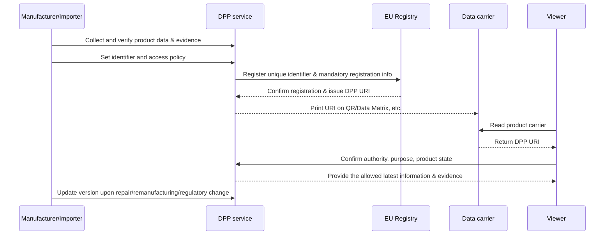

# Digital Product Passport (DPP)

## 1. Overview

> The **Digital Product Passport (DPP)** is a data system that links information about products, parts, and materials to a per-product digital identifier so that it can be electronically looked up and exchanged.

The European Union's Ecodesign for Sustainable Products Regulation (ESPR, Regulation (EU) 2024/1781) introduced the DPP as an institutional foundation for promoting the design and distribution of sustainable products.

The purpose of the DPP is not simply to put a product manual into a QR code.

The core is to provide stakeholders, in a standardized way, the information needed throughout the product lifecycle — such as the product's origin, materials, durability, repairability, environmental performance, and reuse/recycling information.

Consumers can check a product's sustainability information at the purchase and use stages.

Repairers can raise repairability by checking disassembly methods and part information.

Recyclers can optimize disassembly, sorting, and recycling processes using material composition and hazardous-substance information.

Public agencies and customs can check whether a product is registered and whether it complies with regulations.

Behind the emergence of the DPP are the multi-tiering of supply chains and the disconnection of product information.

If the material and process information a manufacturer holds is not conveyed to distributors, consumers, repairers, and recyclers, it is hard to design a circular economy.

Paper documents or per-manufacturer closed portals have limits in information updating and interoperability.

Therefore, the DPP should be understood as an information-management architecture that connects the physical product and digital information via identifiers, data carriers, and access policies.

## 2. Legal Background and Necessity of Introduction

### A. ESPR and Per-Product Delegated Acts

The ESPR is not a comprehensive database that requires the same information for all products at once.

When the European Commission enacts a per-product-group delegated act, the DPP information items and access rights for that product group are specified.

This is because the environmental impact and supply-chain structure differ by product group — batteries, textiles, steel, construction products, and so on — so the same schema cannot be applied as-is.

Therefore, a company must not stop at confirming the general principles of the law but must also confirm together the delegated act for the product group it sells and the separate industry laws.

Besides the ESPR, the Battery Regulation, the Packaging and Packaging Waste Regulation, the Critical Raw Materials Act, the Toy Safety Regulation, and the Construction Products Regulation can be connected to the DPP.

In this way, the DPP is not so much the name of a single solution as an institutional/technical framework combining product regulation and data infrastructure.

### B. Necessity of Introduction

First, to manage environmental performance across the product lifecycle, the data of design, procurement, manufacturing, distribution, use, repair, and disposal must be connected.

Second, to quickly submit the materials that regulators require on a per-product basis, the traceability of source data and evidentiary materials is needed.

Third, because supply-chain participants use different systems, without standard identifiers and exchange rules, data re-entry and errors accumulate.

Fourth, even when a product moves to the used, repair, or remanufacturing stage, the history and state of the same product must be inherited for a circular business to be possible.

Fifth, the disclosure scope of product information must be divided into consumer, business, and regulator versions to manage trade secrets and transparency together.

## 3. Overall DPP Concept Diagram and Components

The following concept diagram shows the overall structure from the physical product to data provision and regulatory confirmation.

### A. Product and Data Carrier

The data carrier is the physical touchpoint that connects the product and the digital record.

A QR code or Data Matrix can be printed at low cost and is easy to read with a smartphone.

RFID and NFC are advantageous for non-line-of-sight reading and automated logistics handling, but the tag cost and infrastructure are added.

The important point is that not all product information is stored directly on the carrier.

It is common for the carrier to hold the identifier/URI for finding the product or DPP, while detailed data is managed by an appropriate service.

Therefore, even when the label is damaged or the product is repackaged, the persistence of the identifier and a reissue policy must be designed.

### B. Identifiers and URIs

Unlike a particular manufacturer's internal management number, a product identifier must not collide across the entire supply chain and, as far as possible, be maintained throughout the product's lifecycle.

Separating the per-product-unit identifier, the model/batch identifier, the component identifier, and the economic-operator identifier makes it easier to express the relationship between products and components.

Based on the registered unique identifier and mandatory registration metadata, the Registry provides or links the DPP's URI.

Here, the URI must be treated not as a simple web address but as an operational contract that includes identification, authentication, version, access policy, and redirection.

When a product is refurbished or a component is replaced, connecting a new state/event/version rather than deleting the existing record and preserving the history is advantageous for audit and dispute response.

### C. Registry and Detailed Data Repository

The EU DPP Registry is a central registration point that manages each DPP's unique identifier and the registration information prescribed by law.

Detailed product data, by contrast, can take a distributed storage structure held by the economic operator or the DPP service provider.

This structure enables per-product registration and uniqueness confirmation without the central authority directly storing all manufacturing data and trade secrets.

In other words, the DPP is not a structure that dichotomously chooses centralization or decentralization, but a hybrid structure that centralizes registration and discovery while decentralizing the holding and control of detailed data.

Because URI resolution and the availability of previous data must be maintained even if the detailed-data service changes, a backup and migration procedure prepared for business change, bankruptcy, and service termination is needed.

### D. Stakeholders and Authority

Economic operators such as manufacturers and importers bear the primary responsibility for creating the DPP and managing the accuracy, completeness, and currency of the information.

Distributors and online marketplaces can perform the role of confirming whether a product has a valid identifier and the necessary information.

Consumers look up the product's sustainability and use/repair/disposal information on an easy-to-understand screen.

Professional repairers look up per-product disassembly/repair procedures and compatible-part information with limited authority.

Recyclers confirm the material composition and processing precautions, but should not access the manufacturer's sensitive manufacturing-process information.

Market surveillance authorities and customs verify the registered identifier, conformity evidence, and relevant regulatory information.

## 4. Data Model and Operation Procedure

### A. Information Layers

DPP data is best layered based on disclosure scope and change cycle.

Public information can include product identification, basic specifications, repair/recycling guidance, and key environment-related indicators.

Business information can include supply-chain evidence, per-batch quality data, audit logs, and detailed material specifications.

Regulator-only information can hold the original evidence, test reports, and responsible-person information needed for conformity assessment and customs confirmation.

Without separating these layers, one either exposes excessive information to consumers or, conversely, lacks the evidence needed for regulator verification.

### B. Core Data Elements

The following table organizes the data elements to consider in a typical DPP design.

| Category | Main Data | Management Perspective |
|---|---|---|
| Identification | Product, model, batch, component, business ID | Global uniqueness, persistence, relationship representation |
| Product | Material, origin, performance, safety, specifications | Linkage with source systems and reference data |
| Circularity | Repairability, disassemblability, reuse, recycling, parts | Update by lifecycle |
| Environment | Carbon, energy, resource, hazardous-substance indicators | Calculation method and evidence tracing |
| Evidence | Test reports, declarations of conformity, audit materials | Tamper prevention and retention period |
| Access | Authority by consumer, business, authority | Least privilege and purpose limitation |
| History | Repair, replacement, remanufacturing, ownership/state events | Version and chronological integrity |

The items in the table must be connected not to a simple field list but to data responsibility and quality rules.

For example, carbon emissions should not be stored as a single number but preserved together with the calculation boundary, base year, emission factor, verifying entity, and unit, so that comparison and audit are possible.

Material information must also be confirmed for whether the sum of the total weights matches the product's total weight, and whether the material classification system is compatible with the recycler's classification system.

### C. Registration, Lookup, and Update Procedure

The first step is not the collection of product data but the designation of the data owner.

Unless one decides which organization provides the material data and which organization verifies the environmental performance, one cannot trace the responsibility for corrections when the information later changes.

Second, generate the product/batch/component identifiers and map them to the source systems' internal keys.

Third, after quality-checking the mandatory registration information and the detailed DPP data, register them with the Registry.

Fourth, connect the returned URI via a data carrier to the product, packaging, and enclosed documents.

Fifth, on lookup, provide only the necessary data according to the user's role and the product's state.

Sixth, record repair, part replacement, remanufacturing, and regulatory change as a new version or event.

In this procedure, separating registration from detailed-data storage can reduce a Registry failure from propagating into a failure of all detailed data.

## 5. Data Governance and Technical Considerations

### A. Data Quality

The reliability of the DPP is determined by the quality of the source data rather than the design of the screen.

Accuracy is the question of whether the actual product and the record match, and completeness is the question of whether the mandatory items required by regulation are not missing.

Timeliness is the question of whether product changes or regulatory changes are reflected within an appropriate time.

Interoperability is the question of whether different businesses' data is exchanged with the same semantic system and units.

Therefore, a data catalog, common codes, unit standards, validation rules, responsible parties, and quality indicators must be specified as a data contract.

For example, mixing kg and g for part weight causes the sum verification to fail, and if the material codes needed for recycling judgment differ by business, automatic classification does not work.

### B. Security and Privacy

Because the DPP is a system where public data and trade secrets coexist, disclosing all information is not transparency.

Purpose-based access is needed that provides consumers minimal product/environment information, repairers only the information needed for safe disassembly, and regulators the evidence needed for statutory verification.

Protect inter-service communication with transmission-segment encryption and mutual authentication, and apply multi-factor authentication and fine-grained authority to administrator and business accounts.

Registration, change, and lookup events must be left as audit logs so that one can confirm who changed and viewed what data and when.

Because a malicious business could manipulate eco-friendly figures or origin, the data's provenance, signature, verifying entity, and change history must be preserved together.

Using blockchain can assist with some integrity problems, but it does not automatically guarantee the truthfulness of incorrectly entered original data.

Therefore, electronic signatures, verifiable proofs, independent audits, and source-data verification take priority over blockchain adoption.

### C. Availability and Business Change

Because the DPP must be accessible for the product's expected lifetime, one must consider the situation where the business that sold the product discontinues the service.

One must entrust backups to a third-party service provider, or prepare a portable format and a retention policy to transfer data upon business change.

If the domain or service of the URI the carrier links to changes, the existing product's label becomes useless, so redirection, domain delegation, disaster recovery, and service-level objectives must be designed.

Availability does not mean only that a 24-hour web screen is open.

One must prepare cache/backup/retry policies so that minimal identification and safety information can be secured even in offline logistics or at a recycling site.

## 6. Comparison with Existing Technologies

### A. Barcodes/QR Codes and the DPP

Barcodes and QR codes are media that represent and read data, and the DPP is a system that includes identifiers, data, governance, and access policies.

Therefore, having a QR code does not automatically make it a DPP.

A general QR may merely link to a manufacturer's web page, but the DPP defines together the product's uniqueness and lifecycle data, role-based access, and registration/audit rules.

Conversely, the DPP can utilize QR or Data Matrix, so it can be combined with existing logistics infrastructure.

### B. Product Traceability and the DPP

Traceability focuses on tracing at which stage of the supply chain a product was.

Beyond traceability, the DPP provides a product's environmental performance, repairability, recyclability, and conformity evidence to various users.

In other words, traceability is an important data source for the DPP but is not identical to the whole of the DPP.

### C. Blockchain-Based History and the DPP

Blockchain can provide a ledger agreed among participants, but putting all detailed data on-chain magnifies cost, performance, right-to-erasure, and trade-secret problems.

The DPP can have a hybrid structure combining a central Registry and per-business detailed repositories.

Therefore, blockchain is utilized for optional integrity anchors or proof logs, and need not necessarily be adopted as the primary repository for product data.

| Comparison Item | General QR/Barcode | Supply-Chain Traceability | DPP | Blockchain History |
|---|---|---|---|---|
| Central purpose | Identification/linking | Movement/state tracing | Sustainability, regulatory, circularity information | Agreed change history |
| Data location | Linked-target service | Per-company system | Registry and distributed detailed repository | Distributed ledger or external storage |
| Authority model | Often simple public | Per-participant contract | Role/purpose-based access | Ledger/smart-contract policy |
| Product lifecycle | Limited | Supply-chain-centered | From design to disposal | Recorded-event-centered |
| Key risk | Broken links, duplication | Silos, consistency | Standards, quality, availability | Privacy, cost, input reliability |

As this comparison shows, one must define the responsibility and purpose of data before the technology choice.

## 7. Application Cases

### A. Electric-Vehicle/Industrial Batteries

Batteries are a representative product group where material composition, capacity, state, reusability, and safety information directly affect repair, reuse, and recycling.

The manufacturer can connect the identifiers of cell, module, and pack and manage the battery's key performance and material/safety information.

When replacement or performance degradation occurs during use, one can add a state event to evaluate the reusability of a used battery.

The recycler can confirm residual energy, chemistry family, and disassembly precautions to reduce worker risk.

However, because battery data can be connected to the manufacturer's core technology, the consumer-disclosure items and the professional-processor items must be separated.

### B. Textile Products

A textile DPP can connect yarn and material blend ratios, dyeing/processing information, repair/washing instructions, and recyclability.

When one garment is composed of multiple materials and accessories, a data model that expresses the relationship between per-material identifiers and the product identifier is needed.

Consumers can confirm the recycled-fiber ratio and care methods, and recyclers can select the sorting process based on whether it is a blend.

However, because the fabric, dyeing, and sewing stages of the supply chain span multiple countries, one must gradually raise the data quality and evidence reliability of partners.

### C. Public Procurement and Internal Asset Management

Public agencies can use the DPP for evidence of eco-friendly procurement and for asset-lifecycle management.

Connecting not only the certification information at the time of purchase but also the maintenance history, replacement parts, and disposal route lets one evaluate the total cost of ownership and resource efficiency together.

However, one must first organize the interfaces of the e-procurement, asset-management, and environmental-information systems so that the procuring agency's additional input does not become duplicate work for suppliers.

## 8. Deep Dive: 2026 Institutional/Standard Trends and Answer Points for a Professional Engineer

The European Commission operates the DPP Registry as a foundation for per-product registration and uniqueness confirmation, and in its July 2026 guidance explains that product data can be held in a distributed manner but the Registry registration of each DPP is required.

It is accurate to understand the Registry not as a data lake that gathers all detailed product information in one place, but as playing the role of managing the unique identifier and mandatory registration metadata and linking to the detailed location.

The Commission FAQ presents the Registry's statutory operation deadline as July 19, 2026, and guides that it will be introduced in phases according to per-product rules, starting from product groups such as batteries.

Also, because a minimum transition period of 18 months can be given to economic operators after the adoption of a per-product delegated act, companies should organize their source data and identifier system now rather than merely waiting for the law's effective date.

In 2026, CEN and CENELEC are presenting a horizontal DPP standard suite covering unique identifiers, data carriers, APIs, interoperability, data-exchange protocols, and so on.

This standardization trend shows that the DPP should be viewed not as a simple ESG report but as an enterprise architecture combining identifiers, carriers, data services, APIs, and access control.

In a professional engineer's answer, it is good to avoid the expression "attach a QR and you're done," and to present as a concept diagram the flow of **identifier → Registry → distributed detailed data → role-based service → lifecycle event**.

Also, one must connect the five perspectives of law/institution, data governance, interoperability, security/privacy, and operational continuity into a single phased adoption roadmap.

For example, in Phase 1 determine the product/batch reference data and the data owner, in Phase 2 link the supply-chain source data and evidence, in Phase 3 integrate the Registry, API, and access policy, and in Phase 4 verify circularity with repair/recycling data.

## 9. Considerations and Implications

### A. Regulatory Mapping and Responsibility System

One must map the requirements of per-product delegated acts and industry laws to data items, responsible parties, evidence, and retention periods.

If the legal, quality, environmental, procurement, and IT departments interpret separately, the definition of the same item diverges, so a data-governance committee and a single glossary are needed.

### B. Phased Adoption and Investment Priorities

Trying to integrate all products and all supply chains from the start only inflates the platform cost while data quality is low.

One must select as a pilot a product group where regulatory enforcement is fast and the circular effect is large, measure the identifier, data quality, lookup rate, and update time, and then expand.

### C. Interoperability and Vendor Lock-in

Becoming dependent on a particular DPP service provider's proprietary schema and URI makes business change or overseas supply-chain linkage difficult.

One must include machine-readable open data formats, standard APIs, a data-migration format, and a URI-migration policy in the contract and architecture.

### D. The Balance of Security and Trade Secrets

Disclosing all cost, process, and supplier information in the name of transparency can infringe competitiveness and personal information.

One must separate views by public, business, repair, and regulator, and implement minimal, purpose-fit disclosure with field-level authority, masking, audit logs, and key management.

### E. Data Quality and Greenwashing Prevention

Merely storing environmental indicators cannot prove eco-friendliness.

One must record together the calculation method, source data, verifying entity, version, uncertainty, and update date, and operate independent verification and sample audits.

### F. Operational Resilience and Long-Term Preservation

Because the DPP service can end before the product's lifetime, one must set backup, redundancy, service-provider change, disaster recovery, and preservation formats as contractual obligations.

A professional engineer must present, before a function list, the failure scenarios of outage, bankruptcy, domain change, carrier damage, and wrong-data correction.

## References

- European Commission, Digital Product Passport: https://single-market-economy.ec.europa.eu/single-market/digital-product-passport_en
- European Commission, Digital Product Passport FAQs: https://single-market-economy.ec.europa.eu/single-market/digital-product-passport/explore-our-faqs_en
- European Commission, DPP Registry now live: https://single-market-economy.ec.europa.eu/news/digital-product-passport-registry-now-live-2026-07-20_en
- EUR-Lex, Regulation (EU) 2024/1781: https://eur-lex.europa.eu/eli/reg/2024/1781/oj/eng
- CEN-CENELEC, Digital Product Passport standards: https://www.cencenelec.eu/news-events/news/2026/en-in-the-spotlight/2026-07-15-dpp/

---

> **In one line**: The DPP is not a QR code but a product-data architecture that combines a product's unique identifier and Registry, distributed detailed data, and authority/evidence/lifecycle governance to manage sustainability and regulatory compliance.
