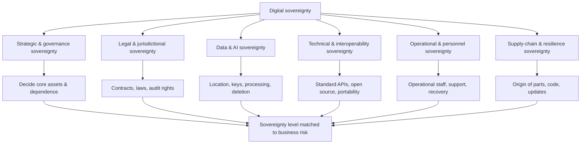
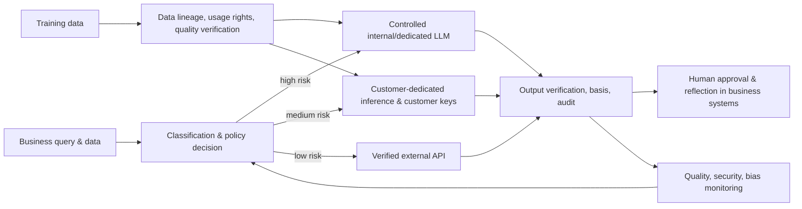

# Digital Sovereignty and Cloud/AI Sovereignty

## 1. Overview

### A. Definition

> **Digital Sovereignty** is the ability of an organization or nation to decide on and control its digital technology, data, infrastructure, and operations for itself, and to manage its strategic dependence on external providers, jurisdictions, and supply chains.

Digital sovereignty is a broader concept than data residency, which stores data in a particular country. Where data is stored is only a starting point; it also includes who controls the encryption keys, who can restore the service in the event of an outage, whether the software can be audited, modified, and ported, and how foreign laws or supply-chain disruptions affect the service. In other words, the core of sovereignty is not location but decision-making authority and sustainable control.

The European Commission describes technology sovereignty as the ability to develop and control core technologies, data, and infrastructure while reducing dependence on non-EU providers ([European Commission, Strengthening Europe's Tech Sovereignty](https://digital-strategy.ec.europa.eu/en/policies/eu-tech-sovereignty)). The important part of this definition is not "cutting off from the outside" but "the autonomy to manage dependence." One must avoid a state in which, while maintaining open standards and international cooperation, national functions or a company's core operations halt if a single particular provider stops.

In a professional engineer's answer, it is important not to equate digital sovereignty with protectionism or domestic production. Making all parts and software directly at home may not be a realistic goal. Instead, it should be approached as a governance problem of identifying high-risk assets, measuring the level of control over legal jurisdiction, data, keys, operational personnel, the software supply chain, and portability, and choosing a level of sovereignty that matches the business risk.

### B. Background and Necessity

First, as the concentration of cloud and SaaS increased, dependence on a single provider became an operational risk. Using convenient managed services improves launch speed and elasticity, but events such as changes in price, terms, or APIs, region outages, and account suspension can limit a company's options. Even if multi-cloud is adopted, depending on the same external managed services and the same supply chain can end up as nominal distribution.

Second, as data and AI became the basis of decision-making, the jurisdiction of data and the right to operate models grew important. Data must be protected at rest, in transit, and in use, and AI services must be able to control the scope of use of training data, the location of inference, log retention, model updates, and output verification. When calling a model via an external API, whether input data is used for retraining, who the sub-processors are, and how deletion requests are proven become part of sovereignty.

Third, the connected supply-chain risk of semiconductors, accelerators, operating systems, open-source packages, and remote updates grew. Supply-chain sovereignty should be understood not as making the origin of all parts domestic, but as identifying the origin and dependencies of core components and securing the ability to substitute, audit, patch, and recover. The disruption of a digital service can begin not from the failure of a single data center but from a hard-to-see common dependency such as certificates, package repositories, DNS, or time synchronization.

### C. Purpose and Scope of Application

The purpose of digital sovereignty can be organized into the following four.

1. Secure the decision-making authority and continuous operating capability of core services.
2. Raise the legal, technical, and operational control over data and AI.
3. Reduce the concentration risk from a single provider, single jurisdiction, and single supply chain.
4. Maintain switchability through an open ecosystem and interoperability.

The scope of application includes public administration, critical services such as finance, healthcare, and energy, manufacturing and defense supply chains, enterprises' core business SaaS, and generative-AI platforms. Because the required levels for general work-collaboration tools and for national critical infrastructure differ, demanding a uniform "highest sovereignty" can lose cost and speed of innovation.

Therefore, the first step is to classify assets by business impact and data sensitivity. Systems directly connected to life, safety, and national functions require high control and recovery capability, but a public-information analysis system may face low risk even if an open global service is chosen. Sovereignty is not a product attribute but a design goal decided according to the business context and risk tolerance.

## 2. The Layers and Reference Architecture of Digital Sovereignty

### A. Sovereignty Layers

Digital sovereignty is not a single metric but the result of synthesizing the control of multiple layers. The strategic layer evaluates the ownership and governance structure of core technologies and providers; the legal layer, contracts and the influence of foreign laws; the data layer, storage, processing, and key control; the technical layer, standards and portability; and the operational layer, people and procedures.

In the structure below, the upper strategy does not replace the lower technology. Even a provider legally within EU or domestic jurisdiction may have low technical and operational sovereignty if it depends excessively on proprietary APIs and external supply chains. Conversely, even when using a global provider's standard services, one can lower certain risks by securing customer-managed keys, independent audits, and clear termination/migration procedures.

### B. Meaning of Each Layer

**Strategic and governance sovereignty** is the question of who decides the direction and budget of digital assets. The board, agency head, CIO, and CISO must approve the list of core services, the acceptable external dependence, the cap on provider concentration, and the switching-investment budget. Without strategic sovereignty, even if the tech team operates individual products well, it is hard to improve the dependence structure of the whole organization.

**Legal and jurisdictional sovereignty** deals with the laws applicable to data and systems, contracts, government access demands, and the place of dispute resolution. The contract must specify the data processor and sub-processors, notification of government requests, audit rights, deletion proof, security-incident notification, and service-disruption and termination conditions. If only the storage location is designated as domestic while the operator, backups, remote support, and logs are in another jurisdiction, actual control can be weak.

**Data and AI sovereignty** is the ability to control the data lifecycle from collection to disposal and the training, inference, evaluation, and updating of models. The customer must be able to hold the encryption keys directly or dispose of them through an external key-management system, and must confirm that AI inputs are not used for the provider's training. Preserving the basis, logs, versions, and approval records of AI results makes after-the-fact explanation and audit possible.

**Technical and interoperability sovereignty** is the ability to move functions to another environment or audit independently without being locked into a specific technology stack. Open standards, documented APIs, portable data formats, reproducible builds of container images, and independent backup restoration are the core means. "Using open source" alone is not enough; the personnel and license rights to actually modify, build, and deploy must be present together.

**Operational and personnel sovereignty** is the ability to operate and recover a service during an outage or security incident without waiting for the external provider's permission. One must have operations manuals, configuration backups, key-recovery procedures, independent monitoring, trained internal personnel, and alternative support contracts. A system with low operational sovereignty may look cheap in normal times but has long recovery time and weak bargaining power in an emergency.

**Supply-chain and resilience sovereignty** is the ability to trace dependencies down to hardware, firmware, software packages, cloud sub-services, and update paths. One must manage an SBOM and a provider list, use signed updates and reproducible builds, and test alternative paths for the discontinuation, export restriction, or vulnerability of critical components.

## 3. Design Principles of Cloud, Data, and AI Sovereignty

### A. Cloud Sovereignty

Cloud sovereignty is securing the level of independence and control the customer or public agency requires over the data, technology, operation, law, and supply chain of cloud services. The mere fact that servers are in a particular country's data center is not a sufficient condition for cloud sovereignty. One must confirm the location of remote-management accounts, support personnel, encryption keys, sub-services, logs, and backups.

The European Commission's 2025 `Cloud Sovereignty Framework` presents eight sovereignty objectives in cloud procurement. It evaluates strategic, legal/jurisdictional, data/AI, operational, supply-chain, technical, security/compliance, and environmental-sustainability sovereignty together, and does not substitute a security certification for sovereignty ([European Commission, Cloud Sovereignty Framework](https://commission.europa.eu/document/download/09579818-64a6-4dd5-9577-446ab6219113_en)).

This framework distinguishes SEAL (Sovereignty Effectiveness Assurance Level), the minimum guaranteed level for each objective, from the Sovereignty Score for comparison across services. A procuring agency can require the minimum level that matches the risk and use the score as an auxiliary criterion for ranking multiple candidates. Therefore, rather than forcing the highest grade on all work, business classification and risk assessment come first.

When selecting a cloud, confirm the data-center location, operating entity, sub-processors, foreign-law exposure, customer-held keys, audit logs, API portability, data-export cost, termination support, and independent operability. Merely inserting the sentence "data is stored domestically" into the contract omits the processing, backup, support, and legal-access paths, so evidence-based evaluation is needed.

### B. Data Sovereignty

Data sovereignty is a state in which data is collected, stored, used, shared, and deleted according to the applicable law and the organization's control policy. Data residency means the physical storage location, data localization means a policy that legally requires storage and processing within a particular region, and data sovereignty includes not only location but also access rights, keys, purpose of use, audit, and deletion.

In the data classification table, do not put only sensitivity; record together the business impact, retention period, cross-border transfer possibility, acceptable operators, and re-identification risk. As a result, one can differentiate the control level in a way such as placing public data on global SaaS, internal data in an environment with strengthened contracts and encryption, and regulated/national-core data in an environment where independent operation is possible.

Encryption assists sovereignty but does not automatically guarantee it. If the provider manages all the keys, even if the storage location is domestic, it can amount to handing access rights to the provider. One approaches "controllable data" only by linking customer-managed keys, external key management, key-access approval, key-usage logs, and proof of irrecoverability after key disposal.

Data movement and deletion are also core to sovereignty. Confirm whether the deletion scope includes backups, caches, search indexes, model-training data, and disaster-recovery replicas, and regularly perform tests of exporting the entire data in a standard format. One must also define whether deletion is logical or physical, whether it propagates to sub-processors, and how the evidence is retained.

### C. AI Sovereignty

AI sovereignty is the autonomous control ability over data, models, computing, inference, and operational decisions. Even when using an external LLM API, directly owning the model is not the only answer; what matters is whether one controls the processing scope of input data, model-version pinning, output logs, safety filters, evaluation data, and an alternative model in case of failure.

The AI pipeline must separate training data from business inference data. Confirm through contracts, technical settings, and audits that confidential business inputs are not used to improve the provider's general-purpose model, and mask personal information and trade secrets contained in prompts and outputs. Because performance, bias, and security characteristics can change when the model provider changes, automate before-and-after evaluation.

When building sovereign AI, place data and models by risk rather than unconditionally keeping them internal. The most sensitive work can choose an internal or controlled dedicated inference environment, medium-risk work a customer-dedicated instance and customer keys, and low-risk work a verified external API. Here, one must quantitatively record the trade-off between the ban on data exfiltration and model quality.

## 4. Sovereignty-Level Evaluation and Adoption Procedure

### A. Designing Evaluation Indicators

When evaluating sovereignty, create indicators verifiable by evidence instead of an abstract "domestic or not." For example, in the data/AI area one can include storage/processing location, customer-key control, ban on use for training, and model/data deletion proof, and in the operational area, the ratio of internal personnel, the success rate of recovery drills, and the ratio of tasks possible without provider support.

Indicators combine binary questions and maturity questions. There are items to judge yes/no, such as "is there a customer key," but who generates, approves, rotates, and disposes of keys and the independence of the audit must be evaluated by level. Do not award a score based on the provider's self-declaration alone; require as evidence contracts, configuration screens, audit reports, recovery-drill results, and actual data-export results.

The per-business score can be computed as a weighted sum. For example, start with legal/jurisdictional 20%, data/AI 20%, operational 20%, technical/portability 15%, supply-chain 15%, and security/compliance 10%, but financial transactions or national-core work can give higher weights to security and legal control. The score is not an absolute certification but a decision tool for selection and improvement.

### B. Adoption Procedure

Step 1 is to create a list of core services and dependencies. In the service catalog, connect applications, datasets, models, cloud regions, APIs, sub-processors, certificates, keys, package repositories, and operational owners. Only with this list can one see where an outage of a particular provider or country propagates.

Step 2 is to conduct impact analysis and set sovereignty objectives. Evaluate not only confidentiality, integrity, and availability but also legal access, supply disruption, switching time, and recoverability. According to the results, define the required sovereignty level, the acceptable external dependence, and the emergency switching time for each business.

Step 3 is to combine procurement and design. Include contract, jurisdiction, key, operational, portability, and supply-chain items in the provider-evaluation sheet, and reflect multi-region backup, standard APIs, independent logs, alternative authentication, and exit design in the architecture. Controls missed at the procurement stage greatly increase in cost at the operational stage.

Step 4 is verification and continuous improvement. Quarterly, test data export, key rotation/disposal, provider outage, alternative-region switching, model replacement, and incident-notification procedures. Unless a function the provider explained as "possible" is verified with an actual recovery drill, the sovereignty score remains a promise on paper.

### C. Operational Controls of the Sovereignty Architecture

Control access with least privilege and continuous verification. Apply personal identification, multi-factor authentication, time limits, approval workflows, and session recording to operator accounts, and place after-the-fact review and automatic expiry on emergency accounts. Provider support accounts are also not an exception; put them under the same policy and audit scope.

Observability does not depend on a specific cloud console alone. Deliver application logs, security events, data access, key usage, model calls, and administrative actions to an independent store, and define a standard format and retention policy. Only then can incident analysis and regulatory reporting continue even when an account is locked or a service is disrupted.

Change management includes changes to models, APIs, regions, and sub-providers. If the cloud provider changes the default region or terms, or the AI provider automatically replaces the model, performance and legal risk can change. Connect the change-notification period, impact assessment, approval, rollback, and alternative path to the contract and operational procedures.

## 5. Comparison and Trade-offs

### A. Comparison of Core Concepts

Data residency focuses on the location where data is physically stored. Data sovereignty asks about access rights, processing, keys, and legal control together with location, and digital sovereignty includes, beyond data, the autonomy of technology, infrastructure, operations, supply chain, and personnel. Therefore, satisfying residency does not complete sovereignty.

Digital sovereignty and digital self-reliance must also be distinguished. Self-reliance is closer to the direction of trying to produce everything oneself without external help, whereas sovereignty is the direction of securing core decision-making and risk-control ability while acknowledging openness and interdependence. Excessively pursuing self-reliance can produce redundant investment and technological isolation, and defining sovereignty too narrowly can miss dependence risk.

Cloud sovereignty is a sub-concept focused on cloud services and provider relationships, and sovereign cloud is not a specific product name. Contract, technical, and operational control must be in place, and the sovereignty level of even the same product can differ according to the customer's key, region, support-model, and portability settings.

| Category | Core Question | Main Controls | Limitation or Misunderstanding |
|---|---|---|---|
| Data residency | Where is data stored? | Region/backup location | Cannot explain processing, access, keys |
| Data localization | Which region does the law require for storage/processing? | Law, policy, region restriction | May conflict with global cooperation and operational efficiency |
| Cloud sovereignty | Can the cloud be controlled and operated independently? | Contract, keys, portability, operation, jurisdiction | Over-control without per-business risk assessment |
| Digital sovereignty | Can core digital decisions and the ecosystem be controlled? | Strategy, data, technology, supply chain, personnel | Reducing to a single score loses context |
| Digital self-reliance | Can one build and operate without external help? | Own technology, personnel, infrastructure | Cost increase and technological-isolation risk |

### B. The Balance of Openness and Sovereignty

A closed system can give a sense of control, but depending on technology only one's own firm knows and on proprietary parts increases the risk of lack of internal personnel and discontinuation. Open standards and open source let one choose multiple providers, but if the maintaining entity is unclear or the core maintainers are concentrated in an external organization, another kind of supply-chain risk arises.

Therefore, openness is not evaluated by license name alone. Confirm whether one can access the source and build process, whether one can independently apply vulnerability patches, whether the data formats and APIs are public, and whether operational personnel can be secured. To pursue open-source utilization and sovereignty control together, an SBOM, reproducible builds, an internal-fork policy, and a community security-response system are needed.

Cost and control are also a trade-off. Customer-managed keys, dedicated regions, independent logs, dual providers, and reserve personnel raise cost but lower the impact of incidents and switching cost. In a professional engineer's answer, rather than concluding "the higher the sovereignty, the better," one must optimize on a risk basis by comparing the expected value of outage loss, regulatory fines, and switching cost against the control investment.

## 6. Application Cases

### A. Cloud Migration of Sensitive Public-Administration Data

Suppose a public agency migrates welfare, tax, and health data to the cloud. The method of designating only the data-storage region as domestic is insufficient. One must confirm the data flow and access paths together, down to the operator and sub-processors, remote-support accounts, backup/disaster-recovery, customer keys, and log/analytics services.

Divide the work into three grades by impact. Core work directly connected to citizens' lives and rights requires a controlled environment and independent recovery capability, internal administrative work applies a verified public cloud and strong contractual controls, and public-information work uses a general-purpose cloud but does not bring in personal information. This way, one can strengthen the sovereignty of core data without fixing all work at the highest level.

In migration verification, actually execute data exfiltration/restoration, key disposal, operator-session auditing, manual work during an outage, and recovery at an alternative provider. If, in testing, the data format changes or functions dependent on a managed service are discovered, one must prepare a standard format and an alternative design before operation.

### B. AI Quality Inspection at a Manufacturer

When a manufacturer automates quality inspection using an external vision model and cloud GPUs, the original images may include design information and workers' personal information. Preprocess the originals in a controlled area, and deliver only the necessary features to the external service or use a dedicated inference environment. Record model inputs/outputs and versions as lineage to trace responsibility for defect determinations.

In preparation for provider replacement, manage training data and labels in a standard format, and keep the model-evaluation set and pass criteria internally. When the external API changes, compare accuracy, bias, and latency with the same evaluation set and approve whether to reflect it in the production line. This structure raises the control over business decisions even without directly owning the model.

Also consider situations where equipment goes offline. On network disconnection, perform limited determination on edge devices, and when the connection is restored, synchronize only the approved logs to the center. However, one must set the offline-operation period and an emergency-update procedure so that security updates and key rotation of the edge model are not delayed.

## 7. Deep Dive: Linkage of the EU Framework and a Professional Engineer's Answer

### A. Implications of the EU Cloud Sovereignty Framework

The European Commission's `Cloud Sovereignty Framework` does not judge sovereignty by a single line, "is the data in the EU," but divides it into eight objectives and collects procurement evidence. In particular, viewing strategy, legal jurisdiction, supply chain, technology, and operation together shows that a cloud security certification and a sovereignty evaluation are not the same.

The framework's SEAL sets a minimum guaranteed level per objective, and the Sovereignty Score is used as an auxiliary score to compare the relative characteristics of multiple candidates. This distinction helps avoid, in a professional engineer's answer, the error that "since it obtained a certification, sovereignty is sufficient." A certification is evidence of a particular security requirement, not a guarantee that the customer can migrate to another environment at any time.

Also, the technology-sovereignty package explanation the European Commission announced on June 3, 2026, addresses together the capabilities, infrastructure, supply chain, open source, and public procurement of the cloud/AI ecosystem ([European Commission, Cloud and AI Development Act](https://digital-strategy.ec.europa.eu/en/policies/cloud-and-ai-development-act)). That policy page explains that the public sector can use four cloud/AI sovereignty assurance levels according to a risk assessment, and in actual application, one must separately confirm the latest state of legislation, procurement notices, and audit criteria.

### B. Expected Exam Directions and Answer Composition

Exam questions may expand from "the concept and securing methods of digital sovereignty" into a form connecting data residency, cloud, AI, and supply chain. The answer should not end at the definition but develop in order: why it is needed, what is evaluated, with which architecture and governance it is controlled, and what the trade-off between cost and openness is.

In the conceptual diagram, present the strategy, legal, data, technology, operational, and supply-chain layers, and in the detailed diagram, draw the closed loop of business classification → risk assessment → provider selection → contract/design → recovery drill → continuous evaluation. Use a table as an auxiliary tool to compare residency, localization, cloud sovereignty, and digital sovereignty, but explain the principle by which each difference arises in sentences.

In the cases, using sensitive public data and manufacturing AI lets one explain not only data location but also keys, operation, model version, portability, and supply chain together. In the conclusion, do not present "domestic production" or "multi-cloud" as an all-purpose solution but conclude with a strategy that links a risk-based sovereignty level, open standards, independent audit, exit testing, and personnel capability.

## 8. Considerations and Implications

### A. Risk-Based Leveling

Demanding the highest level of sovereignty for all systems burdens cost and the speed of innovation. Conversely, entrusting all systems to external services on convenience alone loses the bargaining power and recovery ability of core functions. One must set a minimum level per service based on business impact, data sensitivity, switchability, and legal obligations.

Sovereignty grades are not fixed labels but are re-evaluated according to risk changes. When there is new AI use, a foreign-law change, a provider acquisition, a discontinuation notice, or a sub-processor change, re-confirm the grade and controls. Re-evaluate not only at least once a year but also after major changes and incidents.

### B. The Effectiveness of Jurisdiction and Contracts

Merely writing data location and security obligations into the contract is not enough. Government-request notification, approval of remote support, sub-processor changes, audit materials, deletion proof, service-disruption/termination/migration support, and the dispute jurisdiction must be made into actually enforceable clauses. Legal, security, procurement, and operations must jointly conduct the provider evaluation so that technical requirements and the contract do not diverge.

Foreign-law exposure is not judged by the provider's country of registration alone. One must examine the legal-access possibility of the parent company, governance structure, sub-processors, remote operators, and management consoles. One must record how legal risk will be reduced through technical encryption and contractual notification obligations, and which entity will accept the remaining risk.

### C. Portability and Exit Strategy

Portability is broader than "the data can be downloaded." One must migrate data, metadata, permissions, encryption keys, audit logs, models, workflows, and configuration values together, and be able to reproduce the same business level in the alternative environment. The more proprietary features and APIs of a managed database, the greater the switching cost and time.

An exit test is not a document review done only once after contract signing. Select a representative business, restore it to an alternative environment within a set time, and confirm data integrity, performance, permissions, audit, and regulatory reporting. The test results must be reflected in the next procurement and architecture improvement.

### D. Supply-Chain and Open-Source Management

Manage the SBOM, the provider/sub-provider list, firmware/package origin, signature verification, and vulnerability-response time. When a particular open-source project is discontinued or a vulnerability is found, confirm whether one has an internal-fork, alternative-implementation, or patching capability. Supply-chain sovereignty is not about looking at a single origin but about the time and ability to substitute in the event of a disruption.

Open source can raise sovereignty but is not an automatic guarantee. Evaluate together the license obligations, maintainer concentration, trust of the build server, package-repository dependence, and lack of support personnel. Public and financial core systems must codify an open-source adoption policy and a security-patch SLA as operational criteria.

### E. AI Accountability and Human Control

AI sovereignty does not end with installing a model internally. One must manage across the whole lifecycle the rights to training data, personal-information minimization, model explanation and verification, bias evaluation, prohibited automated decisions, human approval, and rollback on incidents. Even when using an external model, the entity responsible for the final business decision and the appeal path must remain within the organization.

In preparation for model updates and external-API outages, prepare pinned versions, alternative models, rule-based fallbacks, and manual work. Reflecting unverified output directly into production or administrative systems because accuracy is high is not sovereignty but dependence on external judgment.

### F. Performance Measurement and Continuous Improvement

Sovereignty performance is not evaluated by the number of providers or the ratio of domestic regions alone. Manage as core indicators the data-export success rate, alternative-environment switching time, key independence, audit-log completeness, recovery time on provider outage, the number of critical single dependencies, internal operational capability, and the model-change verification rate.

Even if indicators improve, they can conflict with business performance. Simplifying functions to reduce switching time can lower user value, and strong isolation can increase latency and cost. From a professional engineer's perspective, one must view sovereignty, security, availability, performance, cost, and innovation together, and transparently present to stakeholders the basis for the choice and the residual risk.

## References

1. European Commission, "Strengthening Europe's Tech Sovereignty" — https://digital-strategy.ec.europa.eu/en/policies/eu-tech-sovereignty
2. European Commission, "Cloud Sovereignty Framework", version 1.2.1, October 2025 — https://commission.europa.eu/document/download/09579818-64a6-4dd5-9577-446ab6219113_en
3. European Commission, "Cloud and AI Development Act" — https://digital-strategy.ec.europa.eu/en/policies/cloud-and-ai-development-act
4. European Commission, "First policy brief on digital sovereignty" — https://interoperable-europe.ec.europa.eu/collection/sovereignty/news/first-policy-brief-digital-sovereignty

---

> **In one line**: Digital sovereignty does not end with keeping data domestic; it is the ability to control legal jurisdiction, keys, AI, technology, operation, and the supply chain to match business risk, and to switch independently when necessary.
