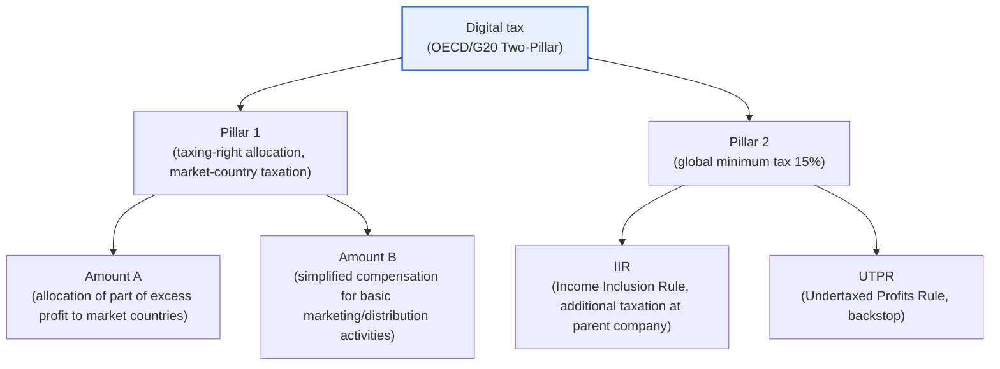
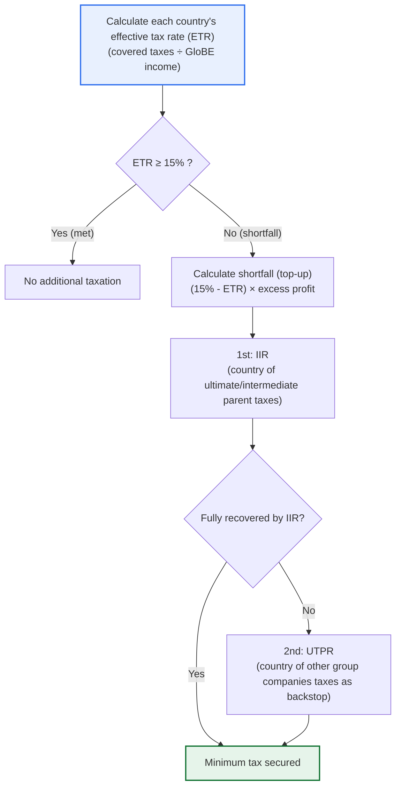

# Digital Tax

## 1. Overview

### A. Definition
> **Digital tax** is an **international tax system redesigned so that the countries where users and markets are located can also exercise taxing rights over global large enterprises (especially Big Tech)** that earn revenue from digital services targeting users in multiple countries without a physical place of business (permanent establishment). It is built on the framework of the two pillars (Pillar 1 and Pillar 2) agreed upon by the OECD/G20 Inclusive Framework (approximately 140 countries).

The fundamental reason digital tax emerged lies in the fact that "**the digital economy neutralized the international taxation principles established in the early 20th century**." Traditional international taxation rests on the principle that "the country where the permanent establishment exists taxes that profit." This is a rule created on the premise of an industrial economy in which business could not be established without physical substance such as a factory, office, or sales outlet. However, Big Tech firms such as Google, Apple, Meta, and Amazon earn enormous revenue selling app stores, search advertising, cloud, and SNS to users worldwide, without a single server or office. The problem is that the market countries where the sales and users actually exist cannot collect corporate tax because there is "no physical place of business," while the firms move their intellectual property and profits to countries with low corporate tax rates (Ireland, Luxembourg, etc.) to drive their effective tax rate to extremes. This phenomenon, in which the tax base is eroded and profits are shifted to low-tax countries, is called BEPS (Base Erosion and Profit Shifting).

This structure seriously undermines tax fairness. Domestic firms doing business in the same country pay taxes at the normal rate, while the multinational platforms that dominate the market pay almost no tax, creating a "tilted playing field." Digital tax is the product of international cooperation that established a new principle to correct precisely this problem: "**tax also in the market where value is created and users exist**." In that it fundamentally changes the rules for allocating taxing rights that had been maintained for over a hundred years, digital tax is assessed not as the mere creation of a new tax item but as a paradigm shift in the international tax order.

### B. Background and Development
The discussion of digital tax was triggered when individual countries first unilaterally introduced a "Digital Services Tax (DST)." When France introduced in 2019 a DST taxing 3% of domestic digital revenue, the UK, Italy, Spain, and others followed, and the United States countered with retaliatory tariffs, calling it discriminatory taxation aimed at U.S. Big Tech, which escalated into a trade dispute. As such fragmented, unilateral taxation by each country gave rise to double taxation and trade conflict, the need for unified multilateral norms came to the fore, and led by the OECD/G20, about 140 countries reached political agreement on the two-pillar framework in October 2021. In short, digital tax is the result of the structural problems of "the limits of the permanent establishment principle" and "BEPS," combined with the real-world pressure of "the proliferation of DSTs across countries," converging into international cooperation.

## 2. Main Content — The OECD Two-Pillar Framework

### A. Overall Structure Diagram
Digital tax is a structure in which Pillar 1, which deals with "where to tax (reallocation of taxing rights)," and Pillar 2, which deals with "at least how much to tax (guaranteeing a minimum effective tax rate)," are combined complementarily. If Pillar 1 is a "horizontal redistribution" of taxing rights, Pillar 2 corresponds to a "vertical lower bound" that sets a "floor" for tax-rate competition.

### B. Pillar 1 — Allocation of Taxing Rights to Market Countries
Pillar 1 is a rule that newly allocates the taxing right over part of the profits of very large multinational enterprises with very large revenue to "the market country where the profit actually arose." Its core is Amount A, which requires that a certain proportion of the "portion exceeding routine profit (excess profit)" of very large firms whose consolidated revenue and profit margin exceed set thresholds be divided among and taxed by the market countries where sales arise, according to the scale of users and sales. In that it lets market countries hold taxing rights even without a physical place of business, this is a provision that directly amends the century-old permanent establishment principle. Added to this, Amount B, which simplifies the arm's-length pricing for basic marketing and distribution activities, is designed complementarily to reduce transfer-pricing disputes and administrative costs.

However, Pillar 1 gains effect only when it takes effect in the form of a Multilateral Convention, and it must be noted that its implementation has been considerably delayed due to ratification delays in major countries including the United States and the difficulty of coordinating interests. In other words, it is accurate to understand Pillar 1 as an "ongoing task" that, despite the agreed design, has not yet reached full entry into force.

### C. Pillar 2 — Global Minimum Tax of 15%
Pillar 2 is a rule (GloBE Rules) that forces multinational enterprises with consolidated revenue of EUR 750 million or more to bear a minimum effective tax rate (ETR) of 15% in "every country" where they conduct business. If the effective tax rate in a particular low-tax country falls short of 15%, the shortfall (top-up tax) is additionally taxed in another country. The additional taxation operates on two axes. The Income Inclusion Rule (IIR) requires the country where the ultimate parent (or an intermediate parent) is located to collect the shortfall first, and when that cannot be collected, the Undertaxed Profits Rule (UTPR) recovers the shortfall complementarily in the country where another group company is located. The purpose of this design is clear. No matter how much a firm shifts profits to a low-tax country, since they will be taxed up to 15% somewhere anyway, the incentive itself to shift profits to a low-tax country is eliminated.

The process of determining Pillar 2's top-up tax operates as a flow that starts from calculating each country's effective tax rate and recovers the shortfall through the IIR and UTPR, as shown below. This process structurally demonstrates Pillar 2's deterrent that "tax underpaid in a low-tax country will be topped up somewhere anyway."

Pillar 2 is running ahead of Pillar 1 in actual implementation. As of 2026, more than 60 countries have legislated or are enforcing the GloBE rules, and Korea, too, amended the Act on the Adjustment of International Taxes to enforce the global minimum tax from the business year beginning in fiscal year 2024. This is a case of Korea proactively reflecting the OECD agreement in domestic law, and the covered firms must fulfill their obligations to calculate each country's effective tax rate and to file (the GloBE Information Return, GIR).

| Category | Pillar 1 | Pillar 2 |
|---|---|---|
| **Purpose** | Reallocation of taxing rights to market countries | Guarantee of a minimum effective tax rate |
| **Core rule** | Amount A (excess-profit allocation), Amount B | IIR, UTPR (15% top-up) |
| **Scope of application** | Very large MNEs (high revenue, high profit margin) | MNEs with consolidated revenue of EUR 750 million or more |
| **Implementation status** | Multilateral convention ratification delayed, ongoing | Enforced in some 60 countries, Korea from 2024 |

Pillar 1 and Pillar 2 are complementary. If Pillar 1 redraws the map of taxing rights over "which country collects," Pillar 2 draws the lower bound of "how low the tax rate can be lowered," blocking the floor of tax competition. Only when both axes operate together can Big Tech's tax avoidance be curbed on both fronts — the allocation of taxing rights and the tax-rate floor.

## 3. Recent Trends — U.S. Withdrawal and the Side-by-Side Compromise (2025–2026)

Digital tax entered a major turning point around 2025. In early 2025, the new U.S. administration effectively declared withdrawal from the OECD two-pillar project through an executive order, and strongly opposed applying Pillar 2's IIR and UTPR to U.S. multinationals. Since U.S. firms account for a large share of the world's Big Tech, the U.S. withdrawal was a factor threatening the effectiveness of the entire framework.

In response, through the G7's political agreement in June 2025, the OECD announced in January 2026 the so-called "Side-by-Side" package. Its core is to place a safeguard (Side-by-Side Safe Harbor) that excludes multinational enterprise groups headed by a U.S. parent from the application of GloBE's IIR and UTPR, on the view that the United States is conducting similar taxation through its own existing minimum-tax regime (GILTI, etc.). As of January 5, 2026, the United States is the only country the OECD has officially confirmed as meeting these requirements. This is a realistic compromise to patch over the withdrawal of the largest stakeholder, the United States, while maintaining the framework of the global minimum tax; it is assessed as a double-edged decision that raises the system's sustainability while leaving a crack in the principle of "universal application." Meanwhile, the first GloBE Information Return (GIR) for covered firms is scheduled to be due by June 30, 2026, and the actual implementation and filing phase of Pillar 2 is getting under way.

## 4. Adoption Cases and Figures in Major Countries

To understand the development of digital tax concretely, one must look together at each country's unilateral DST and cases of implementing multilateral norms. These cases simultaneously reveal "why unified multilateral norms were needed" and "why implementation is difficult."

First, in 2019 France became the world's first to introduce a DST taxing 3% of the French digital revenue of digital firms with annual domestic revenue of EUR 25 million and global revenue of EUR 750 million or more. A distinctive feature of this rate is that it is levied on "revenue," not "profit," which was a design to circumvent Big Tech's avoidance of profit-based taxation by shifting profits to low-tax countries. However, the United States defined this as discriminatory taxation against its firms and announced retaliatory tariffs on French products, escalating it into a trade dispute. The UK (2020, 2% of digital-services revenue), Italy, and Spain (3% each) also introduced similar DSTs, deepening the fragmentation.

Second, this proliferation of DSTs across countries produced the side effects of double taxation and trade conflict. The DST of a market country and the corporate tax of the home country could be imposed doubly on the same revenue, and because the rate, tax base, and scope differed by country, firms' compliance burden surged. This confusion paradoxically became the driving force for the OECD-led multilateral agreement, and the premise of the agreement was that once multilateral norms take effect, each country would withdraw its unilateral DST. In other words, there is a structural tension in which the more the entry into force of Pillar 1 is delayed, the greater the incentive for individual-country DSTs to be maintained or revived.

Third, Korea amended the Act on the Adjustment of International Taxes to enforce Pillar 2 (the global minimum tax) from the business year beginning in fiscal year 2024. Multinational enterprises with consolidated revenue of EUR 750 million or more must calculate the effective tax rate for each country they have entered and, if it falls short of 15%, must additionally pay the shortfall, and bear the GloBE Information Return (GIR) obligation for this. As many of Korea's large manufacturing and platform firms became covered, the aggregation of tax data by country and the construction of a filing system emerged as practical priorities.

| Case | Form | Rate / Basis | Implication |
|---|---|---|---|
| **France DST (2019)** | Unilateral revenue tax | 3% of digital revenue | First introduction, trade dispute with the U.S. |
| **UK DST (2020)** | Unilateral revenue tax | 2% of digital-services revenue | Spread across Europe, deepened fragmentation |
| **Korea Pillar 2 (2024)** | Multilateral norm implementation | Minimum ETR 15% | Proactive domestic legislation of OECD agreement |
| **U.S. (2025–)** | Withdrawal, compromise | Side-by-Side exception | Crack in the universal-application principle |

Fourth, the lesson running through these cases is that "international taxation makes a rupturing sound when institutions cannot keep pace with the speed of technological change." France's unilateral DST was an attempt to fill the normative vacuum but produced trade conflict; the OECD's multilateral agreement tried to patch over that conflict but cracked again with the U.S. withdrawal. The reason an asymmetry persists — in which Pillar 2 produces real results with its 15% floor while Pillar 1 drifts — is that the allocation of taxing rights entails a far sharper conflict of sovereignty and interests than setting a minimum tax. The future of digital tax depends on how the balance between these two axes is restored.

## 5. Meaning and Outlook

| Perspective | Content |
|---|---|
| **Tax fairness** | Restores the legitimate taxing right of market countries over Big Tech that earns profit without physical substance |
| **BEPS response** | Removes the incentive for tax-base erosion and profit shifting to low-tax countries (15% floor) |
| **Digital sovereignty** | Secures a taxation base for value creation in the data and platform economy |
| **Uncertainty** | Weakened universal-application principle due to U.S. withdrawal and the Side-by-Side compromise; Pillar 1 delayed |

In sum, digital tax has clear policy goals of restoring tax fairness and curbing BEPS, but its realization depends greatly on the participation of the largest stakeholders and the speed of implementing multilateral norms. While Pillar 2 is already enforced in some 60 countries and is settling in as an effective floor, Pillar 1 is blocked by the political difficulties of ratifying the multilateral convention, and the U.S. withdrawal and the Side-by-Side compromise have created an exception to the principle of universality that "the same rules apply to all multinationals." Therefore, it is realistic to understand the outlook as an incomplete equilibrium in which "Pillar-2-centered partial, phased settlement" and "the possible persistence of individual-country DSTs" coexist, and this uncertainty itself acts as a key variable in firms' tax strategies and in each country's policy responses.

## 6. Considerations and Implications

From a professional engineer's perspective, digital tax should be approached both as a case in which "the growth of the digital economy forces the redesign of institutions and norms" and as a topic directly tied to the problem of value distribution in the data, platform, and AI economy.

1. **The speed of implementing international cooperation and fragmentation are the biggest variables.** Digital tax gains effect only through multilateral agreement, but as seen in the U.S. withdrawal, the Side-by-Side compromise, and the ratification delay of Pillar 1, the interests of each country are sharp. If the agreement wavers, individual-country DSTs may proliferate again, reviving double taxation and trade disputes, so the reflection in domestic law and the coordination of double-taxation prevention determine success or failure.

2. **There is a double-edged impact on Korean firms.** Domestic large firms with large global revenue (semiconductors, electronics, platforms, etc.) become subject to Pillar 2 and bear considerable tax-compliance burdens such as calculating and filing each country's effective tax rate (GIR). At the same time, as a market country for large platforms, Korea also gains the benefit of expanded taxing rights, so a balanced response that weighs both the burden and the benefit is needed.

3. **Tax compliance becomes an information-systems task.** Calculating each country's effective tax rate, aggregating financial data by business year, and the GloBE Information Return are tasks that must produce vast amounts of data accurately and in a timely manner. Building into the ERP and tax systems the standardization of tax data by country, data-consistency validation, and an automated calculation and filing pipeline is the core of the practical response, and this is directly tied to data governance and master-data management.

4. **As an institutional starting point for taxing the digital economy, it has great extensibility.** As the data, AI, and platform economy grows, the discussion of taxation surrounding "where value is created" may expand into a data tax, a robot tax, and so on. In that digital tax is the first such multilateral norm, it is expected to continue to be cited as a reference for future discussions of digital value distribution.

5. **It must be understood integrally at the intersection of technology and policy.** Digital tax is a complex issue entangling taxation, trade, data sovereignty, and industrial competitiveness. Rather than viewing it as a simple tax change, viewing it as one axis of a national strategy linked to the regulation of the platform economy, data movement, and digital trade is a professional-engineer-level approach.

## References
- OECD, "Global minimum tax: Understanding the Side-by-Side package" (2026.01) — https://www.oecd.org/en/events/2026/01/global-minimum-tax-understanding-the-side-by-side-package.html
- PwC, "Pillar Two Country Tracker" — https://www.pwc.com/gx/en/services/tax/pillar-two-readiness/country-tracker.html
- Skadden, "OECD Publishes Pillar Two Global Minimum Tax Safe Harbor" (2026.01) — https://www.skadden.com/insights/publications/2026/01/oecd-publishes-pillar-two
- OECD, "Base Erosion and Profit Shifting (BEPS)" overview — https://www.oecd.org/tax/beps/

---

> **In one line**: Digital tax is an OECD/G20 international tax system that lets *market countries also tax Big Tech that earns cross-border revenue without a physical place of business*, responding to BEPS and tax-fairness problems through Pillar 1, which allocates taxing rights to market countries, and Pillar 2, the 15% global minimum tax; the implementation of international cooperation — including the U.S. withdrawal and the 2026 Side-by-Side compromise — determines its success or failure.
