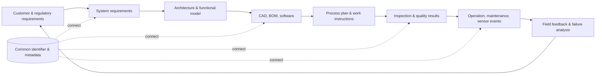
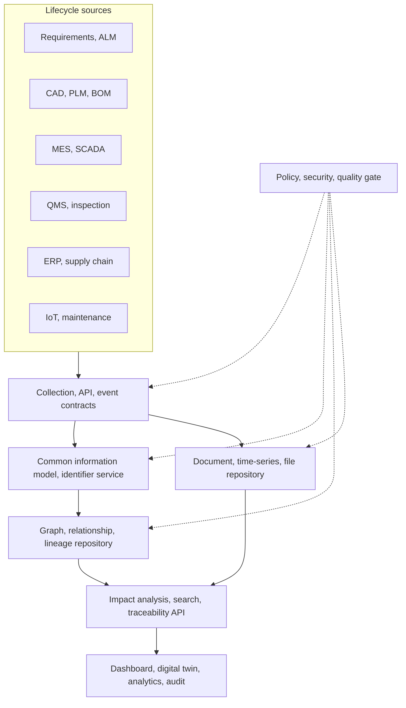

# Full-Lifecycle Information Linkage Based on the Digital Thread

## 1. Overview

> **Definition**: The Digital Thread is an integrated information flow that connects the heterogeneous information generated across the lifecycle of a product or service — from requirements through design, development, production, operation, maintenance, and disposal — via identifiers and relationships to make it traceable.

Traditional organizations have introduced separate systems for planning, design, manufacturing, quality, sales, and maintenance.
Each system is optimized for its department's work, but the meaning and connection between systems often remain in documents, emails, and manual cross-checking.
As a result, it is hard to immediately explain which production plan and inspection criteria a design change affects, or which requirements and design decisions a field failure originated from.
The digital thread treats this disconnection not as simple file integration but as the problem of connecting the relationships and context between lifecycle objects.

The core of the digital thread is not copying all data into a single database.
The starting point is referencing requirements, parts, geometry, processes, inspection results, and sensor events with common identifiers and standard semantics while respecting each domain's source systems.
Therefore, even if a central repository is created, provenance, change history, access authority, and inter-version relationships must be preserved.
In a professional engineer's answer, one must not stop at the word "integration" but explain identifiability, interoperability, lineage, impact analysis, reliability, and security together.

The background of its emergence lies in the spread of the model-based enterprise and smart manufacturing.
As products grew complex into systems combining software, electronic parts, mechanical parts, and data services, it became hard to guarantee quality with the output of a single department alone.
To operate a digital twin, one must not only connect the state of the physical object and the virtual model but also trace which requirements and design/inspection bases that model has.
Through such connections, the digital thread provides the foundation for the digital twin, model-based systems engineering, and data-driven decision-making.

The goals can be organized into four.
First, quickly find forward and backward impacts based on a specific part or requirement.
Second, reuse the same product definition in manufacturing, inspection, and maintenance to reduce re-entry and interpretation differences.
Third, leave a change and approval history to raise trust in the data and auditability.
Fourth, return field feedback to design and requirements to improve the quality of the next product and process.

## 2. Concept and Composition Principles

### 2.1 Distinguishing the Digital Thread from Related Concepts

The digital thread is not the product name of a data storage technology but an operating model for information linkage.
A data lake is a storage- and processing-centered concept that stores source data in various formats, whereas the digital thread is a connection-centered concept that follows lifecycle objects and relationships to answer meaningful questions.
A digital twin is a digital representation that represents a real-world observed object in a purpose-fit manner and synchronizes its state, and the digital thread is the information flow that connects that twin with requirements, design, process, and inspection data.
PLM is a system for managing product-related information and processes, and the digital thread is a tracing perspective that crosses boundaries including PLM, such as ERP, MES, QMS, ALM, and IoT.

The following table is an aid for distinguishing the terms.
Rather than memorizing a single cell of the table, one must grasp the location of the disconnection each concept seeks to solve.

| Category | Core Question | Main Scope | Relationship to the Digital Thread |
|---|---|---|---|
| Digital thread | How is lifecycle information connected and traced? | From requirements to disposal | The overall connection structure and operating principle |
| Digital twin | With which digital representation is the physical object's state synchronized? | Object, model, sensor, simulation | An application operated on top of the thread |
| PLM | How are product data and collaboration processes managed? | Product definition, change, approval | An important source system and management system |
| Data lake | How are various source data stored and processed? | Storage/analytics platform | A foundation that can hold thread data |
| Knowledge graph | With which semantic model are objects and relationships represented? | Entities, relationships, inference | A method that implements connection and impact analysis |
| MBSE | How are system requirements and design managed with models? | Systems engineering | A core source of the upper requirement/design thread |

### 2.2 Overall Information Flow

The digital thread connects the outputs created at each lifecycle stage with common identifiers and relationships.
When a requirement ID continues through system function, design element, part, process plan, inspection characteristic, and field event, change impact and root-cause analysis become possible.
The connection must be managed not as a one-directional list of links but as relationships that include version, validity period, responsible party, approval state, and provenance.

A requirement is the result of turning customer expectations, laws, safety constraints, and performance goals into verifiable statements.
Unless requirements are connected to design and testing, the basis for asserting that the product satisfies the requirements is weak.
Therefore, record the verification method, approval state, and reason for change together in the requirement links.

At the design layer, system structure, interfaces, geometry, software versions, and part composition and manufacturing information are connected to one another.
Because a simple filename connection can break the relationship when a file is copied or its format is converted, a method of assigning persistent identifiers to model elements and objects is needed.
Even for the same part number, if the design version and applicable product family differ, it may have different validity, so version and configuration basis must be specified.

At the manufacturing and quality layer, design intent is conveyed to work instructions, equipment settings, inspection characteristics, and nonconformity handling.
When inspection results reference specific geometry, process, equipment, and work conditions, the cause of a defect can be analyzed by condition rather than by average value.
Conversely, without this relationship, quality data becomes an independent bundle of numbers, making it hard to determine the re-verification scope for a design change.

The operation and feedback layer makes the thread a learning loop rather than a closed document system.
Maintenance history and sensor events tell in which usage environments problems recur, and this information returns to requirements, design, and preventive-maintenance cycles.
Feedback must be distinguished from source data and preserved together with the reliability and approval state of the field determination, so that a wrong event does not trigger a design change.

### 2.3 Identifiers and Semantic Models

Identifiers are the clue of the thread.
Assign a stable global or domain identifier to products, components, requirements, model elements, processes, inspection characteristics, documents, and sensor events, and manage the mapping with each system's keys.
Because unconditionally using a business system's internal number as a global key can break relationships during a system replacement or organizational restructuring, a design that separates a persistent identifier from a display number is advantageous.

The meaning does not automatically become the same just because the identifier is the same.
A glossary and an ontology define the meaning of and allowable relationships among parts, functions, processes, defects, units, and states.
For example, whether a temperature value's unit is Celsius or Fahrenheit, and whether an inspection characteristic is the upper bound of a design tolerance or the upper bound of a measured value, must be clear for meaning not to change in inter-system exchange.

Metadata can include the creator, creation time, source system, version, security level, quality state, retention period, applicable product configuration, and license.
Metadata looks like an incidental description compared to the body, but it becomes the reference point for search, impact analysis, audit, and reproducibility.
If, when moving data, only the body is copied and the metadata is lost, the connection remains but the trustworthy context is lost.

### 2.4 Standards and Interoperability

When connecting different systems, file conversion alone is not enough.
Syntactic interoperability is the question of whether a file can be read, and semantic interoperability is the question of whether the read value is interpreted as the same concept.
In inter-organizational transactions, interoperability of process and responsibility is also needed, so approval, change notification, error handling, and retransmission rules must be included in the contract.

In smart manufacturing, one can combine standards such as the STEP family for product-model exchange, MTConnect for equipment-data exchange, and QIF for quality-information exchange.
Using a standard does not immediately integrate; what matters is which profiles and mandatory fields the organization adopts and how it manages the meaning of extension fields.

The gap between standardization and real systems is managed with a mapping layer and conformance testing.
Convert source-system data into a common information model, and confirm with test data that the values and relationships before and after conversion are preserved.
Merely increasing one-to-one point mappings makes interfaces grow exponentially, so simplify the connection structure around the common model and API/event contracts.

## 3. Implementation Architecture and Operational Procedure

### 3.1 Logical Architecture

The following structure is not a reference model that says to replicate a specific product, but divides the thread's functions into layers.
One may virtualize and link source systems without changing them, or place a separate trusted data repository if regulatory or performance requirements are high.
What matters is that a query result must be able to explain provenance, transformation, version, and authority.

The collection layer uses batch, API, message, and file exchange in a purpose-fit manner.
Work in which approval order matters, such as a design change, needs transactions and state transitions, while high-volume, low-latency data such as sensor events is suited to streaming and time-series storage.
Making all data real-time increases cost and complexity, so distinguish intervals according to the information's freshness requirement and analysis purpose.

The common information model is a contract that defines the minimum common attributes and relationships.
Forcibly cramming all sources' detailed attributes into one giant schema makes the model rigid, so commonize the core identification, state, version, and relationships, and manage domain extensions with namespaces and profiles.
Implement a model change after reviewing backward compatibility, conversion rules, consumer impact, and reprocessing plans.

The relationship repository can be implemented with a graph database or relational link tables.
A graph is not always the right answer; structured aggregation may be better suited to a relational or columnar store.
Decide the technology choice based on the traversal pattern of impact analysis, relationship depth, write/read ratio, regulatory retention, and team capability, and combine multiple stores at the query layer.

### 3.2 Construction Procedure

The first step is to define the business question and the success criteria.
Instead of the goal "integrate the data," define it with a user and time included, such as "find the inspection plans affected after a design change within 10 minutes."
Only with an accurate question can one determine the required relationships, currency, authority, and performance criteria.

Second, list the core lifecycle objects and systems.
Start with high-value objects such as requirements, system functions, components, geometry, software, process, inspection, failure, and supplier, and do not put all files into the first scope.
Drawing the current manual cross-checking and duplicate entry as a value stream reveals priorities and expected effects.

Third, create the reference model of identifiers, terms, relationships, and states.
Because the same name can carry different meanings, place a data dictionary and responsible parties, and document the conditions under which a relationship holds and its validity period.
To maintain the relationships before and after a change, treat version and configuration basis as mandatory elements of the model.

Fourth, implement a small value stream as a pilot.
For example, select one of the requirement-design-inspection connection or the failure-part-maintenance connection and complete an actual query scenario.
Use the pilot as a venue to discover the quality of relationships, user acceptance, and source-data defects rather than the number of interfaces.

Fifth, put quality, security, and performance gates into the operational pipeline.
Automatically check schema, identifier uniqueness, mandatory relationships, units, time, duplicates, authority, and missing lineage, and leave approvals and expiry dates for exceptions.
For high-risk products, connect data signing, hashing, electronic approval, and verification logs so that results can be reproduced later.

Sixth, establish the change-management and operations organization.
Define the roles of the information-model committee, domain data owners, platform operators, and security/quality leads, and place procedures for model-change requests and version releases.
Do not connect the systems once and finish; apply the same onboarding procedure when new products, partners, and sensors come in.

### 3.3 Traceability, Impact Analysis, and Change Propagation

Traceability must be provided in two directions, upstream and downstream.
Upstream tracing confirms which process, design, and requirements a field defect relates to, and downstream tracing finds which inspection, maintenance, and customer configuration a requirement or design change affects.
If relationships are recorded only one-directionally, one of impact scope or root-cause analysis is missed, so bidirectional traversal must be possible.

Impact analysis goes beyond a list of direct links to interpret relationship types and conditions.
For example, a "use" relationship, a "verify" relationship, and a "substitute" relationship have different priorities for change propagation.
One must find broken mandatory verification paths using graph patterns, a rule engine, and configuration-management information, and attach an explanation of why something was included in the traversal result.

Change propagation is not a function that automatically changes everything.
A semi-automatic approach — generating impact candidates and having the domain owner approve whether they are affected and the re-verification scope — is safe.
Because unapproved automatic propagation can violate an old configuration or an exception contract, set the automation level based on risk and the reversibility of the change.

### 3.4 Quality, Security, and Authority

Digital thread quality can be measured by dividing it into accuracy, completeness, consistency, currency, uniqueness, traceability, and availability.
However, because a single average quality score can hide the omission of core relationships, place separate quality gates by mandatory object, mandatory link, and high-risk product family.
Quality indicators must specify the definition, denominator, measurement interval, threshold, and improvement owner.

Security must start from the assumption that all information gathers into a central graph.
Design drawings, supplier information, customer operational information, and individuals' maintenance records can have different levels and legal bases.
Combine object-, relationship-, and attribute-level access control, row/column filtering, masking, purpose-of-use recording, and query audit logs.

In partner linkage, a data-space approach that provides only the necessary views and periods/configurations/attributes without sharing the entire thread is advantageous.
When a supplier changes data, one must be able to confirm who changed what and when, and appropriately use certificates, signatures, hashes, and trust lists.
Because integrity technology does not guarantee that data is true, source verification and business approval are also needed.

## 4. Comparison and Application Cases

### 4.1 Comparison of Point-to-Point Integration and the Digital Thread

Point-to-point integration is advantageous for solving a quick need between two systems, but as the number of systems grows, the number of interfaces and conversion rules increases sharply.
If each interface uses different terms and versions, a change in one place spreads to failures in many places, and it is hard to traverse relationships integrally.
The digital thread places the common model, identifiers, and event contracts at the center to standardize the meaning and responsibility of connections.

| Category | Point-to-Point Interface | Digital Thread Approach |
|---|---|---|
| Startup speed | Fast for a single need | Model and governance preparation needed |
| Scalability | Complexity increases as systems grow | Mitigated by the common model and reusable relationships |
| Semantic management | Distributed across per-interface mappings | Terms, relationships, profiles managed centrally |
| Impact analysis | Manual lookup across many logs and documents | Scope derived by relationship traversal and rules |
| Change response | High chance of cascading fixes | Controlled by version, lineage, and compatibility procedures |
| Suitable situation | Simple, one-off, low coupling | Long-term products, regulation, multi-organization ecosystems |

It does not mean point-to-point is bad.
Early on, one can quickly validate a limited flow such as authentication, settlement, or equipment state point-to-point.
However, if the product lifecycle and partners are expected to grow, one must also prepare a migration plan to convert point-to-point connections into common contracts and a relay layer.

### 4.2 Manufacturing Quality Case

Suppose a hypothetical aerospace-part manufacturer cannot determine the scope of inspection re-execution after a design change.
Previously, the person in charge manually cross-checked CAD files, work standards, inspection results, and supplier certificates found in per-department folders.
Document names were similar, but part versions and process validity periods differed, so shipping delays and rework occurred due to inspections missed after the change.

First, assign persistent identifiers to parts, geometry, tolerances, processes, and inspection characteristics, and model the relationship between design version and manufacturing configuration.
Next, manage product-definition data in a standard exchange format, and make the work-instruction and quality systems reference the same part and characteristic IDs.
Include in inspection results the measurement equipment, calibration state, process conditions, worker role, and data version.

When a change is approved, the impact-analysis service presents the related processes, inspections, suppliers, and inventory configurations as candidates.
The quality lead approves the actually affected items among the candidates and decides the necessary re-verification and shipping hold.
When a field failure occurs, trace back from the failure event through part lot, process conditions, inspection results, and design change to register recurrence-prevention items as design feedback.

The outcome of this case is not the number of integrated systems itself.
It must be measured by change-impact-analysis time, mandatory-link omission rate, number of times the same data is re-entered, number of re-verification omissions, and time to determine the cause of field problems.
For example, even if impact-analysis time is reduced from several days to tens of minutes, if the relationship quality is low and false positives are many, approval work can increase, so evaluate speed and accuracy together.

### 4.3 Case of Combination with a Digital Twin

A power-plant digital twin is not completed merely by showing sensor values and simulation results.
It must be connected to which equipment/part the sensor is installed on, which design variables and maintenance procedures it references, and what the anomaly-detection model's training data and alarm history are.
With this connection, one can go beyond simply displaying an alarm to using it as a basis for maintenance prioritization and design improvement.

However, real-time sensor data and long-term-retention product-definition data have different lifetimes and processing characteristics.
A hybrid structure that separates a low-latency time-series store from an immutable design/approval store and connects them by common identifiers and time/configuration bases is suitable.
One must query the observation time, applicable configuration, and temporal validity together so that the real-time state is not confused with a past design version.

## 5. Deep Dive: Standardization, Reliability, and Linkage to a Professional Engineer's Answer

National research institutes and industrial standardization activities view the digital thread as the information flow between design, manufacturing, inspection, and product support, and emphasize open standards and trustworthy traceability.
The purpose of standardizing product data is to avoid dependence on a specific tool and to enable the reuse and verification of information between lifecycle stages.
However, rather than listing standards, explaining the scope of application, mandatory information, conformance testing, and the organization's operational responsibility is more appropriate for a professional engineer's answer.

The digital thread and the digital twin are not in a substitution relationship with each other.
If the twin is an application that represents the state of a specific physical object, the thread is the foundation that connects which requirement/design/process/inspection/maintenance context that state has.
To raise the twin's reliability, one must manage not only data time synchronization but also model version, verification and validation results, uncertainty, and traceability.

Recently, graph technology, event-driven architecture, data spaces, and generative-AI-based search are expanding thread utilization.
When generative AI queries lifecycle data, it must search only authorized relationships, present the basis for its answer and source links, and distinguish inferred results from factual data.
Otherwise, the more connected data there is, the greater the risk of plausibly explaining a wrong relationship.

The expected answer is stable in the following order.
Describe the definition and background of emergence, and present the requirement-design-production-operation conceptual diagram.
Then explain identifiers, metadata, standards, graphs, APIs, and governance, and compare with point-to-point integration.
After presenting the business effect with a manufacturing-quality or digital-twin case, conclude with interoperability, security, quality, change management, and organizational responsibility as considerations.

## 6. Considerations and Implications

### 6.1 Fix the Value Question and Scope First

Starting with enterprise-wide integration as the goal enlarges the scope and budget and makes it hard to prove quick results.
Select questions with clear cost and risk, such as change-impact analysis, regulatory traceability, inventory-configuration confirmation, and predictive maintenance.
A phased approach that first determines the relationships and currency needed for the question and then expands the data and interface scope is desirable.

### 6.2 Manage Identifiers and Versions as Management Assets

If identifier rules are left as an internal problem of the system-development team alone, the thread breaks when a system is replaced.
Set an enterprise-level identifier policy, configuration basis, version lifetime, disposal/substitution relationships, and data owners, and include them in the procurement requirements for new systems.
Register objects for which relationships cannot be created as data-quality debt and manage them in an improvement backlog.

### 6.3 Choose Standards but Operate Profiles

Adopting many standards does not guarantee interoperability.
One must define as a profile the versions, mandatory elements, units, code lists, extension fields, and conformance tests the organization actually uses.
A standard change goes through an impact assessment on existing relationships and consumers, conversion testing, and a parallel-operation period.

### 6.4 Continuously Measure Data Quality and Reliability

Even if linkage succeeds, if there are identifier duplicates, mandatory-link omissions, outdated models, and unit-conversion errors, the risk of decision-making does not decrease.
Measure the quality of core objects and relationships by product family, partner, and lifecycle stage, and display quality results and responsible parties on a dashboard.
The priority of data-quality improvement is not to eliminate all errors but to lower the paths with large safety, regulatory, and customer impact first.

### 6.5 Design the Balance of Security and Collaboration

The value of the thread lies in sharing, but the entire data need not all be shared.
Control the sharing scope with least privilege, purpose-based views, separation by project/product/region, export approval, partner contracts, and query auditing.
Because blocking all links for security reasons erases the thread's value, adjust the level of detail of relationships according to sensitivity and business need.

### 6.6 Place a Human Approval Path in Automation

Automating change-impact candidates, anomaly detection, and similar-document linkage can raise analysis speed.
However, because automatic inference does not guarantee the factuality and responsibility of relationships on one's behalf, leave the basis, confidence, approver, and rollback plan for high-risk changes.
Set the correct impact scope and the reduction of re-verification omissions, not the automation rate, as performance indicators.

### 6.7 Include the Organization and Supply Chain

The digital thread is not a platform business of the IT department alone.
Product, design, manufacturing, quality, maintenance, purchasing, security, and legal must jointly determine data meaning and responsibility, and partners must also participate in identifier and change-notification contracts.
Through education and an operations community, one must create a cycle in which field data is again reflected in design and standards for it to be sustained.

## 7. References

- NIST, Digital Thread for Smart Manufacturing: https://www.nist.gov/programs-projects/digital-thread-smart-manufacturing
- NIST, Digital Thread for Manufacturing: https://www.nist.gov/programs-projects/digital-thread-manufacturing
- NIST, Enabling the Digital Thread for Smart Manufacturing: https://www.nist.gov/ctl/smart-connected-systems-division/smart-connected-manufacturing-systems-group/enabling-digital
- NIST, System Lifecycle Handler for Digital Thread: https://tsapps.nist.gov/publication/get_pdf.cfm?pub_id=924828
- NIST, Digital Twins for Advanced Manufacturing: https://www.nist.gov/programs-projects/digital-twins-advanced-manufacturing
- NIST, Recommendations on Ensuring Traceability and Trustworthiness of Manufacturing-Related Data: https://nvlpubs.nist.gov/nistpubs/ams/NIST.AMS.300-10.pdf
- NIST, Testing the Digital Thread in Support of Model-Based Manufacturing and Inspection: https://tsapps.nist.gov/publication/get_pdf.cfm?pub_id=919497

---

> **In one line**: The digital thread is an information-management foundation that connects product-lifecycle information via common identifiers, standard semantics, versions, and lineage to enable change-impact analysis, quality traceability, digital-twin operation, and field feedback.
