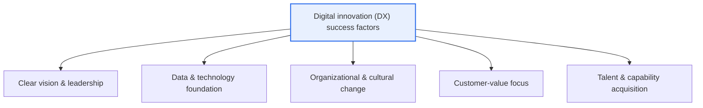
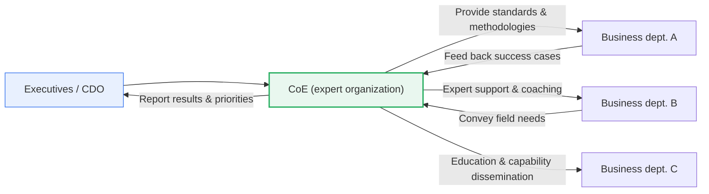

# Considerations for Digital Innovation and the CoE (Center of Excellence)

## 1. Overview

### A. Definition
> A **CoE (Center of Excellence)** is a **"hub of innovation" organization** that **concentrates in a dedicated group of experts** the core capabilities needed for digital innovation (DX) — data, AI, cloud, and so on — provides the enterprise with standards, methodologies, and best practices, and supports and disseminates each department's innovation. Considerations for digital innovation refer to the conditions across the dimensions of strategy, data, organization, culture, and talent — including this CoE — that lead DX to success.

The fundamental reason a CoE is needed in digital innovation lies in the fact that "**if innovation capability is scattered across the organization, it fails to spread and dies out**." DX is not the project of a single department but a long journey that changes the entire organization's way of working, business model, and culture. Yet if each department tries on its own, they redundantly adopt the same tools, repeat the same trial and error, and hard-won success experiences vanish without crossing departmental boundaries. A CoE solves this problem by gathering scarce experts — data scientists, AI engineers, cloud architects, agile coaches — in one place, establishing enterprise-wide common methodologies and standards, and coaching and supporting the innovation of each business department. In short, the CoE is the focal point that concentrates scattered capabilities to reduce trial and error and redundant investment, and spreads local successes across the whole organization, raising the speed and success rate of DX.

### B. Background and Necessity
A considerable portion of digital innovation projects fail to produce the expected results and founder, and the cause is often not the technology itself but **absence of strategy, organizational resistance to change, lack of capability, and silos (disconnection between departments)**. In particular, because advanced capabilities such as data and AI have scarce talent and steep learning curves, it is practically impossible for each department to secure them individually.

Against this background, organizations face two opposing dilemmas. Concentrating capabilities centrally secures expertise but distances them from the field, reducing practicality; distributing them to each department improves field proximity but weakens expertise and standards. A CoE is an organizational form that emerged to reconcile this dilemma in a way that "**concentrates expertise centrally while supporting and disseminating to the field**." Therefore, a CoE should be understood not as a simple new-technology task force but as a standing, strategic organization that accumulates and transfers capabilities throughout the DX journey and raises the organization's digital maturity.

## 2. Considerations for Digital Innovation

The success of digital innovation depends not on the flashiness of the adopted technology but on the balance of multiple axes — vision, data, organizational culture, customer value, and talent. The overall structure diagram below shows the core factors that underpin DX success.

### A. Vision and Leadership
Because DX entails fundamental change in the organization, it loses momentum without strong executive sponsorship and clear direction. When leadership wavers, innovation investment is the first to be cut under the pressure of short-term results, and the entity to coordinate conflicting departmental interests disappears. Therefore, the starting point is for the CEO and CDO (Chief Digital Officer) to declare DX an enterprise-wide priority and to foster the psychological safety that recognizes failure as learning. For example, when a large manufacturer pursues a smart-factory transformation, having executives explicitly include "data utilization" in each factory's KPIs is a concrete practice of leadership.

### B. Data and Technology Foundation
The fuel of DX is data. No matter how good an AI model is, it is useless without trustworthy data, so data governance (quality, standards, security, metadata) and the cloud and data-platform infrastructure to hold it must come first. Integrating data trapped in silos and preparing a data pipeline and analytics environment that the whole enterprise can use in common is a core task. If the data foundation is weak, each department reaches different conclusions with data based on different criteria, and trust in decision-making collapses.

### C. Organizational and Cultural Change
The most common cause of DX failure is not technology but culture. An organization accustomed to a long-standing way of succeeding tends to perceive new attempts as risks and to resist. Therefore, an agile culture that encourages experimentation and fast failure, collaboration across departmental boundaries, and the habit of making decisions based on data must be embedded in the organization. This change is the hardest and takes the longest, and education, incentives, and leaders leading by example must all work together. Adopting only tools without cultural change ends up as "digital showcase administration" in which expensive systems are left neglected.

### D. Customer-Value Focus and Talent
The purpose of DX is not the adoption of technology itself but the provision of new value to customers. Therefore, all innovation must start from the question "what problem of the customer's does this solve?" At the same time, securing the digital talent (data, AI, cloud, UX experts) to execute all of this and reskilling existing personnel are the final keys to success. Because competition in the talent market is fierce, a strategy that pursues internal development and partnerships alongside external hiring is needed.

The table below organizes the considerations (an aid to the prose explanation).

| Consideration | Core Content | Symptom of Failure |
|---|---|---|
| **Vision & leadership** | Clear DX goals & sponsorship led by executives | Investment halted under short-term pressure |
| **Data & technology** | Data governance, cloud/AI foundation | Trust collapse from differing data by department |
| **Organization & culture** | Agile/experimentation culture, resistance management | Expensive systems neglected (showcase administration) |
| **Customer focus** | Innovation starting from customer problems | Technology for technology's sake, no results |
| **Talent & capability** | Expert acquisition, reskilling existing staff | Drifting for lack of an execution body |

## 3. The Role and Operating Model of the CoE

The CoE is the execution body that actually makes the preceding considerations work. The detailed diagram below shows the structure in which the CoE interacts with business departments along five axes — strategy, standards, support, education, and governance.

### A. Capability Concentration and Provision of Standards and Methodologies
The primary role of the CoE is to gather scarce expert capabilities in one place and establish a common framework to be shared enterprise-wide. For example, it organizes data-analysis methodologies, MLOps pipeline standards, cloud-architecture reference models, and reusable component libraries so that each department does not start from scratch every time. This standardization homogenizes quality and makes cross-department collaboration and integration easier.

### B. Field Support and Coaching, and Dissemination of Success Cases
The CoE must be a helper that digs into the field, not an ivory tower. It dispatches experts to each department's innovation projects to solve problems together (embedded support) and replicates and spreads successful pilots to other departments. In this process, the CoE "transfers" knowledge, growing the field's self-sufficiency to innovate on its own. For example, if the CoE standardizes a demand-forecasting model validated in one sales department and transplants it to another business unit, the entire organization shares the results without individual learning costs.

### C. Education, Culture-Building, and Governance
The CoE is responsible for enterprise-wide digital-capability education (data literacy, AI utilization) and the spread of an innovation culture, and at the same time performs governance functions — prioritizing DX tasks, allocating investment, and managing performance. It is a control-tower role that, amid limited resources, decides what to do first, coordinates redundant investment, and measures performance to report to executives.

### D. Operating Model Types
The CoE's mode of operation divides into three types according to the center of gravity between control and autonomy. Each type must be selected and evolved to match the organization's digital maturity.

| Type | Characteristics | Suitable Situation |
|---|---|---|
| **Centralized** | Strong control by the CoE, unified standards | Early DX, absence of capability/standards |
| **Decentralized** | Autonomous innovation by each department | Mature stage, capability internalized |
| **Hub & Spoke** | Mix of a central hub + departmental touchpoints | Expansion stage, most large enterprises |

Generally, an organization quickly establishes capabilities and standards in a centralized form in early DX, and as it matures, transfers authority through Hub & Spoke to a decentralized form, moving the center of gravity from control to autonomy.

## 4. Comparison and Application Cases

### A. Comparison of the CoE and General Organizational Forms
A CoE must not be confused with a temporary TF (task force) or a plain IT department. A TF is a temporary organization disbanded after completing a specific task, so capability does not accumulate, and a traditional IT department focuses on system operation and cannot lead business innovation. By contrast, a CoE is a standing organization that continuously accumulates capability and focuses on converting technology into business value — this is the decisive difference. This difference manifests in practice as "continuity" — a TF's knowledge scatters when the project ends, whereas the CoE reinvests the methodologies and cases it has accumulated into the next project, shortening the learning curve.

### B. Industry Application Cases
The CoE is used as the focal point of DX in various industries. In finance, a data/AI CoE standardizes credit scoring, fraud detection (FDS), and personalized recommendation models and provides them to each business unit. In manufacturing, a smart-factory CoE concentrates the equipment-data-analysis and predictive-maintenance capabilities scattered across factories, spreading a defect-prediction model validated on one line to all factories. In the public sector, too, cases are increasing of establishing a data-analytics CoE for data-driven administration to support each ministry's analytics needs. What these cases have in common is that they realize the essence of the CoE — "standardizing a success in one place and replicating it across the whole organization."

### C. Recent Trend — Generative AI CoE
Recently, organizations that newly establish an **AI CoE / Generative AI CoE** in response to the spread of generative AI (LLMs) are rapidly increasing. This standardizes the scattered LLM-utilization attempts across the enterprise, establishes guidelines for prompts, RAG, and model governance, and controls the risks of data security, ethics, and hallucination. To prevent the problems of data leakage, copyright, and bias caused by indiscriminate adoption, such a central control and support organization is becoming especially important.

## 5. Deep Dive — Expected Exam Directions and Answer-Construction Strategy

In the Professional Engineer for Information Management exam, this topic tends to be set in the management and business-strategy domain in the form of "discuss the considerations for the success of digital innovation and the role of the CoE." Points to note when writing an answer are as follows.

First, **the considerations and the CoE must be organically connected.** Rather than merely listing the considerations (vision, data, culture, customer, talent) and explaining the CoE separately, they must be woven together with the logic that "the CoE is the execution body that actually makes these considerations work" so that an integrated understanding is revealed.

Second, **be sure to include the CoE's operating model and maturity evolution.** The dynamic perspective of shifting the center of gravity from centralized → Hub & Spoke → decentralized, and the characterization of it as "a support organization, not a control organization," are high-scoring points.

Third, **weaving the latest case (Generative AI CoE) and related topics into the answer** keeps it timely. Mentioning connections with adjacent topics such as data governance, MLOps, agile organization, and change management (ADKAR) can demonstrate the broad insight expected at the professional-engineer level.

## 6. Considerations and Implications (Professional Engineer Perspective)

1. **The CoE must be designed as a support organization, not a control one.** If the CoE lords over the field as a gate that approves and censors, it instead slows the speed of innovation and invites resistance. It becomes sustainable only when it positions itself as an enabler that disseminates capability and coaches the field. The balance between support and minimal governance (standards, security) is the crux.

2. **Organizational evolution according to maturity is needed.** In the early stage, rapidly build capability and standards in a centralized form, but as the organization's capability matures, transfer authority through Hub & Spoke to a decentralized form. An operating model that does not match the maturity stage produces a bottleneck (excessive central control) or chaos (premature decentralization).

3. **Being a catalyst of cultural change is the ultimate goal of the CoE.** The success metric of the CoE is not the number of projects performed but how much the whole organization has internalized a digital culture of working on a data and experimentation basis. In other words, the CoE should aim to "make itself unnecessary" (to make the field innovate self-sufficiently).

4. **Performance measurement and a talent-retention strategy must proceed in parallel.** Unless the CoE's contribution is converted into business results (revenue, cost, customer metrics) and made visible, it easily loses its justification to exist. At the same time, designing career paths, compensation, and growth opportunities to prevent the departure of the scarce experts gathered in the CoE is essential. An approach that measures the CoE's contribution in connection with a performance-management tool such as the BSC is effective.

5. **Linkage with data governance and security is a prerequisite.** Because the data and AI the CoE handles entail risks of personal information, copyright, bias, and security, it must necessarily be linked with the enterprise-wide data-governance system and with AI ethics and governance. In particular, a Generative AI CoE must include model governance and risk control as core responsibilities.

## References
- Gartner, "Center of Excellence (CoE)" Glossary: https://www.gartner.com/en/information-technology/glossary/center-of-excellence-coe
- McKinsey, "Unlocking success in digital transformations": https://www.mckinsey.com/capabilities/people-and-organizational-performance/our-insights/unlocking-success-in-digital-transformations

---

> **In one line**: Digital innovation must consider the balance of *vision, data, organizational culture, customer value, and talent*, and the CoE, as an innovation hub that *concentrates scarce core capabilities to provide standards and methodologies and supports and disseminates each department's innovation*, raises the speed and success rate of DX through support over control, autonomy transfer according to maturity, and its catalytic role in internalizing a digital culture.
