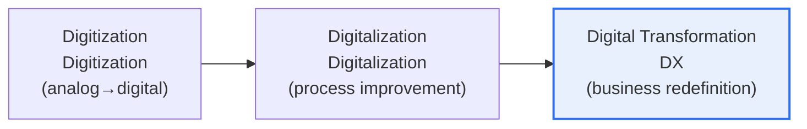

# Digital Transformation (DX)

## 1. Overview

### A. Definition
> A holistic transformation that uses digital technology as a lever to **fundamentally redesign business models, processes, customer experience, and organizational culture** to create new value. It goes beyond simple computerization (Digitization) or partial digitalization (Digitalization).

To understand the essence of DX, three terms must be distinguished. **Digitization** converts analog into digital data, like scanning paper into a PDF; **Digitalization** uses that data to improve existing business processes. **DX (Transformation)**, however, goes one step further and **redefines the very way a company makes money (its business model)**. For example, if a heavy-equipment manufacturer shifts from selling excavators to a service model that charges a "fee per hour of operation," and sells a service that predicts breakdowns through IoT sensors attached to the equipment to reduce downtime, that is textbook DX. It is selling an outcome rather than a product.

### B. Background and Necessity
Three pressures have made DX a matter of survival rather than choice. First, **the maturation of technology**. The cloud has removed the entry barrier of infrastructure cost, and AI and big data now make it possible to extract value from data. Second, **rising customer expectations**. Consumers accustomed to smartphones demand instant, personalized experiences across every industry. Third, **market disruption by digital-native companies**. Just as Netflix reshaped video rental stores and Uber reshaped the taxi industry, platform companies break down the boundaries of existing industries. In the face of this pressure, traditional companies that fail to transform themselves are left behind.

## 2. The Evolutionary Stages of DX

The three stages form a continuum rather than a break, but while the first two are about "efficiency (doing better)," DX has the qualitative difference of "**innovation (doing differently)**." Many companies mistake digitization and digitalization for DX, but adopting an ERP and automating tasks merely makes an outdated way of doing business faster — it is not transformation. True DX is completed only when the data gained in that process is used to **create new revenue streams and customer relationships**.

## 3. Components of DX

DX is not the adoption of a specific technology but simultaneous change across multiple axes. The **business model** shifts from product sales to services, subscriptions, and platforms; **processes** are automated and optimized based on data instead of experience and intuition. **Customer experience (CX)** evolves from disconnected channels to omnichannel and hyper-personalization spanning online and offline, and the **organization and culture** underpinning all of this changes from a hierarchical command structure to an agile, data-driven culture that permits experimentation. The **technological foundation** for these changes is cloud, AI, big data, and IoT.

| Component | Direction of Transformation | Example |
|---|---|---|
| **Business model** | Product → service, subscription, platform | Software package sales → SaaS subscription |
| **Process** | Experience-based → data-based automation | Demand forecasting, inventory optimization |
| **Customer experience (CX)** | Disconnected channels → omnichannel, hyper-personalization | Integrated app, store, and web journey |
| **Organization and culture** | Hierarchy and command → agile and experimentation | Squad organization, data-driven decision-making |
| **Technology foundation** | On-premises, manual work | Cloud, AI, big data, IoT |

## 4. Success Factors and Failure Factors

Many DX projects fail, and the cause usually lies not in technology but in **people and strategy**. Successful organizations have executives who lead with a clear vision (leadership), manage data as a trustworthy asset (data governance), and have a culture that accepts failure as learning. Conversely, failing organizations adopt technology without purpose in a "our competitors are doing it" fashion, fail to manage frontline resistance, or become fixated on short-term results and abandon the transformation.

| Category | Content |
|---|---|
| **Success factors** | Executive vision and leadership, data governance, agile culture, customer-value focus |
| **Failure factors** | Purposeless technology adoption, organizational resistance, fixation on short-term results, silos |

## 5. Considerations and Implications (Professional Engineer Perspective)

1. **Start from value, not technology.** The reverse design of first defining "what new value will we give the customer?" rather than "what technology should we adopt?" and then selecting technology accordingly raises the probability of success.
2. **Cultural change is the hardest and most important.** Technology can be bought, but a culture of working based on data and tolerating failure takes a long time. Manage the change through a CDO (Chief Digital Officer) and a dedicated organization.
3. **A strategy for coexistence with legacy** is needed. A big-bang replacement of core systems all at once is risky, so the Strangler pattern of gradually transitioning via microservices and APIs is realistic.
4. **Generative AI has emerged as a new catalyst.** It accelerates DX in hyper-personalized marketing, task automation, and knowledge retrieval, and AI-native business models are expected to spread going forward.

---

> **In one line**: DX is the stage in the evolution of *digitization → digitalization → digital transformation* that redefines the business model itself, simultaneously innovating business, process, customer experience, and organizational culture; the key to success lies not in technology but in a **customer-value-centered strategy and cultural change**.
