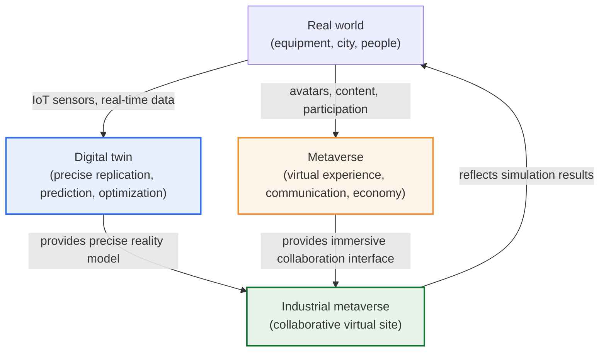
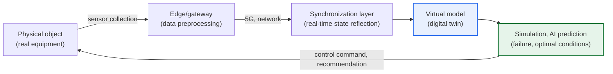

# Digital Twin and Metaverse

## 1. Overview

### A. Definition
> A **Digital Twin** is a technology that **precisely replicates a real physical object (equipment, building, city, process) in digital space and synchronizes it in real time with IoT sensor data** to simulate, predict, and optimize; a **Metaverse** is a persistent virtual world in which **people interact, engage in economic activity, and collaborate through avatars in a three-dimensional virtual space fused with reality**.

The key to understanding the two technologies side by side lies in the fact that "**both move reality into digital form, but their purposes and subjects differ**." The purpose of the digital twin is to "**accurately reflect reality to predict and solve problems**." It ceaselessly synchronizes a virtual model with data such as the actual temperature, vibration, and current at an industrial site, predicting in advance when equipment will fail (predictive maintenance) and first finding the optimal operating conditions of a process in the virtual space. In other words, the digital twin is practical and industry-centered, a technology of observation and analysis in which the flow of data heads "reality → virtual." By contrast, the purpose of the metaverse is to "**create a new space of experience, communication, and economy that extends reality**." People borrow the body of an avatar and enter it to play, work, hold meetings, and trade virtual assets. In other words, the metaverse is experience- and society-centered, a technology of interface and platform whose essence is people's participation and interaction.

However, the two technologies show their true worth when they **converge** rather than oppose each other. When the digital twin provides "a precise virtual stage that reflects reality as it is" and the metaverse provides "an interface in which multiple people enter that stage together as avatars to collaborate and experience," the so-called "**Industrial Metaverse**" is established. For example, several engineers in remote locations meet as avatars on the digital twin of an actual factory to jointly inspect equipment, simulate a process change in the virtual space, and then reflect it in reality. In short, it is a complementary relationship in which the digital twin gives the metaverse "reality (precision)" and the metaverse gives the digital twin "participation (collaboration, immersion)."

### B. Background and Necessity
Behind the simultaneous rise of the two technologies is a common maturation of technology. IoT sensors and 5G's ultra-low-latency, high-capacity communication made it possible to collect and transmit the state of reality in bulk without delay, AI made it possible to analyze and predict that data, and XR (VR/AR) and high-performance GPU / cloud rendering made it possible to draw reality-like three-dimensional spaces in real time. In other words, as "the ability to precisely digitize reality" and "the ability to experience that digital immersively" matured together at the same time, the digital twin (the former) and the metaverse (the latter) entered the practical stage side by side. On top of this, as demand for non-face-to-face collaboration and remote operation surged after COVID-19, the need for a way of working in which physically separated people work at the same virtual site spread throughout industry.

## 2. Conceptual Structure and Relationship

### A. Overall Structure Diagram
Taking the real world as the starting point, the relationship between the two technologies becomes clear when we structurally see how the digital twin and the metaverse diverge and then meet again. The digital twin proceeds in the direction of "observing and replicating" reality, and the metaverse in the direction of "extending and creating" reality, but the two flows join in the industrial metaverse.

What to note in this structure diagram is the directionality of the arrows. In the digital twin, data flows mainly "reality → virtual," becoming a mirror that reflects reality, and the optimization results are fed back into reality. In the metaverse, people enter "reality → virtual" and create new activities. The industrial metaverse, where the two flows meet, layers "people's collaboration (metaverse)" on top of "precise reflection of reality (digital twin)," completing a closed loop that reflects decisions verified in the virtual space back into reality.

### B. The Operating Principle of the Digital Twin — Closed-Loop Architecture
The key is that the digital twin is not a simple 3D model but a "living, moving model." When the sensors attached to a real object continuously send state data, the virtual model reflects those values in real time to maintain the same state as reality.

Adding physics-law-based simulation or an AI prediction model here makes future prediction possible, such as "if these conditions continue, the bearing will reach its wear limit in 3 days." When the operating conditions of the real equipment are changed based on such a predicted result, that change is again observed by the sensors and reflected in the model, continuing a cycle. This closed loop of "**observation → synchronization → prediction → optimization → feedback**" is the decisive feature that distinguishes the digital twin from a static blueprint.

As this detailed architecture diagram shows, the value of the digital twin comes not from individual components but from the cyclic loop they form. Sensors and the edge turn reality into data, the network delivers it without delay, the synchronization layer keeps the virtual model consistent with reality, and simulation and AI predict the future to return control commands to reality. The faster and more accurate this loop, the higher the maturity of the twin.

Accordingly, the maturity of a digital twin is understood broadly in three stages. Stage 1 is the level of "**visualization and monitoring**" of reality into virtual, where data flows from reality to virtual but there is no feedback. Stage 2 is the level of performing "**analysis and prediction**" in the virtual space, adding future prediction such as predictive maintenance. Stage 3 is the level of "**automatically controlling and feeding back**" the virtual space's optimal decision to reality, reaching autonomous optimization in which the closed loop spins on its own without human intervention. Most industrial sites still remain at Stages 1–2, and it is accurate to view fully autonomous Stage 3 as an aspiration that must clear the high threshold of reliability and safety verification.

### C. Components and Characteristics of the Metaverse
The metaverse is defined by four characteristics: **persistence** (the world continues to exist even when the user disconnects), **real-time** (simultaneous interaction of many users), **interoperability** (movement of assets and identity between services), and **economy** (production and trade of virtual goods). Only when all four of these characteristics are present does it become a "persistent virtual world" that is not a simple online game or video conference.

The components that implement this divide into three layers. The first is the **presentation layer**, composed of avatars, 3D space, and a real-time rendering engine, which creates the appearance of the virtual world that the user sees and manipulates. The second is the **immersive interface layer**, composed of VR/AR headsets, haptic devices, and motion capture, which connects the user's senses and movements to the virtual world. The third is the **virtual economy layer**, represented by blockchain, NFTs, and cryptocurrency, which grants ownership and tradability to virtual goods.

In particular, interoperability and economy are the decisive points that distinguish the metaverse from a simple 3D game. Only when a structure is possible in which an item bought in one space can also be used in another and creations can be traded to gain real value can the social and economic potential of the metaverse be realized. In reality, however, each service often uses a closed specification so that assets are trapped within it, leaving this interoperability as the metaverse's biggest unresolved challenge.

## 3. Comparison and Core Technologies

### A. Differences in Purpose and Focus
The difference between the two technologies stems not from a simple functional difference but from a difference in aspiration — "what is the technology for?" The digital twin lives on accuracy and predictive power, so it concentrates all its capabilities on reducing the error against actual data. Conversely, the metaverse lives on immersion and connectivity, so it need not necessarily match reality; rather, the freedom to create experiences not found in reality (movement ignoring gravity, physically impossible spaces) becomes its value. This difference in aspiration is the source that divides every item in the table below.

| Category | Digital Twin | Metaverse |
|---|---|---|
| **Purpose** | Reality replication, prediction, optimization | Virtual experience, communication, economic activity |
| **Focus** | Practical, industrial (accuracy, predictive power) | Experience, social (immersion, connectivity) |
| **Data direction** | Reality → virtual (real-time synchronization) | Virtual ↔ people (interaction) |
| **Reality consistency** | The higher the better (error minimization) | Not essential (creative extension allowed) |
| **Core value** | Simulation, predictive maintenance, optimization | Immersion, connection, virtual economy |
| **Representative applications** | Smart factory, smart city, plant | Virtual meetings, games, virtual offices, exhibitions |

### B. Core Technology Stack
The two technologies share the foundational technologies of 3D modeling/rendering, AI, cloud, and high-performance GPU. Because this common foundation exists, convergence is technically natural. However, each has its own technologies for its own purpose. The digital twin's proprietary domain is IoT sensors, edge computing, real-time synchronization middleware, and physics-based simulation (CAE/CFD), while the metaverse's proprietary domain is XR (VR/AR) devices, avatars and motion capture, and a blockchain-based virtual economy.

| Layer | Digital Twin Proprietary | Metaverse Proprietary | Common Foundation |
|---|---|---|---|
| **Data & connectivity** | IoT sensors, edge, real-time synchronization | Avatars/motion capture, low-latency network | 5G, cloud |
| **Processing & intelligence** | Physics simulation, AI predictive analytics | Real-time multi-access server | AI, GPU |
| **Presentation & economy** | 3D precise model (error minimized) | XR rendering, blockchain/NFT | 3D rendering engine |

## 4. Cases and Convergence — The Industrial Metaverse

Understanding becomes clear when we see the substance of convergence through concrete cases. **First, in manufacturing**, global automotive and aerospace manufacturers are adopting a way, before building a new factory, of constructing the entire line as a digital twin in virtual space, having design and production engineers from several countries connect to that virtual factory as avatars to jointly verify equipment layout, movement lines, and safety, and then breaking ground on the actual construction. This catches design errors early without physical prototyping, reducing rework after ground-breaking. **Second, in the city and infrastructure field**, uses are increasing in which traffic and energy scenarios are simulated on top of a smart city's digital twin, and policymakers make decisions while viewing the results together in the virtual space. **Third, in the plant and energy field**, the interior of a dangerous power plant or chemical plant is reproduced as a digital twin, and workers perform advance training and remote inspection via VR, securing safety without entering the site.

What these cases have in common is that "the precise data of the digital twin" and "the collaboration interface of the metaverse" combine to **first verify, train, and decide in the virtual space without entering reality**, and reflect the results in reality. In other words, the essential value of the industrial metaverse lies not in "fun" but in "moving real-world risk and cost into the virtual to reduce them."

At this point, the reason the fates of the consumer metaverse and the industrial metaverse diverged is also explained. The consumer metaverse failed to present a clear utility answering "why must we meet in a virtual space of all places," so the fervor cooled, but the industrial metaverse has clear, quantifiable utility — reducing prototyping costs, preventing safety accidents, and improving remote-collaboration efficiency — so investment continues. In the end, the lesson recent cases give is that for the convergence of the two technologies to succeed, "the real-world problem being solved and its economic value" must come before "the novelty of immersion."

## 5. Deep Dive — Latest Trends and Standardization

**In terms of the latest trends**, while the overheating of the early consumer metaverse (virtual games, social) has subsided, the industrial metaverse and digital twins, which show clear returns on investment, are seeing substantial adoption expand centered on manufacturing, construction, energy, and defense. As generative AI is combined here, a trend is observed of lowering the cost and threshold of construction and use, such as automatically generating 3D assets and virtual environments and explaining a digital twin's predictions in natural language. Also, as private 5G and edge computing spread to factory sites, the prerequisite of the digital twin — real-time synchronization of large volumes of sensor data — is beginning to be met on-site.

**In terms of standardization**, interoperability is emerging as the core challenge. This is because common formats and protocols are needed for the 3D models, virtual spaces, avatars, and assets of different vendors to move between one another. Accordingly, open formats for 3D data exchange (e.g., the glTF and USD families) and industry interoperability-standardization consortia are advancing the discussion, but it is accurate to understand that they have not yet converged on a single standard. Only when standardization matures can the virtual worlds in the form of "islands (silos)" trapped within individual services be connected to one another, so that the metaverse's essential value of interoperability can be realized.

**As for expected exam directions**, the following are anticipated: (1) define and compare the digital twin and the metaverse and discuss ways to converge them (industrial metaverse), (2) explain the composition and maturity stages of the digital twin and the use of predictive maintenance, and (3) describe the characteristics of the metaverse (persistence, interoperability, economy) and its security threats and countermeasures.

## 6. Considerations and Implications (Professional Engineer Perspective)

1. **Maximize synergy through convergence, but do not confuse the purposes.** The industrial metaverse, which combines the digital twin (precise reflection) and the metaverse (immersive collaboration), is powerful, but it must be designed by distinguishing "areas that require real-world accuracy" from "areas that require experiential freedom." Mixing metaverse-style creative extension into a place where simulation accuracy is vital instead harms reliability.

2. **Securing data and interoperability is the key to practical use.** To accurately reflect reality, large volumes of real-time data, standardized 3D and data formats, and interoperability between services are essential. Being trapped in vendor-specific closed specifications blocks expansion and linkage, so the adoption of open standards and data governance must be designed together.

3. **Proactive response to security and privacy threats is needed.** Because reality is digitized and people act as avatars, new attack surfaces arise — leakage of industrial data, manipulation of the digital twin (inducing real-world malfunction), avatar impersonation, theft of virtual assets, and excessive collection of behavioral data. Alongside access control, encryption, and integrity verification, the principle of protecting the privacy of individuals' immersive behavioral data must be reflected from the design stage (Privacy by Design).

4. **Clarify the return on investment (ROI) and adopt in phases according to maturity.** As the bubble experience of the consumer metaverse shows, the key is not the technology itself but "what problem is solved at what cost." Start with pilots in areas where the effect is quantified, such as predictive maintenance and design verification, and take the realistic approach of gradually widening the scope according to organizational and infrastructural maturity.

5. **Linkage design with adjacent technologies such as AI, 5G, and cloud is needed.** The prediction accuracy of a digital twin depends on AI model quality, real-time synchronization on 5G/edge infrastructure, and large-scale rendering on cloud/GPU resources. Therefore, rather than viewing the digital twin and metaverse as independent projects, they must be designed as an architecture integrated with the organization's AI, cloud, and network strategy to produce sustainable results. In particular, combination with generative AI is expected to lower the cost of 3D-asset generation and prediction-result interpretation, acting as a catalyst that accelerates the popularization of both technologies.

## References
- Korea National Information Society Agency (NIA), issue reports on digital twins and the metaverse — https://www.nia.or.kr/
- Ministry of Science and ICT, policy materials such as the Metaverse New Industry Leadership Strategy — https://www.msit.go.kr/
- Electronics and Telecommunications Research Institute (ETRI), technology-trend materials on digital twins and the industrial metaverse — https://www.etri.re.kr/

---

> **In one line**: The digital twin is a practical, industrial technology that *precisely replicates and synchronizes reality to predict and optimize*, and the metaverse is an experiential, social technology in which *people experience, communicate, and trade through avatars in a virtual space*; their purposes differ, but they converge into the "industrial metaverse" to produce the synergy of collaborating, simulating, and verifying without entering reality, and securing data interoperability and security is the key to practical use.
