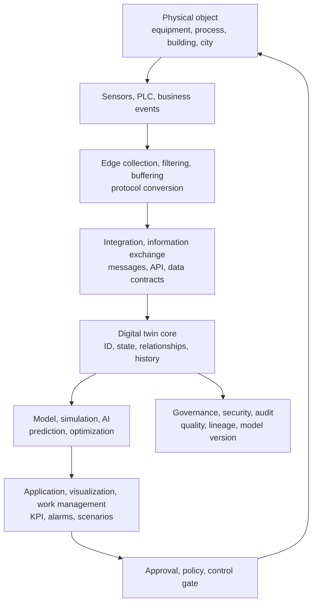
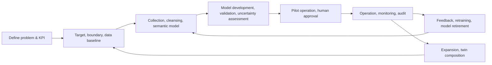

# Digital Twin Architecture and Implementation Strategy

## 1. Overview

> **Definition**: A Digital Twin is a system that digitally represents a real, observable object, process, or system in a purpose-fit manner, continuously synchronizes reality and the digital representation through sensor and business data and models, and uses this for observation, prediction, simulation, and optimization.

A digital twin is distinguished from a simple 3D model or dashboard. A 3D model can visualize shape and space but does not necessarily represent state changes over time or the meaning of behavior. A dashboard shows measured values but may lack the function to change the model's state or experiment with future conditions. A digital twin connects the object's identifier, attributes, state, history, relationships, rules, and simulation model, and aims for a closed loop in which changes occurring in reality are reflected in the digital representation and analysis results feed back into decision-making or control.

The background of its emergence lies in the fact that objects have grown complex and operational data has exploded in manufacturing, construction, energy, logistics, and city operations. In the past, design documents, operation records, and checklists were separate from one another, so the cause was traced only after a problem occurred. As IoT sensors, edge computing, cloud, time-series databases, and AI/simulation technologies combined, it became possible to reproduce the current state of a real object in virtual space and test multiple conditions before operation.

However, a digital twin is not a project of installing many sensors. What to observe, what level of accuracy and latency to allow, which decisions to improve, and who is responsible when a wrong model disrupts operations must be defined first. If the purpose is maintenance, the data needed to estimate failure signs and remaining useful life is key; if it is production optimization, the relationships among inter-equipment constraints, quality, delivery, and energy cost become key.

ISO 23247 describes a digital twin in the manufacturing domain as the synchronization between an observable manufacturing element and its digital representation, and presents a framework composed of general principles, a reference architecture, digital representation, and information exchange. This should be understood not as a single solution that prescribes the implementation product for all industries, but as a basis for designing composable twins using common terminology and interfaces.

In a professional engineer's answer, the value of a digital twin should be presented not merely as "reality replication" but as the data cycle of observation → modeling → analysis/simulation → business decision → reality feedback. One should also discuss together the trade-offs of model accuracy versus construction cost, real-time capability versus consistency, openness versus security, and automatic control versus human approval.

## 2. Concept and Development Stages

The object of a digital twin may be a single piece of equipment, or a system in which multiple twins are connected, such as a factory, city, or supply chain. As the object's boundary widens, the kinds of data and latency, the owning organizations, and inter-model dependencies increase, so the purpose and boundary of the twin must be clarified first. Even for the same factory, a twin for design verification, a twin for predictive maintenance, and a twin for energy optimization differ in the models and accuracy criteria they require.

### A. Core Elements of the Digital Representation

**Identification and context** are the starting point of the twin. If the asset ID differs across the equipment-management system, the sensor gateway, the drawing, and the work order, one cannot judge which pump a temperature value belongs to. Therefore, the asset's global identifier, hierarchical relationships, location, owning organization, and validity period are managed as common metadata.

**State and events** represent the present. State is the current interpreted result, such as running, stopped, warning, or under maintenance, while an event is a change that occurred at a specific point in time, such as exceeding a vibration threshold, a part replacement, or a work approval. Overwriting raw sensor values with state makes cause analysis difficult, so raw data, refined data, and derived state are distinguished from one another and preserved together with time and quality flags.

**Models and rules** turn observed values into meaningful judgments. Physics-based models have high explainability using conservation laws and design equations, but require specialized knowledge to build. Data-based models catch complex patterns given sufficient training data, but their performance can drop when the distribution changes. In practice, physics constraints, statistical models, and machine learning are combined in a purpose-fit manner.

**Synchronization policy** defines the temporal relationship between reality and the digital representation. Sending all data in real time is not always best. Temperature control requires the second scale, but a monthly production plan is sufficient with minute- and hour-level aggregation. The data collection interval, allowable latency, order correction, missing-value handling, and retransmission policy must be specified for the meaning of analysis results to be preserved.

| Element | Key Question | Representative Implementation |
|---|---|---|
| Identifier/context | Whose data is this? | Asset ID, hierarchy, location, relationship graph |
| Observation/state | What is the state now? | Sensors, events, state machine, quality flags |
| Model/rule | Why did that change occur? | Physics equations, simulation, ML, rule engine |
| Synchronization | How fast is it matched to reality? | Streaming, batch, time window, correction |
| Action/feedback | What action is taken? | Alarm, work order, control command, approval |

### B. Development from Simple Model to System Twin

The first stage, the **digital model**, statically represents the attributes and relationships of a real object. CAD, BOM, an equipment master, and process routing fall here. This stage is useful for integrating reference information, but because it does not automatically synchronize with running sensors or events, its function is limited enough that it is hard to call it a twin.

The second stage, the **digital shadow**, is a state in which changes in reality are reflected one-directionally in the digital representation. Collecting the rotational speed and power of equipment and displaying it on a status screen is an example. The operator gains visibility, but because the analysis results of the digital domain do not automatically change the real equipment, the risk of closed-loop control is relatively low.

The third stage, the **digital twin**, has bidirectional interaction between reality and the digital domain. A prediction model may judge the need for maintenance and generate a work order, or a setpoint derived by simulation may be reflected in the control system after approval. However, having a bidirectional connection does not immediately mean full automatic control; authority, safety interlocks, human approval, and rollback must be designed separately.

The fourth stage, the **twin network / system of twins**, is a structure in which equipment twins, process twins, factory twins, and supply-chain twins are connected via standard interfaces. Because the optimization of an individual twin can differ from the optimization of the whole system, resource, quality, delivery, and energy constraints must be coordinated at a higher level. At this stage, data contracts, model versions, semantic systems, and boundaries of responsibility become as important as technology.

## 3. Reference Architecture and Data Flow

A digital twin architecture can be explained as layers: the physical domain, the connectivity/collection domain, the digital-representation domain, the model/analysis domain, and the application/decision domain. Layering is not a method for listing product names but a method for clarifying each layer's responsibility and fault isolation. For example, even if a sensor malfunctions, the quality flag of the raw data must be conveyed to the analysis layer so that wrong control does not occur.

The **physical domain** is the objects of observation, such as equipment, products, workers, environment, and logistics assets. Rather than trying to replicate all physical characteristics, select the observable variables and uncertainties needed for decision-making. Values a sensor cannot directly measure may be estimated values, so distinguish measured, estimated, and simulated values as data types.

The **edge domain** converts field protocols and absorbs latency, bandwidth, and connection loss. Safety-affecting control must not depend on a cloud round-trip; field interlocks and local controllers must have priority. Rather than transmitting data unconditionally, the edge reduces cost and latency by performing outlier detection, window aggregation, compression, and local buffering.

The **integration domain** connects protocols and data contracts such as MQTT, OPC UA, REST, and event streams. Even if the protocol is the same, there is no guarantee the meaning is the same, so unit, time zone, sampling interval, quality code, and schema version are managed together. Considering message duplication, reordering, and reprocessing, place event IDs and idempotent-processing rules.

The **twin core** manages the current state and history of assets, inter-asset relationships, model references, and authority. Merely overwriting state in a single table makes reproducing a past point in time difficult, so run event logging and current-state storage in parallel in a purpose-fit manner. The relationship graph represents "which line a pump is connected to" and "which BOM and work order a part belongs to," providing context for analysis.

The **model/analysis domain** combines rules, simulation, statistics, and machine learning. In a prediction result, do not display only the value but also record the model version, training-data range, confidence interval, input quality, and explanatory basis. If one controls with a single number even when the prediction is uncertain, operators may over-trust the model, so representing uncertainty is important.

The **application/control domain** is where people and business processes use the results. Generating many alarms does not raise monitoring quality; an operational flow including severity, deduplication, assignee routing, action deadlines, and completion verification is needed. Automatic control is placed behind a policy gate equipped with allowable ranges, approval conditions, safe stop, manual override, and audit logs.

## 4. Construction Procedure and Operational Lifecycle

### A. Goal and Target Selection

In the first stage, express the business problem as a KPI and a loss function. "Building a smart factory" is not an actionable goal, but the goal "reduce unplanned downtime of a bottleneck piece of equipment on a quarterly basis and shorten maintenance lead time" can narrow the scope of data and models. When measuring the effect, evaluate together not only model accuracy but also the labor time spent on false alarms, the cost avoided from production stoppages, and the time taken for decisions.

Prioritize the target based on importance, observability, and change cost. Including in the first target a piece of equipment whose failure cost is large and for which sensor data already exists lets one quickly validate hypotheses. Conversely, fully digitizing from the start an object with no data at all ties the schedule to sensor installation and data cleansing, delaying value validation.

### B. Data and Semantic Model Design

Standardize asset IDs, units, time bases, state codes, event types, and location and hierarchy. Connecting relationships by equipment name alone breaks integration because of site-specific abbreviations and renamings. Manage the creation, movement, and disposal of assets and the sensor-replacement history, and make reproducible which asset version past data belongs to.

A data contract defines the responsibilities between producer and consumer. The producer defines at what interval and quality level it publishes data, and the consumer defines up to which schema version it is compatible with. Silently deploying a schema change can alter the meaning of model inputs, so automate compatibility checks and change approval.

### C. Model Development and Validation

A model is not evaluated by accuracy alone. For a predictive-maintenance model, evaluate how early it warns before failure, what the costs of false positives and false negatives are, and whether performance is maintained under new operating conditions. For a simulation model, validate the residual against actual measurements, the computation time, and the range of boundary conditions.

Separate the validation data so that it does not overlap the training data in time, equipment, and environment. If before-and-after data of the same failure event are mixed into training and testing, performance is overestimated. When sensor calibration, seasonal change, product-item change, or equipment modification occurs in the operational environment, detect drift and decide on retraining or model retirement.

### D. Pilot Operation and Expansion

Pilot operation connects the data flow and business actions end-to-end for a single piece of equipment or process. Rather than whether the screen looks good, confirm whether alarms lead to actual maintenance work and whether work results are used again to improve the model. Compare KPIs before and after applying the twin only after securing a baseline period, so as not to mistake mere market changes or worker-proficiency effects for results.

In the expansion stage, a balance is needed between replicating a common platform and allowing site-specific models. Standardizing ID, security, audit, and data quality, while allowing domain extension for equipment-specific physics models and screens, is realistic. Rather than making all work into one giant twin, composing purpose-specific twins via standard interfaces can lower the impact of changes.

## 5. Technical Composition and Key Design Issues

### A. The Trade-off among Real-time, Consistency, and Cost

Ultra-low-latency streaming reflects the latest state quickly, but increases network, storage, and processing costs. Sending all data to the center in real time can make bandwidth and message throughput a bottleneck. Layering is needed in which important events are streamed and raw data for long-term analysis is sent to batch, compressed, tiered storage.

It is difficult to guarantee that the digital representation is always the latest. If events arrive late or device clocks are misaligned, collection time and occurrence time must be distinguished. Without defining watermarks, event-time windows, allowable reordering time, and missing/duplicate policies, state computation differs from run to run.

The consistency level is also chosen by use. Safety control may require strong ordering locally, but an energy-analysis dashboard may allow a few minutes of latency and eventual consistency. From a professional engineer's perspective, do not use "real time" vaguely but present latency SLA, data freshness, loss rate, and reprocessability as numbers.

### B. Interoperability and Open Standards

For linkage between twins, meaning and responsibility matter more than data format. Unless it is agreed whether one system's `temperature` is Celsius or Fahrenheit, whether it is measured or estimated, and of which location's value it is, analysis is wrong even if the API is connected. Manage a common ontology, a unit system, asset classification, and time/space bases as inter-organizational contracts.

In manufacturing environments, existing PLC, SCADA, MES, and ERP are already in operation, so adapters and event-based integration are more realistic than a full replacement. Combine industrial interfaces such as OPC UA, message brokers, REST/GraphQL APIs, and file exchange in role-fit ways, and separate raw data from normalized data so that data meaning does not become dependent on a specific vendor model.

Adopting a standard does not make all interoperability problems disappear automatically. Confirm the standard's profiles, optional items, versions, and implementation conformance, and perform actual linkage tests. Including standard-conformance tests and contract tests in the CI pipeline can catch meaning breakage during system replacement early.

### C. Security, Safety, and Trust

A digital twin can gather in one place sensitive information such as equipment structure and operating state, vulnerable points, and production volume. Separate read authority from control authority, and apply fine-grained access control based on asset, tenant, task, and time. Manage field-device credentials, certificate lifetimes, key rotation, network-segment encryption, and command signing together with operational procedures.

If sensor data is forged, the model can compute normally yet reach a wrong conclusion. Raise input reliability through sensor authentication, provenance and lineage, quality codes, range validation, cross-sensor validation, and anomaly detection. Because outlier removal can delete an actual failure signal, preserve the raw data and separately record the refined result and the reason for removal.

When analysis results are connected to control commands, review not only IT security but also functional safety and operational safety. Reject commands outside the allowable range, transition to a safe state if communication is lost, and enable a person to perform an emergency stop. Even if the model presents a high probability, specify authority boundaries so that safety interlocks and legal responsibility cannot be bypassed.

## 6. Comparison and Application Cases

### A. Comparison of the Digital Twin and Similar Concepts

The difference between a digital twin and a digital model lies in synchronization and operational purpose. A model represents the structure and behavior of a physical object but may not be connected to the actual state. A twin synchronizes the object's data and digital representation at least within a defined scope, and observation results are used for business decisions.

A digital shadow focuses on the one-directional connection flowing from reality to digital. A twin can include a bidirectional flow in which digital analysis results are reflected in real-world work or control. However, because bidirectionality also raises risk, introduce it in phases through human approval and policy gates.

Simulation is a model/execution process that computes the future or alternatives assuming certain conditions. A twin can include simulation but also requires connection with real-time state, history, identifiers, and operational processes. Therefore, even if the simulation result is good, the operational value of the twin is limited without actual data quality and business adoption.

| Category | Digital Model | Digital Shadow | Digital Twin | Simulation |
|---|---|---|---|---|
| Reality synchronization | Optional, static | Reality → digital | Bidirectional possible | Assumption/scenario-centered |
| Core value | Design, documentation | Visibility, monitoring | Operational optimization, closed loop | Prediction, alternative comparison |
| Data requirement | Reference information | Sensors, events | Sensors, history, relationships, models | Input conditions, model parameters |
| Risk factor | Mismatch with reality | Analysis limits | Wrong automatic control | Difference between assumption and reality |

### B. Manufacturing/Equipment Predictive-Maintenance Case

Connecting the vibration, temperature, current, and operating load of rotating equipment to a twin lets one compute the difference between the normal operating pattern and the current state. Because a simple threshold alarm may judge normal vibration due to load change as a failure, use the baseline by operating condition together with the equipment history. Rather than asserting a failure prediction result as "failure in N days," present a remaining-useful-life interval and confidence and let the maintainer confirm.

When maintenance work is completed, record the replaced part, cause code, work time, and whether an actual failure occurred back into the twin. Without this feedback, the model does not learn the operator's judgment and repeats false positives. The case's outcome is verified not only by prediction accuracy but by the conversion rate to planned maintenance, unplanned downtime, and the change in part inventory and maintenance input.

### C. Building/Energy Operation Case

A building twin can combine BIM/spatial information, HVAC equipment, occupancy, outdoor-air conditions, and power metering to analyze energy demand and comfort by zone. Because simply lowering power usage can worsen indoor temperature and air quality, multi-objective optimization among energy, comfort, and equipment lifetime is needed.

Even when heating/cooling setpoints are proposed from outdoor-temperature and occupancy predictions, place a range the manager can approve and a manual-operation procedure. When model inputs are incomplete due to a sensor gap or an air-handler failure, do not unconditionally reuse recent normal values but display the quality state and switch to a conservative operating mode.

### D. Supply-Chain/Logistics-Network Case

A supply-chain twin connects factories, warehouses, transportation, demand, and inventory to test scenarios of delivery delay or supply disruption. Because optimizing a single warehouse can increase the inventory and transportation cost of the whole network, inter-node inventory policies, lead-time distributions, alternative sourcing, and service levels must be modeled together.

Because actual order and delivery events can be delayed or duplicated, manage event IDs, occurrence time, collection time, and state-transition rules. Use simulation results as decision support, and execute ordering and route changes through approval and exception handling. Because supply-chain data includes partner information and commercial secrets, minimal inter-organizational sharing and access auditing are important.

## 7. Deep Dive: Standardization and Twin-Composition Strategy

Recently, the expansion challenge of digital twins is shifting from raising the precision of an individual twin to safely composing different twins. NIST explains that standardization helps advance isolated custom solutions into scalable industrial tools by providing common terminology, reference models, and interfaces. This does not mean that choosing a single platform solves all problems, but that the contracts between replaceable components must be designed first.

The manufacturing reference structure of ISO 23247 explains by separating the responsibilities of the physical manufacturing element, the digital representation, and the user, service, access, and proximity networks. Rather than copying this structure as-is into a product-configuration diagram, implementers must map their own process's observation targets, functional entities, and information-exchange boundaries. In particular, the location of data collection and model computation, the approving party for control commands, and the responsibility for inter-twin composition must be documented.

In future twin composition, it is important to manage a model's input/output contracts, time resolution, coordinate system/units, uncertainty, version, and usage authority in a machine-readable form. When twin A exports a production plan and twin B provides equipment capacity, if the two results use different reference points in time and model versions, the optimization result is not reproducible. Therefore, place a model registry and data lineage as core components of the twin platform.

When AI-generated scenarios or automated optimization are introduced, model risk management is also needed. Include the representativeness of training data, explainability, drift, approval logs, human intervention, and model rollback in operational controls. Recording the action proposed by the model separately from the action actually executed lets one reconstruct the cause and responsibility when an incident occurs.

## 8. Considerations and Implications

- **Purpose and scope first**: Rather than first introducing sensors and 3D screens, define first the decisions and KPIs to improve, the boundary of the object, the allowable latency, and the accuracy target. Rather than a single general-purpose twin, start from a use case with clear value and validate the closed loop of data, model, and business.
- **Data quality and lineage**: Distinguish raw values, refined values, state, and predicted values, and preserve occurrence time, collection time, units, and quality flags. Do not hide missing, duplicate, delayed data or sensor replacement; convey them as a trust level to model inputs and screens.
- **Interoperability and standardization**: Set asset ID, semantic model, units, event contracts, and model version as common rules. Use reference frameworks such as ISO 23247 as the organization's design language, but verify vendor lock-in and semantic mismatch through actual profiles and conformance tests.
- **Quantification of real-time capability**: Divide "real time" into a latency budget by stage — collection, transmission, processing, display, and control. Place the flow needed for control at the edge, and separate long-term analysis and training into cost-efficient storage tiers to optimize performance and cost together.
- **Model trust and change management**: Manage accuracy, false-positive/false-negative costs, uncertainty, drift, and model version, and validate model changes before and after deployment. Recover field workers' knowledge and exception judgments as data so that the model's recommendations improve in actual operation.
- **Security and functional safety**: Do not handle the twin repository's sensitive information and control commands with the same authority. Include device authentication, fine-grained authority, command signing, safety interlocks, manual override, audit logs, and a safe state on failure in the design.
- **Phased expansion of automation**: Start from observation and analysis, then lower risk in the order of recommendation, approval-based execution, and limited automatic control. Test the allowable range and rollback conditions of automatic control, and conduct scenario training that includes failures, communication loss, and wrong inputs.
- **Economics and organizational governance**: Calculate as TCO not only the platform construction cost but also sensor calibration, data operation, model retraining, field training, and legacy-integration cost. Clarify with a RACI the responsibilities of the data owner, model owner, operational approver, and incident responder.
- **Twin-network expansion**: Do not immediately expand an individual twin's success into an enterprise-wide platform; connect starting from areas where composition contracts and security boundaries have been verified. Unless the time basis, model version, uncertainty, and authority between twins are agreed, the reliability of the result collapses before the number of connections.

## References

- NIST, Digital Twin Standardization: https://www.nist.gov/digital-twins/digital-twin-standardization
- NIST, An Analysis of the New ISO 23247 Series of Standards on Digital Twin Framework for Manufacturing: https://www.nist.gov/publications/analysis-new-iso-23247-series-standards-digital-twin-framework-manufacturing
- ISO 23247-2:2021, Digital twin framework for manufacturing — Part 2: Reference architecture: https://www.iso.org/standard/78743.html
- ISO 23247-4:2021, Digital twin framework for manufacturing — Part 4: Information exchange: https://www.iso.org/standard/78745.html
- ISO/DIS 23247-6, Digital twin framework for manufacturing — Part 6: Digital twin composition: https://www.iso.org/standard/87426.html

---

> **In one line**: A digital twin is a closed-loop operational architecture that reliably synchronizes the identification, state, relationships, and models of a real object, connecting observation and simulation to actionable decisions.
