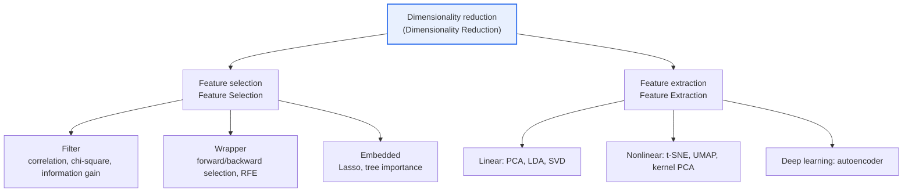
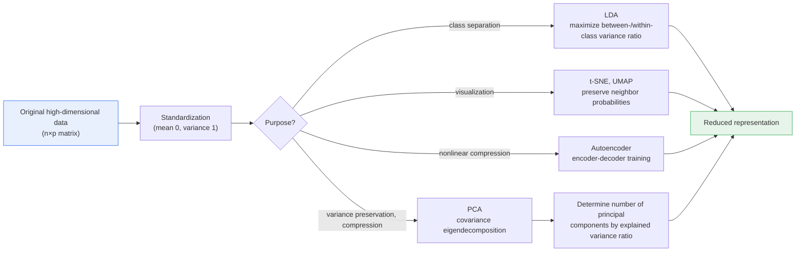

# Data Dimensionality Reduction

## 1. Overview

### A. Definition
> **Dimensionality Reduction** is a technique for **re-representing high-dimensional data with a smaller number of variables (dimensions) while minimizing information loss**. Its purposes are to mitigate the "curse of dimensionality" and to achieve computational efficiency, visualization, and overfitting prevention, and it divides broadly into feature selection, which picks some of the original variables, and feature extraction, which creates new axes.

The fundamental reason dimensionality reduction is needed is the paradox of the "**Curse of Dimensionality**." Intuitively, it seems that the more variables (features) there are, the richer the information and the better the prediction; but in reality, as variables increase, data points scatter extremely sparsely in high-dimensional space and grow far apart from one another. For example, 10 samples are enough to fill one variable uniformly over the interval 0–1, but maintaining the same density in 10 dimensions would require 10^10 samples. As dimensions increase, the amount of data required explodes exponentially.

This sparsity directly neutralizes algorithms. **Distance- and density-based algorithms** such as k-nearest neighbors (kNN) and clustering blur the distinction between "near" and "far" because of the "distance concentration" phenomenon, in which the distances between all points become similar in high dimensions. When the ratio of the distance to the nearest neighbor to that of the farthest neighbor converges to 1, algorithms that assigned meaning to proximity effectively approach random guessing. In the end, having many variables tends to mean an increase not in information but in noise and computational burden.

Also, as variables increase, the model's degrees of freedom (number of parameters) grow, raising the risk of **overfitting**, in which even the noise in the training data is memorized. This problem is especially severe in so-called "HDLSS (High-Dimension, Low-Sample-Size)" situations, where the number of variables is large relative to the number of samples (e.g., tens of thousands of gene-expression values versus hundreds of patients). Dimensionality reduction mitigates all of these problems at once by finding a small number of axes that carry the essential information of the data.

### B. Necessity and Effects
Dimensionality reduction provides three practical benefits. First, **computational and storage efficiency** improves, making training and inference faster and reducing memory usage. Reducing vectors of thousands of dimensions to tens of dimensions dramatically decreases the amount of distance computation and the index size. Second, reducing data to 2–3 dimensions lets people **visualize and explore** the structure of clusters, outliers, and class separation with their own eyes, aiding data understanding and hypothesis formation. Third, removing unnecessary variables, correlated variables, and noise **prevents overfitting** and raises generalization performance and model stability. In practice, the added effect of "**removing multicollinearity**" also stabilizes coefficient estimation in regression and classification models.

## 2. Classification of Approaches: Feature Selection vs. Feature Extraction

Methods for reducing dimensions divide broadly into **feature selection**, which picks out original variables as they are, and **feature extraction**, which combines variables to create new axes. First, survey the whole landscape.

**Feature Selection** is the approach of picking out only the useful variables among existing ones and discarding the rest. Its greatest advantage is that it is **easy to interpret**, because the remaining variables retain their original physical meaning. For example, if a disease-diagnosis model keeps only the roughly ten truly important items among hundreds of test items, clinicians can immediately interpret "a high value on this test means risk." However, the information arising from the combination of discarded and remaining variables is lost.

Feature selection divides further into three branches. The **Filter** approach evaluates variables with statistical indicators such as correlation coefficients, chi-square, and mutual information — independent of the model — to filter quickly. The **Wrapper** approach repeatedly searches subsets of variables (forward selection, backward elimination, RFE) using the actual model's performance as the criterion, so it is accurate but very computationally expensive. The **Embedded** approach is a compromise in which variable selection is built into the model-training process itself, as in Lasso (L1 regularization) or tree-based variable importance.

By contrast, **Feature Extraction** is the approach of mathematically combining multiple variables to create entirely new axes. It compresses information more efficiently, but because the new axes do not have the original physical meaning, it is **hard to interpret**. For example, PCA's "first principal component" takes a form like "a weighted sum of height, weight, and waist circumference," making it difficult to assign an intuitive meaning to it in itself. Instead, because it packs the information of correlated variables densely into a small number of axes, its compression ratio and expressive power are often superior to feature selection.

| Approach | Concept | Representative Techniques | Advantages | Disadvantages |
|---|---|---|---|---|
| **Feature selection** | Select the useful ones among original variables | Filter, wrapper, embedded | Easy interpretation (meaning preserved), simple original-data pipeline | Loss of variable-combination information |
| **Feature extraction** | Combine variables to create new axes | PCA, LDA, t-SNE, autoencoder | Superior information compression and expressive power | Difficult interpretation, transformation also needed for new data |

## 3. Major Techniques and Principles

Feature-extraction techniques differ in character according to "what they optimize." Organizing the internal procedure of representative techniques into a single flow gives the following.

**PCA (Principal Component Analysis)** is the most widely used linear, unsupervised technique. It takes the **direction of greatest variance** in the data as the first principal component, and successively finds directions orthogonal to it with the maximum remaining variance. Since large variance means the data is spread widely in that direction and carries much information (discriminative power), the original data can be substantially reconstructed with just the top few principal components. Mathematically, it is obtained by eigendecomposition of the covariance matrix (or SVD), and the magnitude of an eigenvalue is the amount of variance each axis explains. In practice, it is customary to take principal components up to the point where the "cumulative explained variance ratio" reaches 85–95%. However, PCA is sensitive to variable scale, so it must **always be applied after standardization**, and it has the limitation of capturing only linear correlation.

**LDA (Linear Discriminant Analysis)**, unlike PCA, is a **supervised learning** technique that uses class labels. If PCA finds "the axis of greatest total variance," LDA finds the axis that makes "**between-class variance large and within-class variance small**," projecting in the direction where the classes are best separated. It is therefore powerful as preprocessing for classification problems, but it has the characteristic that the number of dimensions it can reduce to is limited to "number of classes − 1" (e.g., at most 2 dimensions for 3 classes).

**t-SNE** and **UMAP** **preserve nonlinear neighbor structure** and are used mainly for 2- and 3-dimensional visualization. By matching probability distributions so that points close in high dimensions are also close in low dimensions, they excel at unfolding intricately tangled manifold structures to reveal clusters. However, note that these are mainly for visualization, and one should not quantitatively interpret the distances between axes or the sizes of clusters. UMAP is faster to compute than t-SNE and tends to preserve global structure better, so it has recently been preferred in practice.

**Autoencoder** trains a neural network to compress data down to a bottleneck (latent) layer (encoder) and then reconstruct the original (decoder), and uses the representation of that bottleneck layer as the reduced features. Because it can learn nonlinear relationships, it is strong for complex data such as images and audio, and its variant the VAE also extends to a generative model.

| Technique | Principle | Supervised/Unsupervised | Linear/Nonlinear | Main Use |
|---|---|---|---|---|
| **PCA** | Extract orthogonal axes of maximum variance (eigendecomposition) | Unsupervised | Linear | Standard preprocessing/compression |
| **LDA** | Maximize between-/within-class variance ratio | Supervised | Linear | Classification preprocessing |
| **t-SNE / UMAP** | Preserve neighbor probability distributions | Unsupervised | Nonlinear | Specialized for visualization |
| **Autoencoder** | Learn encoder-decoder latent representation | Unsupervised | Nonlinear | Deep learning, complex data |

## 4. Application Cases and Comparison

The choice of technique diverges from the nature of the data and the purpose. Let us look at a few concrete cases to see why differences arise.

**Case 1 — Genomic analysis (Bioinformatics).** A microarray experiment is a typical HDLSS situation: hundreds of samples but more than 20,000 genes (variables). Leaving the variables as they are causes any classifier to overfit. Here, a pipeline that first filters for genes with large expression variation, then keeps only the top few dozen principal components via PCA, and then performs classification is used as the standard. The reason PCA is chosen here is that it can compress the strong correlation among genes into a small number of axes.

**Case 2 — Image recognition and embeddings.** A 28×28-pixel MNIST digit image is a 784-dimensional vector, but the actual information lies on a much lower-dimensional manifold. Unfolding it into 2 dimensions with t-SNE/UMAP separates the digits 0–9 into 10 distinct clusters, letting one verify data quality and class separability at a glance. Conversely, if the purpose is compression and reconstruction, an autoencoder is suitable. Opposite techniques are chosen depending on whether the purpose is "to see" or "to compress."

**Case 3 — Recommendation/search systems.** When users and products are represented as embeddings of hundreds of dimensions and then recommended by similarity, large dimensions make nearest-neighbor search slow and reduce accuracy due to distance concentration. Here, reducing dimensions with PCA or learning the embeddings themselves in low dimensions jointly improves the speed and quality of the approximate nearest-neighbor (ANN) index.

Thus the crux of comparison is not a simple list but "**why that technique fits that situation**." PCA has the edge when linear, correlation structure is dominant and compression matters more than interpretation; LDA when labels exist and classification performance is the goal; t-SNE/UMAP when structure is to be confirmed by eye; and the autoencoder for nonlinear, large-scale, complex data.

## 5. Deep Dive: Recent Trends and Expected Exam Directions

**First, the resurgence in the era of embeddings and vector DBs.** As the high-dimensional embeddings (hundreds to thousands of dimensions) produced by large language models and multimodal models become the basic unit of search, recommendation, and RAG, dimensionality reduction is if anything expanding in use. In vector search, quantization-based reduction such as PQ (Product Quantization) and OPQ reduces the index size to a fraction, and combined with ANN graphs such as HNSW, processes large-scale similarity search in real time.

**Second, the fusion of manifold learning and Representation Learning.** Beyond traditional PCA, the representations themselves obtained through self-supervised learning play the role of "learned dimensionality reduction." That is, the center of gravity is shifting toward directly learning from data a low-dimensional representation useful for downstream tasks.

**Third, past and expected exam directions.** The professional-engineer exam frequently requires forms such as (1) defining the curse of dimensionality and explaining how dimensionality reduction mitigates it, (2) comparing feature selection and feature extraction and discussing the detailed techniques of each, (3) contrasting the principle of PCA (variance maximization, eigendecomposition) with the difference from LDA (unsupervised vs. supervised), and (4) describing, with cases, the position and effect of dimensionality reduction in a big-data/AI pipeline. When constructing an answer, developing it in the order "**concept → classification → technique principle → cases → trade-offs**" can give the completeness of an in-depth essay.

## 6. Considerations and Implications

From a professional engineer's perspective, the following should be comprehensively considered when applying and evaluating dimensionality reduction.

1. **Purpose-based technique selection strategy.** As a principle, use t-SNE/UMAP for exploring data structure, PCA/autoencoder for model preprocessing and compression, and LDA for improving classification performance. Since there is no "universal technique," one must weigh data scale, linearity, presence of labels, and interpretation requirements together in choosing.

2. **The trade-off among information loss, interpretability, and performance.** Reducing dimensions excessively loses even important information, degrading performance, and feature extraction sacrifices interpretability in exchange for a compression ratio. In PCA, quantitatively determine the appropriate dimension via the cumulative explained variance ratio (e.g., 90%) and the scree plot, while in regulated industries (finance, healthcare) feature selection is preferred because of explainability requirements — context-specific judgment is needed.

3. **Prevention of Data Leakage.** Transformations such as PCA, LDA, and scalers must be **fit only on the training data**, and only the transform should be applied to the validation and test data. If, in cross-validation, one reduces on the full data first, test information leaks and performance is optimistically distorted. Enforcing the order via a pipeline is safe.

4. **Scalability and operational perspective.** For large-scale, streaming data, choose scalable techniques such as incremental PCA and Random Projection, and for real-time services, choose a structure that stores a pre-trained transformation and applies it quickly at inference time. Also, design so that the mapping to the original variables is managed even after reduction, enabling model monitoring and debugging.

5. **Combination with related technologies.** Dimensionality reduction is not a standalone technique; its effect is maximized when combined with feature engineering, regularization, ensembles, and ANN search. In particular, in vector-search and RAG architectures, designing reduction, quantization, and indexing as a single pipeline governs both performance and cost.

## References
- scikit-learn, "Decomposition & Manifold learning": https://scikit-learn.org/stable/modules/decomposition.html
- UMAP documentation: https://umap-learn.readthedocs.io/en/latest/
- L. van der Maaten, G. Hinton, "Visualizing Data using t-SNE": https://www.jmlr.org/papers/v9/vandermaaten08a.html

---

> **In one line**: Dimensionality reduction is a technique for reducing variables while minimizing information loss to mitigate the *curse of dimensionality*; it divides into easy-to-interpret feature selection and highly compressive feature extraction (PCA, LDA, t-SNE, autoencoder), is chosen to match the nature, purpose, and interpretation requirements of the data, and is applied together with data-leakage prevention and trade-off management.
