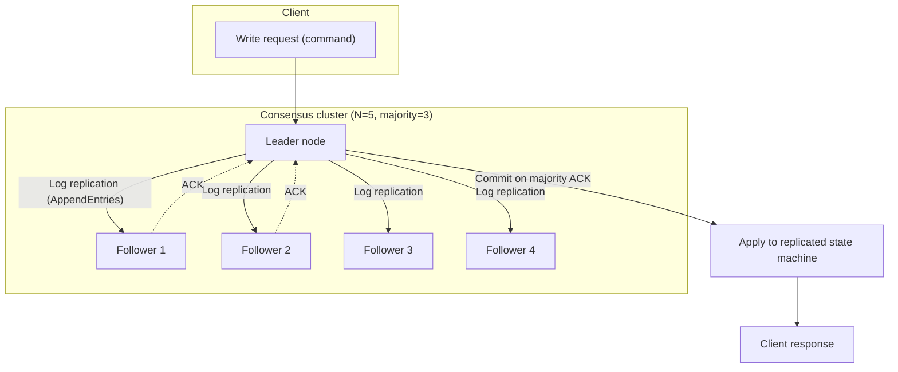
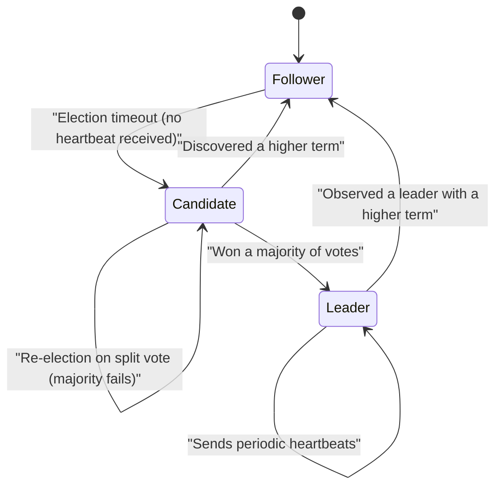

# Distributed Consensus Algorithms — Paxos and Raft

## 1. Overview

### A. Definition

> **Distributed consensus** is an algorithmic procedure that guarantees multiple nodes connected over a network reach the **same decision** on a single value (or on the ordering of commands), even in an environment where some nodes may fail, be delayed, or lose messages. **Paxos** and **Raft** are the representative algorithms that achieve such consensus on a quorum (majority) basis.

Consensus algorithms are the core foundational technology that makes a distributed system behave "as if many computers were a single, trustworthy computer." In a replicated state machine, if each node applies the same commands in the **same order**, the resulting state always matches; consensus is precisely what fixes that "same order" even under failure. The reliability of modern distributed data infrastructure — Kubernetes' etcd, Google Chubby/Spanner, Apache ZooKeeper, CockroachDB, TiDB, and others — all rests on consensus algorithms.

### B. Background and Necessity

Because a single server halts service when it fails, data is **replicated** across multiple nodes to raise availability. But once there are multiple replicas, the questions immediately arise: "which replica holds the correct value?" and "in what order should write requests be applied?" Networks delay, reorder, and lose messages; nodes die and come back to life at arbitrary times; and administrators may elect a new leader incorrectly. To preserve data consistency in an environment where such **partial failure** is ever-present, a rigorous protocol beyond simple majority voting is required.

Theoretically, the **FLP impossibility (Fischer-Lynch-Paterson, 1985)** proved that "in a fully asynchronous network, if even a single node can fail, deterministic consensus that is always both terminating and safe is impossible." Real-world consensus algorithms circumvent this limit by introducing **timeouts (a partial-synchrony assumption)** and **randomness/leader election** to secure practical availability. In other words, the design goal of a consensus algorithm is not "theoretical perfection" but a balance that **never violates safety (never wrong)** while guaranteeing progress once the network stabilizes (eventually makes progress).

Paxos (Leslie Lamport, 1998) was the first algorithm to solve this problem rigorously, but it earned a reputation as being "notoriously difficult" to understand. Raft (Diego Ongaro and John Ousterhout, 2014) preserves the same safety while making **understandability** its primary design goal; by clearly separating leader election, log replication, and safety, it has become today's industry standard.

## 2. The Properties Consensus Must Guarantee, and the Overall Structure

A consensus algorithm must satisfy the following four properties. **Agreement**: all correct nodes decide on the same value. **Validity**: the decided value must be one that some node actually proposed. **Integrity**: each node decides at most once. **Termination**: correct nodes eventually decide on a value. The first three correspond to **safety** and the last to **liveness/progress**; practical algorithms treat safety as an absolute principle and provide liveness on a best-effort basis.

The core mechanism is the **quorum** principle. Letting the total number of nodes be N, a decision is finalized only when a majority of `⌊N/2⌋+1` nodes agree. For two different decisions each to obtain a majority, at least one node must belong to both (the intersection exists); this overlapping node remembers the "prior decision" and forces the new decision to respect it, thereby eliminating **split-brain** at the root. Thus, with N=5 the system tolerates the failure of up to 2 nodes (a majority of 3 remains), and in general **tolerating F failures requires N=2F+1** nodes.

In the structure above, the leader turns a client command into a log entry and replicates it to the followers, and **the moment a majority of ACKs are gathered** it finalizes that entry as committed and applies it to the state machine. Because a committed entry can never be overturned, any subsequently elected leader is guaranteed to contain already-committed commands. This is the substance of the safety property: "once decided, forever preserved."

## 3. Paxos — The Archetype of Consensus

Paxos divides roles into **proposer**, **acceptor**, and **learner**. The proposer proposes a value, the acceptors form a majority quorum to accept the value, and the learner is informed of the finalized value. **Basic Paxos**, which decides a single value, operates in two phases.

In the **first phase, Prepare/Promise**, the proposer picks a globally monotonically increasing proposal number n and sends `Prepare(n)` to a majority of acceptors. If n is larger than anything an acceptor has seen, it replies with a **Promise** that "from now on I will ignore any proposal smaller than n," and if it has already accepted a value, it returns that value as well. In the **second phase, Accept/Accepted**, once the proposer receives promises from a majority, it selects the value with the **highest number** among those returned (or its own value if none was returned), sends `Accept(n, v)`, and if a majority of acceptors accept, v is finalized. This rule of respecting an existing returned value is the key safety device that ensures "a value that may already have been decided is not overwritten."

Because Basic Paxos decides only one value, filling a log of successive commands requires **Multi-Paxos**, which runs a Paxos instance for each log slot. Multi-Paxos elects a stable leader so that phase one can be skipped and only phase two is repeated, finalizing commands in a **single round trip (1 RTT)** during normal operation, which boosts performance. However, the Paxos paper does not specify practical elements such as leader election, membership changes, or log compaction, leaving the practical difficulties that implementations interpret it differently and that verification is hard.

## 4. Raft — Understandable Consensus

Raft decomposes the consensus problem into three sub-problems — **(1) leader election, (2) log replication, and (3) safety** — so each can be understood independently. Every node holds one of the states **follower, candidate, or leader**, and time is logically partitioned by a monotonically increasing **term** number. A term acts as a kind of logical clock, used to immediately identify and reject commands from a stale leader.

Leader election is triggered by a **heartbeat timeout**. If a follower does not receive a heartbeat from the leader within a certain time (the election timeout, typically 150–300 ms, randomized), it becomes a candidate, increments its own term, and broadcasts `RequestVote`. Since each node casts only one vote per term, only a candidate that wins a **majority of votes** becomes leader. Randomizing the timeout to probabilistically avoid split votes, where multiple candidates run simultaneously, is the secret to Raft's liveness.

In log replication, the leader appends a client command to its log, propagates it to followers via the `AppendEntries` RPC, and commits it once a majority has stored it. Raft enforces the **Log Matching property**, guaranteeing that entries with the same index and term have identical content and that all preceding log entries are identical as well. If a follower's log disagrees with the leader's, the leader forcibly overwrites it with its own log to restore consistency. Furthermore, the **election restriction** ensures that only a candidate holding the most up-to-date committed log can become leader, securing safety so that committed commands are never lost. Membership changes are handled without downtime via **joint consensus** or single-node change methods.

## 5. Comparing Paxos and Raft, and Practical Application

The two algorithms provide the same safety (quorum majority and commit immutability), but differ markedly in design philosophy and practical ease of use. Paxos has the generality and theoretical elegance of operating even without a leader, but it lacks a practical specification; Raft centers on a **strong leader** to simplify the flow, making it easy to implement, debug, and teach. "Why the difference arises" stems from differing design goals — Paxos prioritized proving correctness under minimal assumptions, while Raft prioritized the clarity that engineers can actually implement and operate.

| Category | Paxos (Multi-Paxos) | Raft |
|------|--------------------|------|
| Design goal | Theoretical correctness and generality | Understandability and ease of implementation |
| Leader concept | Optional (a leader for performance) | Mandatory (centered on a strong leader) |
| Log flow | Bidirectional allowed | One-way, leader → follower |
| Membership change | Unspecified in the paper (implementation-dependent) | Explicit via joint consensus |
| Representative implementations | Chubby, Spanner, Cassandra (LWT) | etcd, Consul, TiKV, CockroachDB |

As a concrete application, **Kubernetes** stores all cluster state (objects and configuration) in **etcd**, which replicates data across 3–5 nodes using Raft. In a five-node configuration, even if up to 2 nodes fail, as long as a majority of 3 remains alive, the API server continues to read and write normally. This is exactly why the practical recommendation is an odd number of nodes (3, 5, 7) — an even number of nodes fails to increase the failure tolerance while raising the majority threshold, making it less efficient (for example, 4 nodes tolerate only 2 failures, the same as 5 nodes). In addition, placing nodes across availability zones (AZs) raises availability but increases the consensus round-trip latency, so a placement design that weighs **consistency, availability, and latency** becomes a key challenge.

Meanwhile, the blockchain-oriented **PBFT and Tendermint** family are BFT consensus schemes that tolerate not just simple crashes but **Byzantine failures**, where a node maliciously sends false messages; they require 3F+1 nodes to tolerate F traitorous nodes. Unlike Paxos and Raft, which assume the interior of a trusted domain (crash fault tolerant), open and trustless environments demand the more expensive BFT consensus — an important dividing line.

## 6. Considerations and Implications

From a professional engineer's perspective, distributed consensus is not merely algorithmic knowledge but the foundation of system reliability architecture, so the following must be considered holistically.

- **The consistency–latency trade-off**: Consensus requires a majority round trip on every write, increasing latency. It is advisable to design a **tiered consistency** scheme that applies consensus to metadata, configuration, and leadership information where strong consistency is essential, while applying eventual consistency (Dynamo-style) to high-volume, high-frequency data. This connects to decision-making from a PACELC perspective.
- **Node count and placement strategy**: Balance failure tolerance and quorum efficiency with an odd number of nodes (3, 5, 7), and quantitatively review the balance between consensus latency and availability when deploying across multiple AZs/regions. More nodes raise fault tolerance but increase write latency and network cost.
- **Performance optimization techniques**: Offset the cost of consensus through log batching and pipelining, leader-lease-based local reads, snapshots and log compaction, and follower reads to distribute read load.
- **Operational and observability requirements**: Guard against leader-election flapping, clock skew, and network partitions by observing term, commit index, and quorum state (observability), and always maintain a majority-based configuration to prevent split-brain.
- **Threat-model selection**: Within a trusted domain, use crash-fault tolerance (Paxos/Raft); in trustless, open environments, use Byzantine-fault tolerance (PBFT/PoS) — clearly distinguishing the threat model avoids excessive or insufficient safeguards.
- **Technology outlook**: Variants that lower latency such as EPaxos and Flexible Paxos, multi-leader and lease-based reads that exploit locality, and scalable BFT based on proof-of-stake (PoS) are advancing, so the ability to choose a consensus scheme matched to required consistency, scale, and trust assumptions is becoming ever more important.

---
> **In one line**: Distributed consensus (Paxos and Raft) uses quorum majorities and log replication to make multiple nodes reach the same command ordering in a partial-failure environment; by holding safety as an absolute principle while weighing availability and latency, it forms the foundation that makes a distributed system behave like a single, trustworthy system.
