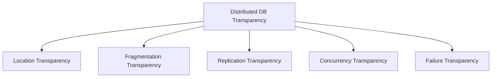

# The Five Transparencies of a Distributed Database

## 1. Overview

### A. Definition
> A **distributed database (DDB)** is a system that presents data physically divided and managed across multiple sites to the user as a **single, logically integrated database**. Here, the degree to which "the fact that the data is distributed" is hidden from the user is called **transparency**.

The essence of transparency is the **hiding of complexity (abstraction)**. Where the data actually resides, into how many fragments it is split, and how many replicas exist are purely internal matters of the system; the user need only issue a single line of SQL, as if querying a single database. Because the user need not know the details of the distribution, application development is simplified, and **location independence** is secured so that applications need not be modified even when the data placement changes.

### B. Background and Necessity
When data is concentrated on a single server, that server becomes both a bottleneck and a single point of failure (SPOF), and geographically distant users experience latency from remote access. Solving this requires **distributing and replicating data across multiple regions and nodes**, but that creates the burden of an application having to worry, one by one, about "which node to connect to and which replica to read." Transparency is needed precisely to have the system shoulder this burden instead, so that the benefits of distribution (availability, scalability, locality) are gained while the user retains the **simplicity of a single database**.

## 2. The Five Transparencies

The five transparencies each differ in "what they hide from the user." The first three (location, fragmentation, replication) hide the **data placement**, while the latter two (concurrency, failure) guarantee **concurrency and reliability**.

- **Location transparency**: Data can be accessed without knowing on which site it is physically stored. The system consults a **global catalog** to route the query to the appropriate node. For example, even if member information is split between two data centers in Seoul and Busan, the application need only execute `SELECT * FROM member`.
- **Fragmentation transparency**: The user is unaware that a single table is split and stored as multiple fragments. There is **horizontal fragmentation** (by rows, e.g., orders by region) and **vertical fragmentation** (by columns), and the system reassembles the fragments to return a complete result.
- **Replication transparency**: The user need not know that multiple replicas of the same data exist and must be synchronized on update. To the user it appears they are handling a single piece of data, but internally a **consistency protocol** operates among the replicas.
- **Concurrency transparency**: Even when many transactions run simultaneously across multiple sites, **serializability** is guaranteed as if each ran alone in sequence. Distributed locks and timestamps block mutual interference.
- **Failure transparency**: Even if a failure occurs at some site or communication link, the **atomicity (all-or-nothing) and consistency** of transactions are preserved. Commits are coordinated so that a partial failure does not corrupt the whole.

| Transparency | What it hides | Core effect |
|---|---|---|
| **Location** | Physical storage location | Location independence |
| **Fragmentation** | Data fragmentation | A unified view |
| **Replication** | Existence/count of replicas | A consistent single view |
| **Concurrency** | Interference of concurrent execution | Guaranteed serializability |
| **Failure** | Partial failure | Atomicity and recovery |

## 3. Related Implementation Technologies

Each transparency is not obtained automatically; it is underpinned by a corresponding distributed-processing technology, as below. In particular, **two-phase commit (2PC)**, the core of failure transparency, guarantees atomicity by having a coordinator ask all participating sites to "prepare" and directing a "commit" only when all agree, thereby preventing a partial application in which only some nodes commit. However, 2PC has a **blocking** weakness in that if the coordinator dies, the participants are left waiting; recently, 3PC, which mitigates this, along with consensus algorithms (Paxos, Raft) and compensation-transaction-based Saga are used alongside it.

| Transparency | Supporting technology |
|---|---|
| Location & Fragmentation | Global catalog, distributed query processing and optimization |
| Replication | Replication synchronization, consistency protocols (synchronous/asynchronous) |
| Concurrency | Distributed locking and 2PL, timestamp ordering |
| Failure | **Two-phase commit (2PC)** and 3PC, log-based recovery |

## 4. Advantages and Disadvantages

The higher the transparency, the greater the convenience of use; but since the system bears that convenience on the user's behalf, the internal cost rises accordingly. For example, fully guaranteeing replication transparency requires synchronizing all replicas immediately (synchronous replication), which increases update latency and communication overhead. Conversely, using asynchronous replication for performance causes replica values to diverge temporarily, shaking consistency. In this way, **transparency, consistency, and performance are in mutual tension**.

| Advantages | Disadvantages |
|---|---|
| Secures availability, scalability, and data locality | Increased design and operational complexity |
| Simplifies applications via transparent access | Cost of synchronization/consistency maintenance, communication overhead |

## 5. Considerations and Implications
- **The CAP theorem trade-off**: Because a network partition (P) is unavoidable, a distributed system must choose which to prioritize between **consistency (C)** and **availability (A)**. For finance, where integrity matters, choose C; for large-scale services, where non-stop operation matters, choose A.
- **Choice of consistency model**: Allowing **eventual consistency** instead of strong consistency (2PC) gains performance and availability at the cost of accepting momentary inconsistency. The level appropriate to the requirements must be decided.
- **Connections and outlook**: **NewSQL/globally distributed databases** such as Google Spanner and CockroachDB pursue both strong consistency and scalability via TrueTime and consensus algorithms, while NoSQL has evolved with an availability focus. For distributed transactions, the practical key is combining 2PC and Saga as the situation demands to balance consistency and performance.

---

> **In one line**: A distributed DB's transparency comes in five kinds — *location, fragmentation, replication, concurrency, and failure* — which hide distribution, replication, concurrency, and partial failure from the user so it appears as a single database; it is realized through a global catalog, replication synchronization, distributed locking, 2PC, and the like, but must be balanced against performance amid CAP and consistency trade-offs.
