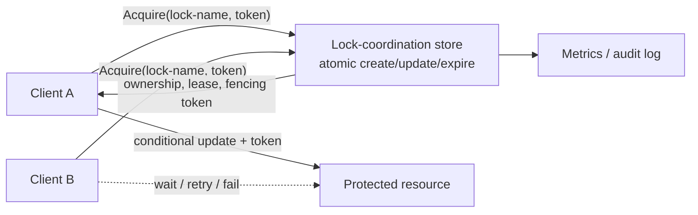
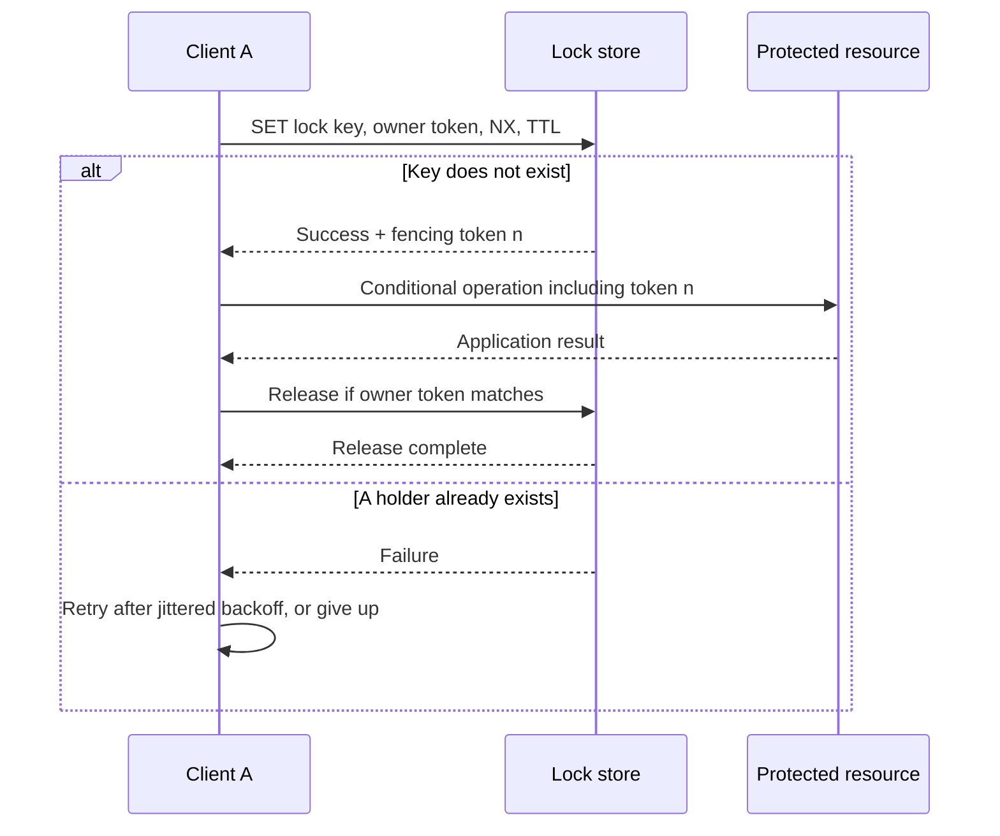

# Distributed Lock

## 1. Overview

> **Definition**: A distributed lock is a control technique that coordinates mutual exclusion and ownership among participants connected over a network, so that multiple servers, processes, or containers do not concurrently modify a shared resource or critical section.

Within a single process, a mutex or semaphore protects a critical section using atomic instructions on shared memory. However, when a service scales out horizontally, there are many instances handling requests, and a lock held in one instance's memory is invisible to the others. In this situation, tasks that must be "performed by only one actor at a time" — such as decrementing inventory, running a batch job only once, creating the same file, or electing a scheduler leader — require coordination across the network.

A distributed lock is not merely a feature for storing a single key. The actor that acquired the lock may not terminate normally, the network may partition, and a delayed response may leave the actor unaware that its own lock has already expired. Therefore, defining mutual exclusion alone is insufficient; one must also design for liveness (a waiting actor eventually makes progress), automatic recovery after failure, and safety (data is not corrupted even if a wrong owner completes work late).

For example, when a single unit of stock remains in an order service and two instances decrement it simultaneously, each instance may read the same remaining stock and both succeed. A distributed lock serializes this race, but using a lock does not make a database's conditional update, transaction, or constraint unnecessary. The lock is a coordination device that reduces contention; final integrity must be guaranteed by atomic verification of the ledger data.

In a professional engineer's answer, it is important to first specify the protected target, the lock scope, the ownership lifetime, the failure model, and the consistency requirements, before choosing "which store to use as the lock service." If the task is short and handled atomically in one database, a conditional UPDATE is simpler and stronger. Conversely, if multiple resources or external systems must be coordinated, a distributed-lock design including a lease, fencing token, retries, and observability is needed.

- **Mutual exclusion**: For the same lock name, only one owner may be permitted at a time.
- **Ownership identification**: Identify the acquiring actor with an arbitrary unique token so that it does not release another actor's lock.
- **Automatic recovery**: Even if the owner fails, avoid permanent deadlock via TTL, session, or lease expiry.
- **Linkage to business integrity**: Do not declare completion merely by acquiring the lock; block late work via conditional updates, fencing, and transactions.

## 2. Overall Structure and Components

A good starting point is to view a distributed-lock system as divided into the client, the lock-coordination store, and the protected resource. The client acquires the lock, runs the critical section, and releases it, but the actual ownership and expiry information of the lock is kept in a consistent store observable by all clients. This store can be implemented with a relational database, a strongly consistent coordinator, or an in-memory key-value store.



The **lock key** identifies the logical resource to protect. Design it so the business unit is evident, such as `inventory:item:1234`, `job:daily-settlement:2026-09-16`, or `file:report.csv`, but avoid an overly broad global lock that causes unnecessary serialization. Conversely, if the key is too fine-grained, multiple stages of the same task may use different locks and miss the scope of protection.

The **owner token** is issued as a random number or UUID when the lock is acquired. This token is sent along with the release request, and the deletion happens only when it matches the stored token. Simply running `DEL lock-key` causes an incident in which, while the previous owner's work was delayed, a new owner acquires the lock, and then the previous owner deletes even the new owner's lock. Owner verification is the basic safety device of the release operation.

The **lease and TTL** express the lock's validity period. Even if the process dies or the network is severed so a release request cannot be sent, another actor can proceed after expiry. However, the TTL is not a guarantee that the work finishes; it is "an upper bound on the time during which ownership may be claimed." If the work takes longer than the TTL, renewal is needed, and if renewal fails, the critical section must be halted immediately or the result must be rejected via fencing.

A **fencing token** is a monotonically increasing number that increments each time the lock is acquired. The protected resource applies a request only when the token it contains is greater than the last token it processed. This device solves the "zombie client" problem, in which a past owner arrives late due to network delay. A lock that has only a TTL may still let the client at the expiry point keep running, so unless the external store checks the token, the intuition of mutual exclusion does not translate into actual data safety.

## 3. Acquire, Hold, and Release Protocol

### A. Acquiring the Lock

The acquisition process begins by defining the conflict model. The client creates a unique owner token and requests an atomic operation on the coordination store that "creates the key only if it does not exist." On success it also obtains the lease expiry time and, if necessary, a fencing token. On failure, it does not loop infinitely but applies backoff and a maximum wait time.



Atomicity means binding "check then store" into a single logical operation. If you first call `EXISTS` and then perform `SET`, a race condition arises in which two clients simultaneously observe absence and both store. A database's unique constraint plus INSERT, a coordinator's compare-and-set (CAS), and a key-value store's `SET NX` provide this atomicity.

After a successful acquisition, you should record the returned result. Logging the owner token, acquisition time, expiry time, fencing token, and request/task ID lets you trace lock contention and failure causes. Recording only a Boolean success flag makes it hard to analyze "who held it for a long time" and "were there late requests after expiry."

For retries, combining exponential backoff with random jitter is safer than a fixed interval. If all waiters re-request at the same instant, a thundering herd hits the store, and another burst of contention occurs when the lock is released. Set an upper bound on wait time and decide whether the task allows duplication, and prepare alternatives such as enqueuing or returning a reprocess response to the user if the lock cannot be acquired.

### B. Holding and Renewing the Lock

Lease renewal is not a task of unconditionally extending the TTL. After atomically verifying that the client is still alive and holds the token, renew only when the remaining lease is shorter than a threshold. If the renewal response is delayed or times out, do not treat it as success; a conservative policy of halting further writes to the protected resource is safe.

If the expected task time is short and low in variance, you can set the TTL sufficiently longer than the task time. But an overly long TTL delays recovery after failure, and an overly short TTL raises the chance of turning a normal task into a zombie task. Therefore, compute the lease budget not from the average time but from p99/p999 latency, GC pauses, container scheduling delays, and network round-trip time.

If the renewal thread is separated from the work thread, an error can occur in which renewal continues even after the work has stopped. Upon receiving a task cancellation, timeout, or process-termination signal, stop renewal first, block new I/O, and then perform cleanup. Because asynchronous tasks already issued may remain even after detecting a renewal failure, place a fence or idempotency key at the result-application stage of queues, the DB, and external APIs.

### C. Releasing the Lock

Normal release performs owner verification and deletion as a single atomic operation. With Redis you can use a Lua script that compares the token then deletes; with a relational DB you can use a DELETE with the condition `WHERE lock_name = ? AND owner_token = ?`. If the comparison and deletion are separated, TTL expiry and a new acquisition can intervene right after the check.

A timeout on a release request differs from whether the release actually succeeded. Even if the client receives a timeout and retries, if token verification is idempotent it can safely re-confirm failure or success. Conversely, forcibly deleting a new lock because there was no release response can damage the current owner's work. You must wait for expiry or separately control an administrative forced-release procedure.

The order of the business commit and the lock release also matters. If you release the lock before the database transaction commits, another actor may read the same resource and start duplicate work. In general, release the lock after completing the commit of the protected data and recording the state of external side effects; but if external API calls are involved, you must also design compensation, an outbox, and idempotent handling.

## 4. Implementation Approaches and Operating Principles

### A. Lock Based on a Relational Database

Because a relational database already provides transactions, logging, failure recovery, and unique constraints, it can be the first candidate to review when the lifetime of the business data and the lock are the same. If you make `lock_name` the primary key in a lock table and let only the transaction whose INSERT succeeds obtain ownership, the database adjudicates mutual exclusion among competitors.

```sql
CREATE TABLE distributed_lock (
  lock_name    VARCHAR(200) PRIMARY KEY,
  owner_token  VARCHAR(100) NOT NULL,
  fencing_seq  BIGINT NOT NULL,
  lease_until  TIMESTAMP NOT NULL,
  updated_at   TIMESTAMP NOT NULL
);
```

Do not trust the success of an INSERT or conditional UPDATE alone; consider the difference between the database clock and the application clock. If you store an expiry time computed by the application, a server with a badly skewed clock may judge a still-valid lock to be expired. Where possible, use the database's monotonically increasing values, transaction time, and server-side conditional expressions, and clearly state the tolerance of time-based judgments.

Row locks and advisory locks have different characters. A row lock is automatically released when the transaction ends and is directly bound to a DB-internal row, but placing a long external call inside the transaction holds the connection and lock for a long time. An advisory lock is a cooperative lock over an application-defined key and is convenient, but all participants must follow the same rules, and you must confirm the meaning of DB session disconnection and connection-pool reuse.

The advantage of a DB-based lock is that you can bind the protected data and lock acquisition into the same transaction. For work that completes with a conditional UPDATE on a single row, such as decrementing inventory, `UPDATE inventory SET quantity = quantity - 1 WHERE id = ? AND quantity > 0` is a more direct means of integrity than a separate distributed lock. On the other hand, if lock-acquisition contention is very high, the business DB may take on the role of a lock server and become a bottleneck.

### B. Lock Based on an In-Memory Key-Value Store

Redis-family stores provide low-latency atomic commands and TTL, so they are frequently used for locks on short critical sections. The basic pattern is to run `SET resource token NX PX ttl` with a random token. `NX` stores only if the key does not exist, and `PX` attaches an automatic expiry time, reducing check-then-store races and indefinite occupation.

Release must always compare the owner token. The pseudocode is as follows.

```text
if GET(resource) == my_token:
    DEL(resource)
```

However, sending the two lines above as separate network commands reintroduces a race between the comparison and the deletion. Therefore, use an in-store script or CAS to make the following a single atomic operation.

```text
if value(resource) == my_token then
    delete(resource)
    return 1
else
    return 0
end
```

A lock based on a single Redis instance is simple to implement, but you must include instance failure, replication lag, and data loss at failover in the failure model. If the failure of a lock leads to a double payment or data corruption in the business, do not claim a strong guarantee from a Redis TTL alone; combine DB constraints, a fencing token, and business idempotency. Because sharding in a Redis cluster may not atomically bind different keys, check the lock-key distribution and the command scope.

Algorithms that raise availability by replicating a lock across multiple independent Redis nodes require strong premises regarding clock accuracy, network delay, correlated failures, and majority-acquisition conditions. In particular, the problem that a client can keep running even after its lease expires is not solved merely by increasing the number of nodes. For high-risk resources, design so the client does not treat the lock result it received as the final authority, and have the resource side check the fencing token.

### C. Consensus-Based Coordinators

Coordinators that provide consensus protocols, sessions, and watches — such as ZooKeeper, etcd, and Consul — offer strong coordination via ephemeral nodes, session expiry, sequential nodes, and compare-and-swap. If a client loses its session, its ephemeral node disappears and waiters receive a change notification and can retry. This makes it easier to express the lock's lifecycle and failure detection explicitly than a simple key-value store.

However, a watch event is not a definitive notification that "it is now my turn." After receiving the event, you must actually re-query the key and confirm that your condition still holds. If all clients watch a single node, an event storm can occur, so use the herd-effect-mitigation pattern in which, among sequential nodes, only the immediate predecessor is watched.

A consensus-based store is not an infinitely fast lock server either. The consensus log and quorum communication provide consistency at the cost of network round trips and operational complexity. You must manage the member count, quorum, disk latency, snapshot and log retention, certificate renewal, and leader failover, and must not approach it as simply installing one more database or Redis.

## 5. Safety, Liveness, and Fairness

The quality of a distributed lock is evaluated along the following three axes. **Safety** is the property that no more than one valid owner performs the protected work at the same time. **Liveness** is the property that, once a failure has passed, some new owner can eventually proceed. **Fairness** is the property that a particular client does not keep being denied its chance and can predict its wait order.

Safety is not completed by atomic acquisition at the store alone. In situations such as a client still running after TTL expiry, a network partition, response retransmission, or a process pause, the previous actor must not write to the resource. Therefore, review whether the protected target compares fencing numbers, or whether the work itself is idempotent and conditional.

Liveness is secured via lease expiry, session disconnection, and client cancellation. But if the expiry time is set too short, the lock is reassigned even on a transient delay and two actors may overlap. Conversely, if it is too long, failure recovery is delayed. Specify the choice between safety and liveness in accordance with the SLA and the failure budget.

Fairness is implemented as needed with a FIFO queue or sequential nodes. A non-blocking retry approach that does not guarantee fairness has high throughput but may let a particular client keep failing. Fair waiting may matter for batch jobs, but for a short critical section on a user request, failing immediately and passing it to an upper queue may be more appropriate than a wait queue.

| Evaluation axis | Question | Representative design means | Impact of failure |
|---|---|---|---|
| Safety | Do two actors not apply together? | Atomic acquisition, owner token, fencing | Duplicate processing, data corruption |
| Liveness | Is the lock released after failure? | TTL, session, cancellation/recovery | Permanent deadlock, processing delay |
| Fairness | Does a particular actor not starve? | FIFO, sequential queue, jitter tuning | Starvation, unpredictable delay |
| Observability | Can causes be traced? | Holder, age, wait, renew metrics | Failure analysis impossible |

## 6. Comparison and Application Cases

### A. Comparing Distributed Locks with Alternative Integrity Techniques

A distributed lock is a way to temporarily serialize multiple requests. Optimistic concurrency control, by contrast, detects conflicts with version numbers or conditional updates and retries failed requests. When contention is low and conflict recovery is easy, the optimistic approach has better throughput than waiting on a lock. If the cost of conflict is high and external side effects are hard to undo, a lock or queue may be more suitable.

A message queue's single-consumer partition guarantees the ordering of a particular key, reducing the need for a distributed lock. However, consumer failure, rebalancing, and work spanning multiple partitions require separate idempotency and progress-state design. A database's unique key prevents duplicate creation, but does not replace a general lock that coordinates the execution order of multiple resources or external systems.

| Technique | Conflict handling | Strengths | Limits / suitable situations |
|---|---|---|---|
| Distributed lock | Preemption before execution | Intuitive serialization, coordinating external work | Must design for TTL, zombies, store failure |
| Conditional update | Verification at commit | Directly coupled with DB integrity | Weak against conflict retries and external side effects |
| Message-queue partition | Ordering by key | Asynchronous processing, reprocessing | Needs partition design and handling of duplicate consumption |
| Single leader/scheduler | The leader performs the work | Simple for batch jobs | Needs leader failover and work partitioning |
| Saga/compensation | Step-by-step confirm/cancel | Long-running distributed work | Complexity of compensation logic and intermediate state |

The difference arises from "who controls the conflict." A lock blocks competitors before execution, the optimistic approach discovers a version conflict after execution, and a queue absorbs contention with an ordered processing flow. Therefore, an answer should state that a lock is not used as a universal solution, but is chosen based on the characteristics and side effects of the protected resource.

### B. Case 1: Duplicate Batches and Leader Election

In an environment where multiple application instances run a daily settlement batch, the scheduler may wake up on all instances. Having only the one instance that acquires the `job:settlement:date` lock start the work reduces duplicate execution. However, if the work is long, halt on renewal failure and record a completion marker with a per-date unique key so restarts are also idempotent.

Leader election and a distributed lock are similar but not identical. A leader holds a long-standing responsibility and must continuously handle membership changes and leader failover. A one-off batch may be suited to a lease lock, but where a leader is responsible for all state changes, as in a cluster control plane, consensus-based election and fencing are needed.

### C. Case 2: Inventory Reservation Linked with Payment

In a situation where multiple orders simultaneously reserve a single unit of product stock, a per-product lock can reduce the contention window. However, calling payment approval, the shipping API, and the notification service while holding the lock lengthens the lock hold time due to external delays, and throughput plummets on failure. In practice, it is stronger to conditionally decrement inventory inside a DB transaction and separate payment and notification into an outbox and a state machine.

Even when using a lock, you should maintain the `quantity > 0` condition and a unique constraint on the order ID. Include order-state transitions and version checks so that a late instance does not re-decrement inventory after lock expiry. This case shows that the lock does not replace the database's integrity constraints but is an auxiliary layer that reduces the contention window.

### D. Case 3: File Creation and Shared Storage

In a system where multiple workers generate the same report file, a `report:tenant:period` lock can reduce duplicate computation. But if the lock expires during a file write, two workers may overwrite the same path. It is safer to write to a temporary file, perform fsync and verification, then do an atomic rename, and record the task version and creator token in a metadata store.

A shared file system or object storage has a failure model separate from the lock store. Because merely having acquired the lock does not guarantee the file system's visibility, durability, or conditional creation, use resource-side conditions such as an object's If-None-Match, version ID, and completion marker together. For large generated outputs, a work queue and a deduplication key may be more suitable than a lock.

## 7. Deep Dive: The Relationship Between Lease Expiry and Fencing Tokens

The most dangerous misconception in distributed locking is assuming "the TTL has ended, so the previous work has ended too." A process may have received a stop signal but be briefly not scheduled by the kernel scheduler, and a network response may arrive after a delay. If a previous client writes to the protected resource unaware that it has lost ownership in the lock store, side effects occur simultaneously with the new client.

A fencing token blocks this problem on the resource side. Issue a number that increments each acquisition, such as `n`, `n+1`, and have the protected resource store the last approved number. If a request token is smaller, treat it as an old task that arrived late and reject it. Do not place this check only in an application-code if-statement; place it as close to the resource as possible, such as the DB's `WHERE version < :token`, a storage conditional write, or a work queue's generation number.

Distinguish the token's monotonic increase from lease renewal. When the same owner merely extends the TTL, the token need not change each time; but when ownership passes to a different client, a larger generation must always be issued. Review persistent storage and recovery procedures so that store recovery or snapshot restoration does not move the counter backward, and document the invariant that a token is never reused.

There are also external APIs to which a fencing token cannot be applied. In that case, reduce risk by combining an idempotency key for the external call, a request expiry time, a duplicate-detection table, and compensating transactions. Even so, for work such as payments or transfers where atomic cancellation is impossible, do not promise exactly-once processing with a distributed lock alone; make the payment provider's idempotency key and a post-hoc reconciliation process the final line of defense for integrity.

## 8. Considerations and Implications

- **Protection scope and key design**: Analyze global locks, tenant locks, and per-resource locks with a business-contention graph and lock only the necessary scope. Include version, tenant, and period in the lock key, but establish a common naming convention and owning team so that different services do not call the same logical resource by different names.
- **Explicit failure model**: Enumerate store failure, network partition, process pause, GC pause, time skew, and restart/snapshot restoration. Decide whether to prioritize safety or availability in each failure, and record in the answer and the operations runbook which behavior to take, fail-closed or fail-open, when a design assumption breaks.
- **TTL and renewal budget**: Compute the TTL based on p99 work time and the maximum pause, and propagate a renewal failure immediately as a business failure. Collect expiry, renewal delay, and long-hold as metrics, and cap the lock hold time so a failure does not propagate for a long time.
- **Zombie prevention and integrity**: Apply owner-token-verified release, a fencing token, DB conditional updates, and an idempotency key together. Do not record lock-acquisition success as business success; separately manage the commit result of the protected resource and the reconciliation state.
- **Performance and cost**: Reflect the lock server's round-trip time, contention rate, queue length, and store quorum latency in the SLA. Because a call to the lock server itself can be a bottleneck for high-frequency, ultra-short tasks, compare local batching, key partitioning, queue serialization, and optimistic verification.
- **Operations and security**: Protect the lock store's authentication, encryption, network isolation, and backup policy to the level of business data. Require approval, a reason, an expiry, and an audit log for an administrative forced release, and do not permit arbitrary key deletion as a standard failure response.
- **Testing and verification**: Inject not only normal contention but also a stop just before TTL expiry, response delay, store failover, network partition, retry duplication, and clock skew. Automatically verify the core invariant that "a lower fencing token is not applied after a higher token," and record fault-injection results together with recovery time.
- **Implications for technology choice**: Prefer a conditional update for work that ends in a single DB transaction, and combine Saga, an outbox, and a queue for long-running, multi-system work. Review a consensus-based coordinator and fencing for high-risk shared resources, but assess operational capability and cost commensurate with the added complexity.

## References

- Redis Documentation, "Distributed Locks with Redis": https://redis.io/docs/latest/develop/clients/patterns/distributed-locks/
- Martin Kleppmann, "How to do distributed locking": https://martin.kleppmann.com/2016/02/08/how-to-do-distributed-locking.html
- PostgreSQL Documentation, "Explicit Locking": https://www.postgresql.org/docs/current/explicit-locking.html
- Apache ZooKeeper Documentation, "Locks": https://zookeeper.apache.org/doc/current/recipes.html#Locks
- etcd Documentation, "Concurrency API": https://etcd.io/docs/v3.6/dev-guide/api_concurrency_reference_v3/

---

> **In one line**: A distributed lock is a means of serializing critical sections across a network, but safety is not completed by TTL alone; you must also design atomic ownership, failure recovery, a fencing token, conditional updates, and idempotency together.
