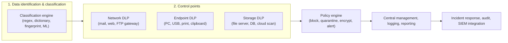
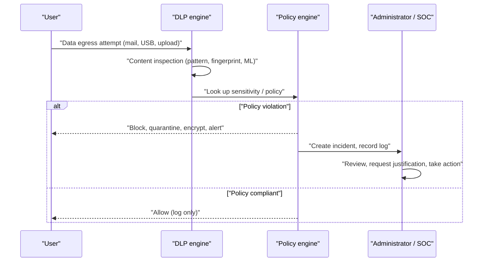

# DLP (Data Loss Prevention)

## 1. Overview

### A. Definition and Background
> **DLP** is a security framework that **identifies, monitors, and blocks the movement of sensitive and confidential data on a content basis**, preemptively controlling storage (at rest), transmission (in motion), and use (in use) that violate policy, thereby **preventing both intentional leakage and inadvertent exposure**.

The fundamental background for DLP's emergence is a shift in perception: "the asset to be protected has moved from inside the castle walls to the data itself." Traditional perimeter security (firewalls, IPS) focused on blocking intrusions from the outside in, yet a substantial share of incidents actually occur when insiders with legitimate access privileges send data out. Situations such as an employee about to leave emailing a customer list to a personal address, a developer copying source code to a USB drive, or a staff member accidentally attaching an Excel file containing resident registration numbers to an external partner cannot be stopped by perimeter security. Such leakage occurs on the **egress (outbound) direction** and, moreover, can be judged only by **understanding the content of the data**. DLP started from precisely this idea — inspecting the content at every path where data leaves the organization's control and blocking it if it violates policy.

The severity of this threat is clear from real cases. Both at home and abroad, a substantial share of large-scale personal-information breaches were caused not by external hacking but by insiders and partners with legitimate access privileges, and the pattern of large volumes of customer data being taken out via personal storage media or email has recurred. Incidents that caused major social repercussions — such as mass leaks of card-company customer data and exposure of personal information at telecom carriers and portals — all revealed that "the path of carrying data out from the inside" was uncontrolled. This left the lesson that data cannot be protected by perimeter defense alone and accelerated DLP adoption.

Another background is **regulatory pressure**. Personal information protection laws and the GDPR mandate notification and fines when personal data is leaked, and credit-information law and electronic-financial supervisory regulations compel control of customer information in the financial sector. PCI-DSS strictly restricts the storage and transmission of card numbers (PAN). Thus, the requirement that "an organization must be able to prove what data flows where" has elevated DLP to an essential compliance control.

### B. Necessity
As insider threats become constant, data boundaries dissolve with the spread of remote work and cloud, and the legal and reputational losses from leaks of personal information and trade secrets become enormous, DLP — which understands content and controls movement — has become a core axis of data-centric security. In particular, in audit and incident-response phases where one must account for "what data we hold, how much of it, and where it moved," DLP's logs and policy history become irreplaceable evidence.

## 2. DLP Control Points and Overall Structure

DLP should be understood not as a single appliance but as an architecture that **controls the three states in which data exists and moves, each at a different point**. Below is the overall structure diagram.

The starting point of DLP is always "**what to protect (classification)**." If you cannot define the data to be protected, no control point is meaningful. Hence the practical adage that 80% of a DLP adoption project lies in policy and classification design, and product installation is merely the remaining 20%. Once classification is done, an inspection engine is placed at each of the three gates through which data flows — the outbound network channel, the endpoint (PC) egress paths, and the storage where data lies dormant on servers and cloud — and a common policy engine adjudicates violations and responds with one of block, quarantine, encrypt, or alert. Every adjudication and response is logged centrally, becoming material for audit and SIEM correlation analysis.

### A. The Three States of Data and Corresponding Controls
The first principle running through DLP is that "**data exists in three states — at rest, in motion, and in use — and each state has a different leakage path**." **Data at rest** lies dormant on file servers, DBs, NAS, and cloud storage; the threat here is that "no one knows where and how much sensitive information is left lying around." Therefore, Storage DLP periodically scans (discovers) storage to map the locations of sensitive data and quarantines, encrypts, or deletes files left inappropriately. **Data in motion** leaves the network via mail, web, messenger, or FTP, and Network DLP inspects and blocks the payload at a gateway or proxy point. **Data in use** is edited, copied, and printed on a user's PC; egress paths that do not traverse the network — such as USB copying, screen capture, clipboard, printer, and document output — belong here, and only Endpoint DLP can control them.

The practical implication of distinguishing these three states is clear. An organization that adopts only Network DLP cannot at all stop an employee from copying files out via USB, and an organization that adopts only Endpoint DLP leaves large volumes of sensitive files lying on servers unaddressed. Only by covering all three states are the leakage paths closed, which is why a mature DLP aims for a form in which the three controls are integrated into a single policy engine.

### B. Data Classification and Detection Techniques
DLP's accuracy depends entirely on "**how accurately it recognizes sensitive data**." Detection techniques fall into roughly four branches. First, **pattern/regex matching** is powerful for data with fixed formats, such as resident registration numbers (6 digits-7 digits), card numbers, and account numbers. It is simple and fast, but since anything matching the format is caught, false positives are frequent, so it must always be combined with a checksum (e.g., Luhn validation for card numbers) or contextual keywords. Second, **dictionary/keyword-based** detection catches the appearance of specific words like "confidential" or "trade secret" and links to document classification labels. Third, **exact data matching (EDM) and document fingerprinting** compare against the actual values of a customer DB or hash fingerprints extracted from original documents, precisely detecting "exactly that data our company actually holds," so false positives are extremely low. Fourth, **machine learning / statistical classification** contextually recognizes "types" such as contracts, source code, and blueprints using a pre-trained model, useful for irregularly formatted unstructured data.

In practice, these are not used alone but **combined with weights**. For example, one sets multiple conditions such as "ignore a single resident-registration-number pattern, but block if 20 or more appear in one document together with the keyword 'customer list,'" balancing false positives and false negatives. Success in DLP operation lies in this rule tuning, and the standard approach is to run for the first several months in **monitor-only mode (observe without blocking)** to lower the false-positive rate before gradually switching to blocking.

The application phases and limits of each detection technique are summarized as follows.

| Detection technique | Principle | Strength | Limits / cautions |
|-----------|------|------|-------------|
| Pattern/regex | Matching a fixed format | Fast and simple to implement | Many false positives; must combine checksum/context |
| Dictionary/keyword | Detecting the appearance of specific words | Easy to link with document labels | Vulnerable to expression variation and evasion |
| EDM/fingerprint | Comparing original values/hashes | Extremely few false positives, precise | Burden of registering/updating originals |
| ML/statistical classification | Learning context/type | Handles unstructured documents | Depends on training-data quality, low explainability |

### C. The Particularities of Endpoint Control
Among the three control points, **Endpoint DLP handles the widest leakage paths while being the hardest area to manage**. On a user's PC, data already exists in decrypted plaintext before leaving over the network, and the egress paths are extremely diverse — USB storage, external hard drives, printer output, screen capture, clipboard copying, Bluetooth, personal cloud sync folders, and more. Because none of these paths pass through the corporate gateway, control by Network DLP is fundamentally impossible; only an agent residing on the PC can inspect the content of data on each path and enforce policy.

However, an endpoint agent itself carries management burden and performance/stability risk. Agents must be deployed and updated across thousands to tens of thousands of PCs, real-time content inspection degrades the user's perceived performance, and one must guard against conflicts with the OS/antivirus and attempts to bypass or forcibly terminate the agent. Therefore, a realistic approach for endpoint policy is "**apply first to core assets and high-risk groups, then expand**" rather than blanket blocking, and it also requires agent integrity protection (tamper protection) and a local-cache design that maintains policy even offline. In actual manufacturing and R&D organizations, because the main leakage paths for source code and design drawings were USB and personal cloud, endpoint control often takes priority in DLP investment.

## 3. Operating Procedure and Incident-Response Flow

The process by which DLP handles a single leakage attempt is formalized by the following process.

A noteworthy point in this flow is that **the response is not dichotomous**. Even when a violation is confirmed, the response is not unconditional blocking but a staged response according to risk. Low risk is **logged only (audit)**, medium risk is a **user confirmation/warning (justification)** that asks the user "do you really want to send this?", high risk is **automatic encryption** (e.g., automatically encrypting an external mail attachment on send), and the highest risk is **complete blocking, quarantine, and administrator notification**. This staged response is the key device that reconciles the trade-off between security and business continuity. Blocking everything paralyzes even normal work, causing users to try to bypass DLP; conversely, allowing everything makes control meaningless.

In particular, the **user-confirmation** step is remarkably effective at preventing inadvertent leaks. Merely popping up "this email contains personal information" to an employee who accidentally attached a sensitive file can stop a substantial number of incidents at the source, while also yielding an educational effect that raises the employee's security awareness. In an actual financial-sector case, after introducing this warning-type control, the number of mistaken external-email transmissions of personal information reportedly dropped to less than half of the pre-adoption level.

## 4. Comparison of DLP Types and Relationship with Similar Technologies

The three DLP types differ in their control targets, deployment locations, and evasion vulnerabilities. The table below organizes what implications these differences carry in practice.

| Category | Network DLP | Endpoint DLP | Storage DLP |
|------|-------------|--------------|-------------|
| Control target | Data in motion (mail, web, FTP) | Data in use (USB, print, clipboard) | Data at rest (files, DB, cloud) |
| Deployment | Gateway/proxy | PC agent | Scanner/API integration |
| Strength | Bulk control of large traffic | Control of offline/physical egress | Discovery of sensitive-data locations |
| Weakness | Blind spot for encrypted traffic/offline | Agent load, management cost | Cannot block in real time |

The fundamental reason the three types differ is "**at which point they encounter the data**." Because Network DLP meets data at the network gate, it has an inherent blind spot: if traffic is encrypted with TLS, it cannot see the content without decryption (SSL interception). Endpoint DLP, by contrast, meets the data at the user's screen/memory layer before encryption, filling this blind spot, but requires an agent on every PC, incurring management burden and performance degradation. Because of this complementary relationship, mature organizations operate all three types together and manage them from a single console.

The relationships between DLP and adjacent technologies are summarized below; these are not substitutes but layered complements operated together.

| Technology | Control approach | Relationship with DLP |
|------|-----------|--------------|
| DLP | Inspect/block leakage paths | Guards the path where data leaves |
| DRM | Attach encryption/permissions to the document itself | Controls viewing even of data that has left (double defense) |
| CASB | Control cloud access/data | Extends DLP into the cloud |
| UEBA | Analyze user anomalous behavior | Complements novel leaks that static rules miss |

DLP must be clearly distinguished from adjacent technologies. If **DRM (Digital Rights Management)** is a "data-accompanying" control that embeds encryption and permissions in the document itself to control viewing, editing, and printing "wherever it goes," DLP is a "path-based" control that guards the "path by which data leaves." The two are complementary rather than competitive: even for data that DLP failed to block, if DRM is applied it cannot be opened outside, forming a double defense. Also, **CASB (Cloud Access Security Broker)** can be seen as extending DLP functions to data headed for the cloud, and **UEBA** complements novel leaks that DLP's static rules miss by detecting user anomalous behavior (e.g., an unusually large download).

## 5. DLP Build and Operation Procedure

DLP should be understood not as a "project to install a product" but as "continuous operation to embed data governance." Its lifecycle is formalized into roughly five stages.

First, the **data discovery and classification** stage. Scan and map what data the organization holds, where, and how much, and define a grading scheme such as public, internal, confidential, and top-secret. This stage governs 80% of DLP's success, and grasping the locations of personal information, trade secrets, and regulated data itself already yields a large security improvement.

Second, the **policy design** stage. Concretize into rules "what, by whom, via which path, and how to respond." Here, design differentiated policies by department, role, and data grade, and map responses by risk level (log, warn, encrypt, block). Translating regulatory requirements (personal information protection law, PCI-DSS, etc.) into policy is also core to this stage.

Third, the **monitor and tune** stage. Initially, do not enable blocking but collect only violation events, and refine rules that produce many false positives. If you skip this period and immediately move to full blocking, normal work is paralyzed and DLP itself meets organizational resistance, so a monitoring period of typically several months is essential.

Fourth, the **enforce and respond** stage. Progressively enable blocking starting from validated policies, and activate a response process to review, seek justification for, and act on detected incidents. Here, DLP alerts must be linked to SIEM/SOAR and flow automatically into the incident-response workflow to be effective.

Fifth, the **continuous improvement** stage. Reflect novel leakage paths (generative-AI inputs, new SaaS, etc.) and organizational changes (new regulations, M&A) to constantly update policy, report violation statistics to management, and embed control as a culture through employee security-awareness training. DLP does not end once built but matures by repeating this cycle.

## 6. Deep Dive — Extension to Cloud and Remote Environments, and Latest Trends

The premise of traditional DLP was that "**data resides inside the corporate network and must pass through the narrow gate of the gateway**." However, this premise collapsed as SaaS, remote work, and BYOD became widespread. When an employee accesses the corporate cloud (e.g., Microsoft 365, Google Workspace) from home on a personal laptop and handles data, that traffic never passes through the corporate gateway at all. To fill this blind spot, DLP is evolving in three directions.

First, the move to **cloud-native DLP**. It scans data stored in the cloud and controls external sharing by integrating directly with the SaaS provider's API (API-based CASB). For example, when an employee tries to share a sensitive file in a cloud drive with "anyone with the link," it detects and blocks this. Second, **integration into SASE/SSE**. DLP is moving away from being a standalone product to being absorbed as one function of a cloud-delivered security service edge (SSE) alongside ZTNA, SWG, and CASB. By routing traffic through the cloud security edge wherever the user is, consistent DLP policy is applied even in remote and mobile settings. Third, the rise of **AI/generative-AI-responsive DLP**. As a new leakage path opens in which employees input source code or customer information as prompts into external generative AI like ChatGPT, "AI prompt DLP" that detects and blocks this in real time has recently emerged as a key topic. In fact, after an incident at one global manufacturer in which an engineer pasted internal source code into an external AI and leaked it, many companies incorporated control of generative-AI inputs into their DLP policies.

Meanwhile, content inspection itself is becoming more sophisticated. Beyond the past regex/keyword approach, the introduction of NLP/LLM-based classification that understands a document's context and meaning is improving detection accuracy for freely formatted unstructured documents such as contracts and confidential reports. However, this carries a privacy-infringement risk of broadly surveilling communications and behavior under the pretext of inspecting personal information, so it must be balanced with the legal requirements of minimizing the inspection scope and obtaining worker consent and prior notice.

## 7. Considerations and Implications

From a professional engineer's perspective, DLP adoption should be approached not as product selection but as a matter of data-governance strategy, considering the following holistically.

- **The classification-first principle**: DLP's success depends not on the product but on data classification and policy design. Unless the work of defining what constitutes sensitive data (labeling as public, internal, confidential, top-secret, etc.) and identifying information assets precedes it, even the best engine falls into a swamp of false positives and negatives. The order of data classification/governance → policy design → control-point placement must be observed.
- **The false-positive/false-negative trade-off and staged transition**: If blocking is too strong, normal work is paralyzed and users bypass DLP (shadow IT); if too loose, control is neutralized. The practical standard is to run in monitor-only mode for the first several months to tune rules, then transition to a staged response by risk level (log → warn → encrypt → block).
- **Privacy and legal balance**: DLP inherently inspects employees' mail, files, and behavior, so it may infringe on workers' privacy and communication secrecy. It must satisfy legality requirements such as minimizing the inspection scope, prior notice and consent via work rules and privacy policies, access control over logs, and prohibition of use for unintended purposes, and must clearly delineate the boundary between control and surveillance.
- **Architectural shift in the era of dissolving perimeters**: With the spread of cloud and remote work, gateway-centric DLP has larger blind spots. It must extend to data-centric control encompassing endpoints, cloud (CASB), and SASE/SSE, and compose a multilayer defense linked with zero trust, DRM, and UEBA. In particular, a continuous-update system that constantly incorporates novel leakage channels, such as generative-AI input paths, into policy is required.
- **Coupling with governance and operations systems**: DLP alerts are effective only when linked with SIEM/SOAR and flowing automatically into the incident-response process, and technical control settles into organizational culture only when an organization (a dedicated information-security team) and procedures to review, seek justification for, and act on detected incidents, along with employee security-awareness training, are in place.

## References
- Personal Information Protection Commission, Commentary on the "Standards for Measures to Ensure the Safety of Personal Information" — https://www.pipc.go.kr
- Gartner, "Magic Quadrant for Data Loss Prevention" / SSE-related research — https://www.gartner.com
- Microsoft Learn, "Microsoft Purview Data Loss Prevention" — https://learn.microsoft.com/purview/dlp-learn-about-dlp

---
> **In one line**: DLP is a data-centric security framework that identifies and controls the storage, movement, and use of sensitive data on a content basis to prevent both insider and inadvertent leaks; its keys are classification-design-first, the balance of false positives and privacy, and extension to SASE/CASB suited to the cloud and AI era.
