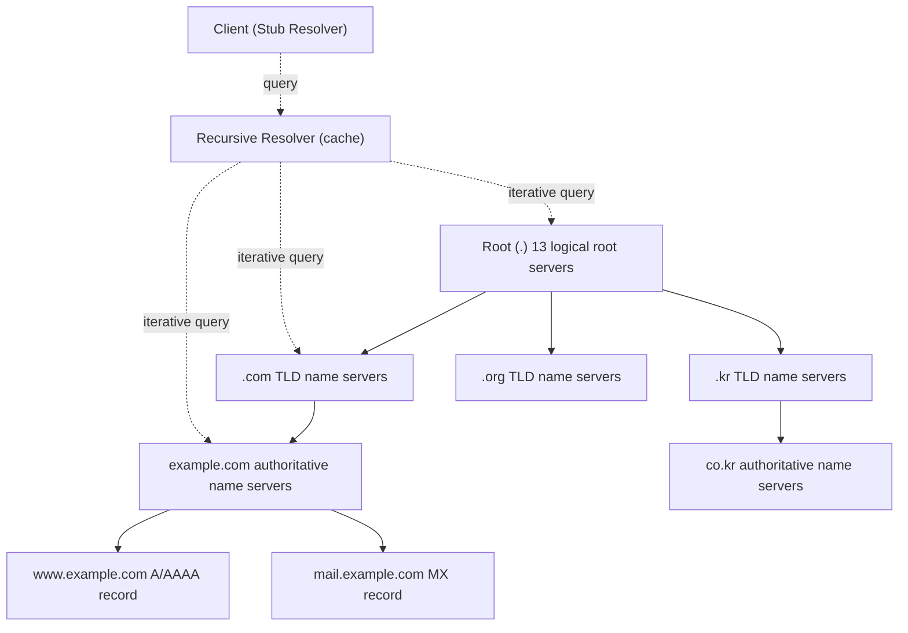
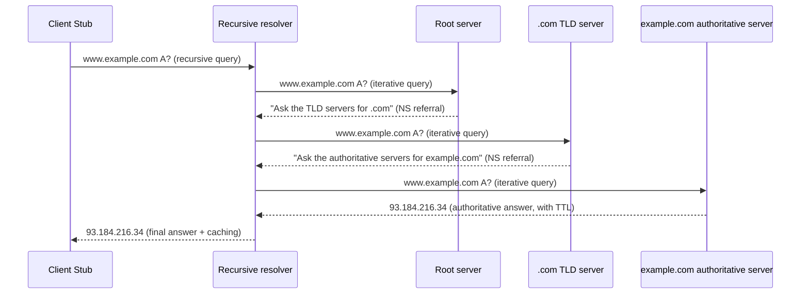
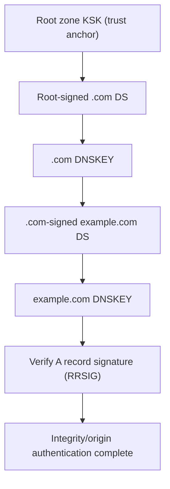

# DNS (Domain Name System) and DNS Security

## 1. Overview

> **Definition**: DNS (Domain Name System) is a hierarchical, distributed global name-resolution system that mutually converts human-friendly domain names (e.g., `www.example.com`) into the IP addresses computers use for communication (e.g., `93.184.216.34`).

In the early days of the internet, the names and addresses of all hosts were placed in a single text file (`HOSTS.TXT`) and distributed centrally. But as the number of connected hosts exploded, this single-file approach exposed three limits: distribution delay, name collisions, and an update bottleneck. That is, a centralized static file could not accommodate the internet's scalability, and to solve this, in 1983 Paul Mockapetris designed DNS by combining the ideas of a hierarchical name space and a distributed database (RFC 882/883, later standardized as RFC 1034/1035). The essential value of DNS lies in "hierarchizing the name space into a tree structure and delegating administrative authority over each zone to an independent entity," so that any organization worldwide can manage its own names without central approval.

Without DNS, all web, mail, and API communication would have to directly specify IP addresses, and every time a server moved or load was balanced, all clients worldwide would have to be modified one by one. Conversely, because DNS exists, the domain acts as an "indirection layer" that decouples a service from its physical location, and this becomes the foundation of modern internet infrastructure such as CDNs, GSLB (global server load balancing), email routing, and service discovery. That said, because DNS was designed to prioritize "availability and scalability" at the time and did not consider "authentication and confidentiality," today it carries structural vulnerabilities such as cache poisoning, amplification DDoS, and privacy exposure, and DNSSEC and DoH/DoT that supplement these must be discussed together.

Its features can be summarized as ① a tree-shaped hierarchical name space, ② distributed operation via delegation of administrative authority, ③ performance and scalability secured through TTL-based caching, ④ lightweight queries centered on UDP/53, and ⑤ an orientation toward eventual consistency.

DNS is often likened to the internet's "phone book," but this analogy underestimates its scale and mode of operation. If a phone book is a static list, DNS is a dynamic system that processes hundreds of millions of domains worldwide, handling millions or more queries per second in real time in a distributed fashion, and in that no single organization owns the whole, it is the infrastructure that best embodies the internet's philosophy of "distributed cooperation." For this reason, DNS is "the first gateway of all communication," operating even before the web (HTTP); if DNS halts, virtually all services become unreachable except for the tiny few who know IPs directly. It is precisely this "universal dependency" that makes DNS's performance, availability, and security not a matter for individual services but a reliability issue for the entire internet.

## 2. The DNS Name Space and Overall Structure

The DNS name space is an inverted-tree structure with the root (`.`) at the apex, descending through TLDs (Top-Level Domains), second-level domains, and subdomains. Each node has a label of up to 63 bytes, and the entire FQDN (Fully Qualified Domain Name) cannot exceed 255 bytes. This hierarchy matters because it makes it necessary to guarantee a name's "uniqueness" only locally. That is, the administrator of the `example.com` zone need only prevent name collisions within their own zone and need not coordinate with the whole world.

Delegation of authority is done on a **zone** basis. A zone is a contiguous portion of the name space for which a single administrative entity is responsible, and a parent zone delegates by pointing to the authoritative name servers of a child zone via NS records. For example, the root delegates the `.com` TLD, and the `.com` TLD delegates the name servers of `example.com`. Thanks to this delegation chain, global resolution is possible without any single server holding all the data.

There are four core entities that make up the DNS infrastructure. First, the **stub resolver** is a minimal-function client built into the OS or browser, which delegates queries to a recursive resolver. Second, the **recursive resolver (caching resolver)** visits the root → TLD → authoritative servers in turn on the client's behalf to find and return the final answer, and caches that result for the TTL. An ISP's resolver, or Google `8.8.8.8` and Cloudflare `1.1.1.1`, are representative. Third, the **authoritative server** is the ultimate origin holding the original data of a particular zone. Fourth, the **root servers** are operated as 13 logical addresses (A–M) but are, in reality, replicated to thousands of physical instances worldwide via Anycast technology to secure availability and response speed.

In this structure, the core performance mechanism is **caching**. Each record is given a TTL (Time To Live), and the recursive resolver does not re-query upstream servers until the TTL expires. A short TTL means changes propagate quickly but increases the load on the root and TLD; a long TTL reduces load but delays worldwide propagation when an IP changes. Therefore, it is common practice to lower the TTL to something like 300 seconds in advance when planning a server migration. This caching is what makes DNS an "eventual consistency" system, and at the same time it is the point that becomes the target of cache-poisoning attacks.

## 3. How DNS Works — Recursive and Iterative Queries

DNS resolution is accomplished by combining two query methods of different character. Between the client and the recursive resolver, a **recursive query** is used. The client requests "give me the completed answer," and the resolver takes on the responsibility of finding the answer. Between the resolver and each tier of servers, an **iterative query** is used. If a server does not know the answer, it returns only a referral to a lower server, saying "ask further down." This division of roles matters because it concentrates the heavy search work at a single resolver and reuses the cached result, dramatically reducing the total query volume across the internet.

Looking at the concrete flow, when a user requests `www.example.com`, the stub resolver throws a recursive query to the recursive resolver. If the resolver has no answer in cache, it first asks the root server, and the root returns an NS referral to the `.com` TLD servers. The resolver then asks the TLD servers and obtains a referral to the `example.com` authoritative servers, and finally receives the actual A record (`93.184.216.34`) from the authoritative server, delivers it to the client, and caches it for the TTL. The first query thus goes through several round trips, but subsequent identical or similar queries are processed immediately from the cache and answered within a few milliseconds. In practice, the cache hit rate is typically 80–90% or more, and most DNS queries terminate at the resolver cache without reaching upstream servers.

At the transport layer, DNS basically uses **UDP port 53**. Because name resolution is single-shot and small-volume, UDP, which has no connection-setup overhead, is advantageous. However, when the response exceeds 512 bytes (the traditional UDP limit) or when reliability is needed as in a zone transfer (AXFR/IXFR), it falls back to **TCP port 53**. In modern environments where responses have grown large, as with DNSSEC-signed data, it is standard practice to extend the UDP payload up to 4096 bytes with **EDNS0** (RFC 6891) to reduce TCP retries.

The availability of authoritative servers is secured through **primary/secondary (master/slave) redundancy**. The original zone data is held by the primary server, and secondary servers replicate it via **zone transfer**. Here, using **IXFR (Incremental Zone Transfer)**, which transfers only the changes rather than copying the whole each time (AXFR), saves bandwidth, and update is judged by detecting an increase in the serial number of the SOA record. Because zone transfers can expose the internal topology, it is a security principle to restrict them to authorized secondary servers only and authenticate them with TSIG (Transaction Signature). Because of this redundancy, multiple authoritative servers continue to respond even when the primary fails, maintaining DNS's high availability.

A factor easily overlooked in performance optimization is **negative caching (RFC 2308)**. A response for a nonexistent name (NXDOMAIN) must also be cached to prevent repeated invalid queries from flowing to upstream servers, and here the caching duration is determined by the minimum TTL value of that zone's SOA record. If there were no negative caching, queries for nonexistent subdomains from typos or bots would reach the authoritative server directly and increase load; indeed, an NXDOMAIN flood is exploited as one DDoS technique. A design that makes even the answer "does not exist" a caching target underpins DNS's scalability.

## 4. Major Resource Record (RR) Types

The basic unit of DNS data is the resource record (RR), and each record consists of `name / TTL / class (IN) / type / value`. Understanding record types is not rote memorization but a matter of grasping "what service need each type exists to satisfy." For example, A/AAAA handle the endpoint of web access, MX handles mail routing, SRV handles service discovery, and CAA handles control of certificate issuance. The table below is a supplementary summary; in an actual answer, it is better to describe the context in which each record appears.

| Type | Role | Example/note |
|------|------|-----------|
| A | Domain → IPv4 address | `www.example.com → 93.184.216.34` |
| AAAA | Domain → IPv6 address | Essential for IPv6 transition |
| CNAME | Alias (delegate to canonical name) | Usage restricted at the root domain |
| MX | Designate mail server (with priority) | Lower priority value takes precedence |
| NS | Delegate a zone's authoritative name servers | The core of the delegation chain |
| SOA | Zone start/administration info (serial, refresh interval) | One per zone |
| PTR | IP → domain (reverse lookup) | `in-addr.arpa` |
| TXT | Arbitrary text (SPF, DKIM, verification) | Widely used for mail authentication |
| SRV | Service location (host, port) | SIP, LDAP, etc. |
| CAA | Restrict CAs allowed to issue certificates | Prevents misissuance |
| DNSKEY/RRSIG/DS/NSEC | DNSSEC signing/verification/denial of existence | See the deep dive in Section 4 |

The **PTR record** handling reverse lookup also carries significant practical meaning. If forward is name→IP, PTR resolves IP→name, expressing the IP in reverse order under the special domains `in-addr.arpa` (IPv4) and `ip6.arpa` (IPv6). A representative use of PTR is **mail-server spam filtering**: a receiving mail server checks whether the reverse lookup of the sending IP matches the forward lookup (forward-confirmed reverse DNS) to filter out forged senders. Therefore, when running one's own mail server, a missing PTR can lead to legitimate mail being treated as spam — a concrete case where a single DNS record directly affects service reliability.

The difference between CNAME and A records is a point frequently confused in practice. A maps a name directly to an IP, whereas CNAME delegates a name to another "canonical name." A CNAME chain is flexible but induces additional lookups that increase latency, and it cannot be used at the root domain (zone apex) due to the RFC constraint that it cannot coexist with SOA/NS. To work around this, CDN providers offer vendor-extension records such as ALIAS/ANAME. As another practical case, **SPF/DKIM/DMARC** for preventing email spoofing all distribute their policies in TXT records — a representative example of DNS being used beyond simple address translation as a "trust-policy distribution channel."

## 5. DNS Security Threats and Comparison

Because DNS is a UDP-based protocol designed without integrity or authentication mechanisms, it is exposed to various threats. Rather than merely listing threats, one should understand them together with the structural cause of "why that attack succeeds."

**Cache poisoning** is an attack in which an attacker injects a forged response into a recursive resolver first, making the resolver cache a wrong IP. Because UDP has weak source verification and the authenticity of a response is checked only against the query ID (16 bits) and source port, brute-force guessing was possible. The technique presented by Dan Kaminsky in 2008 demonstrated the severity of this vulnerability by using subdomains to repeat guessing opportunities indefinitely, and the response promoted **source-port randomization** and, ultimately, the adoption of DNSSEC. **DNS amplification/reflection DDoS** combines the DNS characteristic of a small query eliciting a large response (an amplification factor of tens of times) with UDP's source-spoofing capability to pour massive responses onto a victim's IP. The 2016 Dyn DNS outage by the Mirai botnet was a representative case showing that when the DNS infrastructure itself becomes the attack target, numerous services such as Twitter and Netflix can be paralyzed simultaneously. Besides these, there are **DNS tunneling** (an exfiltration/C2 channel that hides data in DNS queries to bypass security appliances), **subdomain takeover**, and **domain hijacking** (hijacking a registrar account).

| Threat | Root cause | Main countermeasures |
|------|-----------|-------------|
| Cache poisoning | No verification of response authenticity (16-bit ID) | DNSSEC, port randomization, 0x20 encoding |
| Amplification DDoS | UDP source spoofing + large responses | RRL (Response Rate Limiting), Anycast, BCP38 |
| DNS tunneling | Insufficient monitoring of query payloads | Traffic analysis/anomaly detection, payload inspection |
| Subdomain takeover | Abandoned CNAME delegations | Clean up unused records, verify ownership |
| Domain hijacking | Weak registrar accounts | Registry lock, MFA, DNSSEC |

Additionally, DNS is exploited to conceal attack infrastructure. A **DGA (Domain Generation Algorithm)**, in which malware generates a large number of random domains daily and registers only some as C2 servers, neutralizes simple blacklist blocking, and **typosquatting/IDN homograph attacks**, which register visually similar domains to deceive users, are a staple phishing technique. Because such threats are hard to counter with static blocking alone, dynamic detection techniques such as entropy analysis of query patterns and machine-learning-based domain reputation scoring are also required. In fact, large security vendors analyze hundreds of billions of DNS query logs per day to identify new malicious domains early.

Threat countermeasures operate at different layers and must be understood together. For example, DNSSEC provides "integrity and authentication" but not "confidentiality," so the privacy problem is separately solved by DoH/DoT. Conversely, DoH/DoT block eavesdropping and tampering via transport-segment encryption but do not guarantee that the data returned by the resolver is "the answer of the genuine authoritative server," so they are complementary to DNSSEC. This point — that no single mechanism covers all threats — is the core implication of DNS security.

## 6. Deep Dive — DNSSEC and Encrypted DNS (DoH/DoT) Latest Trends

DNSSEC (DNS Security Extensions, RFC 4033–4035) verifies whether a response has been forged or tampered with, by attaching a digital signature (RRSIG) to each record set (RRset) and connecting the authenticity of its verification key (DNSKEY) to the parent zone's DS record through a "chain of trust." The top of the trust is the root zone's public key, and the **KSK rollover (Key Signing Key Rollover)** that periodically replaces it was first performed in 2018 — a historic case in which resolvers worldwide switched at once to trust the new root key. To prevent forged responses for nonexistent names, DNSSEC provides "authenticated denial of existence" via **NSEC/NSEC3**, where NSEC3 supplements with hashing the problem of NSEC exposing names directly and being exploited for zone walking.

In cloud-native environments, DNS's role is in fact expanding. Kubernetes uses **CoreDNS** as its in-cluster DNS to give pods and services names of the form `service.namespace.svc.cluster.local`, thereby implementing **service discovery** between microservices. That is, even as a service's IP keeps changing due to scale-in/out, the name stays fixed, so callers can communicate without being aware of IP changes. Also, **split-horizon DNS**, which returns different answers to the internal corporate network and the outside, is a practical technique that provides private IPs to internal users and public IPs to external users for the same domain, reducing exposure of internal assets. In this way, DNS is evolving beyond traditional internet name resolution into a core control point for container and zero-trust environments.

Meanwhile, what emerged to address the "privacy" that DNSSEC does not handle is encrypted DNS. **DoT (DNS over TLS, RFC 7858)** encrypts queries with TLS on port 853, and **DoH (DNS over HTTPS, RFC 8484)** carries DNS in HTTPS traffic on port 443, making it indistinguishable from ordinary web traffic. Cloudflare, Google, and Mozilla operate public DoH resolvers and have expanded default browser adoption. However, DoH, while strengthening privacy, also makes it harder for corporate security appliances to monitor and block DNS, creating the trade-off of "reduced network visibility." For this reason, many enterprises run policies that force the use of an internal resolver alongside DoH detection. As the most recent trends, privacy-enhancing technologies are being discussed, such as **ECH (Encrypted Client Hello)**, which also conceals the SNI (Server Name Indication), and "Oblivious DoH," which prevents even the resolver from knowing both the querier and the query content simultaneously. Because exact deployment status is fluid by standard and implementation, it is advisable to check the latest RFCs and vendor documentation when adopting.

## 7. Considerations and Implications (Professional Engineer's Perspective)

**First, balanced design of availability, security, and privacy.** Because DNS easily becomes a single point of failure (SPOF) for the internet, it is essential to geographically distribute authoritative servers, run multiple DNS providers in parallel (multi-provider), and apply Anycast. Combine DNSSEC (integrity) and DoH/DoT (confidentiality) in layers, but reconcile in advance the trade-off between the reduced network visibility DoH brings and corporate security policy.

**Second, an operational strategy based on TTL and redundancy.** Manage a peacetime TTL policy deliberately in preparation for service migration and failover, and reduce latency with DNS-based load balancing linked to GSLB and health checks, while reconciling the trade-off so that an overly short TTL does not increase upstream infrastructure load. One must recognize that cache-invalidation delay directly affects the recovery time objective (RTO). In particular, DNS-based GSLB returns the IP of the optimal data center based on user location, server load, and latency to distribute global traffic, but has the limitation that routing to a failed node persists for as long as the TTL due to caching by clients and intermediate resolvers. For this reason, large-scale services use DNS-based distribution as the first tier but combine it in multiple layers with Anycast and L4/L7 load balancers to supplement immediate failover — the standard approach.

**Third, using DNS as a core axis of security operations.** Because most malware C2, phishing, and data exfiltration pass through DNS, linking **Protective DNS**, a DNS firewall (RPZ, Response Policy Zone), and DNS-log-based anomaly detection with SIEM/XDR can block threats early. One must strategically exploit DNS's duality as both an "attack channel" and the most effective "detection point."

**Fourth, governance and verification systems during the standards-transition period.** Because standards keep changing — full adoption of IPv6 (AAAA), the root KSK rollover, the spread of encrypted DNS — an organization must systematize operational governance such as automating DNSSEC signing/verification, preventing domain hijacking via registry lock and MFA, and preventing subdomain takeover by cleaning up unused records. Going forward, DNS's role is expected to expand further through linkage with zero-trust architecture and internal service discovery in cloud-native environments (CoreDNS, etc.).

**Fifth, infrastructure ownership/cost structure and a supply-chain perspective.** Whether to build DNS operations in-house or outsource to a managed DNS provider is a trade-off among availability, cost, and control. Outsourcing is cost-efficient in that it lets you immediately leverage worldwide Anycast infrastructure, but it creates supply-chain risk in the form of vendor lock-in to a particular provider and the fact that that provider's failure directly leads to one's own service outage. Because there have actually been cases where a large DNS provider's failure spread to the simultaneous outage of many services, one must also consider running multiple providers in parallel and designing automatic failover. Furthermore, since the domain name space exists on a governance system running through ICANN, registries, and registrars, one should formally incorporate domain expiry and ownership management into the organization's asset-management process to prevent the rudimentary incident of "a service outage caused by a lapsed domain."

## References
- RFC 1034/1035, Domain Names — Concepts and Implementation/Specification, IETF
- RFC 4033/4034/4035, DNS Security Introduction and Requirements (DNSSEC), IETF
- RFC 7858, Specification for DNS over Transport Layer Security (DoT), IETF
- RFC 8484, DNS Queries over HTTPS (DoH), IETF
- RFC 6891, Extension Mechanisms for DNS (EDNS0), IETF
- ICANN, KSK Rollover documentation: https://www.icann.org/resources/pages/ksk-rollover
- Cloudflare Learning Center, What is DNS?: https://www.cloudflare.com/learning/dns/what-is-dns/
- RFC 2308, Negative Caching of DNS Queries (DNS NCACHE), IETF
- ICANN Root Server System (Anycast/root server operation): https://www.iana.org/domains/root/servers

---
> **In one line**: DNS is a hierarchical, distributed name-resolution system that translates domain names into IPs, securing scalability through delegation and caching; but by design it is vulnerable to cache poisoning, amplification DDoS, and the like due to the absence of authentication and confidentiality, and the key is to supplement these with DNSSEC (integrity) and DoH/DoT (confidentiality).
