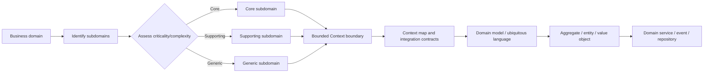
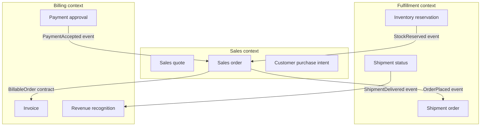
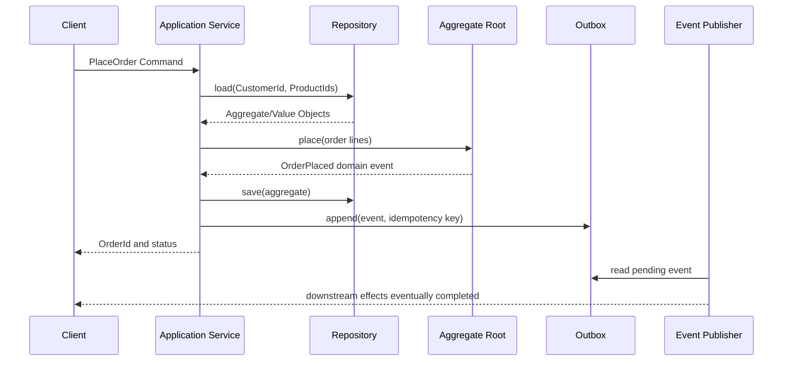

# Domain-Driven Design (DDD)

## 1. Overview

> Domain-Driven Design (DDD) is a design approach that places the center of software not on the technical framework but on the problems and models of the business domain, and that iteratively evolves a model shared between domain experts and developers.

Enterprise systems go beyond simple data-entry and lookup programs, combining business rules such as products, contracts, settlement, delivery, and regulations to make decisions.
As the business grows more complex, the same word takes on different meanings in different departments, and a change to one screen cascades into effects on multiple systems and organizational policies.
At such times, the approach of first creating database tables and then bolting on service screens can build features quickly, but it becomes hard to explain the ownership of rules and the boundaries of change.
DDD raises the consistency of design and implementation by surfacing this complexity through the domain model, language, boundaries, and invariants.

The essence of DDD is not in mechanically applying a particular framework or class pattern.
The developer listens to the domain expert's expressions, models candidate concepts, and if the model cannot explain the actual business decisions, asks again and revises.
Therefore, DDD is a way of thinking that connects analysis, design, implementation, testing, and operation, and must not be reduced to a refactoring technique of the technical team alone.

A domain is the business area a system tries to solve, and a subdomain is a part of that area divided by purpose and responsibility.
A core subdomain is the source of competitiveness and differentiation, so it is highly worth developing with internal capabilities.
A supporting subdomain is necessary for the business but relatively low in differentiation, so it can be implemented with a standard product or a simple internal service.
A generic subdomain is a function most organizations commonly need, such as purchasing, authentication, and mail, so it may be reasonable to leverage packages or external services.

Whether DDD is needed is judged by the complexity and change frequency of the rules rather than the system's scale.
Introducing a heavy domain model into a simple lookup system with simple rules may only increase development speed and operational complexity.
Conversely, in a system entangled with discounts, inventory, settlement, permissions, and regulatory exceptions, the implicit rules of code and data quickly accumulate as debt when there is no model.
A professional engineer must judge whether to apply DDD not by trend but from the perspectives of domain complexity, cost of change, organizational structure, and integration requirements.

## 2. The Overall Concept Map of DDD and Design Principles

DDD first sets the large boundaries with strategic design, then concretizes the model and responsibilities within each boundary with tactical design.
The two stages are separate but feed back to each other.
If the strategic boundaries are wrong, no matter how elaborately the tactical patterns are written, the coupling and translation cost between services will not decrease.

Domain decomposition is not a task of copying the organization's current org chart.
Confirm that the word "customer" may be treated as a potential buyer in sales, the purchasing subject in orders, and the debtor in receivables, and set the boundaries based on the rules and responsibilities of each business.
Trying to unify the same term into one giant object across all systems creates unnecessary dependencies, so acknowledging the difference in meaning by context actually raises consistency.

The ubiquitous language is the language that domain experts and developers use together in the model, code, tests, and documents.
If in a meeting one says "reservation confirmed" while implementing it in code as `createOrder`, a translation loss arises between the language and the model.
A glossary is only a starting point; the effect appears only when the same meaning is maintained down to the actual model's attributes, states, behavior, and error messages.

A domain model is not a collection of data structures but a structure of business rules and decisions.
For example, an order's total is not simply the sum of product prices but may be the result of reflecting the order of discount application, tax rounding, and delivery conditions.
Scattering this calculation rule across screen controllers or batch SQL causes omissions on change, so place the owner of the rule and the invariant inside the model.

The table is a supplementary means to quickly contrast DDD's main concepts.
Each concept should be understood not as an independent checklist but as a relationship that connects the model's meaning and responsibilities.

| Concept | Core question | Main responsibility | Common misconception |
|---|---|---|---|
| Domain | What business problem does it solve? | Define the problem's scope and purpose | Seeing the database itself as the domain |
| Subdomain | Up to where is one business capability? | Distinguish core/supporting/generic areas | Copying the org chart verbatim |
| Bounded context | Which model and language are valid? | Define the model's application boundary and contract | All contexts sharing the same object |
| Entity | Must the same object be tracked over time? | Manage identifier and lifecycle | Making every table an entity |
| Value object | Is the value itself the meaning, with no identifier needed? | Encapsulate immutable value and validation | Passing strings/numbers without limit |
| Aggregate | Which changes are bound into one consistency boundary? | Protect invariants and transaction boundary | Putting all objects under one big root |
| Domain event | What business fact occurred? | Convey facts between contexts | Equating it with a simple log message |

DDD's principle is not "make everything an object."
The heart of modeling is distinguishing which rules must be satisfied together immediately and which information may be reflected later via events.
This distinction determines the transaction scope, storage structure, API contracts, and even the failure-recovery approach.

## 3. Strategic Design: Subdomains and Bounded Contexts

### 3.1 Subdomain Classification and Investment Priority

Subdomain classification connects business strategy with architectural decisions.
A core subdomain is the capability by which customers distinguish you from other providers; it is likely an area with high implementation difficulty and frequently changing rules.
Therefore, place domain experts and skilled developers in the core area and invest in the model's quality and testing.

A supporting subdomain aids the core business but has low competitive advantage of its own.
For example, if a manufacturer's production optimization is core, ordinary HR and electronic approval may be classified as supporting or generic areas.
Rather than unconditionally externalizing the supporting area, decide by comparing integration cost, data sovereignty, security, and change requirements together.

A generic subdomain is a capability that many organizations solve similarly.
Building a proprietary model directly in this area can unnecessarily increase maintenance cost, so use standard solutions and concentrate capability on the differentiating areas.
However, even when adopting a package, the difference between internal and external terminology must be managed in a translation layer so the core model is not polluted.

The business portfolio and subdomain classification are not fixed truths.
A generic function may become a core capability due to regulatory changes or business strategy, and changes in the price or dependency of an external platform are also grounds for reassessment.
In the classification results, record not only importance but also change frequency, cost of failure, obtainable expertise, and external substitutability.

### 3.2 Bounded Contexts and Model Boundaries

A bounded context is an explicit boundary within which a particular domain model and ubiquitous language are valid.
Within the boundary, the meaning and invariants of "customer," "order," and "status" are kept consistent, but when crossing the boundary, only the necessary information is exchanged via APIs, events, and translators.
This hides the model's internal implementation and lets each team change its own business rules independently.

A context's boundary may coincide with the boundary of a database schema but is not always the same.
One context may use multiple stores, and one may initially separate logical schemas within a single database and then physically separate them incrementally.
What matters is clarifying the model's ownership and change contract rather than the storage location.

When setting boundaries, look together at the meaning of terms, the reason for change, transactional consistency, team responsibility, external linkage, and security grade.
Keep functions that change for the same reason close, and do not needlessly bind functions that change for different reasons.
If you first decide the number of microservices and then fit the domain into them, the risk of a distributed monolith grows.

In the structure above, the sales order and the shipment order are related but are not the same object.
Sales manages the price, customer promise, and order status, while fulfillment manages physical inventory and shipping feasibility.
If the sales context directly modifies fulfillment's internal inventory object, the two teams' changes become coupled, so convey only the necessary facts via the order-received event and the shipment-request contract.

### 3.3 Context Maps and Integration Relationships

A context map visualizes the direction of dependencies and the relationship types among bounded contexts.
A Shared Kernel is a part of the model jointly maintained by several teams, requiring change agreement and joint testing.
A shared kernel looks like reuse, but because the cost of coordinating changes propagates to all teams, it is safer to limit it to small, stable values.

In a customer-supplier relationship, the upstream provides the contract and the downstream consumes it.
You must decide whether the downstream must follow the upstream's model verbatim, or place a translation layer to protect its internal model.
If the supplier changes frequently or is unreliable, use an anti-corruption layer (ACL) to convert the external model into the internal language.

An open host service provides a standardized public contract that many consumers can use.
A Published Language is an expression agreed upon by multiple contexts, such as an event schema or API documentation.
This relationship is convenient, but without contract version management and backward-compatibility testing, coupling between contexts grows again.

| Relationship | Meaning | When to apply | Control point |
|---|---|---|---|
| Shared kernel | Jointly own part of the model | Strong domain commonality and close collaboration | Change approval, joint testing |
| Customer-supplier | Upstream provides the contract | When the supply direction is clear in the workflow | Contract version, impact analysis |
| Conformist | Downstream accepts the upstream model | When there is little benefit to changing the external model | Limit the scope of internal pollution |
| Anti-corruption layer | Translate the external model into the internal model | When linking legacy/packages | Translation rules, error handling |
| Event collaboration | Share business facts asynchronously | When reducing temporal coupling | Duplication, ordering, reprocessing |

## 4. Tactical Design: The Model's Components and Execution Flow

### 4.1 Entities and Value Objects

An entity is an object that maintains identity through an identifier even as its attributes change.
An order with the same order number is the same order even if the delivery address changes, but the address itself may be a combination of values whose meaning is completed as a whole.
An entity's identifier may be a database auto-increment value, but separating a business-meaningful identifier from a technical identifier is advantageous for external contracts.

A value object judges identity by the value of its attributes and its immutability conditions.
An amount is not a single number but may include currency, precision, and rounding rules, and an email address may include format and normalization rules.
Making value objects immutable reduces side effects from sharing and lets you block invalid states in the constructor or factory.

Primitive obsession — passing primitive types everywhere — induces unit confusion and missing validation.
For example, the value `1000` alone cannot tell whether it is a KRW amount or points, and whether VAT is included.
Meaningful types such as `Money`, `CustomerId`, and `DeliveryAddress` help the compiler and tests enforce business rules.

### 4.2 Aggregates and Invariants

An aggregate is a bundle of objects treated as one consistency boundary, and the outside modifies the inside only through the aggregate root.
If order is the root, instead of directly modifying order items, use a behavior on the order such as `addLineItem` to enforce the rules of quantity, price, and status.
An aggregate is not a design that bundles many objects, but a design that finds the minimal unit that must be consistent together.

If an aggregate is too large, the data and transactions to lock each time increase, lowering concurrency.
Conversely, if it is too small, you must modify multiple aggregates simultaneously to process one business command, and distributed transactions or compensation become necessary.
Therefore, decide boundaries by invariants, change frequency, and concurrency patterns rather than by the object's natural containment relationships.

References between aggregates are generally expressed by identifier rather than by directly holding the object.
If an order holds the entire customer object, changes to the customer model propagate to the order model, so store only `CustomerId` and obtain needed customer information via separate lookup or events.
This approach lowers coupling but requires designing lookup consistency and cache freshness together.

### 4.3 Domain Services and Application Services

A domain service expresses a domain rule that is hard to naturally attach to a single entity.
A rule that requires collaboration among multiple aggregates, such as a funds transfer between two accounts, or one that is not the essential responsibility of a particular object, such as an exchange-rate lookup, becomes a candidate for a domain service.
But sending all calculations to services yields an anemic domain model, so first place responsibilities on entities and value objects and put only the remaining rules in services.

An application service coordinates the user's use case.
It receives a command, checks permissions, fetches the aggregate from the repository, invokes domain behavior, and coordinates the transaction and event publication.
Writing business rules themselves directly into the application service duplicates the rules across multiple entry points, so keep the service closer to a flow coordinator.

The distinction between a domain service and an application service is not a matter of layer names.
A calculation with business meaning, such as "is this customer a VIP," may belong to the domain, while a technical flow of "receive an HTTP request and convert it to JSON" belongs to the application/interface layer.
Decide the location by the reason a responsibility changes, and testing and maintenance become easier.

### 4.4 Domain Events and Repositories

A domain event indicates that a meaningful fact has occurred in the domain.
Events such as `OrderPlaced`, `PaymentAccepted`, and `ShipmentDelivered` are expressed in past tense, so the publisher need not know the consumer's internal implementation.
Because an event differs from a command, conveying a fact such as "the order was received" rather than "decrement inventory" reduces coupling between contexts.

A repository abstracts the storage and restoration of an aggregate as if it were a domain-perspective collection.
The domain layer uses meaningful contracts such as `findById` and `save` instead of SQL or ORM details, and the infrastructure layer implements them.
However, handling all lookups with the repository object model can degrade the performance of complex report queries, so a judgment to place a read-only query model separately is also needed.

Separating event publication and storage can create a problem where storage succeeds but the event is lost.
To mitigate this, one can apply the outbox pattern: record the domain event in an outbox within the same local transaction, and a separate deliverer retries.
In this case, consumers may receive duplicate events, so design deduplication based on the event ID and an idempotency key.

### 4.5 The Standard Flow of Command Handling

A DDD application is usually implemented with the flow of input adapter, application service, domain model, and storage/message infrastructure.
Rather than exposing the input DTO directly as an entity, converting it into a command object separates the change speed of the external API contract from the internal model.

In this flow, the aggregate validates the invariants of price and status, and the application service coordinates the transaction boundary.
If the outbox record is not included in the same transaction, the order may be saved but the inventory-reservation event may disappear.
Conversely, if the consumer immediately displays the event-processing result to the user as a confirmed status, asynchronous delay may be misunderstood, so distinguish the `received` and `processing complete` states.

## 5. Comparing DDD with Similar Approaches

### 5.1 DDD and Data-Centric Design

Data-centric design emphasizes normalization, integrity, query performance, and data integration.
DDD emphasizes what business behavior and rules the data expresses, and where the responsibility for change lies.
The two approaches are not in opposition; in complex systems, mapping between the domain model and the relational storage model is necessary.

Binding order, customer, and product into one common table-centric model may seem convenient for report writing, but the different rules of sales, fulfillment, and settlement may become entangled in one schema.
DDD allows each context the model it needs, and provides integrated lookups via a separate read model or data product.
In exchange, one must accept duplicate data and synchronization cost, so a balance between consistency requirements and lookup convenience is needed.

### 5.2 DDD and Microservices

Microservices is an architectural style that makes the unit of deployment, scaling, and failure isolation small, while DDD is a design approach that discovers business models and boundaries.
A DDD bounded context can be a microservice candidate, but one context may be split into several services, and several contexts may initially be implemented as a single modular monolith.
Using DDD as an unfounded justification for service splitting only increases network calls and operational complexity.

A modular monolith is an approach that keeps modules and contracts between contexts while maintaining a single deployment unit.
It suits an incremental strategy of validating domain boundaries and securing the team's operational capability, then extracting into services only the contexts with clear change conflicts or scaling demands.
On the other hand, in a large organization that needs independent deployment and strong failure isolation from the start, per-context services may be reasonable.

| Comparison criterion | DDD | Data-centric design | Microservices |
|---|---|---|---|
| Main concern | Business meaning and change boundaries | Data integrity and utilization | Deployment, scaling, failure isolation |
| Boundary basis | Language, invariants, reason for change | Schema, entity relationships | Service operation unit |
| Consistency | Strong consistency per aggregate, eventual consistency between contexts | Easy to secure strong consistency via central transaction | Frequent asynchronous/compensation handling between services |
| Advantage | Cohesion of complex business rules | Integrated lookup and integrity management | Independent deployment and scaling |
| Risk | Modeling/collaboration cost | Rule scattering and giant schema | Burden of operating a distributed system |
| Suitable condition | Complex, changing core business | Simple CRUD/integrated analytics | Independent teams, deployment, scaling needs |

## 6. Application Case: An Online Order and Settlement Platform

Assume that in an online commerce platform, sales, inventory, shipping, and payment share a single order table.
If a discount-coupon change affects inventory handling and a shipment-status change affects the revenue-recognition batch, even a small policy change leads to a full deployment.
First, divide sales order, inventory fulfillment, payment, and settlement into contexts, and define the ubiquitous language of each context.

The sales context is responsible for order creation, cancellation, discount application, and customer promise.
The order aggregate manages order items and discount results together, but does not directly modify the actual inventory object.
When an order is received, it publishes an `OrderPlaced` event, and the fulfillment context attempts a reservation according to its own inventory policy.

The inventory context is responsible for available quantity per warehouse and reservation expiry.
Because the inventory quantity shown by sales and the physical inventory confirmed by fulfillment may differ in timing and purpose, do not treat the two values as one common field.
A successful reservation is notified as `StockReserved`, a failure as `StockReservationFailed`, and the sales context transitions the order to a waiting, canceled, or alternative state.

The payment context is responsible for approval, cancellation, refund, and payment-method security policy.
So that a retry does not cause a double payment even when a user request times out due to a card company's response delay, use the payment-request key as an idempotency key.
The payment-completed event becomes the basis for updating the order status and settlement records, but separate the contract so the payment context does not directly manipulate sales' internal state.

The settlement context confirms revenue and receivables based not on the order price but on accounting, tax, and fee standards.
Using sales' discount-calculation result directly as the accounting ledger makes it hard to track regulatory changes and rounding differences, so settlement separately owns the evidence and calculation rules it needs.
This structure duplicates some data but lets each context change its rules independently and leave an audit trail.

Concretely, for a platform handling one million orders per month, a structure using an order-received event and a settlement-dedicated read model may scale better than one in which all contexts join the order table.
However, if there is a 30-second event delay, the status on the call center and operations dashboards may appear late, so design SLA and reconciliation lookups together.
DDD is not a slogan for choosing distribution but a method for making the consistency level and the cost of business failure explicit.

## 7. Deep Dive: Incremental Adoption and Operational Design

### 7.1 Adoption in Legacy Systems

Applying DDD to a legacy system all at once can harm the stability of existing features.
First, select a workflow that changes frequently and has a high failure cost, then confirm terminology and boundaries via event storming or workshops.
Rather than immediately rewriting external systems, protecting the periphery first with an ACL and a facade lets you incrementally validate the new model.

Using the strangler pattern, you can add a new context in front of an existing feature and gradually move responsibilities by traffic or business type.
Early in implementation, you can reference the existing database read-only, but once the new model has ownership, separate the write path and observe synchronization delay.
Define the migration-complete criterion not by lines of code but by ownership of business rules, data integrity, and recoverability from failure.

### 7.2 Modeling Workshops and Quality Metrics

When domain experts, developers, planners, and operators together list past-tense events and commands, workflows and exceptions quickly surface.
Recording only the happy path oversimplifies the model, so be sure to include cancellation, return, reprocessing, regulatory exceptions, and permission denials.
Organize the workshop output into a glossary, a context map, an invariants list, event contracts, and open questions.

DDD's quality cannot be evaluated by the number of classes or services.
Key metrics may include the impact scope on change, the aggregate conflict rate, the number of synchronous calls between contexts, the event-reprocessing success rate, rule-test coverage, and the number of business-term inconsistencies.
For example, observe whether an order-cancellation rule change ends with the testing and deployment of the sales context alone, or requires manual adjustment across payment, shipping, and settlement.

### 7.3 Operational Control of Event-Based Integration

An event-based structure lowers coupling but creates new failure modes: delivery delay, duplication, order reversal, and consumer failure.
Include the occurrence time, identifier, version, and originating context in the event schema, and consumers must have safe processing and reprocessing policies even when order is reversed.
Without observing the DLQ, retry count, processing delay, and per-consumer lag, eventual consistency looks like mere data inconsistency.

Contract testing automatically verifies the fields, meaning, requiredness, and backward compatibility between publisher and consumer.
Even using a schema registry or a versioning policy, the mere fact that field names are the same does not guarantee business meaning.
Record the meaning of events and whether they contain personal information in a catalog, and connect retention period and access rights to data governance.

## 8. Considerations and Implications

### 8.1 Complexity and Investment Scope

DDD should be applied first to core business with high domain complexity.
Wrapping every simple lookup/administration screen in aggregates and events can make the design artifacts and testing cost exceed the business value.
Differentiate the modeling depth and separation level based on the change frequency and failure cost of business rules.

### 8.2 Boundaries and Organizational Responsibility

A bounded context must reflect not only technical modules but also a team's responsibility and decision-making authority.
If a team has no authority to change a contract yet the service is separated anyway, coordination meetings and emergency deployments increase during operation.
Clarify the product owner, data owner, on-call, SLO, and change approver per context so that Conway's law does not manifest as disorderly coupling.

### 8.3 Consistency and User Experience

When adopting eventual consistency between contexts, distinguish the state the user sees from the confirmed state.
If shipping availability is not confirmed immediately after an order is received, express `processing` in the UI and API, and provide paths for retry, alternatives, and refunds on failure.
Quantify the consistency-delay target per business, and make corrective work and alerts operate when the delay exceeds the target.

### 8.4 Data, Security, and Audit

When contexts separately own data, handling the replication and deletion requests of personal information can become complex.
Do not put resident numbers or raw payment data in events; convey only identifiers and minimal business facts, and apply tokenization, masking, and access control as needed.
Because legal retention and destruction obligations may conflict, design the retention policy of source data, derived read models, logs, and backups together.

### 8.5 Performance and Failure Recovery

An aggregate-unit transaction is advantageous for protecting invariants, but saving one at a time in a large batch can lower throughput.
Separate the core command path from the analytics/aggregation path, and use read-only models, batches, and caches, but do not let the cache become the final truth of the business.
Event reprocessing, deduplication, partial-failure compensation, and data-rebuild procedures must be verified regularly.

### 8.6 Answer Strategy from a Professional Engineer's Perspective

An effective answer first presents the domain complexity and the necessity of DDD, then explains the boundaries of subdomains and bounded contexts with a concept map.
Next, connect the ubiquitous language and entity/value object/aggregate/domain event from the perspective of invariants and transactions.
On the relationship with microservices, correct the misconception that "DDD equals microservices" and compare the pros and cons of a modular monolith and incremental separation.

In the conclusion, present the trade-offs of cost, performance, consistency, security, and organizational responsibility.
Do not mention only domain-expert collaboration and the glossary; connect contract testing, outbox, idempotency, observability, and recovery drills as operational measures.
A professional engineer should be an architectural decision-maker who chooses the level suited to the problem's boundaries and reasons for change, rather than recommending the adoption of a particular pattern.

## References

- Martin Fowler, Domain-Driven Design: https://martinfowler.com/bliki/DomainDrivenDesign.html
- Martin Fowler, Bounded Context: https://martinfowler.com/bliki/BoundedContext.html
- Martin Fowler, Repository: https://martinfowler.com/eaaCatalog/repository.html
- Microsoft Azure Architecture Center, Domain analysis: https://learn.microsoft.com/en-us/azure/architecture/microservices/model/domain-analysis
- Microsoft Azure Architecture Center, Tactical DDD: https://learn.microsoft.com/en-us/azure/architecture/microservices/model/tactical-ddd

---

> **In one line**: DDD is a design that makes business language and rules explicit through bounded contexts, aggregates, and events to protect the change boundaries of a complex system, and it should be applied incrementally in accordance with domain complexity and the organization's operational capability.
