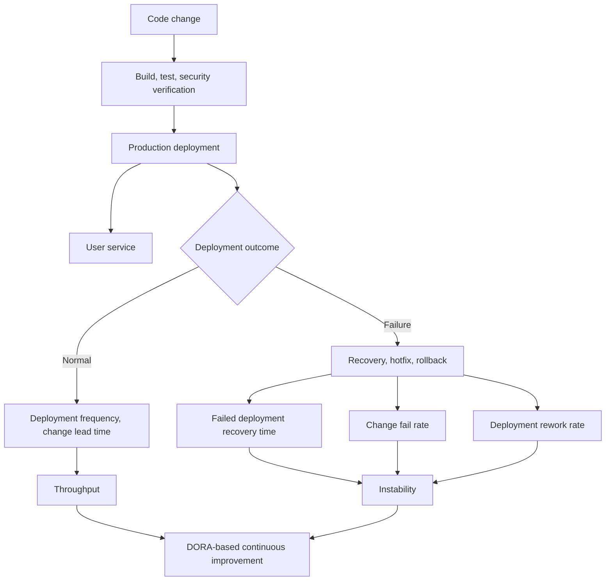
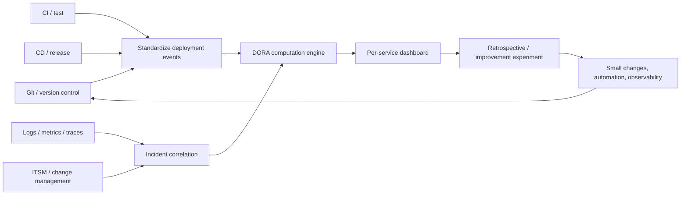

# DORA Software Delivery Performance Metrics (DORA Metrics)

## 1. Overview

> **DORA metrics** are a delivery-performance metric system that measures, per application or service, how frequently, quickly, and stably software is delivered to users, and how well failures and rework are controlled.

An organization that has adopted DevOps and continuous delivery finds it hard to judge performance merely from the fact that the number of pipeline runs or completed tickets has increased.

Even with many deployments, if failures recur, user value does not grow; and even if developers built many features, if operational recovery is slow, the reliability of the whole organization declines.

Conversely, if you break changes into small pieces, pass automated verification, and deploy frequently while limiting the duration of failure impact, you can improve speed and stability together.

DORA metrics express such outcomes in a common language, so that the development, testing, security, operations, and product organizations can converse over a single service's performance.

DORA is composed so that throughput and instability are viewed together.

The five metrics in the current official guide are change lead time, deployment frequency, failed deployment recovery time, change fail rate, and deployment rework rate.

The first three explain how many changes flow into the production environment, and the latter two explain how stably those changes operated.

Therefore, DORA must not be interpreted simply as "a way to deploy faster."

The purpose of measurement is not to rank particular teams or to force target numbers, but to discover bottlenecks in the service-delivery flow and the effects of improvement experiments.

Historically it started from four key metrics — deployment frequency, change lead time, recovery time, and change fail rate — and was recently refined to define failed deployment recovery time with more focus on failures caused by changes, and to add deployment rework rate.

This change in definition shows that the metrics are not a fixed scorecard but a measurement model improved in step with technology and research findings.

## 2. The Metric System and Concept Map

DORA metrics place the service-delivery flow on one axis and the stability of deployment outcomes on the other.

High throughput means that changes reach the production environment without waiting long.

Low instability means that deployments do not create user-facing failures, that recovery is swift even when problems arise, and that unplanned rework is small.

Only by viewing both axes together can one distinguish a "fast but breaking team" from a "stable but unable-to-deploy-anything team."

Change lead time is the time taken until one commit executes successfully in the production environment.

Deployment frequency is measured as the number of successful production deployments in a given period, or the interval between deployments.

Failed deployment recovery time focuses on the time taken to recover after a software change degrades the service.

Change fail rate is the proportion of production deployments that required immediate intervention, rollback, hotfix, or a corrective deployment.

Deployment rework rate is the proportion of unplanned deployments performed to fix production failures rather than normal planned features.

The five metrics must use the same denominator and time range to show a meaningful flow.

For example, if one team measures from commit to deployment while another measures from pull-request creation to deployment, the two teams' lead times cannot be compared.

Also, because the deployment unit and the definition of failure differ by service, one should observe the trend of a single application or service first, rather than the organization-wide average.

## 3. The Five Key Metrics

### A. Change Lead Time

Change lead time is the time from when a change is committed to the version control system to when it is successfully deployed to the production environment.

This metric measures not only the time a developer actually wrote code, but also the waiting and processing time of the entire delivery system — review, build, test, approval, and release wait.

Therefore, if the value is long, rather than concluding that an individual developer's productivity is low, first check at which stage a queue forms.

For example, if the average coding time is short but security review runs as a once-a-week batch, changes linger in the review queue for a long time.

Conversely, if you frequently integrate small changes and use automated testing and deployment, the waiting time at each stage decreases.

The measurement formula can be expressed as follows.

`Change lead time = production successful deployment time - the commit time of that change`

If a single deployment includes multiple commits, you must set a rule for which commit is regarded as the representative change.

Using the oldest commit as the basis lets you see the delay from batch size, but including only the change just before deployment may miss the actual waiting bottleneck.

In a professional engineer's answer, presenting not only the definition but also the measurement boundary and exception handling raises the metric's reliability.

### B. Deployment Frequency

Deployment frequency is how often a particular service delivers changes to actual users.

Because frequently merging code to the development branch or deploying multiple times to a test environment differs from production-delivery performance, one must clearly define the criterion of production or end-user release.

High deployment frequency lets you decompose the risk of a large release into small units and shortens the feedback cycle.

But raising only frequency without looking at the change fail rate can produce a wrong optimization of indiscriminately flipping feature flags or repeating failures.

Therefore, frequency must always be interpreted bound together with stability metrics.

For example, when transitioning from 2 large releases per month to 20 small deployments per week, you must separately record whether the deployment itself succeeded and whether it was exposed to users.

When code is deployed via a feature flag but the feature is inactive, you can model deployment and release separately according to the organization's measurement purpose.

### C. Failed Deployment Recovery Time

Failed deployment recovery time is the time from when a change creates a failure or performance degradation in the production service to when normal service is restored.

The traditional term MTTR was used as if it encompassed all failure causes, but DORA's latest definition measures with a focus on failed deployments caused by software changes.

Mixing a data-center power outage or an external carrier failure into change-failure recovery time can distort the stability of the delivery pipeline.

You must define in advance what the recovery-end condition is — monitoring normalization, resolution of user impact, rollback completion, or restoration of the service-level objective.

There are cases where, even if rollback is fast, if a data migration did not revert, it cannot be regarded as complete recovery.

Therefore, decide per service whether to include even the consistency of the application, database, message consumer, and cache in the recovery scope.

### D. Change Fail Rate

Change fail rate is the proportion of production deployments that required immediate intervention.

`Change fail rate = number of production deployments classified as failed / total number of production deployments × 100`

Failure can be defined as a case requiring action to return the deployment result to a normal state, such as a failure, rollback, hotfix, or emergency patch.

If you count as failures all deployments that had no user impact simply because an automated deployment step failed, you confuse pipeline quality with service quality.

Conversely, if you exclude cases where a failure was not recognized or was quietly fixed manually, a bias arises in which the metric looks good.

It is important to connect the incident-classification rules with incident records to maintain the same criterion.

### E. Deployment Rework Rate

Deployment rework rate is the proportion of unplanned deployments performed to resolve production problems rather than planned feature delivery.

Change fail rate asks whether a particular deployment failed, but the rework rate shows how much of a team's deployment capacity is consumed by bug fixes and failure response.

For example, if there were 80 originally planned feature deployments and 20 failure-fix deployments, then under a simple operational definition the rework rate can be seen as `20 / (80 + 20) × 100 = 20%`.

The denominator and the planned/unplanned distinction must be fixed to match the organization's release-management approach.

Because an emergency security patch may be classified as an unplanned risk response rather than rework, the classification policy and exceptions must be documented.

A high rework rate may indicate one of the following causes: test defects, missing requirements, deployment risk, insufficient observability, or delayed operational feedback.

Therefore, rather than lowering the number, root-cause-analyze the flow in which rework occurred and convert it into improvement items such as automated regression tests or progressive deployment.

## 4. Measurement Data and the Computation Process

DORA metrics are not values that a single monitoring tool completes automatically, but the result of connecting events from multiple systems.

From the version control system, collect the commit hash, branch, authoring time, and merge time.

From the CI system, collect build start/end, test results, security-scan results, and approval records.

From the CD system, collect deployment start/completion, target environment, release version, and rollback status.

From the observability platform and ITSM, connect error rate, impact start/end, incidents, recovery actions, and user-impact information.

The first step is to define a service catalog and map repositories, pipelines, and operational resources to a single service identifier.

Without a service identifier, multiple teams' commits merge into one deployment, and it becomes hard to grasp ownership and failure impact scope.

The second step is to standardize the event schema.

Storing at minimum `service_id`, `commit_sha`, `deployment_id`, `environment`, `started_at`, `completed_at`, `outcome`, `incident_id`, and `change_type` creates the basis for metric computation.

The third step is to connect production deployments with user-impact events.

Compare deployment versions and incident time windows, and an operator must confirm whether the root-cause-analysis result is attributable to that change.

Because automatically attributing all failures by time window alone can misclassify concurrent deployments or external failures, combine automated judgment with human review.

The fourth step is to ensure the revision history and recomputability of the source data.

If you store only the current numbers on the dashboard, you cannot reproduce past trends when a classification-criterion change or an incident correction occurs.

## 5. Application Procedure and Operating Model

### A. Setting a Baseline

Rather than comparing against industry-leading levels from the start, collect the last 4–8 weeks of data for a single core service.

During the baseline period, the numbers should not be tied to performance rewards or personnel grades, so that teams do not hide unfavorable events.

Recording not only the average but also the median and upper percentiles reduces the problem of a few large failures distorting the average.

### B. Discovering Bottlenecks

Decompose change lead time into the segments of commit wait, code review, build, test, approval, and deployment wait.

Identify which segment is longest, and choose one improvement experiment that reduces the waiting time of that segment.

For example, if approval wait is the bottleneck, rather than adding more approvers, you can consider risk-based automatic approval and progressive deployment.

### C. Small Batches and Automation

Reducing change size shrinks the review scope and the failure causes, and even when a failure occurs, there are more options for recovery.

Because automated unit tests alone are not enough, place contract tests, database-compatibility checks, security scans, and post-deployment verification stage by stage.

However, because adding verification stages can increase lead time, design parallel execution and asynchronous review according to risk.

### D. Progressive Deployment and Fast Recovery

Blue-green, canary, and rolling deployments reduce the risk of all users receiving a new change simultaneously.

Automatic-rollback conditions should be set with signals close to user impact, such as error rate, latency, and core-business success rate.

For schema changes that cannot be resolved by rollback alone, apply the expand-contract pattern and backward compatibility to separate the order of application and data changes.

### E. Retrospectives and Iteration

Do not end the metrics as report numbers in a weekly meeting; operate them as an improvement loop in which the service owner records bottlenecks, experiments, and results together.

The success criterion of an improvement experiment must include not only the change in a single DORA metric but also failure impact, security risk, developer experience, and customer value.

## 6. Comparison with Other Metric Systems

DORA is strong at measuring the flow and stability of the delivery system, while SRE metrics are strong at explaining reliability from the user's perspective.

A product organization's OKRs explain business outcomes but do not directly show which stage of the deployment pipeline is blocked.

Therefore, view the three systems not as substitutes but connect them as different observation layers of outcome-service-delivery.

| Category | DORA metrics | SRE metrics | Product/business OKRs |
|---|---|---|---|
| Main question | How fast and stably are changes delivered? | Is a reliable service provided to users? | Were business goals and customer value achieved? |
| Representative items | Lead time, frequency, recovery time, fail rate, rework rate | SLI, SLO, error budget, availability, latency | Conversion rate, retention, revenue, customer satisfaction |
| Observation unit | Delivery flow of an application/service | User journey/service reliability | Product/business portfolio |
| Main use | Delivery bottlenecks and improvement experiments | Operational priorities and stability budget | Strategic direction and investment decisions |

If DORA metrics improved but SLO violations increased, deployment automation may be ahead of user-impact verification.

Conversely, if SLOs are stable but lead time is excessively long, examine whether the change-approval and integration structure is blocking innovation.

Reading the tension between metrics together with cause and context, without hiding it, is the way to avoid single-scoring.

## 7. Case: Delivery Improvement of a Financial Payment Service

Because a change failure in a financial payment service can lead to monetary loss and regulatory reporting, simply raising deployment frequency is not appropriate.

Assume a hypothetical payment service records 8 production deployments per month, an average change lead time of 9 days, a change fail rate of 12%, and a failed deployment recovery time of 6 hours.

First, connect the repository, CI, CD, and incident data under the `payment-service` identifier, and document the classification criteria for emergency security patches and regular feature deployments.

If analysis shows that code review wait averages 3 days and manual regression testing takes 4 days, the bottleneck is not the developers' coding speed but the delivery-approval structure.

The team adds contract tests to the payment-amount calculation and approval flow, and applies automatic approval and canary deployment to low-risk changes.

For the database schema, first expand it so that old-version applications can read it, then remove the old fields only after all instances use the new code.

Observe error rate and approval success rate for 15 minutes after deployment, and automatically stop or roll back if a threshold is exceeded.

Even if, after 8 weeks, monthly deployments increase from 8 to 24 and average lead time drops from 9 days to 2 days, you must also check that the change fail rate and recovery time have not worsened.

If the rework rate increased, reinforce test coverage or data validation, and do not forcibly reduce deployments to bring the numbers back down.

The core of this case is that even in a regulated environment, controlled small changes and auditable automation can pursue speed and stability together.

## 8. Deep Dive: Latest Definition Changes and Exam Answer Strategy

DORA metrics are not a matter of rote-memorizing the four past key metrics but a topic that can be extended to explain why the measurement targets and classification criteria changed.

The latest official guidance divides throughput into change lead time, deployment frequency, and failed deployment recovery time, and instability into change fail rate and deployment rework rate.

Here, failed deployment recovery time focuses not on general recovery time for all failures but on recovery from service degradation caused by software changes.

Also, deployment rework rate supplements the "proportion of planned delivery capacity consumed by rework" that the mere existence of failed deployments does not reveal.

An answer is logically clear if composed in the order `definition and background → the five metrics and formulas → data-collection architecture → application procedure → comparison with SRE/OKR → case → limits and implications`.

Organize items in a table, but explain in prose which decision each metric supports and what distortion arises when mismeasured.

Avoid assertions like "the higher the deployment frequency, the better, unconditionally," and premise the per-service context, regulation, deployment unit, and user impact.

From the perspective of Goodhart's law, you can point out that forcing a metric as a target number can lead teams to manipulate the denominator or hide failures.

The differentiating point from a professional engineer's perspective lies in connecting data standardization, the service catalog, event correlation, automatic rollback, error budgets, and security/regulatory control into a single operational governance.

## 9. Considerations and Implications

1. **Per-service measurement principle**: Do not compare applications with different technology stacks and user characteristics in one line; prioritize managing per-service baselines and trends.

2. **Simultaneous optimization of speed and stability**: Do not evaluate only deployment frequency or lead time; view the change fail rate, recovery time, and rework rate together to prevent local optimization.

3. **Consistency of measurement definitions**: Fix the commit basis, production-deployment basis, failure-attribution condition, recovery-end condition, and rework denominator in a data dictionary, and manage the change history.

4. **Non-coerciveness of metrics**: Directly tying them to inter-team rankings and individual evaluations can increase hiding, manipulation, and risky deployments, so use them as learning material for retrospectives and improvement experiments.

5. **Balance of automation and control**: Do not unconditionally remove approval stages; differentiate automatic approval, peer review, security approval, and canary scope according to the change's risk.

6. **Recoverability of data/security changes**: Because an application rollback alone may not recover data, design schema compatibility, backups, compensating transactions, and audit logs together.

7. **Observability and root-cause analysis**: Connect logs, metrics, and traces with deployment versions to distinguish user impact from change causes, and do not misattribute external failures as change failures.

8. **Connection to business performance**: Connect how DORA improvements affect customer value, reliability, cost, and developer well-being with SLOs and OKRs, but do not oversimplify into a single composite score.

9. **Continuous model improvement**: When new technology or operating methods emerge, re-examine the metric definitions and operate a versioned measurement policy that preserves comparability with past data.

## References

- DORA, "DORA's software delivery performance metrics" — https://dora.dev/guides/dora-metrics/
- DORA, "A history of DORA's software delivery metrics" — https://dora.dev/insights/dora-metrics-history/
- DORA, "DORA's Research Program" — https://dora.dev/research/

---

> **In one line**: DORA metrics measure per-service change lead time, deployment frequency, failed deployment recovery time, change fail rate, and deployment rework rate together from the perspectives of throughput and instability, forming a DevOps performance system that drives not a numbers race but small, safe changes and continuous improvement.
