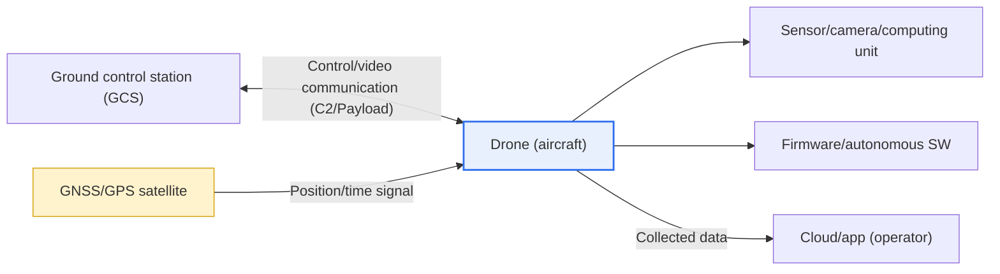
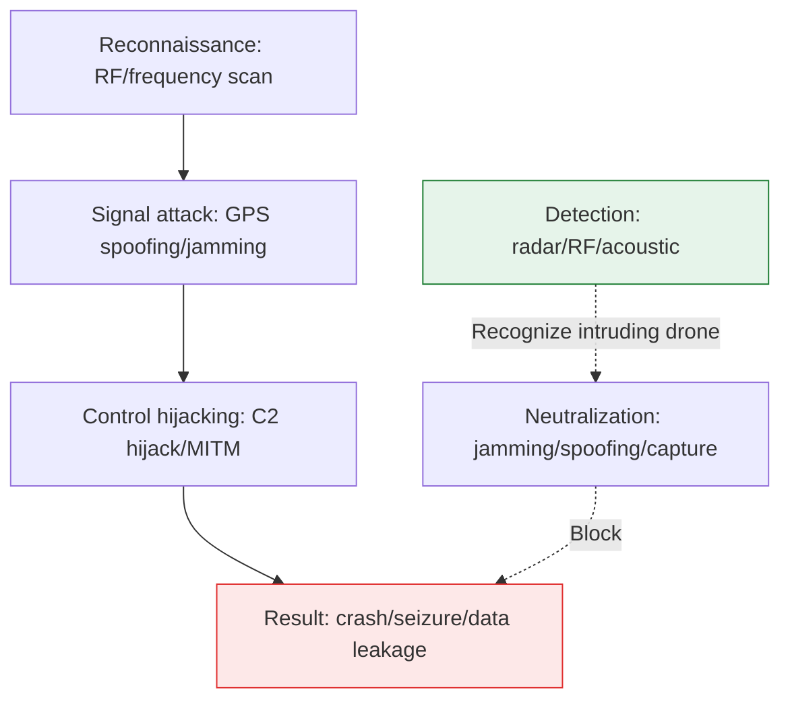

# Drone Security Threats and Countermeasures

## 1. Overview

### A. Definition

> A **drone (unmanned aerial vehicle, UAV/Drone)** is an aircraft that flies without an onboard pilot, either by remote control or by a pre-programmed/autonomous algorithm. It is a cyber-physical system (CPS) composed of **communication (control and video links)** with a ground control station (GCS), satellite-based **navigation (GNSS/GPS)**, **sensors** for attitude and environment recognition, and the **flight software (firmware)** that controls all of these.

Drones are rapidly spreading into logistics delivery, aerial photography, precision agriculture, facility inspection, disaster monitoring, and military reconnaissance; by Ministry of Land, Infrastructure and Transport statistics, the number of registered drones and licensed operators in Korea has grown greatly every year. As fast as they spread, the attack surface has widened, and drone security has emerged as a matter of **public safety** beyond mere information protection.

The fundamental reason drone security differs from general IT security is that "**a cyber threat converts directly into physical harm**." Intrusion into a traditional IT system often stops at logical harm such as data leakage or service disruption, but a drone is a physical object of several to tens of kilograms flying through the sky. A drone whose control has been seized crashes or collides with people, buildings, or aircraft, causing immediate loss of life and property. That is, a drone's threat model must include **safety** as the top requirement, in addition to the CIA triad of confidentiality, integrity, and availability.

Another particularity is the duality that a drone is "**both a target of attack and a weapon of attack**." On the one hand, the drone itself becomes the target of hacking and jamming; on the other hand, a legitimate drone is abused as a tool for illegal photography, physical intrusion, drug smuggling, VIP threats, and reconnaissance of key facilities. The 2018 incident in which the UK's Gatwick Airport was closed for about 36 hours by the appearance of an unidentified drone, affecting 140,000 passengers' flights, and the 2018 incident in Venezuela in which a drone carrying explosives detonated over a state event, symbolically show the impact when a drone is used as a weapon. Therefore, drone security has a dual structure in that one must design both "defense to protect one's own drone (Blue)" and "countermeasures to stop intruding drones (Anti-Drone)."

### B. Components and Threat Points

A drone system is broadly divided into the ground control station (GCS), the wireless communication links (C2 and payload link), the GNSS navigation signal, the onboard sensors/camera/computing unit, and the firmware/apps that drive them. The problem is that **each and every one of these elements is an independent attack surface**. The communication links mostly use open ISM bands such as 2.4 GHz and 5.8 GHz, and a substantial portion of consumer drones use unencrypted control signals or only weak authentication. Civilian GPS (L1 C/A) is a public-specification signal with a very weak power (received power around -125 dBm), so it is structurally vulnerable to forgery and disruption. Because of this "inherent vulnerability," drone security requires integrated design across all layers, beyond defending individual elements.

## 2. Drone System Components and Threat-Point Concept Map

First, survey with an overall structure diagram what elements a drone consists of and where each element is attacked. The ground control station and the drone exchange control and video bidirectionally over wireless, the drone one-directionally receives position signals from GPS satellites, and internally the sensors and firmware perform autonomous judgment. Each arrow (path) and node (component) becomes a threat point.

Once you grasp that the overall structure divides into the four axes of "communication, navigation, computing, and data," next you must view from a process perspective how an actual attack unfolds in temporal order, so you can decide where to intervene. The diagram below shows the kill chain in which an attacker starts with reconnaissance and proceeds to signal disruption, control hijacking, and data leakage, along with the flow in which the defense side intervenes with detection and neutralization.

## 3. Security Threats in Detail

Because drone threats are clearly distinguished by component, you must understand "why that threat succeeds" at the principle level to design a defense.

### A. GPS Spoofing/Jamming (Navigation Layer)

The most symbolic threat is **spoofing and jamming** aimed at GNSS. Jamming radiates strong noise into the GPS band to bury the normal satellite signal, so the drone loses its position and falls into failure modes such as hovering, return-to-home (RTH), or forced landing. Spoofing is more cunning. It creates a forged signal slightly stronger than the actual satellites so the drone mistakes it for genuine, then slowly moves the forged signal's coordinates to lead the drone to a place the operator did not intend. The 2011 incident in which Iran claimed to have lured and captured the US RQ-170 reconnaissance drone by spoofing, and the 2012 field experiment by a University of Texas team that spoofed a civilian drone with equipment costing about USD 1,000 to change its course, show that this threat is not theoretical.

The fundamental reason this threat succeeds is that the civilian GPS signal is a **public specification with no means of authentication** and its received power is extremely weak. Because the signal has no signature, the drone has no way to verify "whether this signal came from a genuine satellite," and a transmitter near the ground can easily create a much stronger signal than the satellites. Therefore, the navigation-layer defense must be oriented toward breaking "blind faith in a single signal source."

### B. Communication Hijacking / Man-in-the-Middle Attack (Communication Layer)

**Communication hijacking** is an attack that seizes the control (C2) channel between the ground station and the drone, or interposes as a man-in-the-middle (MITM) to forge and alter commands. If a consumer drone's control protocol uses only weak authentication or has poor session-key management, an attacker can seize control using a replay attack or a protocol vulnerability. In fact, demonstrations (e.g., 'SkyJack'-type attacks) of seizing a drone via authentication bypass on the Wi-Fi-based control of certain commercial drones have been made public. The background of this threat is again the structural problem of "an open band + weak encryption," and the countermeasure converges on channel encryption and strong mutual authentication.

### C. Data Leakage and Firmware Tampering (Data/SW Layer)

**Data leakage** is a threat of intercepting the video, flight logs, and position information that a drone captures and collects, at the transmission segment or in storage. For a drone filming facilities or military sites, the leaked video itself can be a national or industrial secret, and even ordinary filming can lead to infringement of personal information and portrait rights. **Firmware tampering** implants malware in the drone's flight software or injects an update whose integrity is not verified, inducing malfunction or a backdoor; it is especially dangerous on airframes without signing or secure boot. Finally, the threat of a legitimate drone itself being **abused as a tool for illegal photography, physical intrusion, or terrorism** is, unlike the previous two layers, hard to stop by "technical defense" alone and requires detection, neutralization, and regulation together.

| Threat | Target layer | Core principle | Actual/representative case |
|---|---|---|---|
| **GPS spoofing/jamming** | Navigation | Manipulate/paralyze position recognition via forgery/noise | 2011 RQ-170, 2012 UT field demo |
| **Communication hijacking** | Communication | Seize C2 channel, MITM, replay | SkyJack-type Wi-Fi seizure demo |
| **Data leakage** | Data | Intercept video/logs at transmission/storage segments | Leaked facility-filming video |
| **Firmware tampering** | SW | Integrity-unverified update, malware | Induce backdoor/malfunction |
| **Drone abuse (weaponization)** | Physical | Illegal use of a legitimate airframe | 2018 Gatwick closure, Venezuela explosives |

## 4. Countermeasures

Countermeasures should be designed as **defense in depth** that corresponds 1:1 to the threat layers, but integrated so that technology, detection, and regulation complement each other.

### A. Defense of the Communication/Navigation/SW Layers (Airframe Perspective)

At the communication layer, **encrypt (AES, etc.) and apply mutual authentication** to both the control (C2) and video links to block hijacking and MITM, and manage a per-session nonce/sequence to prevent replay. At the navigation layer, move beyond sole reliance on GPS by **fusing inertial navigation (INS), visual-inertial odometry (VIO), barometric, and geomagnetic sensors**, and cross-verify the consistency of signals from multiple satellite constellations (GPS, Galileo, BeiDou) to detect spoofing. Anti-spoofing receivers that detect sudden changes in the signal's angle of arrival (AoA) and received power are also being commercialized. At the SW layer, apply **code signing, secure boot, and signed-update verification** to the firmware to guarantee integrity. The common principle of these layered defenses is to "**eliminate a single point of trust and verify with multiple grounds**."

### B. Anti-Drone (Intruding-Drone Perspective)

Separately from protecting one's own airframe, an **anti-drone (C-UAS, Counter-UAS)** system to stop intruding drones is needed. Anti-drone consists of the stages "detect, identify, mitigate." Detection uses radar (RCS-based), RF scanners (control-frequency detection), EO/IR cameras, and acoustic sensors in combination to reduce false alarms, and neutralization divides into jamming that disrupts the control/GPS bands, spoofing that lures with forged signals, physically capturing with a net or capture drone, and directed energy (laser, high-power microwave). However, because jamming at airports or in cities can cause collateral damage to normal communication and navigation, choosing a neutralization means suited to the environment is important.

### C. Regulation and Governance

Because technology alone cannot stop a "weaponized legitimate drone," regulation takes charge of the final layer. **Remote ID**, which requires all drones to broadcast identification information during flight, is central to deterring illegal flight and tracing responsibility after an incident; the US FAA effectively mandated Remote ID over 2023–2024, and the EU (EASA) and domestic regulations are also being organized toward strengthening registration and identification. Combined with this, designation of no-fly zones (around airports, nuclear plants, military facilities), airframe-registration and operator-license systems, and geo-fencing complete the multilayer defense.

| Response layer | Core means | Threat addressed |
|---|---|---|
| **Communication security** | C2/video encryption, mutual authentication, replay prevention | Hijacking, MITM |
| **Navigation security** | INS/VIO fusion, multi-constellation cross-verification, anti-spoofing receiver | GPS spoofing/jamming |
| **SW integrity** | Code signing, secure boot, signed updates | Firmware tampering |
| **Anti-drone (C-UAS)** | Detection (radar/RF/acoustic) + neutralization (jamming/spoofing/capture/DE) | Drone abuse/intrusion |
| **Regulation/governance** | Remote ID, registration/license, no-fly zones, geo-fencing | Weaponization/illegal flight |

## 5. Deep Dive — Standards/Policy Trends and Practical Application

Drone security is an area where technology and regulation co-evolve rapidly. First, the **mandating of identification** is a global trend. The US FAA's Remote ID rule (Part 89) requires remote-ID equipment and broadcast on most registered drones, making it possible to check the identification and location of nearby drones even with a smartphone. The EU is organizing a low-altitude unmanned-aircraft traffic-management (UTM) system called U-space, making identification and geo-awareness requirements. This is the idea of "**putting a license plate on drones too**," structurally lowering the threats that come from anonymity.

Second, the **rapid growth of the anti-drone market**. Since the Gatwick incident, major airports, stadiums, and summit venues began to permanently deploy C-UAS integrating radar + RF + EO/IR, and in Korea too, anti-drone has settled as a standard procedure for protecting nationally important facilities and large events (e.g., summits, large sporting events). Neutralization means are trending from wide-area jamming toward precise spoofing and capture, to reduce urban collateral damage.

Third, the **new horizon of autonomous, swarm, and AI drones**. As the share of autonomous flight grows, an AI security threat is added in the form of **adversarial attacks** targeting recognition models — for example, planting disruptive patterns on signs or terrain to induce misrecognition. As swarm operation increases, one must respond to scenarios in which dozens to hundreds intrude simultaneously, so wide-area, automated response, rather than single-target neutralization, becomes a challenge. In practice, **SW supply-chain security (SBOM, signing)** for the drone SW supply chain (open-source flight-control stacks, component firmware) is also emerging as a new requirement.

## 6. Considerations and Implications

1. **Convergent design of safety and security**: Because a drone is a CPS in which a cyber breach directly leads to a physical accident, do not separate hacking defense from crash/collision prevention; integrate a "fail-safe design" (e.g., safe landing/return on signal loss) together with security requirements.

2. **Elimination of a single point of trust and multiple verification**: The root cause of GPS spoofing and communication hijacking is "reliance on a single signal without verification." An architecture that "cross-verifies with multiple grounds" — INS/VIO/multi-constellation fusion, mutual authentication, code signing — is a core strategy worth the trade-off (increased cost, weight, computation).

3. **Environmental suitability and legal limits of detection/neutralization**: Jamming/spoofing-based neutralization causes collateral damage to normal communication and navigation in cities and airports, and is entangled with permission issues under radio and aviation law. Choose precise means such as capture or directed energy suited to the facility's characteristics (urban/suburban, sensitivity), and secure the legal basis for the neutralization authority in advance.

4. **Preemptive securing of regulation/governance**: Remote ID, registration, licensing, and geo-fencing are the last layer that deters the "weaponized legitimate drone" threat that technical defense cannot reach. Maintain alignment with international standards (FAA Part 89, EU U-space) and put in place responsibility-tracing and data-retention systems for incidents.

5. **A roadmap for future threats (autonomous, swarm, AI)**: Adversarial attacks on autonomous drones, simultaneous swarm intrusion, and SW supply-chain threats are insufficiently addressed by existing countermeasures. AI-model robustness verification, wide-area/automated response systems, and SBOM-based supply-chain security should be set as mid-to-long-term investment tasks.

## References
- FAA, "Remote Identification of Drones (Part 89)" — https://www.faa.gov/uas/getting_started/remote_id
- EASA (EU), "U-space and drone regulations" — https://www.easa.europa.eu/en/domains/civil-drones-rpas
- ENISA, "Cybersecurity threats to drones/UAS" — https://www.enisa.europa.eu/
- NIST, "Cyber-Physical Systems / Secure Boot guidance" — https://www.nist.gov/

---

> **In one line**: A drone is a cyber-physical system that is both a target of GPS spoofing, communication hijacking, data leakage, and firmware tampering, and a tool for illegal photography and intrusion; because a cyber threat leads directly to physical harm, one must integrate in multiple layers *communication/navigation/SW-layer defense + anti-drone (detection/neutralization) + regulation (Remote ID, geo-fencing)* to secure **safety and security together**.
