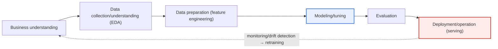
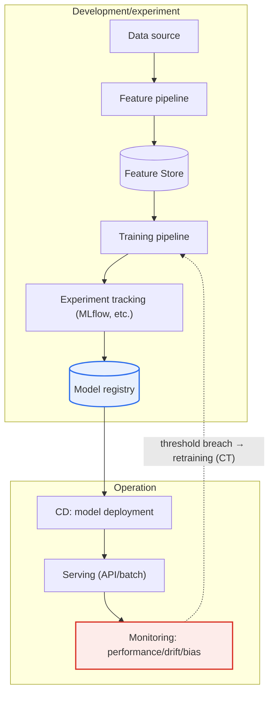

# DSML Projects and MLOps

## 1. Overview

### A. Definition
> **DSML (Data Science & Machine Learning)** is a project that fuses data science and machine learning to solve data-driven problems, and **MLOps (Machine Learning Operations)** is an engineering methodology that automates and standardizes the development-deployment-operation of ML models to turn them into sustainable products.

The reason DSML projects are uniquely difficult is that "**even if the experiment succeeds, it fails in operation**." Even if a data scientist builds a high-accuracy model in a notebook (Jupyter), putting it into an actual service and having it continuously deliver value is a completely different problem. Real data changes over time from the training point (drift), the model must be periodically retrained and redeployed, and performance must be continuously monitored. Bridging this "**gap between research and production (Research-Production Gap)**" is what MLOps does.

Just as DevOps in traditional software development automatically integrated and deployed the single artifact of "code," MLOps **manages the three artifacts of data, model, and code together** to turn a model into a sustainable product. Here a decisive difference arises. General software produces the same result whenever the same code runs, but an ML system's performance changes if the distribution of the input data changes even when the code is identical. That is, since the quality of an ML system depends not only on code but also on **data and learned parameters**, unless all three elements are version-controlled and made reproducible, you cannot even explain "why that result came out back then."

### B. Background and Necessity
As data- and AI-driven decision-making spread into core business such as financial credit scoring, manufacturing anomaly detection, and commerce recommendation, systems that provide continuously trustworthy predictions — not one-off models — were required. However, field surveys often report that a substantial portion of developed ML models are never deployed to actual operation and are shelved. The cause is frequently not algorithmic performance but **the absence of operational elements — data pipelines, environment reproduction, monitoring, and retraining**.

Deploying a model without MLOps produces three problems in sequence. First, a model that fit well right after deployment quietly degrades over time (**model decay**). Second, with no observability system to detect the degradation, the problem is recognized late, usually via user complaints or falling revenue. Third, because the retraining pipeline is manual, response is slow, and a hastily patched model breaks reproducibility and destroys trust. Breaking this vicious cycle and keeping a model as a "**continuously living product**" is MLOps' reason for existence.

### C. Characteristics
MLOps is characterized by (1) **triple version control** of data, model, and code, (2) **pipeline automation** from training to deployment, (3) **continuous monitoring and automatic retraining (CT)** during operation, and (4) **reproducibility and governance** that tracks the lineage of experiments, data, and models. This can be summarized as adding the ML-specific concept of **CT (Continuous Training)** to DevOps' CI/CD.

## 2. The DSML Project Lifecycle

A DSML project is based on CRISP-DM, the standard data-mining methodology, but follows a **cyclical structure** with reinforced deployment and operation. The diagram below shows the overall lifecycle flow as a **closed loop** in which operational results feed back into the initial stage, rather than a straight line where each stage ends once.

In the **business understanding** stage, define the problem to solve and the success criteria. The trap of this stage is confusing data-science metrics (accuracy, F1) with business metrics (conversion rate, amount of churn prevented). For example, a churn-prediction model with 95% accuracy is meaningless if it misses customers who actually churn (low recall). Therefore, you must first agree on whether the problem is defined as prediction, classification, or ranking, and which error is more fatal, so subsequent stages do not waver.

In the **data collection/understanding (EDA)** stage, secure data and grasp its distribution, missingness, outliers, and correlations through exploratory analysis. In practical experience, 60–80% of a DSML project's effort concentrates in this stage and the next data-preparation stage. Because the quality and representativeness of the data determine the upper bound of model performance, this is the background for the recent emphasis on the **data-centric AI** perspective — that securing "good data" takes priority over flashy algorithms.

In the **data preparation** stage, perform cleaning, missing-value handling, feature engineering, and training/validation/test splitting. The most common failure here is **data leakage**, a phenomenon in which information unknown at test time (e.g., future values, variables derived from the answer) mixes into training features so that only the validation performance comes out unrealistically high. To prevent this, normalization statistics must be computed only from the training set and applied to validation and operation.

In the **modeling/evaluation** stage, select an algorithm and tune hyperparameters, then verify not only performance but also business value, fairness, and explainability. In the final **deployment/operation** stage, serve the model and monitor performance, and when drift is detected, return again to the business-understanding stage to repeat the cycle.

| Stage | Core activities | Representative artifacts |
|---|---|---|
| **Business understanding** | Problem definition, agree on success criteria/metrics | Project charter, KPI definition |
| **Data collection/understanding** | Secure data, EDA, quality diagnosis | Data catalog, EDA report |
| **Data preparation** | Cleaning, feature engineering, splitting | Feature Store |
| **Modeling** | Algorithm selection, training, tuning | Experiment logs, candidate models |
| **Evaluation** | Verify performance, business value, fairness | Evaluation report, model card |
| **Deployment/operation** | Serving, monitoring, retraining | Serving API, dashboard |

## 3. MLOps Architecture and Components

> MLOps extends DevOps to ML: it **version-controls the three elements of data, model, and code and automates training-deployment-monitoring**, and its essential differentiator is the addition of **continuous training (CT)**, which retrains the model with operational data.

The architecture diagram below shows the MLOps automation path that starts from the data source, passes through pipeline, registry, serving, and monitoring, and feeds back into retraining.

**Pipeline automation** binds data collection → feature generation → training → evaluation → deployment into a single re-runnable workflow. Moving away from manually running notebooks, the pipeline is automatically triggered when code is committed, new data arrives, or performance crosses a threshold. This leaves "who trained with what data and when" in code, securing reproducibility and audit trails.

The **Feature Store** prevents **training-serving skew**, in which the features used in training and the features computed at serving time diverge. A representative case is when training used a "last-7-day purchase amount" aggregated in batch, but the real-time computation logic at serving differs slightly, so offline performance is good but online performance collapses. Defining and reusing features centrally structurally reduces this skew.

The **model registry** manages the version, metadata, and lineage of a trained model (which data, code, and hyperparameters it was made with) and controls promotion from staging to production. **Monitoring** watches not only prediction performance (accuracy, latency) but also changes in input-data distribution (**data drift**) and changes in the input-output relationship (**concept drift**), as well as bias. When monitoring results cross a threshold, the retraining pipeline (CT) operates and the cycle is completed.

| Component | Role | Example tools |
|---|---|---|
| **CI/CD/CT** | Integrate/deploy code, data, model + continuous training | Jenkins, GitHub Actions, Kubeflow |
| **Pipeline orchestration** | Automate data → training → deployment | Kubeflow Pipelines, Airflow |
| **Feature Store** | Feature definition/reuse, skew prevention | Feast, Vertex Feature Store |
| **Experiment tracking** | Record metrics, parameters, artifacts | MLflow, W&B |
| **Model registry** | Manage version, lineage, promotion | MLflow Registry |
| **Monitoring** | Watch performance, drift, bias | Evidently, Prometheus |

## 4. MLOps Maturity Levels and Cases

Google Cloud's MLOps practitioner guide divides the automation level into **three levels (Level 0–2)**. This maturity model is frequently cited in that it is a practical yardstick for diagnosing where an organization is and what to put in place next.

**Level 0 (manual process)** has data preparation, training, and validation all manual, with a model built by data scientists handed off to the operations team. Retraining is infrequent (once every few months) and there is a large disconnect between deployments. It is sufficient for a small PoC or a domain where predictions do not change often, but is vulnerable to model decay in an environment where data changes rapidly.

**Level 1 (ML pipeline automation)** automates the training pipeline so that when new data arrives, the model is automatically retrained and validated (CT introduced). Here a Feature Store and a metadata store are introduced to handle training-serving skew and reproducibility issues. **Level 2 (CI/CD pipeline automation)** manages the pipeline itself as code, so that committing a new idea (preprocessing/model-architecture change) as code automatically builds, tests, and deploys the pipeline — a fully automated stage. It is the level targeted by organizations that must rapidly experiment with and deploy many models at scale.

As industry cases, the recommendation models of streaming/video services such as Netflix and YouTube require frequent retraining (CT) and A/B-test-based deployment because user behavior changes moment to moment. In manufacturing, anomaly-detection models trained on equipment-sensor data shift in distribution with season and equipment aging, so drift monitoring and automatic retraining have become core to predictive-maintenance (PdM) systems. Financial credit-scoring models require **explainability and reproducibility** for regulatory reasons, so MLOps governance elements such as model cards and lineage tracking are especially emphasized.

### The Difference Between DevOps and MLOps
To understand MLOps accurately, one must note the difference from DevOps. DevOps manages a single target, "code," and its testing is clear via unit and integration tests, but MLOps handles the three axes of code, data, and model together and adds new test stages of "data validation" and "model validation." Above all, **CT (continuous training)**, which DevOps lacks, is the core. Because data keeps changing even after deployment, situations recur in which the model must be retrained and redeployed even without changing the code.

| Aspect | DevOps | MLOps |
|---|---|---|
| **Management target** | Code | Code + data + model |
| **Version control** | Source code | Source + dataset + model/parameters |
| **Testing** | Unit/integration tests | + data validation + model validation (performance/fairness) |
| **Pipeline** | CI/CD | CI/CD + **CT (continuous training)** |
| **Cause of performance change** | Code change | Code change **+ data-distribution change (drift)** |

The implication of this difference is that even an existing DevOps organization cannot stably operate an ML system unless it newly puts in place data/model version control and a drift-response system. That is, MLOps is not a simple extension of DevOps but requires a separate operational capability for handling the uncertainty of data.

## 5. Considerations and Implications (Professional Engineer's Perspective)

1. **Data-drift detection and retraining automation determine operational success or failure.** Because performance quietly collapses when real data diverges from the training point, you must design a CT system that watches distribution changes with statistical distances (PSI, KL-divergence, etc.) and retrains on threshold breaches. The key here is adjusting the trade-off between retraining frequency and cost to match the domain's rate of change.
2. **Reproducibility is the foundation of trust and regulatory response.** Version-control data, model, and code together and track experiments so a particular prediction can be reproduced and audited after the fact. In heavily regulated domains such as finance and healthcare, this is not a choice but a compliance requirement.
3. **Training-serving skew and data leakage must be structurally blocked.** Unify feature definitions with a Feature Store, and embed in the pipeline the discipline of computing normalization statistics only from the training set, preventing the "good offline, bad online" incident.
4. **Staged advancement matched to MLOps maturity is realistic.** Rather than over-investing to target Level 2 from the start, incrementally adopt Level 0 → 1 → 2 in line with the organization's capability, number of models, and rate of change, and expand automation from the point where ROI is confirmed.
5. **Linkage with Responsible AI is essential.** Include not only performance but also bias/fairness metrics in monitoring, and specify limits and intended use with model cards to combine governance/ethics requirements with MLOps.

## References
- Google Cloud, "MLOps: Continuous delivery and automation pipelines in machine learning": https://docs.cloud.google.com/architecture/mlops-continuous-delivery-and-automation-pipelines-in-machine-learning
- Google Cloud, "Practitioners Guide to MLOps (Whitepaper)": https://cloud.google.com/resources/mlops-whitepaper

---

> **In one line**: A DSML project goes through the cyclical lifecycle of *business understanding → data → modeling → deployment/operation*, and the core of MLOps is triple version control of data, model, and code, and taming model decay, training-serving skew, and reproducibility problems through pipeline automation, monitoring, and continuous training (CT) to turn a model into a sustainable product.
