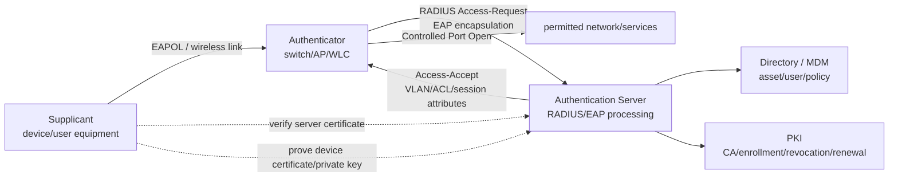
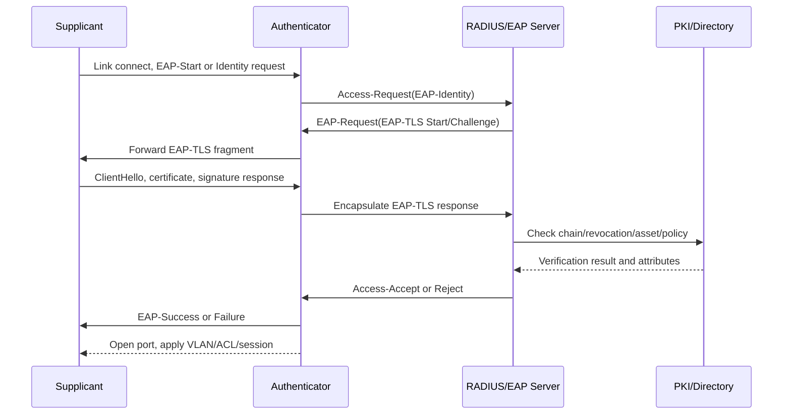

# EAP-TLS (Extensible Authentication Protocol-Transport Layer Security) Network Access Authentication

## 1. Overview

> **EAP-TLS** is an authentication method that, within the EAP (Extensible Authentication Protocol) framework, uses the TLS handshake and X.509 certificates to mutually authenticate a device and an authentication server, and derives the key material needed for network access from a successful authentication.

In enterprise wireless LAN, wired 802.1X, remote access, and industrial device access, it is hard to trust a device's identity with a simple shared password alone. As users and devices multiply, the operational burden of distributing, changing, and revoking passwords grows, and if the same password is reused across many devices, the leak of a single device can lead to a compromise of the entire network. EAP-TLS separates this problem with per-device certificates and private keys.

EAP itself is an extensible framework that carries various authentication methods; it is not a single cryptographic protocol that provides all security properties on its own. EAP-TLS is the form in which TLS is chosen as the authentication method within that framework, and it carries TLS records and handshake messages inside EAP messages. Therefore, one must understand EAP, link-layer authentication, TLS, RADIUS, and PKI individually to explain the whole operation.

A typical 802.1X environment has three roles. The **Supplicant** is the laptop, smartphone, or IoT device requesting access; the **Authenticator** is the device that controls the access port, such as a switch or wireless LAN controller; and the **Authentication Server** is usually an authentication/policy server linked with a RADIUS server. Before authentication the port is in a restricted state, and only after successful authentication are the permitted VLAN or security policy applied.

The core value of EAP-TLS is that a device proves possession of its private key without sending a password over the network. The server checks whether the certificate is from a trusted certificate authority and whether its validity period, usage, and revocation status are appropriate, and the device also verifies the server's certificate. Because both sides must pass verification, one can build a structure more resistant to phishing APs and forged authentication servers than one-way authentication in which only the server trusts the device.

However, having a certificate does not automatically make things secure. If the issuance policy is loose, the private key is stored in a plaintext file, or a revoked certificate is still accepted, EAP-TLS's advantages disappear. Therefore, in a professional engineer's answer, one must present not only the protocol procedure but also the PKI lifecycle, device onboarding, exception handling, operational metrics, and incident response as a single control system.

## 2. Components and Overall Architecture

### A. Roles and Trust Boundaries

The Supplicant holds its own certificate and private key but does not transmit the private key itself to the other party. It proves possession of the private key via TLS signature verification, and putting the key in the OS's secure store, a TPM, or a secure element makes authentication hard to reproduce merely by copying a file.

The Authenticator, rather than making the authentication decision itself, is an enforcement point that forwards EAP messages and opens or closes the port. A wireless AP or switch applies the VLAN, ACL, session time, and quarantine status by receiving policy from the authentication server, in order to separate authentication from network enforcement.

The Authentication Server verifies the certificate chain and policy and makes an access decision by combining attributes such as user, device, group, location, and time. In real environments, a RADIUS server processes EAP and connects with a directory, MDM, CMDB, and PKI to match the certificate subject with asset information.

PKI consists of the certificate-issuing authority, intermediate CAs, trust anchors, and enrollment/renewal/revocation functions. If you design the authentication server and devices to unconditionally trust the same root CA, test certificates or certificates for other purposes may be accepted, so you must use purpose-specific CAs together with EKU and SAN policies.

### B. Overall Structure Diagram

In this structure, the TLS logic between the device and the authentication server resides on the RADIUS server, but the device does not directly establish a TCP connection with RADIUS. Because the Authenticator acts as a relay between the link-layer EAPOL and the backend RADIUS, the same authentication policy can be reused whether the medium is wireless or wired.

EAPOL is the link-layer transport means between the device and the Authenticator. RADIUS is the policy/authentication transport means between the Authenticator and the authentication server. Confusing the two leads to wrongly explaining that the switch performs certificate verification directly, and in fault analysis one fails to separate the wireless segment from the backend segment.

### C. Core Component Table

| Component | Main responsibility | Impact of failure | Management point |
|---|---|---|---|
| Supplicant | Certificate selection, TLS response, server verification | Device access failure | Profile distribution, key protection, logs |
| Authenticator | EAPOL relay, port control | Access impossible even if authentication succeeds | RADIUS reachability, port state, time |
| RADIUS/EAP server | TLS/certificate/policy verification | Full or partial authentication failure | HA, policy order, audit logs |
| PKI/CA | Issuance/renewal/revocation | New issuance/verification failure | Root protection, CRL/OCSP, expiry |
| Directory/MDM | Subject/asset/group linkage | Wrong permissions/onboarding failure | Synchronization, ownership, exceptions |
| Network policy | Apply VLAN/ACL/session | Excessive permissions or quarantine | Least privilege, policy version, verification |

The components in the table are not in a substitution relationship but a chained chain of trust. For example, even if the RADIUS server's availability is high, if the CA issues an expired certificate, a new device cannot connect. Conversely, even if authentication succeeds, if the Authenticator does not understand the VLAN attribute of the Access-Accept, the device may be placed on the wrong network.

## 3. EAP-TLS Authentication Principle and Message Flow

### A. Pre-Authentication Preparation

First, the organization defines a certificate policy. It must set the device certificate's subject identifier, SAN format, Key Usage, Extended Key Usage, key length and algorithm, maximum validity period, and renewal timing. Because the practice of identifying a device by the certificate's CN string alone can create name-collision and reuse problems, use a stable device ID together with directory attributes.

Second, distribute the server CA to trust and the client-certificate profile to devices. MDM, GPO, auto-enrollment, and provisioning at manufacture can be methods. What matters is not indiscriminately adding the trust CA OS-wide but restricting the server name and permitted CAs in the EAP profile.

Third, configure the RADIUS server with the device CA to trust, the permitted EKU, certificate-revocation checking, and network policies by user/device group. Because a valid certificate signature and a business access right are different judgments, additionally evaluate the group, asset state, and risk level after authentication succeeds.

### B. Step-by-Step Flow

1. When a device connects to an AP or switch, the Authenticator does not yet open the controlled port.
2. The Authenticator sends EAP-Request/Identity to request the device identifier or an anonymized identifier.
3. The device returns EAP-Response/Identity, and the Authenticator puts it into a RADIUS Access-Request.
4. The RADIUS server returns an EAP-Request selecting the EAP-TLS method and begins the TLS negotiation.
5. The device and server negotiate the TLS version, cipher suite, and key-exchange parameters and exchange certificate-verification materials.
6. The server inspects the device certificate's chain, usage, expiry, and revocation status, and the device inspects the server certificate.
7. The device signs with the private key corresponding to the certificate to prove possession of the private key.
8. Once TLS creates a shared secret, the EAP method derives session key material for use in link protection.
9. The RADIUS server conveys the authentication result and policy attributes such as VLAN/ACL/session limits via Access-Accept or Access-Reject.
10. On success the Authenticator opens the controlled port; on failure it applies one of block, quarantine, or guest policy.

Actual messages may not fit the MTU, so EAP-TLS data is fragmented into multiple EAP packets. EAP-TLS flags such as Start, Length Included, and More fragments, and total-length handling, are key to interoperability. If an authentication failure occurs only with certificates of a certain size, one should check fragmentation, reassembly, and timeouts before the certificate content.

### C. The Meaning of Keys and Certificates

EAP-TLS uses the pair of the certificate's public key and the private key the device holds. The server does not conclude that the device is a legitimate owner merely by reading the certificate; the private-key signature verification in the TLS handshake must also succeed. Therefore, even if the certificate file is leaked, if the private key is protected and the revocation procedure works, the scope of damage can be reduced.

The MSK (Master Session Key) derived from a successful authentication is used as input for link-layer protection or wireless-encryption key derivation. The EMSK (Extended Master Session Key) is not an all-purpose key used directly for general application data, but material for additional key derivation that the standard permits. Key material must not be left in application logs or reused for arbitrary encryption.

EAP-TLS based on TLS 1.2 and EAP-TLS based on TLS 1.3 both provide certificate-based mutual authentication, but the handshake-message protection and key schedule differ. Because RFC 9190 defines how to use EAP-TLS with TLS 1.3, the support combination of the device, RADIUS, and network equipment must be tested in advance.

## 4. Build and Operation Procedure

### A. Requirements and Risk Analysis

First, classify the access targets and risks. Corporate laptops, personal smartphones, printers, cameras, and production equipment differ in key-storage capability, renewability, and tolerance for interruption. Putting all devices under the same certificate policy either lowers the overall policy because of a weak device, or, conversely, forces you to give up the security of new devices because of legacy devices.

Next, determine the authentication subject. You must decide whether the model is a user-based certificate, a device-based certificate, or a combined user-and-device authentication. A personal laptop is hard to control against a departed employee's access with device authentication alone, and a shared kiosk is hard to account for device loss with user authentication alone. It is reasonable to have separate certificates and policies by asset grade.

Finally, quantify the business impact of failure. For example, assuming 2,000 corporate devices renew simultaneously at 9 a.m., the momentary load on RADIUS and the CA, DNS/NTP failures, and certificate-distribution delays can all manifest as access failures. You must design not only the normal authentication rate but also renewal peaks and a fallback procedure during failures.

### B. PKI Lifecycle Design

Control issuance in the order of enrollment, identity verification, key generation, certificate signing, and profile distribution. Where possible, generate the private key inside the device and transmit only the CSR so that the CA or enrollment server does not see the private key. Injecting the same private key into multiple devices at the manufacturing stage expands a single leak into mass forgery.

Operate renewal not as a one-off task just before expiry but as a continuous state transition. Attempt renewal from 30 days before the certificate's expiry, and provide a fallback path so that a device unable to connect to the network renews on its next connection. You must clarify whether to permit the previous certificate for a certain period until the new one is verified, and which to select when duplicate certificates exist.

Connect revocation with theft, loss, resignation, asset disposal, and malware infection. Even when using a CRL or OCSP, you must decide how often the authentication server refreshes the revocation status and whether to permit or block on a lookup failure. Always permitting on revocation-lookup failure raises availability but delays blocking stolen devices, while always blocking can turn a CA failure into a full network outage.

### C. Staged Adoption

Stage 1 is the observation stage. Without immediately removing existing PSK or MAB, create an EAP-TLS test SSID/test VLAN to collect the authentication success rate, certificate-chain errors, and unsupported devices.
Stage 2 applies it first to user devices and manageable devices. Distribute profiles via MDM or group policy and prepare error codes the help desk can see.
Stage 3 switches default authentication by department, building, or device group, and manages exception devices with a restricted VLAN and a temporary policy that has an expiry date.
Stage 4, once normal operation is confirmed, abolishes plaintext authentication, shared PSK, and permanent MAB, and periodically re-approves the exception list.

Staged adoption is not an excuse to slow security but a change-management approach that limits the scope of failure. At each stage, do not set the success criterion as a single number like 99% authentication success rate; view together the upper percentiles of authentication delay, new-device onboarding time, the proportion of soon-to-expire certificates, revocation-propagation time, and the number of exception devices.

## 5. Comparison of Methods and Application Cases

### A. Comparing EAP-TLS with Adjacent Methods

EAP-TLS pays the cost of certificate issuance/renewal in exchange for per-device identification and strong mutual authentication. PEAP and EAP-TTLS usually use a server certificate to create a protected tunnel and then carry a password or another authentication method inside, so they can be a transitional alternative for organizations where certificate-based device management is difficult. However, unless the server authentication is properly verified, the risk of entering credentials into a fake AP remains.

PSK is fast in small environments but has a large revocation scope for the shared secret. If one device is seized, all devices using the same key must be replaced. EAP-TLS can narrow the scope with per-device certificate revocation, but incurs the operational complexity of managing the CA, RADIUS, and profiles.

MAB is a fallback method that uses the MAC address as an identifier to accommodate devices with limited authentication capability. Because a MAC address can be forged and is not a credential-level proof of identity, MAB must not be described as equivalent authentication to EAP-TLS. MAB devices must limit risk by combining a quarantine VLAN, destination ACLs, short sessions, and asset registration.

| Criterion | EAP-TLS | PEAP/EAP-TTLS | PSK | MAB |
|---|---|---|---|---|
| Main credential | Device/server certificate and private key | Server certificate and inner authentication | Shared secret | MAC address |
| Mutual authentication | Possible and the common design | Varies by inner method | Hard to distinguish subjects who know the key | Effectively none |
| Per-device revocation | Easy | Depends on account/profile policy | Large key-replacement scope | Address blocking can be bypassed |
| Build difficulty | Requires PKI/profiles | Requires server certificate/inner auth | Low | Low |
| Suitable environment | Managed devices/high-security networks | Transitional/legacy devices | Small/restricted networks | Restricted accommodation of EAP-unsupported devices |

Turning the differences into selection criteria: the more the environment has many assets, allows certificate automation, and needs individual revocation on compromise, the greater the benefit of EAP-TLS. Conversely, if there are many low-cost sensors that cannot store certificates, rather than forcibly applying EAP-TLS, one should present device-replacement plans and compensating controls including isolation and monitoring.

### B. Enterprise Wireless/Wired Case

Assume a corporate wireless network used by 1,200 employees, issuing one certificate per employee laptop. When an employee resigns, not only deactivate the directory account but also revoke the device certificate and remove the profile from MDM. After successful authentication, grant the general business VLAN, and apply a restricted VLAN to devices with a low security posture.

In wired offices, 802.1X can be applied to switch ports. For devices with long replacement cycles, such as docking stations, conference-room equipment, and printers, check whether they support EAP-TLS and place only unsupported devices under a MAB exception. In the switch configuration of exception ports, record the permitted destinations and an expiry date together so they do not solidify into permanent bypasses.

The operational metric of this case is not simple access success rate. Manage on a dashboard the proportion of weekly authentication failures due to certificate expiry, the proportion of server-name mismatches, RADIUS response delay, the growth rate of MAB exceptions, the time from a loss report to revocation propagation, and the number of unauthorized-AP detections.

### C. IoT/OT Case

Assume 300 sensors in a factory connect to the production network wirelessly. If a sensor supports a TPM or a secure key store, use a per-device EAP-TLS certificate, and on the production network apply ACLs so that each sensor accesses only its permitted broker and time-synchronization server. Even if a sensor authenticates successfully, it must not be allowed to access a database or management console.

If a legacy PLC does not support EAP-TLS, rather than leaving that port open with MAB indefinitely, combine asset identification, physical-port pinning, minimization of permitted destinations, temporary permission during maintenance windows, and packet-anomaly detection. In the long term, review a segment transition in which a gateway takes charge of authentication and the PLC is placed behind the gateway.

In OT, because an authentication-server failure can lead to a production stoppage, you must separately verify the permitted time for cached authentication results, an emergency operation VLAN, a manual approval procedure, and a safe-stop procedure. It is the professional engineer's role to reconcile the security team's default-deny principle with the production team's availability requirements through documented risk acceptance.

## 6. Deep Dive: TLS 1.3 Transition and Zero-Trust Linkage

RFC 5216 defines the EAP-TLS authentication method, and RFC 9190 defines EAP-TLS 1.3 for use with TLS 1.3. Transitioning to TLS 1.3 is not simply a matter of raising the server's TLS version setting. EAP-message encapsulation, certificate selection, key derivation, fragmentation, retransmission, and the device's server-name verification are all affected by the implementation combination.

Because TLS 1.3 differs from earlier versions in the protection timing of the handshake and the key schedule, you must manage the authentication server, wireless controller, switch, OS supplicant, and certificate profiles with a compatibility matrix. Test items must include not only normal authentication but also server-certificate renewal, device-certificate renewal, a revoked certificate, incorrect time, a large certificate chain, packet fragmentation, RADIUS retries, and recovery after a server failure.

Adopting EAP-TLS based on TLS 1.3 does not mean you can immediately cut off TLS 1.2 support either. If you permit a transitional version for older devices, document the permitted scope and end date, and you can differentially control sessions authenticated with the lower version via a separate VLAN or restricted ACL. Security policy should be staged based on per-asset support status and residual risk, rather than "latest if possible."

From a zero-trust perspective, EAP-TLS is a foundational control that provides strong device identity at the moment of entering the network. But trusting an authenticated device across the entire network is not zero trust. You must continuously evaluate the certificate subject, user session, device security posture, destination service, and data classification, and connect the authentication result with dynamic ACLs, micro-segmentation, and application authorization.

For example, even a developer laptop with a valid certificate may be allowed to access the source repository but blocked from the production database if its patch level is low or it connects from an abnormal location. Here EAP-TLS is evidence of device identity, and the MDM's security posture and the application token are additional attributes. It is important to separate the responsibilities and renewal cycles of the different pieces of evidence and make them auditable.

## 7. Considerations and Implications

### A. PKI Operability and Recoverability

The certificate-issuance system is not an accessory function of network authentication but a core availability component. You must design offline protection of the root CA, redundancy of intermediate CAs, RADIUS redundancy, CRL/OCSP distribution points, and backup-recovery rehearsals together. Also specify a policy for whether to maintain existing sessions or halt new connections during a CA failure.

### B. Private-Key Protection and Device Trustworthiness

Using only private keys that can be exported to the file system increases the risk of certificate copying and malware theft. Choose a protection means suited to the device's characteristics — TPM, Secure Enclave, smart card, HSM — and adjust the user experience of no-export keys and PIN/biometric authentication. Do not place a device whose protection level cannot be confirmed in a high-trust VLAN.

### C. Accuracy of Certificate-Verification Policy

A simple policy that checks only the root CA can permit certificates for other purposes. Verify the issuer, chain, EKU, SAN, validity period, revocation status, minimum cryptographic algorithm, and server name together. In particular, if the client does not verify the server certificate, EAP-TLS's mutual-authentication effect diminishes, so the per-OS profiles must be checked with actual packets and logs.

### D. Exception and Legacy Management

Exceptions for EAP-TLS-unsupported devices may be unavoidable, but without a roadmap to reduce the number of exceptions and compensating controls, the weakest path becomes the standard path. Record for each exception the asset owner, reason, permitted scope, expiry date, and replacement plan, and re-approve monthly. Not permitting MAB indefinitely as a convenience feature is key.

### E. Observability and Incident Response

Correlating the logs of RADIUS, Authenticator, supplicant, and PKI lets you break down a simple "Wi-Fi doesn't work" into certificate expiry, server-name mismatch, revocation-lookup failure, or policy denial. Leave the certificate serial number and asset identifier in logs, but do not leave personal information or key material. Detect a spike in failure rate, use of the same certificate from multiple locations, and abnormal retries as compromise indicators.

### F. Performance and User Experience

If the certificate chain is long or the RADIUS round trips are many, the initial connection time can grow. Test large-scale reconnection scenarios and roaming scenarios separately, and adjust the authentication-server cache, load balancing, appropriate timeouts, and retry intervals. Because a design that makes users repeatedly ignore certificate warnings weakens security, provide automatic recovery and guidance without hiding the cause of errors.

### G. The Connective Structure of a Professional Engineer's Answer

In an answer, do not end EAP-TLS simply as "a method that uses certificates," but develop it in the flow of requirements analysis → PKI design → EAPOL/RADIUS architecture → TLS/certificate verification → policy enforcement → operational metrics → exception/incident response. In comparison questions, do not list only security, but explain certificate-operation cost, legacy compatibility, revocation scope, and the availability trade-off.

## References

- [RFC 5216: The EAP-TLS Authentication Protocol](https://datatracker.ietf.org/doc/rfc5216/)
- [RFC 9190: EAP-TLS 1.3](https://www.rfc-editor.org/rfc/rfc9190.html)
- [RFC 3748: Extensible Authentication Protocol](https://www.rfc-editor.org/rfc/rfc3748.html)
- [RFC 9525: Service Identity in TLS](https://www.rfc-editor.org/rfc/rfc9525.html)
- [IEEE 802.1X-2020 overview](https://1.ieee802.org/security/802-1x/)

---

> **In one line**: EAP-TLS individualizes 802.1X network access through PKI-based device/server mutual authentication, but its true security effect is completed only when the certificate lifecycle, key protection, policy enforcement, and exception control are operated together.
