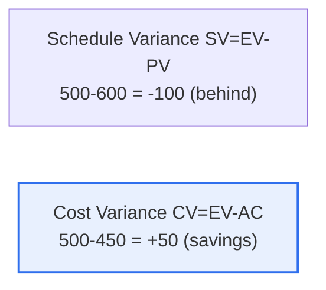

# Earned Value Management (EVM)

## 1. Overview

### A. Definition
> **EVM** is a performance management technique that **integrates a project's schedule and cost performance into three values—Planned Value (PV), Actual Cost (AC), and Earned Value (EV)**—to objectively analyze progress and forecast the completion point.

The fundamental reason EVM is so powerful is that it looks at "**not how much money was spent, but whether the results delivered matched what was spent**." Simply knowing that "half the budget has been spent" tells you nothing about the project's state. If half the budget was spent and half the work completed, all is well; but if half was spent and only 30% completed, it is a crisis. EVM measures this "actual performance" through the concept of **Earned Value (EV)**. EV is "the planned value of the work actually completed so far." Comparing it with Planned Value (PV) and Actual Cost (AC) reveals three things at a glance: whether less has been completed than planned (schedule), whether more has been spent than planned (cost), and, at this trend, when and at what cost the project will finish (forecast). In other words, unlike traditional methods that viewed schedule and cost separately, EVM integrates the two into a single performance indicator to diagnose project health early. This allows problems to be found and addressed before it is too late.

### B. The Three Basic Values
| Value | Meaning |
|---|---|
| **PV (Planned Value)** | Budget of the planned work (planned value) |
| **EV (Earned Value)** | Planned value of the work actually completed |
| **AC (Actual Cost)** | Cost actually incurred |

## 2. Analysis Metrics and a Worked Example

Let us calculate using the given example (EV=500, PV=600, AC=450).

| Metric | Calculation | Result | Interpretation |
|---|---|---|---|
| **SV (Schedule Variance)** | EV−PV = 500−600 | **−100** | Negative → **behind schedule** |
| **CV (Cost Variance)** | EV−AC = 500−450 | **+50** | Positive → **cost savings** |
| **SPI (Schedule Performance Index)** | EV/PV = 500/600 | **0.83** | <1 → slower than planned |
| **CPI (Cost Performance Index)** | EV/AC = 500/450 | **1.11** | >1 → more efficient than budget |

**Risk interpretation**: This project is spending less than planned on cost (CV +50, CPI 1.11), but is **behind schedule** (SV −100, SPI 0.83). In other words, although there is budget headroom, slow progress is the main risk. If the schedule delay continues, the deadline may be missed, and if additional resources are poured in to recover, even the cost advantage could disappear.

## 3. Responses to Negative Risks (Threats)

For the threat of schedule delay, risk response strategies (avoid, transfer, mitigate, accept) can be applied. [[it-project-risk-response]]

| Strategy | Example applied to schedule/cost |
|---|---|
| **Avoid** | Adjust or remove the delay-causing task or scope to eliminate the cause of delay itself |
| **Transfer** | Hand some work to a specialized outsourcer to transfer the schedule risk (but cost↑) |
| **Mitigate** | Reduce delay through schedule compression (Crashing: add resources) or Fast Tracking (parallelization) |
| **Accept** | Absorb minor delays with reserve (buffer) schedule |

For example, a realistic mitigation is to use the remaining cost headroom (CPI 1.11) to add personnel via **schedule compression (Crashing)** to recover the delay, or to shorten the schedule via **Fast Tracking**, which parallelizes predecessor and successor tasks.

## 4. Considerations and Implications

1. **Its value as an early-warning tool** is great. EVM surfaces problems early as quantitative indicators so they can be addressed before it is too late, making it especially useful for large, long-term projects.
2. **Accuracy of EV measurement is a prerequisite.** If progress (EV) is estimated inaccurately, all analysis is distorted, so clear completion criteria (WBS, milestones) and objective progress measurement are essential.
3. **Forecasting (EAC) supports decision-making.** Using CPI and SPI, one forecasts the total cost at completion (EAC) and the expected completion date, providing a basis for proactive decisions such as revising the plan or reallocating resources.

---

> **In one line**: EVM is a technique that *integrally measures schedule and cost performance through PV, EV, and AC*; in the example (EV500, PV600, AC450) it diagnoses SV−100 (behind schedule) and CV+50 (cost savings), responding to the delay threat with mitigation strategies such as schedule compression and Fast Tracking.
