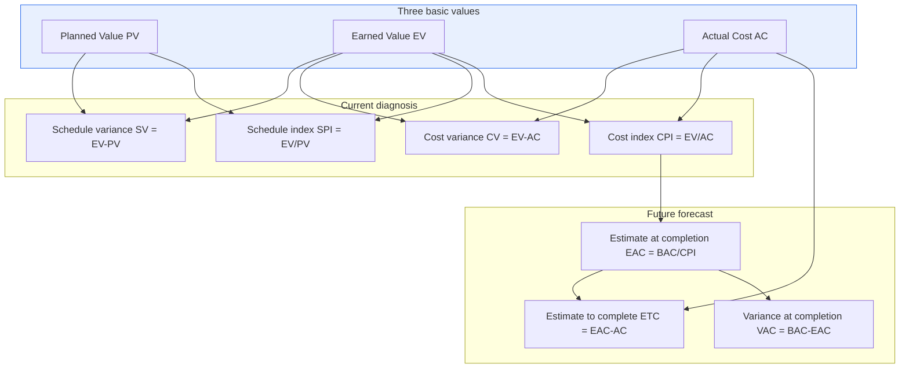
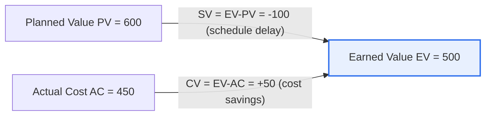

# Earned Value Management (EVM)

## 1. Overview

### A. Definition

> **EVM (Earned Value Management)** is a quantitative performance management technique that **integrates the measurement of a project's schedule and cost performance into three monetary values — Planned Value (PV), Actual Cost (AC) and Earned Value (EV)** — to objectively analyze progress and forecast the completion date and completion cost. The PMBOK treats it as a key technique linking integration management, schedule management and cost management.

The fundamental reason EVM is powerful is that it **looks not at 'how much money was spent' but at 'whether performance matched what was spent'**. Traditional management judged a project by the information "50% of the budget has been spent," but this number alone does not reveal the project's status. If half the budget was spent and half the work completed, that is normal; but if half was spent and only 30% completed, it is a serious crisis. In other words, viewing 'expenditure' and 'completion' separately obscures the project's true state of health.

EVM monetizes this 'actual performance' through the concept of **Earned Value (EV)**. EV is 'the value of the work actually completed so far, converted at the budget of the time of planning.' Comparing EV with Planned Value (PV) reveals schedule status, and comparing it with Actual Cost (AC) reveals cost status. The key is that by **converting schedule and cost into the same monetary unit**, the two axes previously managed separately are diagnosed simultaneously on a single coordinate system. As a result, compound states such as "behind schedule but under cost" or "within budget but progress is sluggish" can be grasped in one picture, enabling early response before problems grow larger.

### B. Background and Need

The roots of EVM lie in the large weapon system acquisition programs of the U.S. Department of Defense (DoD) in the 1960s. In mega-programs involving multiple years and organizations, there was a pressing need to jointly oversee "is the budget being spent as planned, and is that much actually being built?"; this was institutionalized as the Cost/Schedule Control Systems Criteria (C/SCSC) and later developed into today's EVM (ANSI/EIA-748 standard). In other words, EVM was born to solve the problem that 'expenditure tracking' and 'progress management' operated separately, so projects recognized crises only late.

This need remains valid today. The larger and longer the project, the less visible its progress, making it easy to fall into the '90% complete trap' (the phenomenon where the last 10% consumes half the total time). EVM is needed because it quantifies progress in monetary value, dispelling such illusions and providing Early Warning signals.

### C. The Three Basic Values

All EVM analysis starts from three basic values. Precisely distinguishing what these three values mean is the first step to understanding EVM.

| Value | Formal Name | Meaning | Question |
|---|---|---|---|
| **PV (Planned Value)** | Planned value (BCWS) | Budget of work **planned to be completed** by a given point in time | "How much work were we supposed to do?" |
| **EV (Earned Value)** | Earned value (BCWP) | Planned value of work **actually completed** by a given point in time | "How much work did we actually do?" |
| **AC (Actual Cost)** | Actual cost (ACWP) | Cost **actually incurred** to complete that work | "How much did we spend on it?" |

To understand the relationship among the three values intuitively, think of 'laying bricks.' If you planned to lay 100 bricks by today (with a budget of 10,000 won each, PV = 1,000,000 won), actually laid 80 (EV = 800,000 won), and spent 900,000 won laying those 80 (AC = 900,000 won), the diagnosis immediately follows that this project 'laid fewer than planned (schedule delay) and built less than it spent (cost overrun).' PV is the 'plan line,' EV the 'performance line,' and AC the 'spending line,' and EVM reads the project from the relative positions of these three lines.

Below is a structural diagram of EVM's overall metric system, in which variance, index and forecast metrics are derived from the three basic values.

## 2. Analysis Metrics and Worked Calculation

### A. Variances and Indices

Four key derived metrics come from the three basic values. **Variances** show the absolute gap (amount) through subtraction, and **indices** show efficiency (ratio) through division. Variances answer 'how large is the gap,' and indices answer 'how efficient is it'; only by looking at both together can scale and severity be judged simultaneously.

- **SV (Schedule Variance) = EV − PV** : Negative means less completed than planned (delay); positive means ahead.
- **CV (Cost Variance) = EV − AC** : Negative means over budget; positive means savings.
- **SPI (Schedule Performance Index) = EV ÷ PV** : Below 1 means slower than planned.
- **CPI (Cost Performance Index) = EV ÷ AC** : Below 1 means less efficient than budgeted.

A practical implication that must be noted here is that **SV and SPI are schedule metrics based on 'money,' not time**. As a project approaches its end, PV and EV eventually become equal, so SV converges to 0. That is, EVM's schedule metrics have the limitation of underestimating delay toward the latter part of a project, and to compensate for this, Earned Schedule (ES), a schedule forecasting technique based on actual 'time,' is sometimes used alongside.

### B. Worked Calculation (EV=500, PV=600, AC=450)

We perform an actual analysis with the given case. First, look at the relationship among the three basic values in a diagram.

| Metric | Calculation | Result | Interpretation |
|---|---|---|---|
| **SV (schedule variance)** | EV−PV = 500−600 | **−100** | Negative → **schedule delay** |
| **CV (cost variance)** | EV−AC = 500−450 | **+50** | Positive → **cost savings** |
| **SPI (schedule index)** | EV/PV = 500/600 | **0.83** | <1 → 17% slower than planned |
| **CPI (cost index)** | EV/AC = 500/450 | **1.11** | >1 → 11% more efficient than budget |

**Overall diagnosis**: This project is saving compared with plan in terms of cost (CV +50, CPI 1.11), but **the schedule is delayed** (SV −100, SPI 0.83). Of the four states (normal / schedule delay / cost overrun / both problematic), it falls into the 'cost is good but schedule is delayed' type. In practice, this commonly suggests a situation where 'fewer staff than planned were deployed, so less was spent, but progress is correspondingly slow,' or one where 'skilled staff work efficiently but the absolute volume is insufficient.' If left alone, the delay leads to missing the deadline, and hastily adding resources to catch up may even offset the cost advantage secured (CV +50), so proactive intervention is needed.

### C. Completion Forecasts (EAC / ETC / VAC)

The real value of EVM lies in **forecasting the future** beyond the current diagnosis. If the total budget (BAC) is known, the total cost at completion can be estimated as follows, assuming the current efficiency (CPI) is maintained.

- **EAC (Estimate at Completion) = BAC ÷ CPI** (assuming current efficiency continues)
- **ETC (Estimate to Complete) = EAC − AC**
- **VAC (Variance at Completion) = BAC − EAC**

For example, if the total budget BAC in the above case is 1,200, then assuming CPI 1.11 is maintained, EAC ≈ 1,200 ÷ 1.11 ≈ 1,081, and budget savings of about 119 (VAC) are expected. However, if the schedule delay is severe and additional resources must be deployed, CPI will fall, so this forecast may be optimistic; in practice it is often reasonable to estimate conservatively using the formula EAC = AC + (BAC−EV)/(CPI×SPI), which considers both schedule and cost.

## 3. Response Measures for Negative Risks (Threats)

For the threat of schedule delay, risk response strategies (avoid, transfer, mitigate, accept) can be applied. [[it-project-risk-response]] The table below concretizes each strategy for schedule and cost situations.

| Strategy | Schedule/Cost Application Example | Trade-off |
|---|---|---|
| **Avoid** | Remove low-value work/scope causing delay to eliminate the cause itself | Possible loss of value due to reduced scope |
| **Transfer** | Hand some work to specialized outsourcing to shift schedule risk | Outsourcing cost ↑, control ↓ |
| **Mitigate** | Reduce delay through Crashing and Fast Tracking | Cost ↑ or rework risk ↑ |
| **Accept** | Absorb minor delays with reserve (buffer) schedule | No alternative when buffer is exhausted |

In this case, the most realistic mitigation is to use the secured cost headroom (CPI 1.11). First, **Crashing** shortens duration by adding staff and cost to Critical Path activities; although cost increases, if it stays within the savings (CV +50), the schedule can be recovered without a net cost increase. Second, **Fast Tracking** shortens duration by running in parallel predecessor/successor activities that were originally sequential; it adds almost no cost but increases the risk of Rework due to parallelization. An important practical implication is that when choosing between the two techniques, the decision must always be based on the critical path; compressing activities off the critical path merely wastes cost without affecting the total schedule.

## 4. Comparison: EVM and Traditional Progress Management

Why EVM is superior becomes clear in contrast with traditional management. The traditional approach reported 'budget execution rate' and 'schedule compliance' separately. A report such as "50% of the budget executed, schedule on plan" is reassuring, but it can conceal a crisis in which only 30% of the work was completed with 50% of the budget. Because expenditure and performance are separated, an 'illusion' arises.

| Category | Traditional Progress Management | EVM |
|---|---|---|
| **Measured object** | Expenditure and schedule separately | Integrated around performance (EV) |
| **Schedule–cost relationship** | Separate | Integrated in the same monetary unit |
| **When problems are recognized** | Late (near deadline) | Early warning |
| **Future forecast** | Subjective, qualitative | Quantitative forecast based on CPI/SPI (EAC) |

The fundamental reason for the difference is that EVM introduced a third axis — 'the value of completed work (EV)' — linking expenditure and performance. This single change creates the practical benefits of early warning and quantitative forecasting. However, adopting EVM entails costs — defining a WBS, establishing progress measurement rules (0/100, 50/50, % complete, etc.) and building a cost aggregation system — so it should also be recognized in a balanced way that it may be excessive for small, short projects.

### Comparison of Progress Measurement Rules (Methods of Calculating EV)

The reliability of EV depends on the measurement rule for 'how completion is credited.' The choice of rule depends on the nature of the work, and a wrong choice inflates progress or makes it excessively conservative.

| Rule | Crediting Method | Suitable Work | Characteristics |
|---|---|---|---|
| **0/100** | 0% before completion, 100% on completion | Short unit tasks | Most conservative, little room for manipulation |
| **50/50** | 50% on start, 100% on completion | Work spanning 1–2 reporting periods | Half credited merely for starting |
| **% complete** | Owner reports progress rate | Long, continuous work | Flexible but risk of subjective bias |
| **Weighted milestones** | Weighted credit per interim deliverable | Multi-stage deliverable work | Objective, heavy design burden |

For example, it is reasonable to apply 0/100, which leaves little room for manipulation, to tasks with clear completion criteria in a 2-week sprint, and a weighted milestone rule that credits per deliverable to design documentation spanning several months. The key is to **agree on and document the rules before the project starts**; if the practice of 'reporting progress rates at the owner's discretion' is left unchecked, all of EVM degenerates into 'numbers mixed with hope.'

## 5. Advanced Topic: EVM in Agile Environments (AgileEVM) and Practical Application

Traditional EVM was designed on the premise of Waterfall-type projects with 'fixed scope.' However, in Agile environments where scope is fluid every sprint, the definitions of PV and EV waver. **AgileEVM** emerged to compensate: it uses Story Points or completed backlog items as the unit of EV measurement, converting the total points of the release plan into BAC and the planned consumption per sprint into PV. For example, if 200 points are completed after 3 sprints in a 500-story-point release, progress (equivalent to EV) converts to 40%, and combining this with team Velocity forecasts the number of sprints to completion. This is an attempt to combine Agile's flexibility with EVM's quantitative forecasting.

Representative practical cases are the large system acquisition programs of NASA and the U.S. Department of Defense, which have institutionalized EVM to the point of requiring contractors to have EVMS (Earned Value Management System) certification based on ANSI/EIA-748. In Korea as well, cases of using SPI and CPI in monthly performance reports are increasing in the project management offices (PMOs) of large SI and public informatization projects. As a recent trend, project management tools (e.g., MS Project, Jira plugins) are evolving to automatically calculate EVM metrics and visualize them on dashboards, providing real-time early warning just from progress data entry. However, it remains unchanged that the more automation increases, the more important 'the reliability of EV measurement rules' becomes.

### Recovery Feasibility Seen Through TCPI

EVM also answers the question 'how well must we perform from now on to meet the target?' The metric expressing this is **TCPI (To-Complete Performance Index)**, which means the cost efficiency that must be maintained going forward to finish the remaining work with the remaining budget. The formula is TCPI = (BAC−EV) ÷ (BAC−AC). For example, if BAC=1,200 in the earlier case, TCPI = (1,200−500) ÷ (1,200−450) = 700 ÷ 750 ≈ 0.93. This means 'even working somewhat more loosely than so far (at an efficiency of about 0.93), completion within budget is possible,' quantitatively confirming the headroom secured by the current CPI of 1.11.

The practical value of TCPI lies in judging the 'realism' of targets. If TCPI comes out much higher than the current CPI, such as 1.2 or 1.3, it means 'the target can be met only by performing far better than so far,' which usually suggests the target itself is unrealistic. In this case, rather than forcing an unreasonable recovery, the project manager should negotiate with stakeholders to reset (Re-baseline) the budget, schedule and scope Baseline. That is, TCPI functions as an objective signal separating 'a situation that can be solved by extra effort' from 'a situation in which the baseline must be corrected.'

## 6. Considerations and Implications (Professional Engineer Perspective)

1. **Strategic value as an early warning tool.** The essence of EVM is not after-the-fact settlement but 'revealing problems through quantitative signals before it is too late.' Therefore, the larger, longer and more multi-organizational the project, the greater the benefit of adoption, and operating with weekly rather than monthly tracking to reduce signal delay is desirable.

2. **Accuracy of EV measurement is the premise of everything.** If progress (EV) calculation is inaccurate, SV, CV, SPI, CPI and EAC are all distorted. A clear WBS decomposition, objective completion criteria (milestones, deliverables) and consistent progress measurement rules (0/100, etc.) must be agreed in advance, and 'subjective % complete' reporting is the most common cause of failure that neutralizes EVM.

3. **Proactive decision-making based on forecasts (EAC).** EAC and the expected completion date calculated from CPI and SPI become the quantitative basis for plan revisions, resource reallocation and scope adjustment. In particular, since EAC forecast reliability increases when CPI is stable over a period of time, it is important to judge by Trend rather than one-off figures.

4. **Recognizing and supplementing the limits of schedule metrics.** Because SV and SPI are money-based, they underestimate delay in the latter part of a project. Schedule risk must be verified from multiple angles in combination with the time-based Earned Schedule (ES) technique, the Critical Path Method (CPM) and buffer management (CCPM).

5. **Consistency with methodology and culture.** Rather than forcing traditional EVM as-is on Agile organizations, it works without resistance only when combined with AgileEVM and burndown/burnup charts. It must not be forgotten that EVM is, before being a control tool, 'a language through which the team and stakeholders share status.'

## References
- PMI, PMBOK Guide — Earned Value Management overview, https://www.pmi.org/
- ANSI/EIA-748 EVMS standard (overview), https://www.ndia.org/
- Earned Schedule community, https://www.earnedschedule.com/

---

> **In one line**: EVM is a technique that provides early warning and quantitative forecasting (EAC) by *integrating the measurement of schedule and cost performance on a single monetary coordinate system using PV, EV and AC*; in the case (EV500, PV600, AC450), the diagnosis is SV −100 and SPI 0.83 (schedule delay) and CV +50 and CPI 1.11 (cost savings), and the delay threat is addressed by applying critical-path crashing and Fast Tracking using the secured cost headroom.
