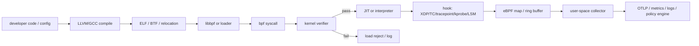
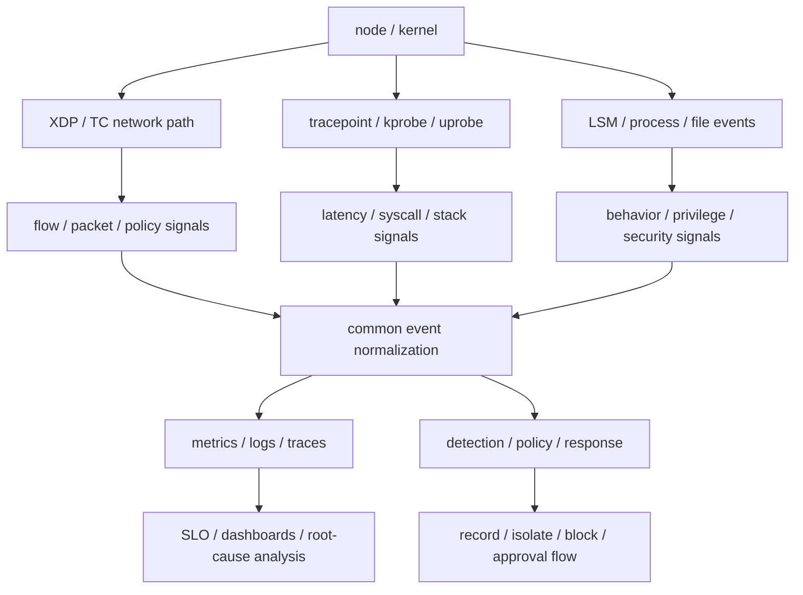

# eBPF-Based Kernel Visibility, Security, and Networking

## 1. Overview

> **Definition**: eBPF (extended Berkeley Packet Filter) is an execution technology that dynamically attaches verifiable programs to fixed hooks in the Linux kernel to extend networking, tracing, and security functions—without changing the kernel source or loading a traditional kernel module.

eBPF is a technology that extended the scope of BPF, which originally filtered packets efficiently, to the kernel as a whole.
Today it is used not only for network packet processing but also for system-call tracing, monitoring process and file behavior, container network policy, performance analysis, scheduling, and various other operational problems.
The key is that it attaches small programs to the kernel events of a running system without recompiling the application or forking the kernel.

Traditional monitoring worked by adding one of the following: application instrumentation libraries, log agents, packet mirroring, or kernel modules.
This approach may bear one of the following burdens: application code modification, increased sidecars, context switching, high packet-copy cost, or kernel-version dependency.
eBPF offers an alternative that runs programs at points close to events inside the kernel and passes only the necessary summary information to user space, reducing observation latency and the scope of change.

However, eBPF should not be understood as "omnipotent code that runs anything in the kernel."
A program must pass the kernel's verifier check and is subject to constraints on allowed program types, helpers, memory access, and execution paths.
Furthermore, safe operation is possible only when you also design for kernel version and distribution settings, privileges, JIT policy, data transfer volume, and recovery procedures for production failures.

From a professional engineer's perspective, eBPF is not a single tool but a combination of a kernel-extension execution model and a platform operations strategy.
Therefore, an answer must connect the execution model, hooks and data structures, network/observation/security use, comparison with existing approaches, and deployment and control measures into a single architecture.

### 1.1 Background and Necessity of Its Emergence

First, because in cloud-native environments the boundary of a failure does not stay within the application alone.
When a single request passes through multiple containers and nodes, virtual networks, service meshes, and external APIs, it is difficult to find the cause of latency and retransmission from application logs alone.
By also viewing the sockets, connections, system calls, and process events that the kernel observes, one can secure facts about the infrastructure path without code changes.

Second, because real-time behavior is required for security and performance.
If behaviors such as file access, process execution, and privilege escalation are analyzed after the fact from logs, an attack may already be underway.
Detecting behavior at kernel hooks and recording or blocking it according to policy can reduce detection time, but because blocking has large business impact and false-positive cost, a staged adoption that separates observation from enforcement is needed.

Third, because the efficiency of the network data path must be raised.
In traditional packet processing, copying between kernel and user space and multiple layers of processing can become a bottleneck.
Using early hooks such as XDP, TC, and AF_XDP appropriately can classify packets at an earlier stage or hand them off to fast user-space processing, but one must not sacrifice semantic verification and operability for performance alone.

### 1.2 Goals and Scope of Application

The goals of applying eBPF can usually be organized into four.
The first is dynamic tracing of system calls, kernel functions, and user functions.
The second is network visibility, policy, and load handling using sockets and packets.
The third is security detection and restriction of process/file/privilege-related behaviors.
The fourth is collecting performance metrics of containers and nodes and connecting them to service-level objectives.

Because the target scope is broad, one must first set the decision question.
If the question is "which service's p99 latency increased," a program that summarizes network flow and scheduling latency is needed.
If the question is "was an abnormal binary executed," a security event model connecting process-execution events with file hashes and parent relationships is needed.
Collecting all events without a question rapidly increases kernel burden, storage cost, personal-data exposure, and alert fatigue.

## 2. The eBPF Execution Model and Core Components

### 2.1 Overall Structure

An eBPF program is generally written, compiled, and loaded in user space, but the core execution when an event occurs takes place inside the kernel.
The user-space loader requests the kernel for the program, maps, links, and necessary metadata.
The kernel confirms the program type and attachment point, checks safety with the verifier, and then, if allowed, executes it via the interpreter or the JIT compilation path.

In this structure, it is important to separate the responsibilities of user space and kernel space.
The kernel program is responsible for quickly filtering events and recording minimal state.
Complex string analysis, external API calls, and long-running policy judgments should be performed in user space so that the kernel execution path is predictable and the verifier constraints are easier to manage.

### 2.2 Programs and the Verifier

An eBPF program operates in a restricted execution environment suited to a specific program type and hook.
For example, a network program accesses the packet context, a tracing program accesses the event context or register information, and an LSM-family program is attached to security-related decision points.
Therefore, even the same source has different accessible contexts and return semantics depending on the program type.

The verifier checks whether the program reads and writes only allowed memory, whether pointer validity can be tracked, whether the helpers to be used are permitted for the program type, and whether the execution path can terminate.
This check is a core control for keeping the kernel stable, but passing the verifier does not guarantee the correctness of business logic or the appropriateness of personal-data handling.
For example, a program that runs safely may generate excessive events or block the wrong process, so separate functional verification and privilege review are needed.

Verification failure differs from a simple syntax error.
It can be rejected at the load stage if the verifier cannot prove data-type or pointer state, if it calls an unsupported helper, or if it assumes a context not provided on a particular kernel.
The operations team must preserve verification logs, automatically roll back failed programs, and perform per-kernel-version regression testing.

### 2.3 JIT and Execution Efficiency

JIT (Just-In-Time) compilation converts verified eBPF instructions into the host CPU's native instructions to lower the cost of repeated execution.
Even when JIT is used, it does not bypass the verifier check; the load-stage safety verification and the execution-stage performance optimization are separate functions.
Because JIT use, hardening, and debug options may differ by distribution or security baseline, they must be specified in operational standards.

Performance evaluation does not end with a single average CPU utilization.
Event rate, program execution time, map contention, ring-buffer loss rate, user-space consumption latency, network packet drops, and service p99 latency are all measured together.
In particular, if every system call copies a large string or the entire packet, the advantage of "no code modification" can be offset by data-transfer cost.

### 2.4 Maps and Data Delivery

A map is a data structure in which the kernel program and user space share key-value state.
Choose a type suited to the purpose—counter, hash, LRU, array, stack trace, socket info—and design the key's cardinality and lifetime, concurrency, and memory limits.
Using a map, you can aggregate in the kernel and read periodically instead of making a user-space call for every event, reducing observation cost.

That said, a map is not unlimited storage.
Indiscriminately creating per-user, per-container, or per-process keys causes memory usage and the number of unique time series to explode, and an attacker can induce a denial of service by creating high-cardinality values.
Decide map size, key normalization, expiration/eviction policy, and hashing/masking of personal-data fields in advance, and apply sampling or aggregation when exceeded.

For event delivery there are several options: perf buffer, ring buffer, map polling, and more.
A fixed counter may be sufficient with a map lookup, but process-execution events where order matters may be better suited to an event buffer.
Whichever method is chosen, you must monitor whether drops occur on buffer saturation and the meaning of dropped data, and must not assume that observation data is complete.

### 2.5 Hooks, Helpers, and BTF

A hook is the event point at which a program runs.
XDP processes packets on the early receive path of the network device, and TC is attached to the traffic-control path.
A tracepoint is a relatively stable trace point provided by the kernel, while a kprobe is flexible for dynamically observing kernel-function entry but can be more affected by changes in kernel implementation.
uprobe attaches to user-space functions, and the LSM hook attaches to security-policy points.

Helper functions are the restricted call interface through which an eBPF program interacts with kernel functionality.
The allowed helpers differ per program type, and failing to check a helper's return value and failure conditions can produce missing data or wrong policy decisions.
A program that depends on a new helper or hook must set a minimum supported kernel and provide an alternative path after feature detection.

BTF (BPF Type Format) is metadata that expresses the type information of the kernel and programs.
libbpf and the CO-RE (Compile Once, Run Everywhere) approach use BTF and relocation information to help cope with small differences in kernel data structures.
This does not mean that once a binary is built it will unconditionally work on all Linux; it is a portability strategy premised on the supported range and on BTF quality and feature availability.

## 3. Networking, Observability, and Security Architecture

### 3.1 Integration Level of Application Areas

eBPF is not a single product name but a common execution foundation.
On the network data path it is used for packet filtering, load balancing, and policy enforcement; in observability it converts system calls and sockets into service-level flows.
In security it detects—or, at some points, rejects—process, file, and network behaviors.

The three areas share the fact that they observe kernel events, but the standards of accuracy and responsibility differ.
Performance observation can tolerate some sampling, but security-audit events must state the meaning of any omission.
Packet-processing policy may care about microsecond-level efficiency, but changing a blocking rule requires approval, rollback, and an emergency bypass.

### 3.2 Networking and XDP

XDP provides a point at which packets can be processed before they proceed further into the network stack.
Therefore it can be suitable for tasks requiring fast judgment, such as DDoS mitigation, early filtering, packet counting, and high-speed forwarding.
However, trying to perform all protocol interpretation and business judgment in XDP increases program complexity and maintenance burden, so set the boundary between early drop/classification and subsequent processing.

TC can be used to handle ingress/egress policy and packet processing on the traffic-control path.
In container networks, you must connect interface, namespace, and service identifiers to the packet flow, so recording only a simple 5-tuple can lose the actual service relationships.
When applying it in Kubernetes, assign identifiers stably and manage lineage, considering pod re-creation, node migration, and network-policy changes.

AF_XDP is an approach that, in conjunction with XDP, delivers packets to a user-space socket.
This can be useful for high-speed packet analysis or special network applications, but it requires operational design such as queues, memory regions, CPU pinning, and drop handling.
Unconditionally applying AF_XDP to general web-service observation may bring little benefit relative to complexity, so judge by traffic volume and latency targets.

### 3.3 Observability and Distributed Tracing

eBPF observability complements layers rather than fully replacing application instrumentation.
By obtaining connection establishment, DNS, TCP retransmissions, socket latency, and process scheduling from the kernel, and obtaining business functions, tenants, and logical work from application instrumentation, you can combine the two data via a correlation ID.
Without this combination, it is hard to connect "the network is slow" and "the payment function is slow" as the causal flow of the same request.

Zero-code or low-code observation provides fast initial visibility but may have limited semantic information.
For example, you may obtain HTTP status codes and socket latency, but you cannot know why a particular product lookup is slow or which business rule failed.
Therefore, use eBPF-based automatic observation together with selective application instrumentation for core services, and define an integrated schema that reduces duplicate collection.

### 3.4 Security Detection and Enforcement

Security use begins with collecting behaviors as events: creating and executing executable files, changing privileges, accessing files, and making network connections.
Recording the parent process, user/container/namespace, file path, destination, and policy version together makes it easier to analyze the attack context than a single event.
However, the facts collectible in the kernel and the risk scores inferred in user space must be separated into distinct fields to enable auditing and reproduction.

Detection and blocking are different operating modes.
Initially, operate in observe-only mode to build a baseline and analyze false positives, then promote only certain high-confidence rules to alerting, isolation, or blocking.
Because a blocking program that errs can also block normal deployments or failure recovery, prepare an exception list, emergency release, last-known-good policy, and an administrator-approval path.

## 4. eBPF Configuration Approaches and Comparison with Existing Technologies

### 4.1 Comparison of Major Hooks

When choosing a hook, you must evaluate not only the meaning of the desired event but also its stability, execution timing, overhead, and range of kernel support.
A tracepoint has the advantage of being a trace point publicly provided by the kernel, but may lack fine-grained internal function flow.
A kprobe is flexible but is easily affected by changes to internal function names and argument structures.

|Category|Main purpose|Advantage|Cautions|
|---|---|---|---|
|XDP|Early packet processing|Low path latency, early drop/classification|Confirm device driver mode and program constraints|
|TC|Ingress/egress traffic control|Policy, forwarding, packet modification|Requires path and network-namespace analysis|
|tracepoint|Stable kernel event tracing|Explicit format, favorable for operational observation|Limits on meaning and granularity of provided events|
|kprobe|Dynamic kernel-function tracing|High flexibility|Affected by kernel-internal changes and argument interpretation|
|uprobe|User-space function tracing|Complements application boundaries|Affected by binary/symbol/build changes|
|LSM|Security-policy points|Behavior detection, some enforcement|Risk of privilege, false positives, business disruption|

The differences in the table are not a mere feature list but show the reasons for operational choices.
For example, a long-running program for failure root-cause analysis should prefer the more stable tracepoint, while a kprobe can be used temporarily for short diagnosis of a specific kernel function.
Security blocking may seem the strongest control, but because its impact is large, the verifiability and recoverability of the policy take priority over the technical feasibility of the hook.

### 4.2 Comparison with Existing Approaches

Agent-based monitoring collects a wide range of data from applications and the operating system and provides mature management features.
On the other hand, it places a process on every node and incurs CPU, memory, and network costs between the collector and the application.
A service-mesh sidecar can make inter-service policy and telemetry consistent, but adds proxy hops and certificate/configuration operations.

eBPF reduces application changes and provides common node-level observation, but depends on the kernel and privileges and does not automatically understand business meaning.
APM provides rich context at the function/transaction level but must consider code instrumentation, runtime overhead, and per-language support.
Therefore, the three approaches are realistically designed not as substitutes but as sharing the observation location and the semantic level.

|Comparison axis|eBPF|Agent/APM|Service-mesh sidecar|
|---|---|---|---|
|Change location|Kernel hook / node|Application / node|Inter-service proxy|
|Code change|Mostly none or little|Requires instrumentation/config|Little application change, but requires mesh config|
|Strength|Common infrastructure visibility, dynamic application|Business/function context|Communication policy, mTLS, traffic management|
|Weakness|Kernel dependency, lacks business meaning|Language/library dependency|Increased hops, resources, operational complexity|
|Suitable question|What happened at nodes/sockets/system calls?|Why are functions and transactions slow?|By what policy should inter-service communication be controlled?|

For example, consider a situation where the p99 latency of a payment API has increased.
eBPF can show retransmissions, socket waits, and CPU scheduling latency; APM can show the payment-verification function and database-call time.
The service mesh can show retries and timeouts between specific services and the encrypted-communication state, so root-cause analysis must correlate the signals of the three layers.

## 5. Adoption, Development, and Operations Procedures

### 5.1 Requirements and Risk Classification

The first step is to list the operational and security questions to be solved, not the events to be collected.
For each question, record the required accuracy, allowed latency, retention period, whether personal data is included, whether blocking is necessary, and the target nodes and kernel range.
Because service performance analysis, security auditing, network policy, and high-speed packet processing require different programs and SLOs, do not put them all into one program.

Next, classify risk grades of observe-only, alert, isolate, and block.
Observe-only is suitable for identifying omissions and false positives; alerts must provide evidence that operators can act on.
Isolation and blocking are applied only to high-confidence policies that have passed business-impact analysis and an approval/rollback plan.

### 5.2 Development and Verification

Developers first confirm the supported kernel and program type, and start with a minimal-function program.
Inside the kernel, perform short, predictable tasks such as parsing packet headers, incrementing counters, and extracting essential fields, and move complex regular expressions, external communication, and large-scale data processing to user space.
Manage the program version, policy version, build tools, and BTF/CO-RE settings together with the artifact so that, in a failure, you can reproduce which code was executed.

Verification is divided into three layers.
First, confirm verifier load success and whether the expected hook attachment occurred.
Second, verify event meaning, map size, and buffer loss on the test kernel and the actual distribution.
Third, confirm the side effects on application SLOs and security policy through load, failure, and rollback tests.
It is also important not to use real personal data for verification, prioritizing synthetic, de-identified events.

### 5.3 Deployment and Privilege Control

Rather than applying to all nodes simultaneously, proceed in the order of development, staging, a few canary nodes, and full expansion.
Because node images and kernel upgrades can affect the loadability of eBPF programs, operate per-node-pool feature detection and a compatibility matrix.
On nodes lacking a feature, design for safe stopping of collection or switching to the existing agent path.

Separate privileges under the principle of least privilege.
Divide the roles of program loader, policy changer, event viewer, dashboard user, and emergency-release approver, and record load, attach, map access, and policy changes in an audit log.
Granting broad kernel privileges to a container is convenient but can enlarge the host attack surface, so review privilege requirements per function and manage them together with the runtime security boundary.

### 5.4 Quality and Cost of Observation Data

If you do not observe the collector itself, you may mistake an empty eBPF dashboard for a healthy system.
Meta-monitor program execution count and time, event generation volume, buffer drops, map usage, user-space consumption latency, and loader errors.
Send health events separately so that, when an anomaly occurs, you can distinguish "there were no events" from "the collector broke."

Manage data cost as a function of cardinality and retention period.
Rather than long-term retention of raw events, aggregate by node, service, and time window, and temporarily raise detailed sampling only during an investigation period.
Mask or pseudonymize sensitive or unique values such as destination IP, user ID, and file path according to the business purpose, and separate the access rights for the search index and for raw retention.

## 6. Industry Application Cases

### 6.1 Kubernetes Service Failure Analysis

Assume that in an e-commerce cluster with many deployed pods, the latency of the payment service has increased.
The eBPF collector aggregates per-node TCP retransmissions, connection-establishment time, socket waits, and process CPU scheduling latency, and combines them with pod/service/node metadata.
With these results, you can narrow the search scope to whether it is an application code problem, a network-path problem of a specific node, or a burst of service-mesh retries.

However, because pod names can change on re-creation, also record deployment/service/workload-level identifiers.
When namespace and tenant information is included in events, apply access control so that only authorized users can view it.
Not storing detailed failure-analysis data indefinitely, but disposing of it according to the retention period after the investigation ends, is desirable from both privacy and cost perspectives.

### 6.2 Behavior Detection in Financial Services

Financial services must quickly identify behaviors such as an abnormal process running on an authorization server or a sensitive configuration file being read.
Connecting process-execution events, parent-child relationships, executable identifiers, user/container context, and file access lets you see the behavior chain more richly than simple login logs.
Operate high-risk rules first in observe mode to learn the exception patterns of normal batches, backups, and security tools, then promote them to an alerting policy.

Do not separate blocking from change management.
For example, wholesale blocking of script execution on an authorization system could also halt emergency recovery procedures.
Operators must include an expiration time, exception reason, approver, and rollback command in the policy, and confirm the affected business and alternative channels before blocking.

### 6.3 High-Speed Network Edge

At a content-delivery or DDoS-defense edge, packets can be classified by source, protocol, and rate before they reach the application.
An XDP-based early filter can quickly pass normal-path packets while forwarding suspicious traffic to a downstream analyzer after leaving a counter and sample.
Here, also verify the change latency of filter rules, the error rate on normal packets, NIC/driver support, CPU-core distribution, and the emergency-release path.

If all traffic is handed to user space in the early stage, the queue and memory operational burden may outweigh the benefit of AF_XDP.
Therefore, layering is needed: keep simple drop/counting in XDP and delegate deep protocol analysis to an appropriate downstream.
Performance figures too must be measured under real packet sizes, rule counts, concurrent flows, and failure conditions, not under an ideal benchmark.

## 7. Deeper Dive: CO-RE, Platform Standardization, and Operational Evolution

In large-scale environments with diverse kernel versions, rebuilding programs per node creates an operational burden.
BTF and CO-RE offer a direction for raising the portability of deployable binaries by using kernel type information and relocation metadata.
However, because CO-RE does not resolve all kernel differences, feature detection, a minimum kernel version, alternative programs, and pre-deployment compatibility testing must all be operated together.

The eBPF ecosystem is developing into a platform form combining libbpf, bpftool, compilers, per-language bindings, and observation/network/security tools.
Rather than collecting each tool's event format as is, the platform team should define common service/node/process/network identifiers and a time base to enable correlation analysis.
Even when exporting to a higher telemetry system such as OpenTelemetry, distinguish facts eBPF directly observed, meaning the application instrumented, and inferences computed downstream.

The recent core of operations is shifting from "collect anything" toward "collect purpose-fit kernel signals at minimum cost."
When observability, security, and network teams run different programs on the same node, hook duplication, map memory contention, event duplication, and policy conflicts can occur.
A common loader, program life cycle, resource budget, ownership, conflict arbitration, and emergency-disable procedures must be managed through platform governance.

In a professional engineer's answer, eBPF can be connected to service mesh, OpenTelemetry, zero trust, DevSecOps, and SRE.
However, one must not confuse the roles of each technology.
eBPF provides signals and policy-enforcement points close to the kernel, the service mesh provides service-communication control, OpenTelemetry provides telemetry exchange, and zero trust provides access-decision principles.

## 8. Considerations and Implications

### 8.1 Stability and Compatibility

Catalog feature differences by kernel, distribution, driver, and architecture in advance, and maintain a support matrix.
Before an upgrade, perform regression tests of the verifier, BTF, hooks, helpers, JIT, and network modes, and prepare an alternative path that reports the observation gap on failure.

### 8.2 Security and Privileges

Because the privilege to load eBPF grants access to powerful kernel functionality, separate it from ordinary application privileges.
Operate signed artifacts, allowed repositories, code review, load auditing, and expirable policies with emergency blocking to reduce supply-chain and internal-abuse risks.

### 8.3 Performance and Resources

Measure program execution time, map memory, event buffers, CPU pinning, and packet drops together with service SLOs.
Set sampling, aggregation, and key limits as defaults, and when claiming a performance improvement, specify the comparison baseline and load conditions.

### 8.4 Data Protection

File paths, command lines, user identifiers, and destination addresses can be personal data or sensitive operational information.
Include collection purpose, minimal collection, masking, access control, retention period, disposal, and audit logs in data governance, and separate investigation raw data from long-term metrics.

### 8.5 Separation of Detection and Enforcement

Do not immediately turn observation results into blocking rules; verify the baseline, false positives, exceptions, and business impact.
Give policy promotion an approver and expiration time, and regularly rehearse whether rollback and emergency bypass work normally.

### 8.6 Operational Responsibility and Duplication

When multiple teams redundantly collect the same system calls and network flows, cost and interpretation inconsistency grow.
Define a common event schema, program owners, map/buffer budgets, and change-management and incident-response RACI, and manage them as platform assets.

### 8.7 Answer Composition and Future Outlook

An answer is highly logical if it unfolds in the order definition → execution model → hooks/maps/verifier → application architecture → comparison with existing approaches → adoption procedure → cases → risk control.
For the future outlook, rather than emphasizing only the expansion of kernel features, describe it in connection with portability, standard telemetry, safe privilege delegation, automated policy verification, and the observation demands of AI infrastructure.

## References

- Linux Kernel Documentation, eBPF Userspace API: https://docs.kernel.org/userspace-api/ebpf/index.html
- Linux Kernel Documentation, BPF: https://docs.kernel.org/bpf/
- eBPF Foundation, Core Infrastructure Landscape: https://ebpf.io/infrastructure/
- eBPF Foundation, What is eBPF?: https://ebpf.io/what-is-ebpf/
- eBPF Docs, Linux concepts and reference: https://docs.ebpf.io/linux/
- Kubernetes Blog, Using eBPF in Kubernetes: https://kubernetes.io/blog/2017/12/using-ebpf-in-kubernetes/
- Red Hat Documentation, Getting started with XDP and eBPF: https://docs.redhat.com/en/documentation/red_hat_enterprise_linux/10/html/configuring_firewalls_and_packet_filters/getting-started-with-xdp-and-ebpf

---

> **In one line**: eBPF is a technology that extends networking, observability, and security from the substrate by attaching kernel programs—whose safety is checked by the verifier—to hooks, and successful adoption is completed by platform operations that include CO-RE compatibility, least privilege, cost, data protection, and rollback.
