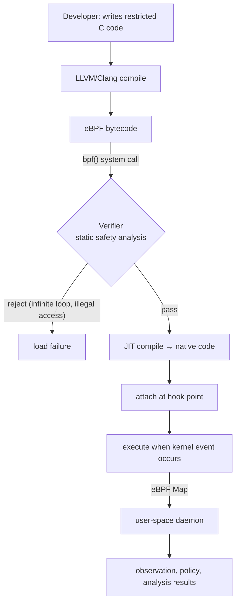
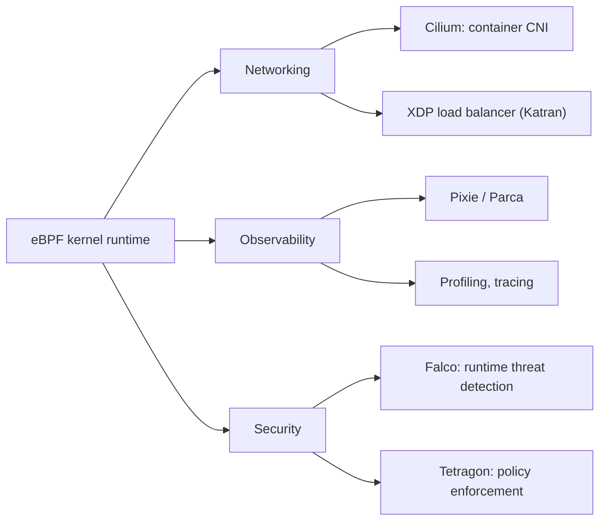

# eBPF (extended Berkeley Packet Filter)

## 1. Overview

> **Definition**: eBPF is a lightweight in-kernel execution technology that safely attaches and runs user-defined programs—having passed a Verifier—to specific events inside the operating system kernel (system calls, network packets, function entry, etc.), without recompiling the kernel or loading a new kernel module.

The roots of eBPF lie in BPF (Berkeley Packet Filter, hereafter cBPF), which appeared in 1992 for packet filtering.
cBPF was a small virtual machine that let `tcpdump` filter only the packets of interest in the kernel and pass them up to user space, but it had a limited structure: only two registers and no use beyond packet filtering.
Introduced in Linux kernel 3.15 in 2014, eBPF dramatically extended this idea, reincarnating it as a **general-purpose in-kernel execution environment** with eleven 64-bit registers, data structures (maps), and helper function calls.
As a result, eBPF today has established itself as a foundational technology that spans networking, observability, security, and performance analysis, going far beyond simple packet filtering.

The reason eBPF matters from a professional engineer's perspective is that it opened a new extension paradigm of "changing the kernel's behavior without changing the kernel."
Traditionally, to change kernel behavior you had to modify the kernel source and wait for a release cycle, or accept the risk of loading a kernel module.
The former takes years, and the latter, if done wrong, halts the entire system with a kernel panic.
eBPF offered a third path between these two options—**a sandboxed program whose safety is guaranteed by the Verifier**—and this is the core of what has evolved Linux into a "programmable kernel."

### 1.1 Background and Necessity of Its Emergence

First, because of the exploding instrumentation demands of cloud-native environments.
As containers and microservices spread, hundreds of processes flicker in and out of existence on a single node, and the need grew to observe—without modifying application code—the system calls and network flows they exchange through the kernel.
Embedding an agent and instrumenting code per application scales poorly because languages and frameworks vary, but instrumenting once at the kernel, which every process must pass through, lets you observe everything regardless of language.

Second, because of the risk and maintenance burden of kernel modules.
Kernel modules run in the same address space as the kernel with unlimited privileges, so a single bug can bring down the entire system, and they must be rewritten and re-verified whenever the kernel version rises.
Because the Verifier blocks infinite loops and invalid memory access in advance at load time, eBPF programs can deploy kernel-level functionality relatively safely.

Third, because of the demand to minimize performance overhead.
Copying packets to user space for processing—for observation or policy enforcement—accumulates context-switching and copy costs.
eBPF can finish processing inside the kernel, even at the network driver layer (XDP), greatly reducing latency and CPU consumption.

### 1.2 Core Characteristics

eBPF's nature can be summarized in four characteristics.
**Safety** means the Verifier statically guarantees the program's termination and memory safety; **performance** means bytecode is translated into native machine code through JIT compilation and executed.
**Dynamic extensibility** means kernel behavior can be changed by attaching and detaching programs without rebooting the system; **programmability** means users can freely connect their desired logic to kernel events.
The combination of these four lets eBPF achieve the goal—previously hard to reconcile—of "kernel extension that is both safe and fast."

## 2. Execution Structure and Operating Principles

The life cycle of an eBPF program flows through write–compile–load–verify–execute–data exchange.
A developer writes a program in restricted C syntax, and LLVM/Clang compiles it into eBPF bytecode.
This bytecode is loaded into the kernel via the `bpf()` system call, at which moment the **Verifier** explores all execution paths of the program to confirm safety.
Only programs that pass verification are converted by the **JIT compiler** into native code for the given CPU architecture and attached at the designated hook point.

The two most important axes of the operating principle are the **Verifier** and the **Map**.
To guarantee that a program always terminates in finite time, the Verifier historically prohibited backward jumps (loops); today it allows only verifiable bounded loops.
It also tracks the range of pointer arithmetic to block access to arbitrary regions of kernel memory, and even checks the accessible helper functions and argument types.
Thanks to this static analysis, a poorly written program is rejected at the load stage before it can run, greatly reducing the risk of a kernel panic during operation.

A **Map** is a key-value data structure that shares state among the in-kernel eBPF program, user-space programs, and multiple eBPF programs.
Because an eBPF program runs briefly and terminates each time an event occurs, it cannot maintain state for long on its own; the Map persists this state in the kernel.
For example, a program that counts system calls accumulates the counter in a hash map, and a user-space daemon periodically reads this map and converts it into metrics.
There are various types—hash maps, arrays, ring buffers, LRU maps, and more—so they cover a wide range from high-frequency event streaming to policy table lookups.

### 2.1 Types of Hook Points

The scope of eBPF's use is determined by where a program can be attached—that is, the hook point.
Hooks are broadly divided into the networking family and the tracing family.
In the networking family, **XDP (eXpress Data Path)** runs as soon as the network driver receives a packet—that is, before entering the kernel network stack—and can pass, drop, or redirect packets the fastest.
In contrast, the **TC (Traffic Control)** hook, being a point after stack entry, handles richer metadata than XDP and also controls the transmit direction.
In the tracing family, **kprobe/kretprobe** attach to the entry/return of kernel functions, **uprobe** to user-program functions, and **tracepoint** to static event points that the kernel exposes stably.

| Category | Hook point | Location | Main use |
|------|---------|------|-----------|
| Network | XDP | Immediately after driver receive | Ultra-fast filtering, DDoS defense, load balancing |
| Network | TC | Network stack | Ingress/egress policy, traffic control |
| Tracing | kprobe | Arbitrary kernel function | Dynamic instrumentation of kernel behavior |
| Tracing | tracepoint | Static event | Stable observation of kernel events |
| Tracing | uprobe | User function | Tracing inside applications |
| Security | LSM BPF | Security hook | Access-control policy enforcement |

That hook points are this diverse means a single technology can handle networking, observability, and security in an integrated way.
The core of design is to understand the nature of each hook—XDP for performance, tracepoint for stability, LSM BPF for security-policy enforcement—and choose according to purpose.

## 3. Major Application Areas

eBPF's applications unfold along three main branches, in each of which a de facto standard project has formed.

In **networking**, the most representative project is **Cilium**, a Kubernetes CNI (Container Network Interface).
Traditional CNIs stack service and policy rules as a linear list in Linux's `iptables`, carrying a scalability limit whereby the per-packet rule-lookup cost grows linearly as the number of services increases.
Cilium replaces this rule processing with eBPF map-based hash lookups to maintain consistent performance even in large clusters, and processes L3–L7 policy and load balancing in the kernel without a service mesh's sidecar proxy.
Facebook (Meta)'s XDP-based load balancer Katran is cited as a case that processes millions of packets per second on a single server.

In **observability**, its strength is being able to automatically instrument inter-service calls, latency, and system calls without modifying application code at all.
Instead of embedding a sidecar or SDK in each service, a single eBPF agent is placed on the node to observe all traffic and function calls passing through the kernel, making it language-neutral with fewer instrumentation gaps.
Continuous profiling that constantly performs CPU profiling (e.g., Parca) and automatic service-map generation (e.g., Pixie) fall into this category.

In **security**, it monitors system calls and kernel events in real time to detect and block runtime threats.
Falco defines suspicious system-call patterns (e.g., launching a shell inside a container, accessing sensitive files) as rules to detect intrusions, while Tetragon does not stop at detection but immediately blocks policy-violating processes at the kernel level.
Using LSM (Linux Security Module) BPF hooks, one can also flexibly implement access-control policies with eBPF, much like SELinux or AppArmor.

## 4. Comparison with Kernel Modules and User-Space Approaches

To accurately understand eBPF's position, it must be compared with the two existing alternatives: the kernel-module approach and the user-space-agent approach.
The three approaches sit on a trade-off between "where it runs" and "how safe it is."

| Comparison item | Kernel module | eBPF | User-space agent |
|-----------|-----------|------|----------------------|
| Execution location | Kernel | Kernel (sandbox) | User space |
| Safety | Low (panic risk) | High (Verifier-guaranteed) | High (process isolation) |
| Performance | Very high | High | Relatively low |
| Deployment flexibility | Low (reload/reboot) | High (dynamic attach) | High |
| Kernel event access | Full | Hook-limited | Limited (indirect) |

Kernel modules are the most powerful in performance and access scope, but their weak safety and maintainability make production adoption burdensome.
User-space agents are safe and easy to develop, but cannot see kernel events directly, so their observation depth is shallow and they incur context-switching costs.
eBPF's essential differentiation is that it compromises between the two, providing **performance and access close to a kernel module** along with **safety close to user space**.
The fundamental reason for this difference is that eBPF has both a static safety mechanism—pre-execution verification—and a performance mechanism—JIT—at the same time.
That said, one must acknowledge that because hook points and helper functions are limited to the scope the kernel exposes, its flexibility to freely handle the whole kernel does not reach that of a kernel module.

## 5. Deeper Dive: Standardization Trends and Extensions

eBPF started as a Linux-specific technology, but as the ecosystem matured, portability and standardization emerged as key challenges.
Early on, deployment was cumbersome because programs had to be compiled to match the kernel headers on each execution node; with the advent of the **CO-RE (Compile Once – Run Everywhere)** technique and BTF (BPF Type Format) metadata, a once-compiled binary can be reused across different kernel versions.
This became a turning point for practically deploying eBPF in large-scale infrastructure.

On the governance side, the **eBPF Foundation** was established under the Linux Foundation, with Google, Meta, Microsoft, Isovalent, and others participating, providing a neutral basis for development that eases dependence on any single vendor.
As a platform extension, the **eBPF for Windows** project is under way, showing the possibility that eBPF may extend beyond Linux into a multi-OS instrumentation and policy framework.
In the service-mesh area, a **sidecarless** architecture is emerging that removes the sidecar proxy and handles much of the work in the kernel with eBPF, with discussion continuing toward reducing the resource consumption and latency of the data plane.

That said, rather than describing these trends assertively, the accurate answer posture is to also state that the technology is evolving rapidly and that detailed performance and maturity may vary by workload and kernel version.

## 6. Considerations and Implications

First, **control over its security duality** is needed.
eBPF is a powerful means of security observation and enforcement, but if abused through improperly granted privileges, it can become a kernel-level rootkit or data-exfiltration tool.
Therefore, governance must run in parallel: strictly controlling the privilege to load eBPF programs (CAP_BPF, etc.) under the principle of least privilege, and constantly auditing the list and integrity of attached programs.

Second, an adoption strategy that accounts for **Verifier constraints and development complexity** is required.
Because the Verifier guarantees safety in exchange for placing constraints on program size, complexity, and loops, complex logic must be split into multiple programs or divided in role with user space.
Since low-level development is difficult, a realistic staged approach is to use proven higher-level frameworks such as Cilium and Falco rather than developing directly, and expand to in-house development after organizational capability matures.

Third, a strategy for **managing kernel-version dependency and portability** is important.
Because the availability of hook points and helper functions differs by kernel version, one must clearly define the range of supported kernels premised on CO-RE/BTF, and in environments where old kernels are mixed, prepare an alternative instrumentation path.

Fourth, one must approach from **an integrated architecture perspective across observability, networking, and security**.
Integrating these three areas—which used to be operated separately with different tools—on the single kernel-based foundation of eBPF can reduce operational complexity and resource consumption.
As a professional engineer, one should evaluate its value not from the perspective of adopting individual tools, but from that of a platform strategy that makes eBPF the common foundation of the data plane and designs observation, policy, and security consistently.

## References

- eBPF official site, https://ebpf.io/
- Cilium project documentation, https://docs.cilium.io/
- Linux Foundation, eBPF Foundation, https://ebpf.foundation/

---

> **In one line**: eBPF is a "programmable kernel" foundational technology that dynamically attaches sandboxed programs—whose safety is guaranteed by the Verifier—to kernel events, integrally handling networking, observability, and security at the kernel level with high performance, without reboots or modules.
