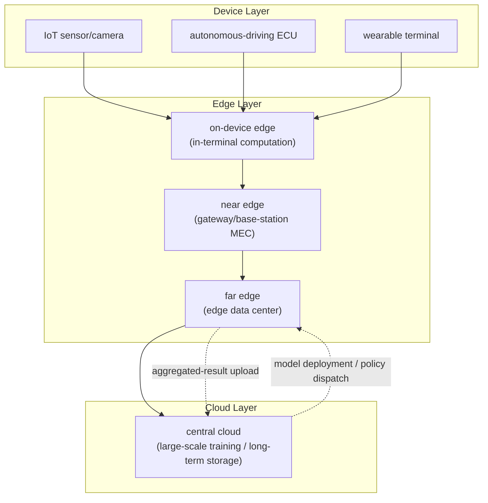
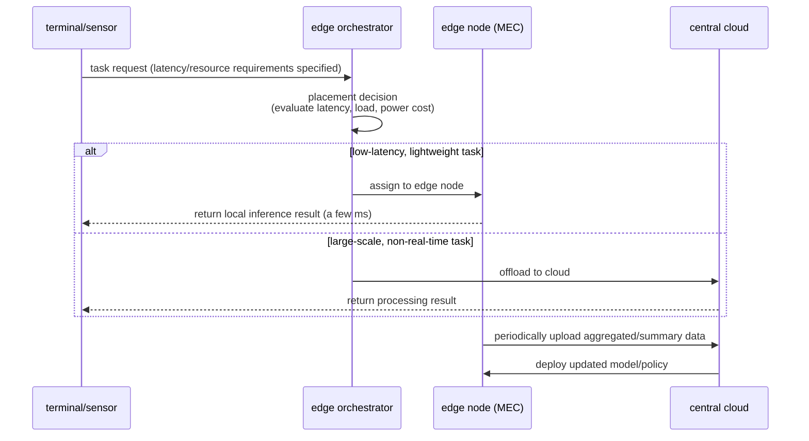

# Edge Computing

## 1. Overview

> **Definition**: Edge computing is a distributed computing paradigm that performs computation, storage, and analysis at the site where data is generated (terminals, sensors, gateways) or on small-scale distributed computing resources nearby, minimizing transmission to the central cloud and resolving latency, bandwidth, and privacy problems.

Behind the emergence of edge computing are two structural changes: the "explosion of data" and the "physical limits of the centralized cloud." IoT sensors, autonomous vehicles, and industrial cameras in smart factories pour out data on the order of several gigabytes (GB) per second; sending all of it to a distant central cloud for processing incurs round-trip latency (RTT) of tens to hundreds of milliseconds and skyrocketing backbone bandwidth costs. In real-time services that require a response within a few milliseconds (ms)—such as emergency braking in autonomous driving or robot control in a smart factory—this latency translates directly into safety accidents. In other words, given the physical law of the speed of light, the only way to reduce the round-trip time of "sending data far away and back" is to move computation close to the point where the data is generated.

Another background is the strengthening of privacy and sovereignty regulations. Uploading sensitive data—hospital imaging, factory process data, personal biometric information—to the cloud in raw form itself may violate personal-data protection law or the GDPR, and from a data-sovereignty standpoint, crossing borders is also problematic. Performing first-stage processing, de-identification, and summarization at the edge and then uploading only the necessary results to the center can substantially alleviate this problem. In this context, edge computing does not replace the cloud but forms a **Cloud-to-Edge Continuum** connecting central cloud, edge, and terminal, complementing each other.

The core characteristics of edge computing can be summarized as: (1) **proximity**—processing near the data source; (2) **low latency**—real-time response; (3) **distribution**—load distribution across many edge nodes; and (4) **autonomy**—continued local judgment even when the network is severed. It is establishing itself as the common infrastructure of 5G/6G, autonomous driving, industrial IoT, and immersive media services, which demand ultra-low latency, hyperconnectivity, and ultra-reliability.

Distinction from similar concepts is also necessary. From a communications-network standpoint, emphasizing placing computing at a point near the user is **MEC (Multi-access Edge Computing)**; focusing on content caching is a **CDN**; and a cloud provider extending its own region near the user is called an **edge zone / local zone**—but all of these lie within the larger flow of edge computing, "from centralized to distributed." The once-popular **fog computing** concept, which emphasized an intermediate layer between edge and cloud, is today understood as effectively absorbed into the far-edge layer of edge computing.

## 2. Edge Computing Layered Structure and Architecture

Edge computing should be understood not as a single piece of equipment but as a multi-layer structure connecting from the terminal to the cloud. The conceptual diagram below shows the entire structure from the device layer where data is generated up to the central cloud.

**A. The Device Layer** is the source of data. Sensors, cameras, actuators, and vehicle ECUs convert the state of the physical world into digital signals. Because this layer is extremely resource-constrained (a few milliwatts of power, a few KB of memory), it either passes raw data upward as is or performs only very simple filtering. Recently, the boundary has been blurring as on-device AI—placing an ultra-lightweight inference engine on this layer itself—is combined with it. For such ultra-low-power always-on operation, TinyML (running neural networks on microcontroller-class hardware), intermittent computing (waking only when an event occurs), and low-power compute elements such as neuromorphic chips are drawing attention as extension technologies for this layer. However, because the resource constraints are large, OTA (Over-the-Air) management to remotely and safely distribute model updates and security patches, along with a lightweight authentication scheme, must accompany them.

**B. The Edge Layer** is the heart of edge computing and is further subdivided into three stages. The **on-device edge** computes directly inside the terminal (e.g., face recognition on a smartphone NPU); the **near edge** is a point one hop away from the terminal, such as a factory gateway or a carrier base station's MEC (Multi-access Edge Computing) server; and the **far edge** is a small-scale edge data center (on the order of tens of kW) placed at a regional hub, playing an intermediate aggregation and coordination role that encompasses many near edges. Response latency grows in the order of on-device (<1 ms) → near edge (1–10 ms) → far edge (10–30 ms) → cloud (50 ms and up), so the core of design is to place workloads (placement) at the appropriate layer according to the service's latency requirement.

The concept that runs through this layer division is **data gravity**. As data grows in scale, it has the property of attracting services and computation to where it resides, so moving computation toward the data is far more economical than moving large volumes of data. Edge computing structures precisely this principle, reflecting the design philosophy of "attach lightweight computation where data is heavy (the site), and lift only lightweight summaries to the upper layers where gravity is weak" in its layer placement.

**C. The Cloud Layer** handles tasks that are insensitive to latency but require large-scale resources, such as large-scale model training, long-term data retention, and global policy setting. A representative pattern is the "training-inference separation" structure—inferring at the edge and training in the cloud, then redistributing the updated model back to the edge—which, combined with federated learning (discussed later), evolves models while preserving privacy.

A key communication standard is the **MEC (Multi-access Edge Computing)** architecture defined by the European Telecommunications Standards Institute (ETSI); through **local breakout**, which distributes the 5G core network's UPF (User Plane Function) near the user, traffic is processed immediately at the edge without passing through the central network.

## 3. Operating Process and Workload Orchestration

An edge environment has hundreds to thousands of heterogeneous nodes distributed geographically, so orchestration that dynamically decides which computation to run on which node determines success or failure. The diagram below shows the offloading decision and processing flow when a request arrives.

**A. The task-offloading decision** is the process of judging "should this computation be done locally, or handed to the upper layer?" The judgment criteria include the task's latency budget, the required amount of computation and memory, the current node's load and remaining battery, and the size of data to be transmitted. For example, on a battery-powered terminal, the key is energy-latency trade-off optimization, which compares the energy required for computation against the energy required for transmission and chooses the smaller; this is decided in real time using integer programming or reinforcement learning.

**B. Container-based deployment and lightweight orchestration** support execution. Just as the central cloud manages containers with Kubernetes, at the edge, lightweight Kubernetes distributions such as K3s, KubeEdge, and OpenYurt are used for resource-constrained nodes. These provide "disconnected operation," in which even when the network between master and worker is unstable or severed, the edge node maintains autonomous operation according to the last specification it received and re-synchronizes state when the connection is restored. Actual carrier MEC platforms deploy CDN caches, AI inference servers, and local UPFs as containers on top of such a lightweight orchestrator.

**C. Data life-cycle management and hierarchical aggregation** are also important. Storing all data generated at the edge would saturate storage in an instant, so edge nodes perform hierarchical aggregation: selectively storing only outliers and events while lifting only statistical summaries (mean, variance, histogram) of normal data to the upper layer. For example, in a smart factory, a 1 kHz raw vibration-sensor signal is analyzed at the edge with a real-time FFT, and only the result—"whether an abnormal frequency was detected"—is transmitted to the cloud, reducing bandwidth by hundreds of times.

**D. Resilience and non-stop operation** are the last gate of edge design. Because edge nodes operate in environments far harsher than a data center—field power outages, communication disruptions, hardware failures—it is essential to design so that even when the upstream connection is severed, they continue core judgment with the last-received policy and model (degraded mode) and buffer data in a local queue for retransmission when the connection is restored (store-and-forward). In addition, failover, in which an adjacent node takes over the workload when a particular node dies, and redundancy, distributing the same service across multiple nodes, guarantee service continuity. In this way, edge autonomy is directly linked to fault tolerance, and pre-validating disconnection situations with chaos engineering is recommended.

## 4. Comparison with Cloud Computing

Edge and cloud are not in opposition but in a division-of-roles relationship, but in an exam answer, one must explain why the differences arise, along with physical and economic reasons. The table below compares the major dimensions.

| Category | Central cloud computing | Edge computing |
|------|--------------------|-----------|
| Processing location | Distant large-scale data center | Distributed nodes near the data source |
| Latency | Tens to hundreds of ms | 1–30 ms (by layer) |
| Resource scale | Effectively infinite scaling | Small-scale, constrained (power, space) |
| Bandwidth cost | High due to raw transmission | Greatly reduced by local processing |
| Data privacy | Exposure risk from moving raw data | Minimized exposure via on-site processing |
| Network dependency | Service halts when connection is severed | Local autonomous operation even when severed |
| Management complexity | Relatively simple due to centralization | High due to many heterogeneous nodes |

The relationship between edge and cloud should be understood not as substitution but as a **division of workloads by role specialization**. The edge handles real-time judgment and first-stage processing, while the cloud handles large-scale training, global integration, and long-term retention; the key is to design the control and data pipeline connecting the two as a single continuum. Missing this perspective and approaching it as an either/or of "edge vs. cloud" leads to failure—either bearing only the management burden of the edge or being trapped by the latency limits of the cloud.

The latency difference between the two approaches fundamentally originates from physical distance. If a terminal in Seoul communicates with a cloud in a U.S. West region, the fiber-optic round trip alone takes more than 130 ms, a limit of the speed of light that software optimization can never reduce. The difference in bandwidth cost, on the other hand, is an economic reason. Uploading the video of 100 4K cameras to the cloud in raw form incurs tens of millions of won in monthly transmission costs, but detecting objects at the edge and uploading only an "intrusion occurred" event reduces the cost by a factor of hundreds.

That said, the edge is not omnipotent. Tasks that require vast resources and global data integration—such as training large language models or a company-wide data warehouse—are still overwhelmingly advantageous in the cloud. In addition, the operational overhead of consistently managing, security-patching, and monitoring thousands of edge nodes is the edge's greatest weakness; to lower it, GitOps-based declarative deployment and an observability system are essential companions.

The difficulty of state management also differs. The central cloud can relatively easily secure strong consistency around a single data store, but among geographically scattered edge nodes, given the CAP theorem, availability and consistency must be weighed against each other on the premise of network partitioning. Therefore, at the edge, eventual consistency, conflict-free replicated data types (CRDT), and local-first design are frequently adopted. Ultimately, the choice between edge and cloud is not just "which is faster" but a comprehensive architectural decision about "how to allocate consistency, durability, cost, and privacy."

## 5. Industry Application Cases

**A. Predictive maintenance in smart factories.** Manufacturers at home and abroad analyze equipment vibration, temperature, and current sensor data at the edge in real time to predict failures in advance. Because the edge node detects anomalies within a few ms without a cloud round trip, immediate alarms or automatic deceleration are possible before equipment stops. Cases are reported of reducing unplanned downtime by 20–50% with this approach.

The notable point in this case is that the edge directly improves safety and quality metrics, beyond mere cost savings. Take a defect-detection camera: with a cloud round trip, the defect verdict arrives only after the conveyor has already moved the product to the next process, but edge inference can immediately reject the product while it is still on-site, fundamentally blocking the leakage of defects to downstream processes.

**B. Autonomous driving and V2X.** Autonomous vehicles process camera and LiDAR data on an in-vehicle on-device edge (a high-performance SoC), while exchanging intersection-signal and surrounding-vehicle information with roadside base-station MEC via V2X (Vehicle-to-Everything). Because the end-to-end latency required for an emergency-braking decision must typically be on the order of a few ms, central-cloud processing is fundamentally impossible and the edge is essential.

**C. Immersive media and cloud gaming.** Carriers place rendering servers on MEC near base stations to lower the motion-to-photon latency of VR/AR and cloud gaming to 20 ms or less. Because large latency causes cybersickness, edge rendering becomes a core element of the user experience.

**D. Smart cities and video surveillance.** Sending the video of thousands of downtown CCTVs to a central control center would make bandwidth and storage costs unmanageable. If each intersection's or building's edge node performs object detection, license-plate recognition, and abnormal-behavior detection, and transmits only event metadata such as "traffic congestion" or "collapsed pedestrian" to the center, bandwidth is reduced by hundreds of times compared with raw video while real-time response becomes possible. Because raw personal video does not leave the site, it is also advantageous for privacy.

## 6. Deeper Dive — Edge AI, Federated Learning, 6G Linkage, and Latest Trends

The recent technological development of edge computing stands out in its convergence with AI. **Edge AI** is inferring lightweight neural networks directly at the edge; through model-compression techniques—quantization, pruning, and knowledge distillation—it shrinks large models trained in the cloud to a size executable on edge hardware (NPU, edge TPU, Jetson, etc.). This is closely linked to the separately organized on-device AI topic.

As edge AI spreads, competition among hardware accelerators is also fierce. To achieve high inference performance in a low-power, small form factor, NPUs, edge TPUs, and FPGAs are used, and power efficiency per compute (TOPS/W) becomes a key metric for choosing edge hardware. Furthermore, because a single edge node must serve models of multiple services simultaneously, the importance of an edge-specialized MLOps (sometimes distinguished as Edge MLOps) pipeline supporting model version management, A/B deployment, and automatic rollback is growing.

The core technique for continuously improving edge models while preserving privacy is **federated learning**. After each edge node trains a model on local data, it transmits to the center only the model weights (or gradients), not the raw data; the center aggregates these (e.g., with FedAvg) to update the global model and redistribute it. This improves overall performance while sensitive data never leaves the site. However, because raw data can be partially reconstructed from weight transmission alone, there is a trend toward jointly applying differential privacy and homomorphic encryption.

On the network side, **5G Advanced and 6G** further strengthen edge computing. 6G aims for ultra-low latency (on the order of 0.1 ms), ultra-precise positioning, and integrated communication and computation (ICC), and, combined with satellite-aerial-terrestrial integrated networks (SATIN), seeks to extend edge nodes not only on the ground but also to low-Earth-orbit satellites. From a standardization standpoint, ETSI MEC, 3GPP's 5G edge-computing specifications, and the Linux Foundation's LF Edge (EdgeX Foundry, Akraino) are leading interoperability. Recently, **edge serverless (Edge Functions)**, which extends the serverless concept to the edge, has spread mainly among CDN providers, evolving into a form in which developers deploy functions to edges worldwide without being conscious of the infrastructure.

From a security standpoint, because edge nodes are exposed at sites with weak physical control, the traditional data-center security model does not apply as is. On the premise that a node can be physically stolen or cloned, remote attestation—verifying boot integrity with keys stored in a hardware root of trust (TPM/TEE)—is combined with zero trust, which mutually authenticates all node-to-workload communication. Furthermore, applying trusted-execution-environment (TEE)-based confidential computing to the edge means even the node operator cannot view data during processing, strengthening data protection in multi-tenant edge environments.

## 7. Considerations and Implications

First (application strategy), edge adoption should be approached not as a full migration but as **selective placement based on workload characteristics**. Classifying workloads along the axes of latency sensitivity, data size, and privacy grade, and lowering only real-time and sensitive workloads to the edge while leaving training and analysis in the cloud, is the optimal hybrid placement. Edge-ifying everything from the start only causes management complexity and cost to surge.

Second (trade-off), the edge is a **balance between latency/bandwidth gains and operational complexity/security exposure**. As the number of nodes increases, the physically accessible attack surface grows, so a hardware root of trust (TPM), secure boot, zero-trust access control, and node authentication/remote attestation must be built in from the start of design. The absence of an automated pipeline to patch the vulnerabilities of thousands of distributed nodes at once leads directly to a large-scale breach.

Third (outlook), the edge-cloud continuum will converge on a **unified control plane**. Combining GitOps, platform engineering, and observability, a system in which policies declaratively defined at the center are automatically propagated and verified all the way to the edge will become the standard, developing in the direction where AIOps autonomously detects and recovers anomalies of heterogeneous edges.

Fourth (related technologies), edge computing is not a standalone technology but a convergence point where 5G/6G, on-device AI, federated learning, IoT, MEC, serverless, CDN, and zero trust intersect. From a professional engineer's perspective, the core of evaluation is not the depth of a specific element technology but the **architectural insight and trade-off judgment** to combine them to meet service requirements (latency, cost, privacy, reliability).

Fifth (adoption roadmap), an organization-level edge transition is best approached with a staged maturity model. Initially, build a pilot edge at a specific line or site to quantitatively verify latency and cost effects (PoC); then define a standard edge platform (lightweight K8s, GitOps, observability) and horizontally expand to many hubs; and finally, establish an integrated cloud-edge operations organization (a platform-engineering team) and an SLO-based reliability-management system, in that order. One must be careful that pushing only technology adoption ahead while deferring operational standards and governance turns unmanaged edge nodes into shadow IT and security vulnerabilities.

## References

- ETSI, "Multi-access Edge Computing (MEC)", https://www.etsi.org/technologies/multi-access-edge-computing
- LF Edge, "EdgeX Foundry / Akraino", https://www.lfedge.org/
- Gartner, "Edge Computing" (glossary and market outlook), https://www.gartner.com/en/information-technology/glossary/edge-computing

---

> **In one line**: Edge computing is a distributed paradigm that performs computation near the data source to resolve latency, bandwidth, and privacy problems; through the device-edge (on/near/far)-cloud continuum and MEC, lightweight orchestration, and edge AI, it realizes the real-time services of autonomous driving, smart factories, and immersive media, with selective workload placement relative to the cloud and management of security and operational complexity being the key to success.
