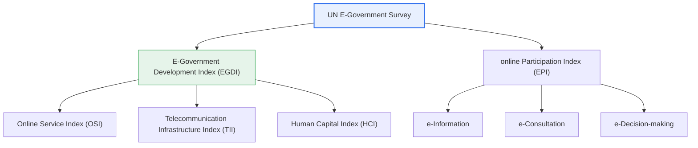
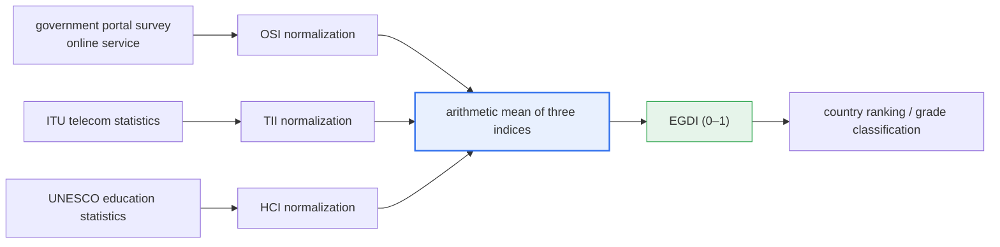

# UN E-Government Survey

## 1. Overview

### A. Definition
> **The UN E-Government Survey** is an international assessment in which the UN Department of Economic and Social Affairs (UN DESA) **measures and compares the development level of e-government and online citizen participation across all member states every two years**, publishing country rankings. It serves as a global benchmark that diagnoses the current status of each country's e-government and suggests directions for improvement.

The reason the UN E-Government Survey matters is that it "**compares the level of e-government using an internationally standardized yardstick**." Because each country has a different political, economic, and administrative environment and has followed a different path in developing e-government, without a common measurement standard it is hard to objectively judge how far ahead a given country is or what one's own country needs to improve. The UN Survey measures all member states with the same methodology along three common axes—online service, telecommunication infrastructure, and human capital—to reveal relative position, thereby helping each country identify its strengths and weaknesses and set the direction of its national informatization strategy.

Korea has long maintained a top-tier position in this assessment as an e-government leader, and the results are used both as an indicator that externally demonstrates national digital competitiveness and as a mirror to review the performance of the government's informatization policy. The assessment consists of two axes: the **Development Index (EGDI)**, which looks at the level of the services the government provides and their underlying foundations, and the **online Participation Index (EPI)**, which looks at the level of interaction and participation between government and citizens. That is, looking together at "how well the government is equipped" and "how much citizens participate" is the fundamental design philosophy of this assessment.

### B. Background and Necessity of Its Emergence
Behind the UN's launch of the e-government assessment was the worldwide wave of e-government construction in the early 2000s. Countries competitively brought government services online, but there was no common framework to compare and share the results. The UN institutionalized a periodic assessment so that all member states, including developing countries, could diagnose their own level and benchmark advanced cases, and to promote the role of digital government in closing the digital divide and achieving the Sustainable Development Goals (SDGs).

The necessity can be organized into three points. First, **diagnosis and benchmarking**. Using standardized indices, a country grasps its position and weak areas and learns from leading countries' cases. Second, a **policy driver**. International rankings become a powerful political motive that keeps governments investing in e-government. Third, **promoting inclusiveness**. Through the human-capital and infrastructure indices, it induces countries to aim beyond mere service construction toward an e-government that anyone can use.

## 2. The Index System and Overall Structure

The UN E-Government Survey consists of two indices—the Development Index (EGDI) and the online Participation Index (EPI)—and the EGDI is in turn calculated as the weighted average of three sub-indices. The structure diagram below shows the hierarchical relationship of the entire index set.

**The Development Index (EGDI)** represents the comprehensive development level of e-government and is calculated as the arithmetic mean of the three sub-indices detailed later. **The online Participation Index (EPI)** evaluates, in stages, the level at which the government provides information to citizens (e-Information), listens to opinions in the policy-formation process (e-Consultation), and further involves citizens in actual decision-making (e-Decision-making). The reason the two indices are viewed together is that no matter how high the Development Index, without citizen participation to back it, e-government remains "one-way service provision" and is not completed as democratic governance.

| Index | Object measured | Nature |
|---|---|---|
| **E-Government Development Index (EGDI)** | Comprehensive level of service, infrastructure, and human capacity | Supply/foundation-centered (0–1) |
| **online Participation Index (EPI)** | e-Information, e-Consultation, e-Decision-making | Interaction/participation-centered |

## 3. Composition and Calculation of the E-Government Development Index (EGDI)

The EGDI (E-Government Development Index) is calculated as a value between 0 and 1 by normalizing each of the three sub-indices and then averaging them; the larger the value, the more developed the e-government is considered. The diagram below shows the calculation process by which raw data proceeds through normalization and averaging to the final index and ranking.

### A. Online Service Index (OSI)
**The OSI (Online Service Index)** evaluates the range and quality of services the government provides online. It looks at whether the service stops at simply posting information, whether it completes the whole cycle of application, processing, and payment for civil affairs, and further whether it provides the services of multiple agencies seamlessly through a single window (one-stop / integrated service). In recent assessments, the survey items have expanded to include data openness, mobile services, and whether inclusive services for vulnerable groups are provided, evolving in a direction that emphasizes the "quality and inclusiveness" of services over their "quantity." Because the OSI is assessed by the UN survey team directly surveying and scoring each country's government portal, it differs in nature from the other indices and is the index in which the government's direct effort is most strongly reflected.

### B. Telecommunication Infrastructure Index (TII)
**The TII (Telecommunication Infrastructure Index)** evaluates the physical foundation on which citizens can actually use e-government services. It uses indicators such as the proportion of internet users, mobile subscriptions, and the diffusion level of high-speed wired and wireless broadband, mainly drawing on the statistics of the International Telecommunication Union (ITU). No matter how excellent the online service built, it is useless without a communication network to use it, so the TII corresponds to the underlying structure that determines the accessibility of e-government. The higher a country's broadband and mobile penetration, the more advantageous it is in this index.

### C. Human Capital Index (HCI)
**The HCI (Human Capital Index)** evaluates citizens' capacity to understand and use e-government services. It uses education-related indicators such as the adult literacy rate, enrollment ratio, and expected years of schooling, mainly based on UNESCO statistics. The reason this index is included in the system is that the ultimate purpose of e-government lies in "citizens' use." If digital literacy is low, even with services and infrastructure in place, they do not lead to actual use. Therefore, the HCI is the index that connects the supply side—services and infrastructure—with the demand side of citizens' capacity to use them.

The design of averaging the three indices produces the effect of **forcing balanced development** by making the overall EGDI fall if any one of service, infrastructure, and people lags. For example, even if the online service (OSI) is near a perfect score, a developing country with low telecommunication infrastructure (TII) or human capital (HCI) will find it hard to enter the top ranks of EGDI. This reflects, in the index structure itself, the point that e-government is not completed by the government's effort alone but is effective only on top of society-wide digital foundations.

Another point to note is that the **data sources of each sub-index differ**. The OSI is calculated by the UN survey team's direct portal survey, the TII by ITU telecommunication statistics, and the HCI by UNESCO education statistics. Therefore, for a country to raise its ranking, improving the government portal (OSI) alone is insufficient; government-wide cooperation—telecommunication policy, education policy, and more—must also take place. This is why the UN assessment is not merely a task of an IT ministry but a comprehensive national-level policy task.

## 4. The Participation Index (EPI) with Cases and Comparison

**The online Participation Index (EPI)** views government-citizen interaction in three stages. The first stage, **e-Information**, is the level of disclosing government information—policy, budget, laws—so that citizens can access it easily. The second, **e-Consultation**, is the activity of collecting citizens' opinions online in the policy-formation process. The third, **e-Decision-making**, is the most mature participation stage, reflecting the collected opinions in actual policy decisions. These three stages represent, as one moves from lower to higher, the direction in which citizens become the subjects of governance.

The three stages of participation can be organized as follows.

| Participation stage | Government activity | Citizens' role |
|---|---|---|
| **e-Information** | Disclosure of information such as policy, budget, laws | Viewing/using information |
| **e-Consultation** | Online opinion collection / public hearings | Submitting opinions / debating |
| **e-Decision-making** | Reflecting collected opinions in policy / feedback | Substantive participation in policy decisions |

Viewing EGDI and EPI together reveals differences in the character of each country's e-government. For example, a country with excellent infrastructure and services but low participation is characterized as an "efficient but one-way e-government," while conversely a country with active participation is characterized as a "democratic, open e-government." The fundamental reason for this difference lies in the difference in policy orientation—whether e-government is seen as "a means of administrative efficiency" or "an innovation in democratic governance." In Korea's case, it has shown strength in OSI with integrated services such as Government24 and Hometax, and has developed the participation aspect as well by operating windows on the government portal with the character of online participation and public petitions. However, because each country's ranking and detailed scores fluctuate with methodological revisions and other countries' advances at each assessment round, it is more accurate to understand it as the trend of "a leading country that has continuously maintained a top-tier position" rather than assertively citing the ranking of a specific round.

## 5. Deeper Dive: Methodological Evolution and Linkage with the Digital Platform Government

The methodology of the UN E-Government Survey is not fixed but has continuously expanded in line with the trends of the times. Initially it focused on the existence of government websites and whether services were provided, but it has gradually broadened its survey scope to include open government data, intelligent services such as mobile and chatbots, inclusion of vulnerable groups (leaving no one behind), and the **Local Online Service Index (LOSI)**, which separately assesses e-government at the local level. This reflects that the focus of e-government is shifting from "how many services have been brought online" to "whether it is an intelligent, inclusive digital government in which no one is left out and everyone participates."

In particular, the introduction of the Local Online Service Index (LOSI) is highly suggestive. Even if the completeness of the national representative portal is high, much of what citizens actually encounter in daily life is the services of local governments, so by jointly assessing the service gap between central and local levels, the intent is to diagnose the "perceived quality" of e-government more precisely. This shows that the focus of assessment is broadening from a single representative indicator to the sum of the services citizens actually face.

Korea's **Digital Platform Government** strategy is closely aligned with this direction of the UN assessment's development. Opening and linking data to remove silos between ministries, providing AI-based personalized services, and involving citizens in policy decisions—these orientations align precisely with the sophistication direction that OSI and EPI demand. Therefore, responding to the UN assessment is not merely ranking management but is connected to the national e-government sophistication strategy itself. However, one must guard against the possibility that excessive optimization to the assessment indicators becomes divorced from the actual perceived quality of services for citizens, and a balance that pursues both indicator response and substantive service innovation is needed.

In addition, given that the UN assessment, by its nature as a cross-country comparison, refines its methodology at each round and adds new items (data openness, AI services, local-government assessment, etc.), it is desirable to use it as a structural diagnosis of "in which areas strengths and weaknesses appear" rather than the ranking or absolute score at a specific point. For example, if infrastructure and service scores are high but the participation score comes out relatively low, this can be read as a signal that citizen-participation channels are formal relative to service completeness, and fed back into policy by strengthening open policy-decision platforms. This attitude of using the assessment as a diagnostic tool contributes more substantively to e-government sophistication than chasing the ranking itself.

## 6. Considerations and Implications (Professional Engineer's Perspective)

1. **Balanced development of the three axes is key.** Because the EGDI is calculated as the average of OSI, TII, and HCI, even if excellent online services are built, if telecommunication infrastructure or citizens' capacity to use them lags, the overall score falls. An integrated strategy that raises service, infrastructure, and human capacity together is required.

2. **The center of gravity shifts from supply to participation.** Beyond mere service provision, "open government," in which citizens participate in policy decisions, is emphasized, and the importance of EPI is growing. Going forward, how substantively e-government implements participation at the e-Decision-making stage will distinguish its maturity.

3. **Link it with the Digital Platform Government and data openness.** Because the UN assessment's direction of development (data openness, personalized services, citizen participation) aligns with the domestic Digital Platform Government strategy, the assessment response must be pursued in integration with the national e-government sophistication strategy for synergy.

4. **Pursue inclusiveness and closing the digital divide in parallel.** As the Human Capital Index and the "leaving no one behind" stance show, without securing accessibility for the digitally vulnerable—the elderly, people with disabilities, low-income groups—it is hard to be recognized as a true achievement of e-government. Accessibility and digital-inclusion policies must be designed together.

5. **Maintain a balance between indicator optimization and substantive innovation.** Over-optimizing to indicators with the sole aim of rising in the rankings can diverge from citizens' perceived quality, so the assessment indicators should be used as a directional lighthouse, while making actual service innovation and improvement of user experience the ultimate goal.

6. **Closing the central-local gap is the next task.** As the introduction of LOSI suggests, much of the service citizens encounter in daily life is provided by local governments, so the completeness of the central portal alone cannot guarantee true e-government maturity. Standardization and upward leveling of local-government services must be pursued together to raise the perceived quality of the nation as a whole.

In sum, the UN E-Government Survey views e-government as a combination of "efficient administration" and "democratic governance" along two axes: the balance of service, infrastructure, and human capital (EGDI) and the maturity of citizen participation leading from information provision to policy participation (EPI). From a professional engineer's perspective, the key is the design capacity to align this index structure with the national informatization and Digital Platform Government strategy, feeding it back not into ranking management but into the substantive goals of enhancing citizen-perceived service and inclusiveness.

## References
- UN DESA, UN E-Government Survey (methodology and EGDI/EPI overview): https://publicadministration.un.org/egovkb/en-us/
- ITU, ICT statistics (raw data for the Telecommunication Infrastructure Index): https://www.itu.int/en/ITU-D/Statistics/
- Republic of Korea Digital Platform Government Committee: https://www.dpg.go.kr/

---

> **In one line**: The UN E-Government Survey measures each country by the *Development Index (EGDI) and the online Participation Index (EPI)*; the EGDI is calculated as the average of the three axes of *online service (OSI), telecommunication infrastructure (TII), and human capital (HCI)*, demanding **balance of service, infrastructure, and capacity and a shift from supply to participation**.
