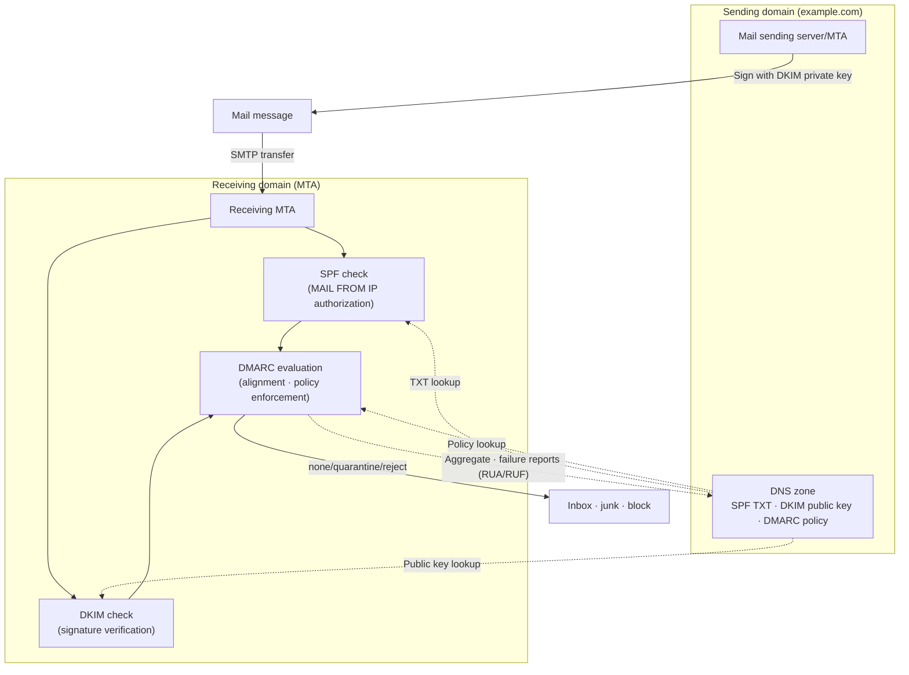
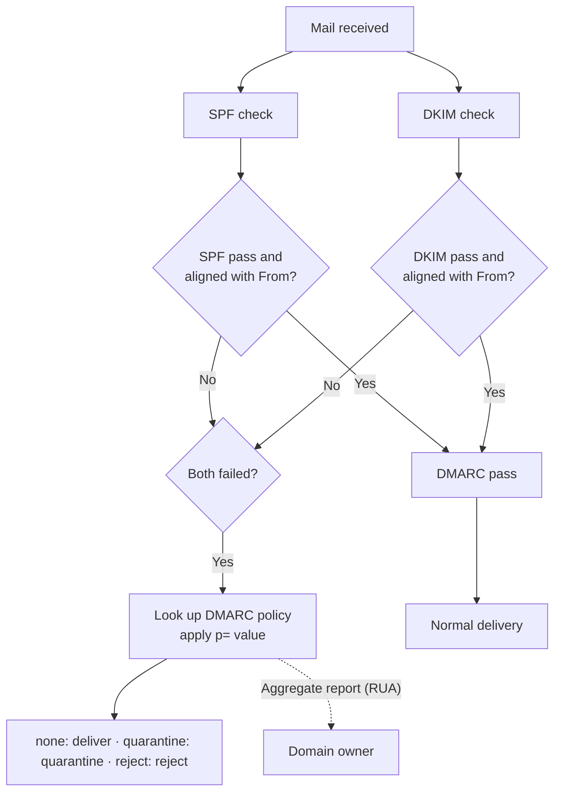

# Email Authentication Framework (SPF, DKIM, DMARC)

## 1. Overview

> An **email authentication framework** is a set of standard technologies that verify the legitimacy of the sending domain in order to filter out mail from forged senders (spoofing). It consists of **SPF (Sender Policy Framework, RFC 7208)**, which authorizes sending IPs; **DKIM (DomainKeys Identified Mail, RFC 6376)**, which attaches a digital signature to messages; and **DMARC (Domain-based Message Authentication, Reporting and Conformance, RFC 7489)**, which aligns the results of the other two with the sending domain (From) and binds them into policy and reporting.

The fundamental reason email authentication became necessary lies in an inherent limitation: **SMTP (Simple Mail Transfer Protocol) itself does not verify the sender**. SMTP, defined in RFC 821 in 1982, was designed for small, trusted networks, and it does not check whatever address the sender puts in `MAIL FROM` or the `From` header. As a result, anyone can easily send mail impersonating another domain, such as `From: ceo@mybank.com`, and this became the technical foundation of phishing, spear phishing, and **Business Email Compromise (BEC)**.

Damage from BEC is already severe across industries. The annual reports of the US FBI IC3 count BEC losses in the billions of dollars every year, and in Korea, impersonation emails that divert trade payments occur repeatedly. Such threats are hard to stop with the statistical judgments of spam filters alone, because impersonation emails have the same grammar and format as legitimate mail and sometimes request only an account change without any malicious attachment. Therefore, sending-domain authentication that verifies "**was this mail really sent from that domain?**" using the policy published by the domain owner and cryptographic evidence became essential. SPF, DKIM, and DMARC take on complementary roles — IP authorization, integrity/signature, and policy/alignment/reporting respectively — to form a single trust framework.

## 2. Overall Authentication Flow and Structure

Email authentication operates as a **distributed trust model** in which the sender publishes policies and public keys in DNS, and the receiving mail server looks them up and verifies them at the moment mail is received. The concept diagram below shows the overall structure from sending through receiving, verification, and reporting.

In this flow, the roles of the sender and receiver are clearly separated. The sender is responsible for "declaring" the IPs, signing keys, and handling policy of the sending servers it controls via DNS, while the receiver is responsible for "verifying and enforcing" those declarations according to the standards. Preparing only one side has no effect. No matter how strict a policy the sending domain publishes, if the receiving server does not interpret and enforce it, spoofed mail is delivered as is; conversely, even if the receiving server attempts verification, it has no basis for judgment if the sending domain has no records. For this reason, email authentication has the nature of **collective security**, gaining ecosystem-level defensive power only when mail providers and domain owners around the world adopt common standards.

The key to this structure is that **the domain owner holds control**. The sender only needs to publish policy in its own DNS, and receiving servers worldwide interpret it according to the standards. Because trust is formed on top of the existing DNS infrastructure without a separate central certificate authority (CA), scalability is excellent. However, since DNS management becomes security management, the accuracy of DNS records and the safety of private key storage determine the trust of the entire framework.

The three technologies differ in what they verify and how. SPF looks at "which servers (IPs) may send on behalf of this domain," while DKIM looks at "was the message signed with that domain's key without forgery or tampering." However, neither technology directly verifies the **header From address** that users actually see, leaving a gap — and DMARC emerged precisely to fill that gap.

## 3. Details by Component

### A. SPF — Sending IP Authorization

SPF is a method in which the domain owner publishes "the list of IPs of servers that may send mail on behalf of my domain" as a DNS TXT record. The receiving server looks up the SPF record of the **envelope sender (`MAIL FROM`)** domain of the SMTP session and checks whether the actually connecting sending IP is in the authorized list. For example, `v=spf1 include:_spf.google.com ip4:203.0.113.10 -all` means that the Google Workspace sending server group and a specific IP are allowed, and all others are rejected (`-all`, hard fail). `~all` (soft fail) means "suspicious but pass," and `?all` (neutral) means no judgment.

SPF's strengths are that it is simple to implement and allows explicit control over the sending server infrastructure. However, it has two fundamental limitations. First, **it breaks on forwarding.** When a user automatically forwards mail to another address, the sending IP changes to that of the forwarding server, which no longer matches the original domain's SPF. Second, what SPF verifies is the envelope sender, **not the header From that the user sees on screen.** An attacker can pass SPF with a domain they control while spoofing only the header From. SPF also has a **limit of 10 DNS lookups**, so overuse of `include` causes authentication to fail with `permerror`. In practice, every time a SaaS mail service (marketing tool, CRM, etc.) is added, the record must be flattened or cleaned up so as not to exceed this limit.

The SPF result gains more meaning when used as input to DMARC alignment rather than to block mail on its own. For example, even if mail whose envelope sender domain differs from its header From domain passes SPF, it is not recognized as authenticated if it fails DMARC's SPF alignment (`aspf`) criterion. Therefore, it is desirable to regard SPF as "the groundwork that explicitly declares the sending infrastructure" and delegate the final judgment on blocking spoofing to DMARC. This perspective is the starting point for operating the three technologies as a single framework rather than as separate functions.

### B. DKIM — Digital-Signature-Based Integrity

In DKIM, the sending server **signs** the key headers and body of the message **with a private key** and publishes the corresponding public key in DNS so that the receiver can verify the signature. The signature information is contained in the `DKIM-Signature` header, and a selector is used to find the public key (TXT) at `selector._domainkey.domain`. It includes the list of signed headers (`h=`), the body hash (`bh=`), and the signature value (`b=`), so verification fails if even a single character of the body or signed headers changes in transit. In other words, DKIM provides sending-domain confirmation and **message integrity** simultaneously.

A detail that determines the stability of signing and verification is **canonicalization**. Mail may change slightly during relay — whitespace, line breaks, header folding, etc. — and the canonicalization method (`c=` parameter) determines whether such trivial changes are tolerated in signature verification. `simple` allows no changes and is strict but vulnerable to relay alterations, while `relaxed` absorbs harmless changes such as whitespace normalization and is widely used in practice. Typically `relaxed` is chosen for both headers and body to reduce false positives from legitimate relay alterations, while still detecting substantive changes to body content. In this way, DKIM uses canonicalization to balance "integrity" and "relay tolerance."

DKIM is relatively robust to forwarding. Since the signature is attached to the message itself rather than to an IP, verification holds across multiple servers as long as the body and signed headers are preserved. However, the signature can break when a mailing list adds a `[list]` tag to the subject or appends a footer. From an operational perspective, **key management** is what matters. A key length of at least 2048 bits is recommended (1024 bits is weak), and **periodic key rotation** using selectors is desirable to prepare for compromise. If the signing private key leaks, an attacker can forge legitimate signatures, so the private key must be protected with an HSM or a secrets management system.

### C. DMARC — Alignment, Policy, and Reporting

DMARC is an upper layer that **aligns** the SPF and DKIM results **with the header From domain** and lets the domain owner specify the handling policy on failure and the report recipient addresses. Alignment is the concept of checking "does the domain used for authentication match the From domain the user sees?", thereby filling the "unverified header From" gap left by SPF and DKIM. Alignment modes are divided into **strict**, which requires an exact match, and **relaxed**, which allows a match at the organizational domain level.

An example DMARC record looks like `v=DMARC1; p=reject; rua=mailto:agg@example.com; ruf=mailto:forensic@example.com; pct=100; adkim=s; aspf=r`. The policy `p` dictates how to handle mail for which no aligned authentication succeeded, and has three levels. **none** only monitors without taking action (for observation in the early stage of adoption), **quarantine** sends mail to junk/quarantine, and **reject** refuses it outright. Receiving servers send daily **aggregate reports (XML)** to the address specified by `rua`, telling how much mail which IPs sent under our domain name and what the authentication results were. These reports are the real value of DMARC. Through them, the domain owner can make visible both legitimate senders they were not aware of (shadow IT) and spoofing attempts.

DMARC adoption must proceed **in stages**. The standard approach is to start with `p=none`, reflect all legitimate senders in SPF and DKIM based on aggregate reports, gradually raise `pct` (enforcement percentage), go through `quarantine`, and finally reach `p=reject`. Starting hastily with `reject` causes incidents in which legitimate systems not yet registered (payroll, notifications, marketing mail, etc.) are blocked en masse.

Below is a flowchart showing the receiving server's DMARC evaluation procedure.

## 4. Comparison and Complementary Relationship

The three technologies are not substitutes but **hierarchical complements**. Using SPF alone leaves you vulnerable to forwarding and header spoofing; using DKIM alone cannot enforce by policy which senders are legitimate; and DMARC has no basis for judgment without SPF and DKIM. Only by deploying all three together is the goal achieved: "legitimate domain mail passes, spoofing is blocked, and unknown senders are made visible through reports."

| Category | SPF | DKIM | DMARC |
|------|-----|------|-------|
| Verification target | Envelope sender (MAIL FROM) IP | Message signature and integrity | Header From alignment and policy |
| Method | Authorized IP list in DNS TXT | Public-key digital signature | Alignment judgment of SPF/DKIM results |
| Forwarding tolerance | Weak (fails when IP changes) | Strong (passes if signature preserved) | Depends on underlying results |
| Spoofing defense | Envelope domain only | Signing domain only | Defends the From the user sees |
| Reporting | None | None | Aggregate and failure reports |
| Main limitation | 10 DNS lookup limit | Breaks under list modifications | Requires the two underlying technologies |

The division of labor among the three becomes clear when understood through a concrete situation. Suppose an attacker properly configures SPF and DKIM for a domain they control, `evil.example`, and then sends mail with only the header forged as `From: ceo@mybank.com`. In this case, SPF and DKIM both pass with respect to `evil.example`. However, DMARC catches that the domain used for authentication (`evil.example`) and the From domain the user sees (`mybank.com`) are not aligned, and rejects the mail according to `mybank.com`'s DMARC policy (`p=reject`). Conversely, in legitimate sending, the authentication domain and the From domain match, so alignment holds and the mail is delivered normally. Thus, only with DMARC's alignment check is defense of "the sender the user actually sees" completed.

To address authentication failures caused by forwarding, **ARC (Authenticated Received Chain, RFC 8617)** was proposed. ARC is a method in which, as mail passes through intermediate servers (mailing lists, forwarders), each relay point signs and preserves the original authentication results, allowing the final recipient to trust the chain stating "SPF broke during forwarding, but this mail was originally legitimate." Large mail services already incorporate ARC to reduce false positives on forwarded mail.

## 5. Advanced — Latest Trends and Practical Application

### A. Mandatory Authentication for Bulk Senders (2024–)

Starting in 2024, email authentication shifted from a "recommendation" to a de facto "requirement." From February 2024, Google and Yahoo began requiring **bulk senders sending 5,000 or more messages per day** to implement all of SPF, DKIM, and DMARC, and enforcing one-click unsubscribe (RFC 8058) and a spam complaint rate below 0.3%. Microsoft is also applying similar requirements in phases. This means every company handling marketing or transactional notification mail must reorganize its authentication configuration per sender, and non-compliance leads to direct business losses in the form of plummeting deliverability. In fact, many commerce and financial companies used this moment to separate subdomains per CRM/marketing tool and to reorganize DKIM signing delegation.

### B. BIMI — Brand Logos and Visualizing Trust

**BIMI (Brand Indicators for Message Identification)** is a specification that displays a **verified brand logo** in the inbox for mail sent by domains that enforce DMARC at `quarantine` or higher. The legitimacy of the logo is guaranteed by a certificate called a **VMC (Verified Mark Certificate)**, and recently the CMC (Common Mark Certificate), which can be issued without trademark registration, is also being introduced. BIMI functions less as an authentication technology in itself than as a **business incentive** that drives DMARC enforcement. In other words, its structure is "to display your logo, first do DMARC properly," and it is notable for linking brand marketing with email security.

### C. Adoption Cases and Common Misconfigurations

In practice, the success or failure of DMARC adoption usually depends on "how completely legitimate senders were identified." Large organizations often have dozens of senders using the domain name besides the headquarters mail server — payroll/HR notification systems, marketing automation tools, help desk ticketing systems, payment receipt senders, and so on. As in the case of a global company that collected aggregate reports under `p=none` for three months and discovered about 20 sending systems it had not been aware of internally, if report-based sender inventory work is not done first, legitimate business mail will be blocked en masse when switching to `reject`. Completing adoption usually takes several months to a year, because organizationally sorting out "who sends mail using our domain" takes more time than the technical configuration.

Typical misconfigurations include: ① exceeding the 10 DNS lookup limit through overuse of SPF `include`, causing `permerror`; ② registering multiple SPF TXT records (only one is allowed), invalidating verification; ③ setting DMARC to `reject` but not specifying a subdomain policy (`sp=`), leaving subdomains unprotected; and ④ not specifying a report address (`rua`), so spoofing attempts cannot be observed at all. Such misconfigurations are hard to diagnose because they appear to work normally on the surface, and are discovered only through regular authentication status checks and report monitoring.

### D. Domestic Application and Past Exam Links

In the Korean public and financial sectors, DMARC adoption is also expanding to counter impersonation mail, and from the perspective of personal information protection and information security management systems (ISMS-P), mail security relates to administrative and technical control items. In the Professional Engineer exam, questions are likely to ask about the individual principles of SPF, DKIM, and DMARC, the complementary relationship among the three, phased adoption strategy (none→reject), and countermeasures against BEC and phishing. When writing an answer, structuring it as a causal flow — "structural limitations of SMTP → division of roles among the technologies → trust framework completed by alignment → phased adoption strategy" — rather than a simple list is advantageous for a high score.

## 6. Considerations and Implications

- **Phased adoption and use of reports (application strategy):** DMARC must start with `p=none`, identify and register all legitimate senders through aggregate reports, and then be raised to `quarantine` and `reject`. Since report analysis is difficult to do manually, the key is an operating system that continuously manages the sender inventory using dedicated analysis tools and services.

- **Trade-off between availability and security:** `p=reject` and strict alignment are highly effective in blocking spoofing, but may also block mail from unregistered legitimate systems and cause business disruption. Conversely, relaxed settings are safe but weaker in defense. A balance must be struck according to the organization's risk appetite and the maturity of its sending infrastructure.

- **Importance of key and DNS management:** DKIM private key leakage and DNS record errors lead directly to signature forgery and mass false positives, respectively. The root of trust must be strengthened through keys of 2048 bits or more, periodic selector rotation, configuration management of DNS changes, and parallel use of DNSSEC.

- **Handling forwarding and list environments (related technologies):** Since SPF easily breaks in mailing list and automatic forwarding environments, it is desirable to use DKIM and ARC together, and when necessary, to separate a dedicated sending subdomain to isolate and manage reputation.

- **Governance and organizational management:** Email authentication is not a technical setting of a particular department but an enterprise-wide asset management issue involving every party that sends mail under the domain — marketing, HR, IT, security, and so on. Unless a process and responsibilities (RACI) controlling the registration and change of senders are defined, authentication gaps will recur every time a new SaaS is introduced.

- **Outlook:** With mandatory authentication for bulk senders and the spread of BIMI, email authentication is becoming essential infrastructure rather than an option, and it is expected to evolve into multi-layered defense that combines sending-domain authentication with content- and behavior-based analysis (threat intelligence, XDR) to counter increasingly sophisticated AI-based phishing.

## References

- RFC 7208, Sender Policy Framework (SPF): https://datatracker.ietf.org/doc/html/rfc7208
- RFC 6376, DomainKeys Identified Mail (DKIM) Signatures: https://datatracker.ietf.org/doc/html/rfc6376
- RFC 7489, Domain-based Message Authentication, Reporting, and Conformance (DMARC): https://datatracker.ietf.org/doc/html/rfc7489
- RFC 8617, The Authenticated Received Chain (ARC) Protocol: https://datatracker.ietf.org/doc/html/rfc8617
- Google, Email sender guidelines: https://support.google.com/a/answer/81126
- BIMI Group: https://bimigroup.org/

---

> **In one line**: SPF (sending IP authorization), DKIM (digital-signature integrity), and DMARC (header From alignment, policy, and reporting) form a complementary email authentication framework that hierarchically compensates for SMTP's lack of sender verification to block spoofing, phishing, and BEC, and phased adoption from `p=none` to `reject` together with report-based sender management is the key to success.
