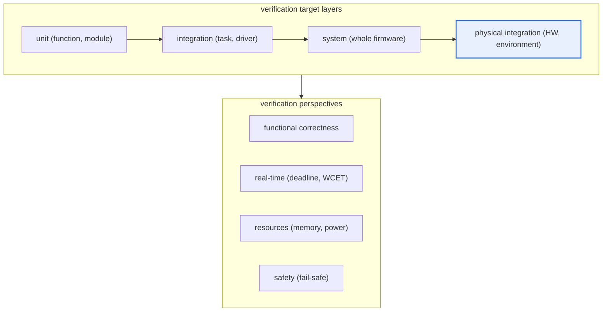
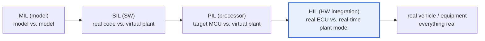

# Embedded Software Test

## 1. Overview

### A. Definition
> **Embedded software testing** is the activity of **verifying the function, performance, and safety of embedded software—which is built into specific hardware and operates in a real-time, resource-constrained environment—including its interaction with the hardware (sensors, actuators, communication, timing).**

The fundamental reason embedded SW testing differs from general SW testing is that "**the software is bound to hardware and the physical world.**" A general application runs in a rich environment such as a PC or server (several GB of memory, a multicore CPU, a full OS, debuggers and profilers), but embedded SW is built into specific hardware (automotive ECUs, medical devices, industrial PLCs, home appliances) with tens of KB to a few MB of memory and an MCU on the order of tens to hundreds of MHz, and interacts with sensors and actuators in real time. Therefore, checking only the software's logic is not enough for testing either.

The axes that must be confirmed in embedded testing fall broadly into four. The first is **real-time behavior**—whether it responds within a set deadline and whether the WCET (Worst-Case Execution Time) fits within the period. The second is **resource constraints**—whether it operates within a limited memory, stack, and power budget, and whether there is no stack overflow or heap fragmentation. The third is **hardware dependency**—whether interworking with interrupts, DMA, timers, and communication buses (CAN, SPI, I2C, etc.) is correct. The fourth is **safety**—because a malfunction leads directly to a physical accident (vehicle braking failure, medical-device malfunction, industrial-equipment runaway), whether it converges to a safe state (fail-safe) on failure.

There is also the practical constraint that it is hard to test directly on the target hardware and that observation and debugging means are limited (a few pins, JTAG, insufficient headroom for log output). For this reason, embedded testing uses a staged strategy that starts from models and simulation and gradually approaches the actual processor and hardware (MIL→SIL→PIL→HIL). Early in development, it verifies in large volumes in a cheap, fast, risk-free virtual environment, and confirms consistency with actual physical conditions at the final stage on real equipment, balancing cost and quality.

### B. Special Characteristics
Five factors—real-time behavior, resource constraints, hardware dependency, high safety and reliability demands, and limited observation and debugging means—determine the difficulty of embedded testing. In particular, "defects that are hard to reproduce (heisenbugs that depend on timing, race conditions, and interrupt order)" and "observation interference (the probe effect), in which observation changes the target's behavior," are difficulties unique to embedded systems.

## 2. Overall Structure — Test Targets and Perspectives

The overall structure of embedded testing is best understood as a matrix crossing "verification targets (SW, interworking, physical environment)" with "verification perspectives (function, real-time, resource, safety)." The structure diagram below shows that embedded SW testing starts at the software unit and expands to hardware and the physical environment, with each layer requiring a different perspective.

**Unit and integration tests** check the logic and boundary values at the function and driver level, often performed with stubs/mocks that virtualize the hardware or with host compilation. **System testing** targets the whole firmware to check scenarios, state transitions, and exception handling. **Physical integration testing** connects real sensors, actuators, power, and communication to verify even physical conditions such as temperature, voltage, and noise. The four items on the perspective axis are applied repeatedly at all layers, but real-time behavior and safety in particular are decisively revealed at the physical-integration stage.

The reason this structure matters is that the later a defect is found, the more sharply the cost of fixing it rises. Finding a logic defect at the physical-integration (HIL) or in-vehicle stage costs greatly for root-cause isolation, because the hardware wiring and test setup are already entangled. So the standard is to filter out as many function and boundary defects as possible at the cheap SIL stage and focus HIL on "physical and timing problems that cannot be reproduced in the virtual world."

## 3. Test Stages — X-in-the-Loop

X-in-the-Loop, the core methodology of embedded verification, progressively makes the verification environment closer to reality in step with the development stage. Early on, it verifies with models and simulation, then gradually combines actual code → target processor → real hardware, finally performing real-time integrated verification on real equipment. The detailed architecture below shows "what is real and what is simulation" at each stage.

**The MIL (Model-in-the-Loop)** stage, before the control algorithm has yet been made into code, simulates at the model level (e.g., a Simulink block diagram) together with a plant model of the controlled object. The purpose of this stage is to cheaply confirm "whether the design concept satisfies the requirements." For example, one can verify the stability and responsiveness of vehicle cruise-control logic early by running thousands of driving scenarios on a laptop without an actual ECU.

**The SIL (Software-in-the-Loop)** stage compiles the **actual C code**—generated from the model or written directly—on the host PC and runs it together with a virtual plant model. Here it confirms whether the code behaves identically to the model (code-model equivalence) and whether the error is within tolerance when converting floating point to fixed point. SIL has fast execution speed and easy coverage measurement and debugging, making it most suitable for automating regression tests in large volumes.

**The PIL (Processor-in-the-Loop)** stage runs the code on the **actual target processor (or a cycle-accurate instruction-set simulator)**. Because compiler optimization and target-architecture characteristics can make the result differ from the host, this stage confirms numerical accuracy on the target and execution time (cycle count). WCET measurement and stack-usage confirmation are often done here.

**The HIL (Hardware-in-the-Loop)** stage connects the **actual ECU (controller)** to a real-time plant simulator, injecting fake sensor signals and receiving actuator outputs to verify in a closed loop. HIL can safely and repeatedly reproduce dangerous failure scenarios (sensor disconnection, sudden load changes, communication errors) without a real vehicle or real facility, making it essential equipment in the automotive, aerospace, and power-generation fields. At the final **real-vehicle / real-equipment** stage, all elements are integrated as real objects for final verification.

| Stage | Verification target (real) | Main purpose | Representative tools/environment |
|---|---|---|---|
| **MIL** | None (model only) | Verify design concept | Model simulation such as Simulink |
| **SIL** | Actual code (host) | Code-model equivalence, regression automation | Host compilation + virtual plant |
| **PIL** | Code + target processor | Target accuracy, execution time | Evaluation board, ISS |
| **HIL** | Actual ECU + real-time | Closed-loop, fault-injection verification | Real-time simulator (HIL rig) |

## 4. Major Test Perspectives and Techniques — Details

In embedded testing, each perspective requires its own techniques. Below, the principle and practical implication of each item are described.

**Real-time verification** differs from general performance testing in that it looks at the "worst case," not the "average." In a hard-real-time system, exceeding the deadline even once can cause an accident, so judgment is based not on statistical response time but on the WCET and schedulability (RMA, response-time analysis, etc.). For example, if airbag-deployment logic must issue an ignition signal within a few ms after detecting a collision, then no matter how good the average latency is, one must prove that the latency of the worst-case path does not exceed the deadline.

**Resource-constraint verification** looks not only at normal operation but also at leaks and fragmentation during long-running operation. Stack usage is measured as a worst-case value that also considers interrupt nesting, and when dynamic memory is used, the possibility of allocation failure due to fragmentation is inspected. This is why many safety-critical coding standards (e.g., MISRA C) restrict the use of dynamic memory.

**Hardware-interworking verification** handles sensor-value range and noise, interrupt latency and nesting, and communication-frame accuracy and error handling. Defects in this area are often reproduced only at specific timing, so they are filtered in a HIL environment that replays actual signals or injects faults. For example, one tests whether the controller returns to a safe state in a situation where the CAN bus momentarily goes bus-off.

**Safety and reliability verification** looks at coverage and fault response together. In particular, code with high safety integrity requires **MC/DC (Modified Condition/Decision Coverage)**. This is a strong coverage criterion showing that each condition independently affects the decision outcome, required at the highest grade of aviation (DO-178C, DAL A) and the high ASIL grades of automotive (ISO 26262). It is far stricter than simple statement coverage or branch coverage, and its practical advantage is proving completeness with only part of the condition combinations.

| Perspective | Core question | Representative technique |
|---|---|---|
| **Real-time** | Does it meet the deadline even in the worst case? | WCET analysis, schedulability analysis |
| **Resource constraint** | Is it stable within the budget? | Stack high-water-mark measurement, static analysis |
| **Hardware interworking** | Are signals, communication, and interrupts correct? | Fault injection, signal replay, HIL |
| **Safety** | Is it safe on failure, and is coverage sufficient? | Fail-safe testing, MC/DC coverage |
| **Environmental testing** | Does it endure physical conditions? | Temperature, voltage, EMC testing |

### The Decisive Differences from General SW Testing

Organizing where embedded testing diverges from general SW testing makes the practical implications clear. General application testing focuses on "is the function correct" and "is the average performance sufficient," and when a defect occurs, it can usually be recovered by restart or rollback. In contrast, embedded testing must prove "is it safe even in the worst moment," and if a defect leads to a physical accident, recovery is impossible.

The difference in observability is also large. In a general environment, logs, debuggers, and profilers can be used abundantly, but in embedded systems, even log output causes observation interference (the probe effect) that changes timing and hides defects. For this reason, embedded-specific verification means such as non-intrusive trace hardware, real-time closed-loop simulators (HIL), and fault injection have developed. Ultimately, the strategic judgment of "when, where, and what to keep real for verification" determines the success or failure of embedded testing.

## 5. Deeper Dive — Standards, Industry Cases, and Latest Trends

Embedded testing cannot be considered apart from domain-specific **functional-safety standards**. In automotive, ISO 26262 stipulates the required coverage and verification procedures by ASIL grade (A–D), and, as a higher-level concept, the Safety of the Intended Functionality (SOTIF, ISO 21448) addresses situations such as autonomous driving that "can be dangerous due to performance limits even without a fault." In aviation, DO-178C sets verification objectives by software level (DAL A–E), requiring MC/DC at the highest grade. In general industry, IEC 61508 defines the safety-integrity level with SIL (1–4). Because such standards enforce "how much and by what method" testing must be done at the contract level, the embedded test strategy itself is designed as a process that produces standard-compliance evidence.

Looking at concrete cases in the field, large automakers and parts suppliers automatically run regression verification for hundreds of ECUs at night on dozens of HIL rigs and SIL farms. It is becoming common to have a pipeline that quickly checks thousands of scenarios with SIL every time a code change is committed, and passes only the builds that pass to HIL to catch real-time and physical defects. This shows that continuous integration (CI) and test automation have become standard practice even in embedded systems.

Three latest trends stand out. First, the spread of **virtual ECUs and digital twins**. Running large numbers of virtual plants and virtual ECUs in parallel in the cloud, verifying tens of thousands of scenarios without a shortage of real equipment, is increasing. Second, the flow of **SDV (Software-Defined Vehicle) and OTA**. As vehicle SW is updated wirelessly even after shipment, the demand to automate and continuously perform pre- and post-update regression verification and safety argumentation has grown. Third, the **verification of AI and data-based systems**. Because traditional coverage is insufficient for deep-learning perception modules, scenario-coverage and data-distribution-based verification is being combined with the SOTIF perspective. These trends suggest that embedded testing is shifting its center of gravity from "real-equipment-centered" to "virtual, data-centered continuous verification."

## 6. Considerations and Implications

1. **Make standard compliance the starting point of the test strategy.** The coverage (MC/DC, etc.), verification procedures, and traceability evidence required by domain standards such as ISO 26262, DO-178C, and IEC 61508 must be reflected in the plan from the outset to avoid rework at the certification stage. One must recognize that testing is not only defect discovery but an activity that "generates the basis of the safety argument." [[software-safety-analysis]]
2. **Clearly divide the roles of simulation and real equipment.** Remove function and boundary defects in large volumes early with cheap, fast SIL and MIL, and focus HIL and the real vehicle on real-time, physical, and fault scenarios that cannot be reproduced in the virtual world, thereby optimizing cost and quality simultaneously. Designing "what to filter" at each stage is key.
3. **Establish automation and CI suited to embedded systems.** Combine HIL automation equipment and SIL farms into the CI pipeline to have a system that repeatedly performs regression verification at night despite frequent changes. However, for real-time and physically dependent tests, securing reproducibility (signal replay, seed fixing) is the crux, and managing flaky tests is the prerequisite for trust.
4. **Manage observation interference and reproducibility.** Considering the probe effect, in which debugging logs and probes change timing and hide defects or create new ones, one must arrange non-intrusive trace hardware and a deterministic reproduction environment.
5. **Transition to a continuous-verification system for the SDV, OTA, and AI era.** In preparation for post-shipment updates and the expansion of autonomous features, securing continuous-verification capability that combines large-scale parallel verification based on virtual ECUs and digital twins with SOTIF and scenario coverage becomes future competitiveness.

## References
- ISO 26262 Road vehicles — Functional safety, https://www.iso.org/standard/68383.html
- ISO 21448 Road vehicles — Safety of the intended functionality (SOTIF), https://www.iso.org/standard/77490.html
- RTCA DO-178C / MC/DC overview (NASA Technical Reports), https://ntrs.nasa.gov/citations/20010057789
- IEC 61508 Functional safety of E/E/PE safety-related systems, https://www.iec.ch/functional-safety

---

> **In one line**: Embedded SW testing is the activity of *verifying hardware, real-time, resource constraints, and safety in a closed loop*; it progressively approaches the actual environment through MIL→SIL→PIL→HIL, satisfies the coverage (MC/DC) and traceability requirements of functional-safety standards such as ISO 26262 and DO-178C, and is evolving toward continuous verification based on SDV and digital twins.
