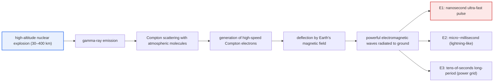
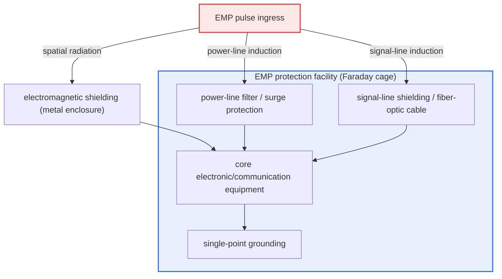

# EMP Attack (ElectroMagnetic Pulse Attack)

## 1. Overview

### A. Definition and Problem Awareness
> **An EMP attack** is an attack that uses a **powerful electromagnetic pulse generated instantaneously to induce overcurrent and overvoltage in the semiconductor circuits of electronic, power, and communication equipment, destroying or paralyzing them.** In that it can simultaneously disable the electronic systems of a wide area without physical explosion or loss of life, it is classified as an "electronic weapon of mass destruction (e-WMD)."

The fundamental reason an EMP attack differs from other physical or cyber threats is that it "**simultaneously paralyzes the entire electronic nervous system of society without a single bullet or a single line of malware.**" Modern society depends on semiconductor-based electronic systems across the power grid, communications, finance, transportation, healthcare, and defense. Yet a semiconductor device suffers permanent damage as its junction melts when current flows the instant the rated voltage is greatly exceeded. EMP targets precisely this physical vulnerability. When a powerful electromagnetic pulse is emitted instantaneously, voltage is induced in conductors (wires, board traces, antennas), and if this induced voltage exceeds the device's withstand voltage, the circuit burns out. As a result, electronic equipment over a wide area goes dead **simultaneously and in a form that cannot be recovered by software.**

What is particularly problematic is that modern infrastructure is interdependent. If the power grid stops, communications, water supply, cooling, and financial computing stop in a chain, and if even the control circuits of backup generators are damaged by EMP, recovery itself becomes impossible. A cyber attack can be countered with backups, patches, and isolation, but EMP directly destroys the physical layer (hardware), so it cannot be reversed by a reboot or software recovery. For this reason, major countries treat EMP as an independent threat category distinct from conventional, nuclear, and cyber threats, and apply separate EMP protection (shielding) standards to critical national facilities.

### B. Classification by Cause of Occurrence
Depending on how an EMP occurs, the scale of the threat and the response approach differ greatly. **HEMP**, generated by a high-altitude nuclear explosion, can cause continental-scale damage with a single event and is treated as a national-security threat; **non-nuclear EMP (NNEMP)**, made with electromagnetic weapons without a nuclear device, is localized but a realistic threat in terrorism and on the battlefield; and **natural EMP (space weather)**, caused by solar flares, is not a man-made attack but has a precedent of actually causing large-scale power outages in the grid.

| Category | Cause | Damage range | Characteristics |
|---|---|---|---|
| **HEMP (nuclear EMP)** | High-altitude (30–400 km) nuclear explosion | Wide-area (continental scale possible) | E1, E2, E3 components; the maximum threat |
| **Non-nuclear EMP (NNEMP)** | Electromagnetic weapons (HPM, EMP bomb, explosively pumped flux compression generator) | Localized (hundreds of m to a few km) | Realistic for conventional and terrorist use |
| **Natural EMP** | Solar coronal mass ejection (CME), geomagnetic storm, lightning | Wide-area (power-grid-centered) | Similar to E3; requires space-weather monitoring |

## 2. HEMP's Generation Principle and Time Components

HEMP is at the apex of the EMP threat. When a nuclear device explodes at high altitude, powerful gamma rays are emitted, and as these gamma rays collide with the oxygen and nitrogen molecules of the atmosphere, they knock out electrons (Compton scattering). The high-speed electrons thus generated ("Compton electrons") are bent by the Earth's magnetic field, pouring powerful electromagnetic waves down to the ground. The higher the explosion altitude, the wider the surface area the gamma rays reach, so from a security standpoint the core point is that a single explosion at 400 km altitude can cover an entire country.

The reason HEMP is especially dangerous is that a single explosion sequentially generates three components with entirely different time characteristics, neutralizing different protection means. E1 is so fast that it burns out devices before existing surge protectors can react, and it delivers compound damage in a pattern where E1 first destroys the protection devices and then E3 attacks the power grid.

| Component | Duration | Main threat target | Protection difficulty |
|---|---|---|---|
| **E1** | A few nanoseconds (ns) | Semiconductors, electronics (ICs, communication equipment) | Very high (ordinary surge protectors cannot keep up) |
| **E2** | A few μs to ms | Similar to lightning; cables | Low (partly handled by existing lightning protection) |
| **E3** | Tens of seconds | Power-grid transformers, long-distance cables | High (induced current burns out large transformers) |

### A. E1 — The Most Lethal Ultra-Fast Pulse
E1 is an ultra-short pulse that rises in nanoseconds, with an electric-field strength reaching tens of thousands of V/m. Such a fast pulse passes by faster than the time (tens of ns to μs) that ordinary surge protectors (MOV, gas discharge tubes) need to react, so it burns out the semiconductor behind them before the protection device even operates. Because it couples effectively even to short antennas and traces, small electronics such as laptops, communication terminals, and industrial controllers (PLCs) are particularly vulnerable. E1 protection ultimately relies on a combination of **shielding**, which keeps the pulse from reaching the circuit, and ultra-fast surge-suppression devices (TVS diodes).

### B. E2 — The Intermediate Component Similar to Lightning
E2 has time characteristics similar to lightning, so it is relatively easy to counter. However, if E1 has already destroyed the lightning-protection devices, E2 can penetrate through that gap, so the practical implication is that it must be evaluated not alone but in compound action with E1.

### C. E3 — The Long-Period Component Targeting the Power Grid
E3 is a slow magnetic-field variation over tens of seconds, causing geomagnetically induced currents (GIC) to flow in long-distance transmission lines and communication cables. This current saturates the iron core of large power transformers, causing overheating and burnout. Large transformers take several months to over a year to manufacture and replace and have little inventory, so E3 damage can lead to long-term, large-scale blackouts. E3 is physically similar to a solar geomagnetic storm, and in fact the 1989 Quebec, Canada blackout (about 6 million people, 9 hours) is a representative case caused by GIC from a geomagnetic storm.

## 3. Threat Types and Protection Measures

The basic principles of protection can be summarized in three—**shielding, grounding, and filtering.** Shielding prevents the pulse from reaching the circuit, grounding safely channels the induced overcurrent away, and filters and surge protectors block components penetrating through power and signal lines. Any one alone is insufficient; the key is layered defense that places response means in overlapping layers along each penetration path (spatial radiation, power lines, signal lines, ground lines).

| Threat | Penetration path | Protection measure |
|---|---|---|
| **Immediate destruction of electronics (E1)** | Spatial radiation, short traces | Electromagnetic shielding (Faraday cage), shielded room, TVS diodes |
| **Power-grid paralysis (E3)** | Long-distance transmission-line GIC | Surge protectors, grounding, GIC blocking devices, transformer protection |
| **Communication/cable induced current** | Signal lines, data lines | Cable shielding and bonding, using fiber-optic instead of metal wire |
| **System halt / recovery impossible** | Compound | Isolated storage of spare equipment (off-site), system redundancy, recovery procedures |

Shielding performance is specified by attenuation (dB). In domestic and foreign military and critical-facility standards, shielding performance of usually **80 dB or more** (by frequency band) is required, and the U.S. stipulates test and evaluation criteria via MIL-STD-188-125, the IEC via the 61000 series, and so on. In actual construction, openings such as doors, ventilation ducts, and cable penetrations become the weak points (leakage paths) of shielding, so a design that treats openings with waveguide-below-cutoff attenuators, EMI gaskets, and honeycomb vents determines the performance.

## 4. Comparison — Differences and Implications among EMP, Cyber, and Lightning Threats

All three threats target electronic systems, but their generation mechanisms and response strategies are fundamentally different. Understanding these differences allows one to prioritize protection investment.

| Category | EMP attack | Cyber attack | Lightning (natural) |
|---|---|---|---|
| Attack layer | Physical (hardware destruction) | Logical (SW, data) | Physical (electrical surge) |
| Damage range | Wide-area simultaneous (HEMP) | Targeted / spreading | Localized |
| Recovery | Hardware replacement needed (long-term) | Recovery by backup/patch | Device replacement |
| Core response | Shielding, grounding, filtering | Access control, detection, backup | Lightning rods, surge protection |

The most important practical implication is that **EMP cannot be recovered by software.** No matter how severe a cyber attack, one can restore from backup and reconfigure the system, but once semiconductors are physically burned out by EMP, parts must be replaced. Therefore, the core of EMP preparedness is, along with "defense," a resilience strategy of "**isolated storage of spare equipment (stored separately in an EMP-shielded place).**" In addition, even a facility already equipped with lightning protection (lightning rods, surge protection) may be powerless against the ultra-fast component of E1, so one must be careful not to mistake existing protection for EMP response.

## 5. Deeper Dive — Latest Trends and National Responses

The EMP threat started from Cold War-era nuclear scenarios, but recently its realism has grown in two directions. First, the **miniaturization of non-nuclear EMP (NNEMP) weapons.** High-power microwave (HPM) equipment and explosively pumped flux compression generators (FCG) can create strong pulses locally without a nuclear device, becoming battlefield and terrorist threats in drone-mounted and vehicle-mounted forms. In fact, HPM-based interception systems are being researched and demonstrated as counter-drone defense means, showing that the EMP principle is used not only for attack but also as a defensive asset.

Second, **awareness of space weather (natural EMP)** has grown. If a solar flare on the scale of the 1859 Carrington Event were to recur in modern times, global power-grid and satellite damage is feared, and the aforementioned 1989 Quebec blackout is a case that actually demonstrated the possibility. Accordingly, countries are pushing to introduce space-weather monitoring and warning systems (e.g., solar-observation satellites, geomagnetic observation) and GIC-blocking devices for the power grid.

On the policy side, the U.S. has treated EMP as a national-security agenda, developing related executive orders (the 2019 executive order "Coordinating National Resilience to Electromagnetic Pulses") and standards (MIL-STD-188-125), and domestically as well, EMP protection standards and a protection-facility certification system for critical national facilities are operated, gradually expanding protection of infrastructure such as communications and power. From a professional engineer's perspective, because exact latest policy figures and years can change, it is safer to describe it as the trend of "expanding standardization of protection and institutionalization of certification" rather than making assertions.

## 6. Considerations and Implications (Professional Engineer's Perspective)

1. **Priority protection of critical national infrastructure and risk-based investment.** Because complete protection is unrealistic in terms of cost, one must assess risk starting from power, communications, finance, defense, and healthcare facilities whose paralysis has large ripple effects, and apply protection standards differentially. Rather than protecting all facilities equally, a risk-based approach that prioritizes by irreplaceability and required recovery time is realistic.
2. **Layered defense of shielding, grounding, and filtering, and management of openings.** Protection performance is determined by the weakest penetration path (doors, ventilation ducts, cable penetrations). Even if 80 dB-class shielding is designed, if opening treatment is poor the overall performance collapses, so opening design with waveguide-below-cutoff attenuators and EMI gaskets, along with periodic shielding-performance testing (leakage inspection), is essential.
3. **A resilience-centered redundancy and spare-equipment strategy.** Because EMP physically destroys hardware, after-the-fact recovery is difficult. Therefore, rather than a defense-only posture, one must design "rapid recovery premised on damage" by storing core spare equipment isolated in EMP-shielded space and geographically distributing and duplicating the system.
4. **Integrated preparedness with natural EMP (space weather).** Not only man-made HEMP but also geomagnetic storms caused by solar flares can paralyze the power grid as an E3-like threat. Space-weather monitoring and warning, GIC-blocking devices, and securing spare large transformers must be pursued in integration with power-stability policy.
5. **Standard/certification systems and measured verification.** Design and construction according to international standards such as MIL-STD-188-125 and IEC 61000, and measured verification after completion (measuring shielding attenuation), must be institutionalized, and standards must be periodically updated to reflect new, non-nuclear EMP weapon threats.

## References
- CISA (U.S. Cybersecurity and Infrastructure Security Agency), Electromagnetic Pulse (EMP) Protection Guidelines: https://www.cisa.gov/topics/critical-infrastructure-security-and-resilience/electromagnetic-pulse-emp
- U.S. EMP Commission Reports (Commission to Assess the Threat to the United States from Electromagnetic Pulse Attack): https://www.firstempcommission.org/
- IEC 61000-2-9 (HEMP environment) and MIL-STD-188-125 overview: https://www.iec.ch/
- NASA/NOAA Space Weather and the 1989 Quebec Blackout: https://www.swpc.noaa.gov/

---

> **In one line**: An EMP attack is an electronic weapon-of-mass-destruction-type threat that *physically destroys electronic, power, and communication hardware with a powerful electromagnetic pulse*; the HEMP of a high-altitude nuclear explosion (ultra-fast E1, lightning-type E2, power-grid-attacking E3) is representative, and because of the characteristic that software recovery is impossible, critical national infrastructure must be protected with layered defense of shielding, grounding, and filtering and a resilience strategy of isolated spare equipment and redundancy.
