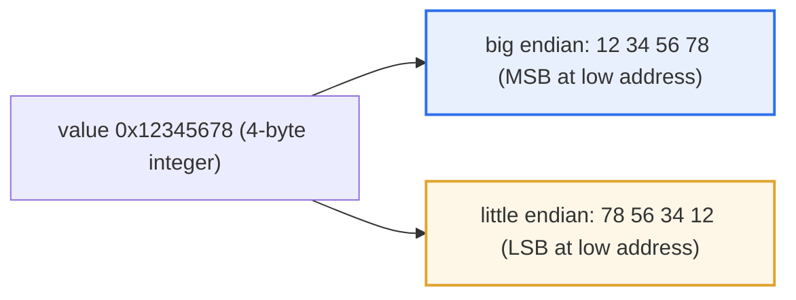
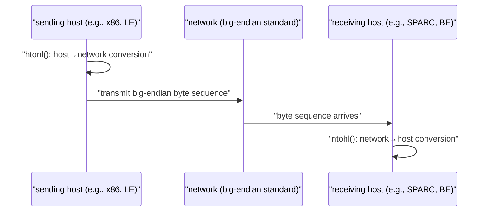

# Big Endian and Little Endian

## 1. Overview

### A. Definition
> **Endianness** refers to the **order in which the constituent bytes are arranged** when storing data of two or more bytes (integers, floating point, pointers, etc.) in memory or a transmission medium. **Big endian** stores the most significant byte (MSB) at the lowest address, and **little endian** stores the least significant byte (LSB) at the lowest address.

The fundamental reason endianness becomes a problem is that "**the same value is stored in a different order on different systems, so the value breaks when data is exchanged.**" Inside a CPU register, a number is a single logical value, but the moment that value is broken into bytes and laid out in addressed memory, a physical choice arises: "which byte to place first." For example, suppose we store the 4-byte unsigned integer `0x12345678`. If we place `12 34 56 78` from the lowest address in the order a human reads, it is big endian; if we place it in reverse as `78 56 34 12`, it is little endian. The value itself is the same, but the byte arrangement in memory is exactly opposite.

If data is written and read only within a single computer, endianness is no problem at all, because the CPU reads by the same rule it used to store. The problem arises **when two systems with different endianness exchange binary data.** If a little-endian device interprets `12 34 56 78` sent by a big-endian device by its own rule, it misunderstands the least significant byte to be `12`, and the value is completely flipped to `0x78563412`. This is why endianness must be considered in network communication, file-format exchange, and interworking of heterogeneous devices. This is why internet protocols adopt **big endian (network byte order)** as the standard order for transmission, blocking confusion.

Neither side is inherently superior; it is merely **a difference in CPU design philosophy.** The origin of the name is also telling. It was taken from a scene in Jonathan Swift's novel *Gulliver's Travels* in which people who crack boiled eggs from the big end and people who crack them from the little end wage war over a trivial difference, well illustrating the character of "a convention that requires agreement rather than one side being right."

One concept to distinguish is **byte order and bit order.** Usually "endianness" refers to the byte-level arrangement order, and this is the problem a programmer directly faces in memory and networks. Meanwhile, in serial communication and bit-field transmission, there is also bit endianness—which side of the bits within a byte to send first—but because most hardware handles this transparently, in everyday application development it is enough to consider only byte endianness. Also, in the past PDP-11 and others had **middle endian**, which stored `0x12345678` shuffled by word as `34 12 78 56`, but today it remains only a historical relic that one is unlikely to encounter in practice.

### B. Background and a Storage Example
Historically, Intel-family x86 CPUs adopted little endian, while Motorola 68000, early SPARC, PowerPC, and internet protocols adopted big endian, leading the two approaches to coexist. Designs that chose little endian based it on the point that the rule "low address = low byte" is advantageous for arithmetic operations and type conversion, while designs that chose big endian based it on the point that it "matches the order a human reads." Below shows how the 4-byte value `0x12345678` is actually laid out in memory.

| Address | Big endian | Little endian |
|---|---|---|
| Low address (base+0) | 12 | 78 |
| base+1 | 34 | 56 |
| base+2 | 56 | 34 |
| High address (base+3) | 78 | 12 |

## 2. Operating Principle and Comparison

The difference between the two approaches can be summarized as "in which direction the value is broken into bytes and spread along the address axis." The diagram below shows one and the same value splitting into different byte sequences according to the two rules.



The greatest practical advantage big endian offers is **readability.** When a memory dump or packet capture is laid out in hexadecimal, the byte order matches the order humans write numbers, so values can be read intuitively during debugging and protocol analysis. Little endian, on the other hand, thanks to the rule that **the low byte is always at the same (low) address**, when cutting a 4-byte value into 2 or 1 byte, you only need to read the front part as is without changing the address, simplifying type conversion and multi-precision arithmetic implementation. This also aligns well with the CPU's internal operation of performing addition from the low byte (= low address) while propagating the carry.

| Category | Big endian | Little endian |
|---|---|---|
| **Storage order** | MSB at low address | LSB at low address |
| **Intuitiveness** | Same as the order humans read | Reverse order (less intuitive in a dump) |
| **Operation/type conversion** | — | Advantageous for low-byte access, variable-precision arithmetic |
| **Representative use** | Network (TCP/IP), 68000, early SPARC | Intel x86/x64, ARM (LE by default), RISC-V |

This contrast explains "why the two camps never ultimately unified into one." It is because each design had a substantive advantage for its own purpose. The camp that valued CPU-internal arithmetic efficiency chose little endian, and the camp that valued human readability and protocol consistency chose big endian; both were "not wrong" choices, so once the ecosystem became entrenched, the cost of switching overwhelmed the advantages, and coexistence solidified.

A point to note here is the fact that endianness **applies only to multi-byte units.** One-byte data (e.g., an ASCII character), or continuous data whose "each element is one byte" such as a byte array or string, is stored identically regardless of endianness. What endianness flips is only the case where multiple bytes gather to form a single value, such as an integer or a real number. Confusing this point makes it easy to commit the error of wrongly attributing a broken string to endianness.

## 3. Handling Method — Byte-Order Conversion

The standard strategy to prevent endianness mismatch in heterogeneous communication is to "**unify the byte order at the transport layer.**" Specifically, when sending data over the network, one **converts one's host byte order to network byte order (big endian)**, and when receiving, one converts it back to one's own host order. If the application performs this conversion consistently, then whatever the endianness of both CPUs, they meet on a single agreed standard in the middle, so the value is preserved.



In the C/POSIX environment, the functions `htonl()`/`htons()` (host-to-network, 4/2 bytes) and `ntohl()`/`ntohs()` (network-to-host) are provided for this conversion. These functions do nothing if the host is already big endian (no conversion), and flip the bytes if it is little endian, allowing you to write **portable code without worrying about the host's endianness.** For example, when transmitting port number `80` (0x0050) on an x86 (little-endian) host, `htons(80)` flips the bytes to ensure that `00 50` (big endian) goes out on the network. Conversely, on a host that is already big endian, the same call changes nothing. Thanks to this structure of "calling the conversion function but having the actual behavior differ according to the host's endianness," the same source code works correctly and identically on both architectures.

At the application level, serialization libraries such as Protocol Buffers, Avro, and Thrift handle endianness internally, reducing the need for developers to deal with low-level conversion directly. However, when defining a binary format directly (a file header, an embedded protocol), the endianness must be specified in the format specification. Also, because floating point (IEEE 754) is a multi-byte value, it is affected by endianness; most little-endian systems store floating point in little endian just like integers, but some embedded environments have mixed cases where the endianness of integers and floating point differ, so when exchanging real-number data in binary, compatibility must be verified separately from integers.

The classic technique to confirm one's own system's endianness is to store the integer `1` and then read the first byte of its memory. If the first byte is `01`, the low byte came first, so it is little endian; if `00`, it is big endian. Below expresses that determination in C code, a typical idiom that peeks at the first byte of a 4-byte integer through a `char` pointer.

```c
#include <stdio.h>

int is_little_endian(void) {
    unsigned int x = 1;          /* 0x00000001 */
    char *p = (char *)&x;        /* 첫 바이트 주소 */
    return (*p == 1);            /* 1이면 LSB가 앞 → 리틀 엔디언 */
}

int main(void) {
    printf("%s\n", is_little_endian() ? "Little Endian" : "Big Endian");
    return 0;
}
```

As an actual example, TIFF and image formats or Unicode text files are designed to place a **BOM (Byte Order Mark)** or a magic number (`II` = Intel/LE, `MM` = Motorola/BE) at the head of the file so that the reading side can determine the endianness. That is, the format itself declares "I was written in a certain endianness," which is how actual standards implement the principle explained earlier: "specify the endianness in the format specification."

## 4. Cases and Practical Implications

Endianness mismatch is not an abstract theory but a common cause of actual bugs. As a first case, if an embedded sensor (big-endian MCU) sends a 16-bit temperature value it collected directly to an x86 Linux server (little endian) while omitting the conversion, `0x0102` (258) is read on the server as `0x0201` (513), and the temperature is recorded as a completely wrong value. Second, as a file-format compatibility problem, when a binary configuration file created on a big-endian device is read on a little-endian PC, all integer fields are flipped and parsing fails. Third, in network programming, if fields such as port number or IP address are placed directly into a struct and transmitted without `htons()`, it works between devices of the same endianness but suddenly breaks in heterogeneous interworking, becoming a "non-reproducible bug." In this way, endianness bugs are tricky to diagnose because they **stay hidden in a same-endianness environment and are revealed only in heterogeneous interworking.**

A fourth case is **shared memory and memory-mapped files (mmap).** When a little-endian server reads via memory mapping a struct that a big-endian server created and dumped directly to disk, the string fields are fine but only the integer counter or offset fields appear as absurd values. This is the result of the earlier principle—"a byte array (string) is endianness-independent, a multi-byte integer is endianness-dependent"—acting simultaneously within a single struct, and because the symptom is partial, finding the cause is even trickier.

Therefore, the practical principle is clear. At every point where binary data crosses a process, device, or language boundary, **unify the endianness explicitly**, and never depend on code that "happens to work because the endianness is the same." One hidden reason text-based formats (JSON, XML) are preferred for heterogeneous interworking is precisely that they are free of the endianness problem.

## 5. Deeper Dive — Bi-Endian and Latest Trends

Recent processors trend toward supporting **bi-endian.** ARM, PowerPC, MIPS, RISC-V, and others can switch endianness mode via a configuration register or boot option, making it easy to integrate a single chip into both big- and little-endian ecosystems. For example, ARM operates in little endian by default but can select big-endian mode for network equipment. This is a change from the era when "the CPU fixed the endianness" toward treating endianness as "a selectable attribute for system-integration flexibility."

Such a switching function is usually decided once at the early boot stage of the system or at the firmware level, and the operating system and applications operate on top of it on the premise of a consistent endianness. Therefore one must understand that the switching itself is for the integration convenience of the chip maker and board designer, not a function that an application developer changes frequently at runtime. From the application's standpoint, the principle "convert at the boundary whatever the endianness of the environment I run in" still holds.

Meanwhile, in reality, the **de facto standardization of little endian** is progressing. As Intel x86/x64 and ARM in little-endian mode dominate the server, mobile, and PC markets, a large share of newly designed file formats, language runtimes, and virtual machines presume little endian by default. The RISC-V standard also specifies little endian by default. However, because network protocols still maintain big endian as the standard, byte-order conversion will not disappear from communication code going forward. Ultimately, understanding the dual structure of "internal operation is little, transmission standard is big" and consistently applying conversion at the boundary remains the crux of practice.

## 6. Considerations and Implications (Professional Engineer's Perspective)

1. **Enforce explicit conversion in heterogeneous interworking**: In binary exchange between systems of different endianness, either unify to network byte order or nail down the endianness in the protocol/format specification. Use standard conversion functions such as `htonl/ntohl` consistently to write code independent of host endianness.
2. **Serialization/binary-format design principles**: When designing file or communication formats, endianness and field sizes must be specified to guarantee cross-platform portability. Where possible, use a proven serialization framework such as Protobuf or Avro to delegate endianness handling, and when needed, mark the endianness in the header with a BOM or magic number.
3. **Test/diagnosis strategy**: Because endianness bugs stay hidden in a same-endianness environment, binary-interoperability testing must be performed in both big- and little-endian environments (or with cross-emulation such as QEMU) to catch them early.
4. **Leveraging the bi-endian/standardization trend**: Architectures that can switch endianness, such as ARM and RISC-V, increase system-integration flexibility, but because behavior differs by setting, the endianness mode of the deployment environment must be controlled through configuration management. New systems should presume the de facto little-endian standard while maintaining big-endian conversion at the transmission boundary.
5. **Linkage with performance and alignment**: The endianness conversion itself is low-cost, but to keep byte swapping from becoming a bottleneck in bulk data transmission, it is desirable to consider buffer-unit batch conversion and memory alignment together.

## References
- Wikipedia, "Endianness" — https://en.wikipedia.org/wiki/Endianness
- RFC 1700 / IEN 137 (Network byte order, "On Holy Wars and a Plea for Peace")
- Linux man-pages, "byteorder(3) — htonl/htons/ntohl/ntohs" — https://man7.org/linux/man-pages/man3/htonl.3.html

---

> **In one line**: Endianness is *the byte order in which multi-byte data is arranged in memory*; big endian (MSB first, network standard) and little endian (LSB first, x86 de facto standard) coexist due to a difference in design philosophy, and the crux is to explicitly convert to network byte order at heterogeneous boundaries to secure value compatibility.
