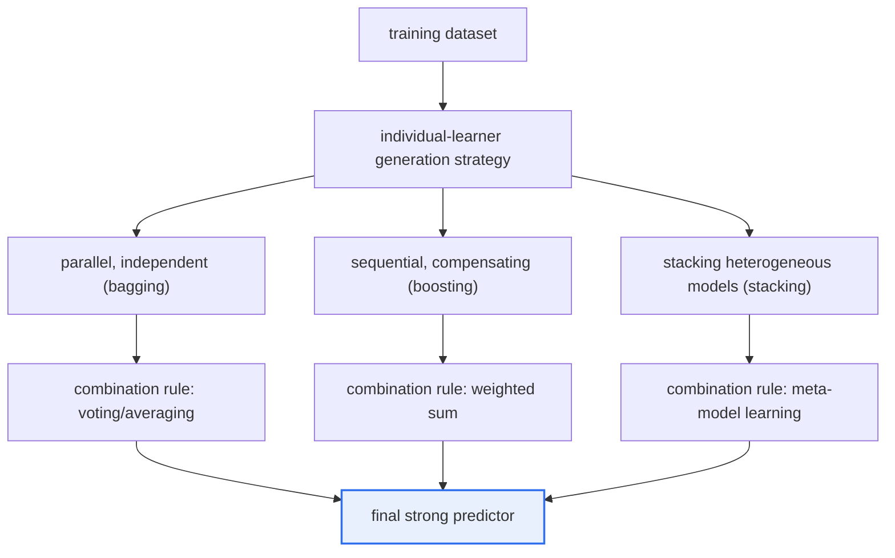
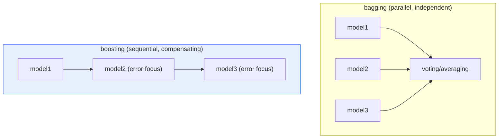

# Ensemble Learning — Bagging and Boosting

## 1. Overview

### A. Definition
> **Ensemble learning** is **a technique that strategically combines multiple weak learners to create a single strong prediction model (strong learner)**, simultaneously raising prediction accuracy and generalization stability beyond a single model. The representative approaches are bagging (parallel combination) and boosting (sequential combination).

The fundamental principle that makes an ensemble powerful lies in the statistical intuition that "**gathering the opinions of many is better than one (collective intelligence, wisdom of crowds).**" A single model may overfit to a specific pattern of the training data or be biased in a particular direction, and that error is unique to that model. However, when the predictions of multiple models trained with different approaches and data are synthesized, **the mutually low-correlated errors each model commits cancel out in the averaging process**, and the variance of the overall prediction is reduced. It is the same logic as diluting the impact of individual misjudgments by asking multiple experts rather than one and taking a majority vote or average. The core premise is that **each individual learner must be at least slightly better than random guessing (a weak learner), and they must be sufficiently diverse from one another.** Because if all models err in the same way, gathering them is useless no matter how many.

Depending on how this "combination" is designed, ensembles branch broadly into two directions. **Bagging** trains multiple models "in parallel, independently" and averages or votes on the results, focusing on reducing the **variance** of individual models to suppress overfitting. In contrast, **boosting** connects multiple models "sequentially," continuing training so that the later model concentrates on what the earlier model got wrong, focusing on reducing **bias** to raise accuracy. Both share the common purpose of overcoming the limits of a single model, but the type of error they aim to reduce (variance vs. bias) and the training structure (parallel vs. sequential) are exactly opposite, forming a complementary relationship.

### B. Background and Necessity of Its Emergence
As the experience repeated that no matter how finely a single model was tuned in traditional machine learning, its performance hit a wall, the recognition took hold that "**mixing several well is more effective than making one well.**" Breiman's bagging in 1996 and Freund and Schapire's AdaBoost the same year laid the theoretical foundation, and with the subsequent emergence of Random Forest (2001) and the Gradient Boosting family, ensembles became the de facto standard for structured (tabular) data prediction. In fact, the majority of top solutions in data competitions such as Kaggle adopt boosting-family methods such as XGBoost, LightGBM, and CatBoost, or stacking, which layers multiple models. Even today, when deep learning dominates images and natural language, the fact that ensembles still often deliver the best performance in industrial fields centered on structured data—credit scoring in finance, demand forecasting, churn prediction—attests to their necessity.

### C. Theoretical Foundation — The Bias-Variance Trade-off
The key to understanding ensembles is the **bias-variance trade-off**, which decomposes prediction error into bias², variance, and noise. A model with large bias fails to learn the structure of the data sufficiently and underfits, while a model with large variance memorizes even the noise of the training data and overfits. Bagging averages many models with low bias and high variance (such as deep decision trees) to **selectively lower only the variance**, while boosting sequentially compensates shallow models with high bias and low variance (stumps) to **lower the bias**. That is, the two techniques are complementary approaches that attack different axes of the same trade-off. [[decision-tree]]

## 2. Overall Structure and Operating Principle

The overall skeleton of an ensemble can be organized into three stages as below: 'generating individual learners → combination strategy → final prediction.' It is no exaggeration to say that what data to use to build what learners, and by what rule to combine their predictions, is the whole of ensemble design.

If the above structure diagram is the big picture, the difference in the training flow of bagging and boosting, in detail, is as follows. Bagging trains models "simultaneously, without referencing one another" on different samples drawn with replacement (bootstrap) from the original data. Conversely, boosting trains one model, then measures its error, and repeats the process of training the next model **with more weight on the samples with large error.** Therefore, bagging is easy to parallelize and advantageous for large-scale data, while boosting depends on the preceding results and is inherently sequential.

### A. The Principle of Bagging
Bagging is short for Bootstrap Aggregating and, as the name suggests, consists of two steps. First, **bootstrap** creates several sets of samples the same size as the original by allowing duplication (sampling with replacement) from the original data. In this process, each sample becomes slightly different in composition from the original, containing on average only about 63% unique data, with the remaining 37% excluded (Out-Of-Bag, OOB). This OOB data is used as a free validation means to estimate generalization performance without a separate validation set.

Second, **aggregating** combines the predictions of the models trained on each sample—majority vote for classification, arithmetic mean for regression. The core is that because each model saw a different sample, the directions of their errors vary, and averaging them **greatly reduces the high variance of the individual models.** However, because bagging hardly reduces bias, the principle is to use models with low bias (i.e., sufficiently complex) as the individual learners. In practice, a deeply grown decision tree is the representative choice.

For bagging to be effective, **diversity among the models** is the crux. Because bootstrap alone can make the trees similar, Random Forest additionally introduces "feature randomness," in which only some randomly chosen features are candidates at each split. This alleviates the phenomenon of all trees clinging to one strong variable, lowering correlation among trees and maximizing the variance-reduction effect of averaging.

### B. The Principle of Boosting
The philosophy of boosting is "**repeatedly compensate for weaknesses.**" After training the first model, it assigns greater weight to the samples that model got wrong, so that the next model concentrates on those difficult cases. Repeating this process a set number of times, it sums each model's predictions with weights proportional to performance to produce the final prediction. The representative early algorithm, **AdaBoost**, implemented this idea by exponentially increasing the weight of misclassified samples.

The mainstream of modern boosting is **gradient boosting**, which shifts the perspective from "weight adjustment" to "**residual learning.**" That is, the next model is trained toward the prediction error up to the previous step (the negative gradient of the loss function), so that the entire ensemble progressively reduces the loss like gradient descent. Here, the key stabilizing device is shrinking each step's contribution by a learning rate and adding it little by little. Lowering the learning rate requires more trees but reduces overfitting risk and improves generalization—a trade-off.

Boosting powerfully reduces bias to deliver high accuracy, but because of its structure of obsessing over errors, it is **sensitive to noise and outliers**, and its overfitting risk is greater than that of bagging. Therefore, careful tuning—limiting tree depth, adjusting the learning rate, early stopping, adding regularization terms—determines performance.

### C. The Type System of Ensemble Combination Methods
Bagging and boosting are the two representative axes of ensembles, but broadening to combination methods as a whole, they organize into four types. Understanding these distinctions is necessary to choose the method suited to the situation in practice. The simplest, **voting**, votes on or averages the predictions of different algorithms as is; in classification it is divided into hard voting (majority) and soft voting (averaging probabilities). Soft voting reflects each model's confidence (predicted probability) as well, so it generally performs better than hard voting.

**Bagging** is a method that trains the same algorithm in parallel on bootstrap samples to lower variance, and **boosting** is a method that lowers bias through sequential compensation, as explained earlier. The last, **stacking**, is a two-stage structure that takes the prediction results of multiple heterogeneous models as new features and trains a meta-model on top of them once more, combining the strengths of individual models through learning. The four types are distinguished as below by 'what is diversified and how it is combined.'

| Type | Individual learner | Source of diversity | Combination rule | Main effect |
|---|---|---|---|---|
| **Voting** | Heterogeneous (different algorithms) | Algorithm difference | Voting, probability averaging | Stability↑ |
| **Bagging** | Homogeneous | Data sampling | Voting, averaging | Variance↓ |
| **Boosting** | Homogeneous | Error compensation (sequential) | Weighted sum | Bias↓ |
| **Stacking** | Heterogeneous | Models + meta-learning | Meta-model learning | Accuracy maximization |

### D. Comparison of the Two Approaches
The table below organizes the differences between bagging and boosting, but one must remember that each item in the table is a result derived from the fundamental difference explained earlier of 'whether to reduce variance or bias.' For example, the reason bagging is robust to overfitting is that independent parallel training cancels out errors, and the reason boosting is sensitive to overfitting is that it can learn even the noise while sequentially chasing errors.

| Category | Bagging | Boosting |
|---|---|---|
| **Training method** | Parallel (independent) | Sequential (compensating previous error) |
| **Data sampling** | Bootstrap (with replacement) | Weight↑ on misclassified samples / residual learning |
| **Combination** | Voting, averaging | Performance-weighted sum |
| **Main effect** | Variance↓ (overfitting mitigation) | Bias↓ (accuracy↑) |
| **Overfitting** | Robust | Relatively sensitive (needs tuning) |
| **Parallelization** | Easy (independent) | Difficult (sequential dependency) |
| **Representative algorithm** | Random Forest | AdaBoost, GBM, XGBoost, LightGBM |

## 3. Representative Algorithms and Industry Application Cases

**The representative of bagging is Random Forest.** It trains hundreds of decision trees with bootstrap samples and random feature selection and votes or averages them. Even if individual trees grow deep and overfit, the aggregate is stable, and it naturally provides feature importance, making it advantageous for interpretation as well. In fact, Random Forest is widely used in domestic and foreign financial institutions' **credit-card fraud detection (FDS)** and carriers' **customer-churn prediction.** For example, when classifying whether transactions are fraudulent among hundreds of thousands of transaction logs, Random Forest is reported to significantly lower false positives compared with a single tree.

**The representatives of boosting are XGBoost, LightGBM, and CatBoost** (the gradient-boosting family). XGBoost introduced second-order approximation and regularization to capture both accuracy and speed, and LightGBM provides several-times-faster training on large data through leaf-wise growth and histogram-based splitting. This family frequently shows the best performance in structured-data prediction, being used as a standard in, for example, **e-commerce demand and inventory forecasting**, **manufacturing-process defect prediction**, and **advertising click-through-rate (CTR) prediction.** As one example, there are several known cases of a large retailer changing its demand-forecasting model from simple regression to a LightGBM ensemble, noticeably reducing the prediction error (MAPE) and cutting inventory cost.

As a third axis, there is **stacking.** It takes the predictions of models with different characters—Random Forest, boosting, logistic regression, and so on—as inputs and trains a meta-learner on top of them once more to combine them. Because it mixes heterogeneous models to gather individual strengths, it is commonly used to squeeze out the last bit of performance in competitions. However, its structure is complex and its overfitting and operational costs are large, so practical application must be cautious.

### A. Bagging's Variance-Reduction Effect — A Simple Numerical Intuition
Why bagging is effective can be intuited with simple statistics. When averaging n mutually independent predictions, if the variance of each prediction is σ², the variance of the average shrinks to σ²/n. For example, if the prediction variance of an individual tree is 1 and there are 100 trees, then under the ideal assumption of complete independence, the variance of the average prediction drops to 0.01. Of course, actual trees cannot be completely independent, so the reduction effect is limited by a correlation coefficient ρ, and the variance converges to roughly ρσ² + (1−ρ)σ²/n. The practical lesson this formula teaches is clear. **From a certain point, lowering the correlation among trees (ρ↓) becomes more important than increasing the number of trees (n↑)**, and this is precisely why Random Forest lowers ρ with random feature selection.

### B. Performance Evaluation and Hyperparameter Tuning
The performance of an ensemble is greatly influenced by hyperparameters. In the bagging family, the number of trees (n_estimators), tree depth, and the number of candidate features per split (max_features) are the key control variables; in the boosting family, the number of trees, learning rate (learning_rate), tree depth, and regularization terms are. In boosting in particular, there is a trade-off in which **the product of learning rate and number of trees yields roughly constant performance**, so combining a low learning rate with many trees plus early stopping is the standard for suppressing overfitting. Tuning estimates generalization performance with cross-validation (k-fold) and searches with grid/random search or Bayesian optimization; in bagging, OOB error can be used without a separate validation set.

## 4. Deeper Dive — Latest Trends and Expected Exam Directions

Recently, the boosting family has developed with **automatic handling of categorical variables (CatBoost's ordered target encoding)**, **GPU-accelerated training**, and **distributed training**, coping with large-scale, high-dimensional data. Also, at the boundary with deep learning, neural networks dedicated to structured data (TabNet, FT-Transformer, etc.) are challenging ensembles, but in many benchmarks results are reported that well-tuned gradient boosting is still comparable or ahead, so its status as "the champion of structured data" is solid. Meanwhile, **AutoML** platforms internally auto-compose ensembles and stacking to reduce human tuning burden, and as the demand for explainability grows, combining post-hoc explanation techniques such as **SHAP (SHapley Additive exPlanations)** with ensembles has become de facto standard practice.

From a professional engineer's perspective, this topic is likely to appear in forms such as "**compare and explain bagging and boosting and discuss the application situation of each**," "**explain the effect of ensembles from the bias-variance perspective**," and "**the principle difference between Random Forest and XGBoost and the criteria for practical choice.**" A high-scoring answer must be developed by weaving together (1) the theoretical basis of the bias-variance trade-off, (2) the structural difference of parallel/independent vs. sequential/compensating, (3) the practical trade-offs of overfitting, interpretability, and cost, and (4) concrete industry application cases.

## 5. Considerations and Implications

1. **A selection strategy suited to the problem's characteristics** is needed. If the data has much noise, overfitting is a concern, and stability is important, bagging (Random Forest) is advantageous; if accuracy must be pushed to the extreme and there is capacity for tuning, boosting (XGBoost, LightGBM) is advantageous. Stacking, which re-mixes the predictions of both models, is reviewed as a last resort for performance improvement.
2. **Leverage the position as the champion of structured data.** Separate from the flow in which deep learning dominates images, speech, and natural language, in tabular business data ensembles have the practical advantages of best performance, fast training, and low data requirements, so rather than unconditionally choosing deep learning, it is reasonable to review ensembles first.
3. **Manage the trade-off between interpretability and computational cost.** Ensembles are accurate but are more opaque internally than a single model and have large training and inference costs. In regulated industries (finance, healthcare), present the basis by concurrently using explanation techniques such as SHAP and partial dependence (PDP), and in real-time services, manage latency by model lightweighting and limiting the number of trees.
4. **Overfitting and data-quality management determine success or failure.** Because boosting in particular is sensitive to outliers and label noise, control overfitting with cross-validation, early stopping, and regularization, and first secure the quality of the training data (label accuracy, imbalance handling). No matter how strong the ensemble, it cannot exceed the limits of low-quality data.
5. **MLOps linkage from an operational and reproducibility perspective** is important. Because results differ by random seed, hyperparameters, and data version, one must have model version management, experiment tracking, and a retraining pipeline to continuously maintain prediction performance.

## References
- scikit-learn User Guide, "Ensemble methods": https://scikit-learn.org/stable/modules/ensemble.html
- XGBoost Documentation, "Introduction to Boosted Trees": https://xgboost.readthedocs.io/en/stable/tutorials/model.html
- LightGBM Documentation, "Features": https://lightgbm.readthedocs.io/en/stable/Features.html

---

> **In one line**: An ensemble is *a technique that combines multiple weak learners to create a strong model*; bagging (parallel, independent, variance↓, Random Forest) and boosting (sequential, compensating, bias↓, XGBoost) attack the two complementary axes of the bias-variance trade-off, chosen by considering the problem's characteristics, interpretability, and cost, and are especially powerful on structured data.
