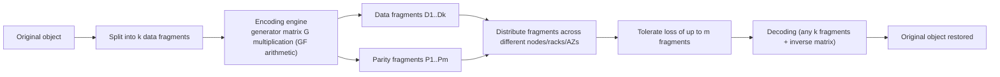
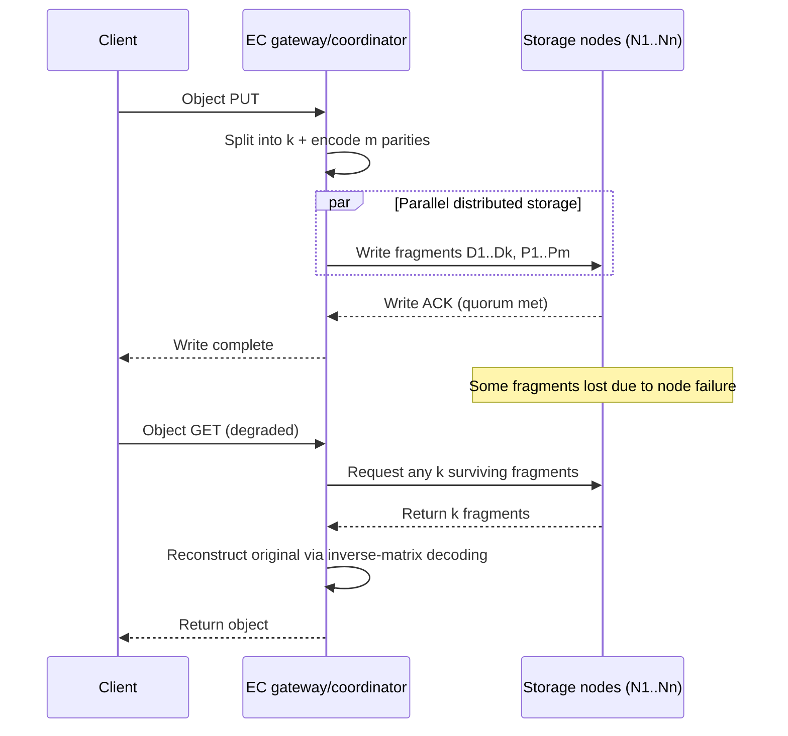

# Erasure Coding and Data Durability in Distributed Storage

## 1. Overview

### A. Definition
> Erasure Coding (EC) is a data protection technique based on error-correcting codes that splits original data into **k data fragments**, generates **m additional redundant (parity) fragments** through mathematical encoding, stores the resulting n (=k+m) fragments in a distributed manner, and **fully restores the original as long as any k fragments survive**.

The essence of erasure coding is transplanting into storage systems the situation in which "data is **erased** on a channel (a loss where the position that disappeared is known but the value is not)." Codes developed in communication theory, such as Reed–Solomon, apply directly to the fault model of storage media: because disk and node failures let us know precisely that "this fragment is gone," recovery is far more efficient than general error correction where the location is unknown. In other words, EC is a near information-theoretically optimal redundancy scheme that achieves **high durability with low capacity overhead**.

### B. Background and Need
In the era of cloud and object storage, total data volume has swelled beyond petabytes to exabytes, but the reliability of individual disks has not improved proportionally. Traditionally, distributed storage secured durability through **3-way replication (3-replication)**. 3-replication is simple to implement and offers good read locality, but its **storage overhead is 200% (two copies per original)**, which is very large. At the scale of tens of PB, this 200% overhead means enormous disk, power and rack space costs.

Erasure coding achieves the same or higher durability **with much less redundancy**. For example, the widely used RS(10,4) configuration consists of 10 data fragments + 4 parity fragments = 14 fragments, with **only 40% storage overhead**, while tolerating the simultaneous loss of any 4 fragments. Compared with 3-replication, which tolerates the loss of at most 2 copies (for the same data), EC tolerates more simultaneous failures with less space. As large-volume, infrequently accessed (cold/warm) data explodes, the need to maximize "durability per unit cost" is the fundamental driver of EC adoption. Indeed, Meta's f4, Microsoft Azure, AWS S3, Google Colossus, Ceph and HDFS-EC have all adopted EC as standard in their large-scale storage tiers.

Fundamentally, the rise of EC is a matter of **storage economics**. At a scale of several EB, a difference of 1 percentage point in storage overhead translates into thousands of disks and the associated power, cooling, rack space and operations staff. Lowering the 200% overhead of 3-replication to EC's 40–50% cuts the hardware needed for the same data protection to one-third or less, which for hyperscale operators leads to total cost of ownership (TCO) savings on the order of tens of billions of won annually. At the same time, the distribution of data has shifted so that cold data — "created but rarely read again" — makes up the majority; the less frequently data is accessed, the more tolerable the latency penalty and the greater the storage savings, so EC has broad room for application. In short, EC is the reinterpretation of error-correction technology from communication theory to meet storage's need to economically protect exploding data.

### C. Key Characteristics
The nature of EC can be summarized in four points. First, **space efficiency** — MDS codes achieve the theoretical upper bound of durability per unit of redundancy, obtaining the same durability with much less storage than replication. Second, **high durability** — by adjusting m, durability can be finely designed to withstand up to any m simultaneous failures. Third, **asymmetric cost** — normal reads are cheap, but recovery, degraded reads and partial updates are expensive. Fourth, **placement dependence** — theoretical durability is actually guaranteed only when fragments are distributed across a sufficient number of failure domains. These characteristics form the basis for deciding "when to use EC and when to use replication," discussed later.

## 2. Operating Principles and Architecture of Erasure Coding

### A. Basic Principles of Encoding and Decoding
The mathematical foundation of EC is **linear algebra over a Galois field (GF(2^w))**. The k data fragments are treated as a vector D and multiplied by an (k+m)×k **generator matrix** G to produce n encoded fragments C = G·D. In Reed–Solomon codes, the top k rows of G are the identity matrix (the original is stored as-is: a systematic code), and the bottom m rows are built from a Vandermonde or Cauchy matrix so that **any submatrix formed by choosing any k rows is invertible**. Thanks to this property, with any k fragments, the original D can be uniquely restored by multiplying by the inverse of the corresponding submatrix.

The key here is the **MDS (Maximum Distance Separable) property**. MDS codes achieve the theoretical upper bound of durability per unit of redundancy: "whichever m of the n fragments disappear, the remaining k can restore the data." Reed–Solomon is the representative MDS code, and this is the fundamental reason EC is more space-efficient than replication. During decoding, only the rows corresponding to surviving fragments are selected for the inverse-matrix operation, so in storage environments where erased positions are known, the computation is greatly reduced.

The simplest intuition is the XOR parity also used in RAID. A special EC with m=1 keeps only one parity P = D1 ⊕ D2 ⊕ D3 for data D1, D2, D3, so that if any one fragment is lost it is restored by XORing the rest with P. However, m=1 cannot tolerate two simultaneous losses. Reed–Solomon generalizes this idea with polynomial and matrix operations over a Galois field, creating **m mutually linearly independent parities** to tolerate up to any m simultaneous losses. That is, XOR parity is the thinnest special case of EC, and RS is the general solution that raises it to arbitrary m. Thanks to this generality, storage systems can freely adjust m to match the required durability.

Encoded fragments must be distributed across **different failure domains** — nodes, racks, power circuits, availability zones (AZs). If several fragments are concentrated in one rack, a rack-level power outage causes more than m losses and makes recovery impossible. Therefore, in EC placement policy, **topology-aware placement** is as important as the code parameters (k, m).

The main components of an EC system are as follows.
- **Encoding/decoding engine**: The core module performing generator-matrix and GF operations. Accelerated with SIMD libraries such as ISA-L or DPU/GPU offloading.
- **Stripe manager**: Splits objects into stripes and fragments and manages the mapping metadata.
- **Placement policy engine**: Enforces rules that distribute fragments across failure domains without overlap.
- **Rebuild manager**: Detects fragment loss, schedules rebuilds and throttles bandwidth.
- **Integrity verifier (scrubber)**: Periodically verifies fragment checksums to detect and correct silent corruption early.

### B. System Architecture and I/O Path
In distributed storage, EC's write and read paths are asymmetric. On write, the client or gateway gathers data into stripes, encodes it, and sends it in parallel to n nodes. On a normal (non-degraded) read, the systematic code property means only the k data fragments need to be read as-is, so no decoding is required — an important optimization point in EC performance design. In contrast, during a **degraded read** with lost fragments or during **reconstruction**, k fragments must be pulled over the network and decoded, causing network and CPU load to spike.

The most expensive part of this structure is **rebuild traffic**. In RS(10,4), recovering a single fragment requires reading fragments from 10 other nodes, generating network and disk I/O up to 10 times the amount of data being recovered. In large clusters, disk replacement is routine, so this rebuild bandwidth becomes a constant background load that competes with normal service I/O. LRC (Local Reconstruction Codes), discussed later, aims to mitigate this problem.

Another point to note is the **cost of partial updates (small writes)**. With replication, only a specific block needs to be modified and reflected in each copy, but in EC, even if only one data fragment in a stripe changes, all parities of that stripe must be recomputed. Because of this "read-modify-write" burden, EC suits **immutable, append-only objects** and large sequential writes, and is unsuitable for transactional workloads with frequent small updates. This property is the technical basis for tiering that places EC in object storage and archive tiers and uses replication for hot block and file data.

### C. Integrity Verification and Handling Silent Corruption
EC's durability assumption rests on the premise that "the location of lost fragments is known precisely." However, a disk can cause **silent data corruption**, in which bits quietly flip without the disk dying completely; in this case the system may be unaware of the corruption itself and risk decoding with a bad fragment and returning a contaminated original. Therefore, practical EC systems store a **checksum (CRC/hash)** alongside each fragment and perform **scrubbing**, periodically reading and verifying fragments in the background. Fragments found inconsistent in verification are treated as erasures and regenerated via EC, converting corruption of unknown location into an erasure problem of known location. In other words, EC's efficiency becomes real durability only when combined with checksums and scrubbing.

## 3. Types and Parameter Selection

Erasure coding is classified by code family, (k, m) parameters, and whether recovery efficiency is improved. The most widely used is the Reed–Solomon family, and LRC and Regenerating Codes emerged as variants to reduce rebuild cost. Parameter selection is essentially the question of where to set the **three-way trade-off among durability, storage efficiency and recovery cost**.

| Category | Representative Scheme | Storage Overhead | Fault Tolerance | Rebuild Cost | Examples |
|---|---|---|---|---|---|
| Replication (baseline) | 3-replication | 200% | 2 copies | Low (1:1 copy) | HDFS default, hot data |
| RS(6,3) | Reed–Solomon | 50% | 3 | High (read 6 fragments) | Ceph default example |
| RS(10,4) | Reed–Solomon | 40% | 4 | High (read 10 fragments) | Facebook f4, HDFS-EC |
| LRC(12,2,2) | Local Reconstruction | ~50% | Multi-level | Medium (local group only) | Azure Storage |
| MSR/MBR | Regenerating Code | 40–50% | m | Low (partial fragments only) | Research, next-generation storage |

In RS(k,m), **increasing m sharply improves durability** but also increases storage overhead, while **increasing k improves storage efficiency** but increases the number of fragments to read during rebuild, raising the recovery burden. For example, RS(10,4) tolerates up to 4 simultaneous failures with 40% overhead, outperforming 3-replication (200% overhead, effectively tolerating 2 failures) in both space and durability. However, since fragments are spread across 14 nodes, it is disadvantageous for rebuilds and small random reads. For this reason, a hybrid policy of tiering — **replication for frequently accessed hot data, EC for rarely accessed warm/cold data** — has become the practical standard.

LRC targets this rebuild cost problem head-on. It divides all fragments into several **local groups** with a local parity per group, so that when a single fragment is lost, only **a few fragments in the same group** are read for recovery instead of all of them. Azure's LRC(12,2,2) divides 12 data fragments into two groups of 6+6, with 1 local parity per group and 2 global parities overall. As a result, it greatly lowers the recovery cost of single-node failures (the most frequent case in practice) while keeping storage overhead lower than replication — Microsoft reported that this approach cut rebuild I/O to about half compared with pure RS.

To get a quantitative feel for parameter selection: storage overhead is calculated as (k+m)/k − 1, so RS(6,3) is (6+3)/6 − 1 = 50%, RS(10,4) is (10+4)/10 − 1 = 40%, and RS(12,4) is 33%. That is, **as k grows, parity is relatively diluted and overhead falls**, but the stripe width grows, increasing both the number of fragments to read during rebuild and the number of failure domains required for fragment placement. For example, safely placing RS(10,4) at rack level requires at least 14 distinct failure domains, and in small clusters this requirement itself becomes a constraint. Conversely, narrow codes such as RS(4,2) or RS(6,2) are realistic for small clusters. Code parameters are thus a practical decision dependent not only on theoretical efficiency but on **cluster size and topology**.

## 4. Comparison with Replication and Practical Application Cases

Choosing between erasure coding and replication is not simply "which is better" but a question of **fit with workload characteristics**. With replication, each copy is complete data, so read locality is excellent; there is no need to gather fragments and decode, so latency is low; and rebuild is a simple copy, so it is fast. EC, on the other hand, has overwhelmingly better storage efficiency but is disadvantaged in small/random read latency and rebuild bandwidth. The fundamental reason for the difference is thus a difference in design philosophy — **"whether redundancy is kept as complete copies or as mathematically compressed parity"** — which manifests as a trade between cost and performance.

This difference stands out in real object storage deployments. Object storage handles data as immutable objects rather than file-system blocks, so it pairs well with EC: each object can be encoded whole into stripes and its fragments scattered across multiple nodes and AZs. Objects rarely change once written, so there is almost no partial-update burden, and with PUT/GET-centric access patterns, encoding and decoding can be performed naturally at request boundaries. Conversely, block storage (virtual machine disks, database volumes) has frequent small random updates, making EC's read-modify-write cost large, so replication or narrow-width EC is preferred there. "What to protect with EC" is thus closely tied to the storage access model (object/file/block).

As concrete cases, **Facebook (Meta)'s f4** stores infrequently accessed BLOBs (photos, videos) with RS(10,4), reducing storage space to about half or less compared with the previous 3-replication. **AWS S3** distributes objects with EC across at least 3 AZs in its standard storage class and advertises "99.999999999% (11 nines) annual" durability; this extreme durability is economically achievable only by combining EC with multi-AZ placement. **Ceph** lets operators choose replicated/erasure profiles per pool, specifying policy by data class. **HDFS-EC (3.0+)** applies RS(6,3) and RS(10,4) policies to cold data directories, drastically reducing the storage cost of Hadoop clusters.

In numbers, the implications are clear. Storing 1PB of original data with 3-replication requires 3PB of actual disk, but with RS(10,4), 1.4PB suffices — **disk, power and rack space costs fall by more than half** for the same data. However, this saving comes at the price of being "unsuitable for latency-sensitive, frequently accessed data," so in practice the standard approach is to automatically transition aged data from replication to EC through a data lifecycle policy.

From a durability perspective, the two approaches can also be compared quantitatively. Data durability is commonly expressed as "how many nines," which depends on the annual failure rate (AFR) of individual fragments, the rebuild time (MTTR), and the number of simultaneous losses m that can be tolerated. **The faster the rebuild** (the shorter the vulnerable window) and **the larger m**, the exponentially better the durability. For this reason, cloud providers increase EC's m and place fragments across multiple AZs to advertise 11-nines durability, while finely tuning LRC, parallel rebuild and throttling to speed up rebuilds. Conversely, in environments with large disks and slow rebuilds, a small m increases the risk of so-called **correlated failure**, where second and third failures overlap during rebuild and lead to data loss. EC design is therefore a problem that must consider not only "what value to set for m" but also "how quickly the rebuild can finish."

In summary, the choice between the two can be judged by the following criteria.
- **When replication is advantageous**: Hot data requiring low latency and high IOPS, frequent small updates (transactions, metadata), small clusters (insufficient failure domains), workloads where fast, simple rebuild matters.
- **When EC is advantageous**: Large, immutable, sequentially accessed warm/cold data (backups, archives, media, logs), cases where storage cost reduction is the top priority, large clusters with sufficient failure domains, cases requiring multi-AZ/region durability.
- **When hybrid is the answer**: Most real-world cases where data class changes over time — replication initially, then automatic transition to EC after a set period via lifecycle policy.

## 5. Advanced Topic: The Rebuild Cost Problem and Next-Generation Code Trends

The frontier of EC research and practice is focused on "**how to reduce rebuild cost** while retaining MDS storage efficiency." The biggest weakness of pure Reed–Solomon is that recovering one fragment requires moving all k fragments over the network; in a reality where disk replacements occur constantly in large clusters, this **repair traffic** accounts for a significant share of cluster network traffic.

Behind the growing severity of this problem is increasing disk capacity. As single-disk capacity reaches tens of TB, rebuilding one disk with EC can take from several hours to more than a day. The longer the rebuild, the more the probability of losing additional fragments accumulates during that period, effectively lowering durability, so "how to reduce and parallelize rebuild bandwidth" ties directly to durability. The approaches addressing this can be summarized as follows.
- **LRC (Local Reconstruction Codes)**: Adds local parity to localize the number of fragments needed for single-failure recovery. It slightly increases storage overhead in exchange for greatly reducing recovery bandwidth; Azure Storage is the representative adopter.
- **Regenerating Codes (MSR/MBR)**: Characterize information-theoretically the optimal trade-off curve between storage and repair bandwidth, and minimize repair traffic by designing each node to transmit **only partial information** rather than whole fragments during recovery.
- **Practical codes such as Clay/Piggyback**: A family that seeks to apply MSR's theoretical benefits to real systems (e.g., Ceph's clay plugin) with lower implementation complexity.

Of these, LRC is already widely used commercially, while the regenerating code family is centered on research and specialized systems but is regarded as a promising direction for hyperscale storage.

Taken together, the recent evolution of EC converges on "lowering rebuild and computation costs while preserving MDS storage efficiency." LRC and regenerating codes on the algorithm side, hardware offloading on the execution side, and geo-distribution and hierarchical codes on the placement side are developing in tandem, and EC is expected to spread into broader data tiers going forward.

**Hardware acceleration** is another important trend. Because GF multiplication is CPU-intensive, Intel ISA-L (Intelligent Storage Acceleration Library) accelerates encoding with SIMD (SSE/AVX) instructions, and attempts to offload EC computation to **DPUs/SmartNICs** or GPUs to free the CPU are increasing. In addition, geographically distributed **multi-region EC (geo-distributed EC)** withstands even region-level failures but must account for wide-area network latency and cost, so hierarchical code designs combined with LRC are being actively researched. However, the maturity and standardization of these latest techniques vary greatly by product, so caution is needed in actual adoption to verify the specific specifications and validation results of vendor implementations.

In terms of ecosystem, EC is already built into open-source and commercial storage across the board. Ceph supports several EC plugins such as `jerasure`, `isa` and `clay`, letting operators specify the algorithm and (k, m) in a profile, and MinIO applies EC by default for object storage and is used even in small deployments. Since 3.0, HDFS has allowed EC policies to be set per directory, and most commercial object storage and backup appliances internally adopt RS or its variants. There is no single standardized "EC protocol," and code families, fragment sizes and placement policies differ by system, so direct compatibility of EC fragments between different storage systems cannot be expected. Therefore, in migration or multi-vendor design, it is safer to assume **interoperability at the object/file level** rather than the EC fragment level.

## 6. Considerations and Implications (Professional Engineer Perspective)

- **Workload-based tiering strategy**: EC is not a cure-all. Replication suits latency-sensitive, frequent random access (transactional DBs, hot caches), while EC suits large, infrequent sequential access (backups, media archives, logs). Designing automatic **hot (replication) → warm/cold (EC)** transitions via data lifecycle policy is the standard way to achieve both cost and performance.
- **Managing parameter and placement trade-offs**: Choosing (k, m) is a three-way balance of durability, storage efficiency and rebuild cost. Increasing m raises durability and lowers space efficiency; increasing k raises space efficiency and increases the recovery burden. It must always be designed together with **distributed placement across failure domains (node, rack, AZ)**; fragment concentration breaks EC's durability assumptions.
- **Preparing for rebuild storms**: In the era of large disks (tens of TB), even a single-disk rebuild takes a long time and much bandwidth, increasing the probability of a second failure in the meantime. **Silent data corruption** and rebuild load must be managed together through LRC adoption, rebuild bandwidth throttling, priority queues and background scrubbing.
- **Quantitative evaluation of performance and cost**: Before adoption, quantify not only "storage overhead savings" but also **degraded read latency, the impact of rebuild traffic on normal I/O, and CPU/network costs**. Whether acceleration means such as ISA-L or DPU offloading are applied determines the effective cost.
- **Checking fit with the access model**: EC suits object, immutable and sequential data, but is unsuitable for block/file-based random small-update workloads because of read-modify-write cost. The access pattern of the target data (object/file/block, update frequency) must be analyzed first to decide the protection method, and code parameters must not exceed the physical constraint of the cluster's number of failure domains.
- **Parallel integrity and governance**: EC's durability assumption relies on the premise that "the loss location is known," so mechanisms that convert silent corruption into an erasure problem through checksums and scrubbing must always accompany it. In addition, for multi-AZ/region placement, data sovereignty and regulatory compliance (data residency) requirements and fragment distribution policies must be designed together from a governance perspective so that they do not conflict.
- **Related technologies and outlook**: EC is a foundational technology for object storage, data lakes/lakehouses, backup and archiving, and cold cloud tiers; as rebuild efficiency improves with **LRC, regenerating codes and geo-distributed EC** and **hardware offloading** becomes widespread, its scope of application is expected to expand further. Beyond mere knowledge of techniques, a Professional Engineer must be able to blend EC and replication as a **comprehensive designer of storage protection policy** aligned with the organization's data classes, SLAs and cost targets.

## References
- Reed, I. S., & Solomon, G., "Polynomial Codes over Certain Finite Fields", 1960. — https://en.wikipedia.org/wiki/Reed%E2%80%93Solomon_error_correction
- Huang, C. et al., "Erasure Coding in Windows Azure Storage (LRC)", USENIX ATC 2012. — https://www.usenix.org/conference/atc12/technical-sessions/presentation/huang
- Muralidhar, S. et al., "f4: Facebook's Warm BLOB Storage System", OSDI 2014. — https://www.usenix.org/conference/osdi14/technical-sessions/presentation/muralidhar
- Apache Hadoop, "HDFS Erasure Coding". — https://hadoop.apache.org/docs/current/hadoop-project-dist/hadoop-hdfs/HDFSErasureCoding.html
- Ceph Documentation, "Erasure code". — https://docs.ceph.com/en/latest/rados/operations/erasure-code/

---
> **In one line**: Erasure coding is an MDS error-correction technique that encodes the original into k data + m parity (n=k+m total) fragments and restores it from any k of them, providing high durability with much lower storage overhead than 3-replication, but at the cost of rebuild and degraded-read overhead, so it must be complemented by workload-based tiering and recovery-efficiency techniques such as LRC.
