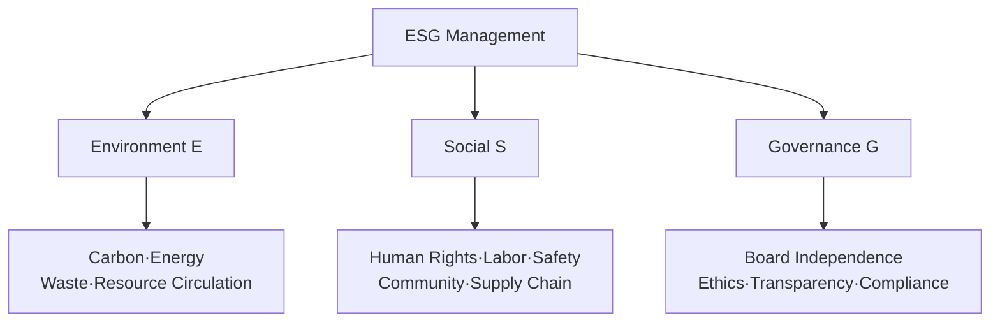

# ESG Management (Environment, Social, Governance)

## 1. Overview

### A. Definition and Objectives
> A management paradigm that integrates the non-financial factors of **Environment (E), Social (S), and Governance (G)** into managerial decision-making, pursuing **sustainability and long-term corporate value** together.

The essence of ESG lies in "**bringing non-financial risks that financial statements never captured into the center of management**." The traditional approach of evaluating companies solely by financial performance overlooked risks such as carbon regulation, human rights issues among suppliers, and opaque governance; these risks actually materialized as lawsuits, boycotts, and divestment, eroding corporate value. ESG makes these non-financial factors objects of measurement and management, aiming not at short-term profit but at **sustainable growth and stakeholder trust**.

### B. Background and Necessity
The backdrop is the materialization of the climate crisis and the expansion of demands for social responsibility. In particular, as **disclosure of ESG information becomes mandatory** (TCFD, the international sustainability disclosure standards ISSB, etc.) and global asset managers and pension funds reflect ESG assessments in their investment decisions, ESG has become not "a choice for virtuous companies" but **an essential task on which financing and survival depend**. In other words, pressure from three directions—regulation, capital markets, and consumers—acts simultaneously, making it difficult for companies to ignore ESG.

## 2. ESG Components and Key Indicators

The three axes address different stakeholders and risks. **Environment (E)** relates to climate and resources and takes greenhouse gas emissions as its core indicator, where the distinction among Scope 1 (direct emissions), Scope 2 (purchased electricity), and Scope 3 (the entire supply chain) is important. Scope 3 is the hardest to control yet often accounts for the majority of emissions, so genuine reduction requires supply-chain collaboration. **Social (S)** concerns relationships with people—employees, suppliers, local communities—and its indicators are industrial safety, human rights, diversity, and supply-chain due diligence. **Governance (G)** is the decision-making system that keeps everything running properly, looking at board independence, ethical management, and disclosure transparency. No matter how good E and S are, they cannot be sustained if G is weak, so G is regarded as the foundation supporting the rest. Measurement uses international standards such as GRI, SASB, TCFD, and ISSB, as well as the domestic **K-ESG Guidelines**.

| Domain | Key Indicators |
|---|---|
| Environment (E) | Greenhouse gases (Scope 1·2·3), renewable energy ratio, waste·water |
| Social (S) | Industrial safety, human rights·diversity, supply-chain due diligence, local community |
| Governance (G) | Board independence, ethical management, disclosure transparency, compliance |
| Standards | GRI, SASB, TCFD, ISSB, K-ESG Guidelines |

## 3. IT That Supports ESG

ESG stands on the proposition that "**what cannot be measured cannot be managed, and what cannot be managed cannot be disclosed**," so data-handling IT becomes an essential foundation. **IoT and sensors** measure the energy use and carbon emissions of factories and equipment in real time, providing actual measured data rather than estimates. **Big data and AI** use this data to predict and optimize emissions and to detect ESG risks (such as supplier issues) early. **Blockchain** leverages its tamper-resistant nature to guarantee transparency in supply-chain origin tracing and carbon-credit trading. **Cloud and EMS (Energy Management Systems)** raise resource efficiency to realize green IT, and **ESG disclosure platforms** collect, aggregate, and report scattered data to automate disclosure work. In short, IT runs through the entire cycle of ESG data—collection → analysis → disclosure.

| IT Technology | Contribution to ESG |
|---|---|
| IoT·Sensors | Real-time actual measurement of energy·carbon emissions |
| Big Data·AI | Emissions prediction·optimization, risk analysis |
| Blockchain | Supply-chain tracing·transparency in carbon-credit trading |
| Cloud·EMS | Energy management, green IT |
| ESG Disclosure Platform | Automated data collection·aggregation·reporting |

## 4. Considerations for Implementation

The biggest pitfall in pursuing ESG is **greenwashing**—inflating environmental and social performance beyond reality. This connects directly to the reliability of disclosed data, so a measurement and verification (third-party assurance) system must be in place to ensure the data has a basis. Moreover, complying with strengthening disclosure standards such as ISSB requires rigor at the level of financial data, and this must be backed by governance in the form of a **dedicated ESG organization and board oversight**. In particular, indicators that span suppliers, such as Scope 3, cannot be met by a company's own efforts alone, so **ESG due diligence and management across the entire supply chain** becomes decisive.

| Category | Content |
|---|---|
| Data reliability | Prevent greenwashing through measurement·third-party verification |
| Disclosure response | Comply with ISSB·sustainability disclosure standards |
| Governance | Dedicated ESG organization·board oversight |
| Supply chain | Supplier ESG due diligence·Scope 3 management |

## 5. Considerations and Implications
- **Investment, not cost**: ESG is both a defense that reduces regulatory and reputational risk and an offense that opens new opportunities such as eco-friendly new products and green finance. From a professional engineer's perspective, a balance that views risk management and opportunity creation together is needed.
- **Data governance is the deciding arena**: The more disclosure becomes mandatory and quantified, the more "how systematically one secures trustworthy data" ultimately determines competitiveness. The IT department's role moves beyond support to become central.
- **Convergence of standards**: The once-proliferating ESG standards are converging around ISSB, so companies that build a data system aligned with international standards early will lead in regulatory response and in attracting global capital.

---

> **In one line**: ESG management is sustainable management that *integrates the non-financial risks of environment, society, and governance into management*; because "you must measure to manage and disclose," IoT·AI·blockchain·disclosure platforms support the entire data cycle, and data reliability (preventing greenwashing) determines success or failure.
