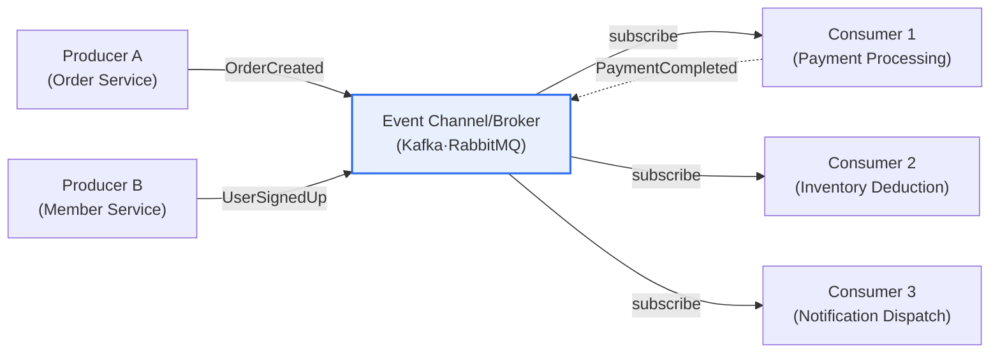
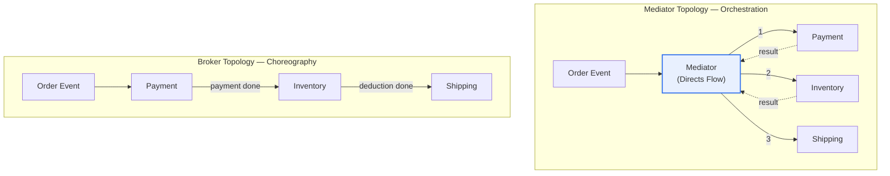

# Event-Driven Architecture (EDA) Topologies

## 1. Overview

### A. Definition

> **Event-Driven Architecture (EDA)** is an architectural style that organizes components around the occurrence, delivery, and processing of 'events' that represent changes in system state. Components publish and subscribe to events, cooperating asynchronously while remaining **loosely coupled**.

The core idea of EDA can be summed up in one sentence—'**Don't call, notify**'. In a traditional request-response system, service A directly calls service B's API. This approach is intuitive, but it comes at the cost of A and B being **strongly coupled in time and space**. A must hold a thread and wait until B responds (temporal coupling), and A must know B's address, interface, and availability (spatial coupling). As a result, if B slows down or fails, that impact propagates immediately to A and then, in a cascading failure, to the upstream services that called A.

EDA fundamentally changes the direction and nature of this coupling. A merely publishes the fact that "an order was created (OrderCreated)" as an event and knows nothing about who consumes it. Payment service B, inventory service C, and notification service D, all interested in that event, subscribe on their own and react independently. Even when adding a new consumer (e.g., marketing analytics service E), not a single line of A's code changes. This relationship in which **producer and consumer are anonymous to each other** is the essence of EDA, and from it derive three benefits: scalability, flexibility, and fault isolation. Because A finishes its work the moment it publishes, response latency disappears (real-time responsiveness), and even if a consumer dies, the event remains in the queue to be processed later, so faults are isolated.

When actually implementing such an EDA, the form of implementation diverges depending on **who coordinates the event flow**. Assigning the responsibility of coordination to a central coordinator yields the **Mediator topology**, while letting events flow on their own through a broker without a coordinator yields the **Broker topology**. The choice between these two topologies is the first and most important design decision in EDA.

### B. Background and Necessity

Behind EDA's recent resurgence lie three industrial shifts. First, **the spread of microservices architecture (MSA)**. Splitting a single giant monolith into dozens or hundreds of independent services causes inter-service communication to explode; handling all of it with synchronous REST calls entangles the services tightly, falling into the anti-pattern of a 'distributed monolith'. Asynchronous communication via events is the canonical remedy for this problem.

Second, **the demand for real-time processing**. Tasks that must react immediately to "something happening right now"—such as financial fraud detection, real-time recommendation, and IoT sensor stream processing—have increased. Batch processing cannot secure this immediacy, and EDA, which streams state changes as events the moment they occur, becomes the natural choice. Third, **the explosive event generation of IoT and mobile**. In an environment where millions of devices pour out an enormous volume of signals per second, an event backbone that can buffer them and distribute them to multiple consumers is essential. As these three currents overlap, EDA—which simultaneously provides loose coupling, asynchrony, and scalability—has established itself as the default architecture of the cloud-native era.

## 2. EDA Components and Event Processing Flow

To understand EDA, one must first grasp its constituent parts and the path along which events flow. The diagram below illustrates the overall structure of EDA.

An **event producer** is the entity that, at the moment a state change occurs, turns that fact into an event and publishes it. An important design principle here is that an event should contain not "what to do (a command)" but "what happened (a fact)." For example, publishing "an order was created" rather than "process payment" keeps the producer from intervening in the consumer's processing and keeps coupling loose. The producer completes its own transaction the moment it publishes the event and takes no part in subsequent processing.

The **event channel/broker** is both the passage through which events travel and a buffer. Apache Kafka, RabbitMQ, AWS EventBridge, and NATS are representative examples. The broker is the key component that physically decouples producers from consumers, providing durability that stores events and delivers them upon resumption even if a consumer is briefly down. In particular, Kafka preserves events as a log without deleting them, so a consumer that joins later can replay past events from the beginning. This characteristic becomes the foundation for Event Sourcing, described later.

An **event consumer** subscribes to events of interest and performs the actual business logic. A consumer can publish new events as a result of its processing (PaymentCompleted in the figure above), and this chain completes the business process. The most important thing in consumer design is **idempotency**. Brokers often guarantee at-least-once delivery to prepare for network failures, which means the same event may arrive twice. Therefore, a consumer must be designed so that processing the same event multiple times yields the same result as processing it once (e.g., deduplication based on event ID).

The **mediator** is a special component that appears only in the mediator topology; it centrally directs the sequence and conditional branching of multi-step event processing. Its role and alternatives are covered in detail in the next section.

## 3. Mediator Topology vs. Broker Topology

The two representative topologies of EDA diverge on "who is responsible for coordinating a complex business flow." The diagram below contrasts how each topology handles the same 'order processing' task.

### A. Mediator Topology — Orchestration

In the **mediator topology**, a central mediator (orchestrator) controls the entire flow like a conductor. Just as an orchestra's conductor cues the timing of each instrument, the mediator knows the sequence and conditions—"first process payment, and if it succeeds, deduct inventory, then start shipping"—and calls each processor in order. The greatest advantage of this approach is **flow visibility**. Because the whole scenario of the task is explicitly represented in one place, the mediator, it is easy to grasp and trace at which step a problem arose.

It is especially suited to complex tasks that require strict sequencing and conditional branching across multiple steps (e.g., insurance claim review, loan approval workflows). This is because the mediator can clearly express state-machine-like tasks in which the next action depends on the success or failure of each step. In practice, workflow engines such as Netflix's **Conductor**, Uber's **Cadence** and its successor **Temporal**, and AWS **Step Functions** play this mediator role.

However, the mediator topology has its costs. First, the mediator can become a **single bottleneck and single point of failure (SPOF)**. Since every flow passes through the mediator, the mediator's performance sets the upper limit of overall throughput, and if the mediator dies, the entire task halts. Second, because processors are coordinated—albeit indirectly—through the mediator, coupling is relatively higher than in the broker topology. Adding a new step often requires modifying the mediator's flow definition.

### B. Broker Topology — Choreography

The **broker topology** is a **chain-reaction** approach in which, without a central coordinator, each processor does its own work upon receiving an event and then publishes its result as another event that triggers the next processor. It is likened to choreography, where dancers complete a group performance by reacting to one another's movements without a conductor. When the payment service publishes "payment completed," the inventory service hears it, deducts stock, and publishes "deduction completed," and then the shipping service reacts, and so on.

The advantage of this approach is **extremely low coupling and outstanding scalability**. With no central coordinator, there is no bottleneck, and each service can be deployed and scaled completely independently. When adding a new service interested in the "payment completed" event (e.g., issuing loyalty points), existing services need not be touched at all. It is therefore suited to high-volume event processing where simplicity and scalability are top priorities.

On the other hand, its greatest weakness is that **the overall flow is hard to trace**. Because business logic is scattered across many services, it is difficult to grasp at a glance "how far along in the whole process this order currently is," and there is a risk of circular dependencies (A→B→A) or unexpected chains. For this reason, in the broker topology, securing observability through distributed tracing and correlation IDs is essential.

### C. Comparison of the Two Topologies

| Category | Mediator Topology | Broker Topology |
|---|---|---|
| **Coordination method** | Central mediator directs flow (orchestration) | Chain reaction without central coordination (choreography) |
| **Coupling** | Relatively high | Very low |
| **Flow visibility** | High (concentrated in one place) | Low (distributed across many services) |
| **Suitable tasks** | Complex sequential·conditional-branching tasks | Simple·highly scalable event processing |
| **Main weakness** | Mediator bottleneck·SPOF | Flow-tracing·circular-dependency risk |
| **Representative technologies** | Temporal, AWS Step Functions | Pure Kafka-based pub/sub |

The fundamental reason for the difference between the two topologies lies in **"the location of the business logic."** The mediator topology gathers the business-flow logic in the center, while the broker topology distributes it across each service. Thus the selection criteria are clear—if the flow is complex and auditing and tracing matter, choose the mediator; if the flow is simple and scalability and independence matter, choose the broker. In practice, rather than dividing the two dichotomously, a **hybrid** approach is common: leaving large domain boundaries loosely coupled via choreography while coordinating the complex transactions within them via orchestration.

## 4. Real-World Cases and Distributed Transactions — the Saga Pattern

The first wall you hit when actually adopting EDA is **distributed transactions**. Within a single database, ACID transactions can guarantee "all succeed or all cancel," but when payment, inventory, and shipping reside in different services and databases, such atomicity cannot be secured. Here the **Saga pattern** emerges: it connects a series of local transactions across multiple services via events, but if a failure occurs midway, it executes **compensating transactions** to undo the previously successful operations. For example, if the shipping step fails, it publishes compensating events such as "restore inventory" and "cancel payment" in reverse order. Sagas divide into orchestration sagas (the mediator also directs compensation) and choreography sagas (each service publishes compensation events on its own), and this is directly tied to the choice of topology.

Concrete industry cases make the effect clear. First, **Netflix** has thousands of microservices cooperating via Kafka-based events, and uses its in-house Conductor to coordinate workflows. Services for playback, recommendation, billing, and more are loosely coupled via events, so it processes tens of billions of events a day while enabling independent deployment of individual services. Second, **Uber** experienced the problem of the choreography approach early on (difficulty tracing flow) and developed Cadence (now Temporal) to manage long-running workflows such as dispatch and fare calculation in the mediator style. Third, e-commerce platforms apply the saga pattern to order processing, composing—via events—a flow that automatically reverses inventory and sends a notification to the user when payment fails. These cases empirically demonstrate the selection principle: "the broker for simple event processing, the mediator for complex transactions."

## 5. Advanced — Event Sourcing·CQRS and Recent Trends

EDA is a complete architecture in itself, but it is also evolving in combination with two advanced patterns. First, **Event Sourcing** is a way of storing an application's state not as a current value but as "an enumeration of all the events that led to that state." Take a bank account: instead of storing the current balance of 100,000 won, it stores the event sequence "deposit 50,000, deposit 80,000, withdraw 30,000" and, when needed, replays it to compute the balance. This approach provides a perfect audit trail and time travel to past points, but at the cost of the burden of recomputing state each time and the difficulty of event schema evolution.

Second, **CQRS (Command Query Responsibility Segregation)** is a pattern that separates the Command model that changes data from the Query model that reads it. Combined with EDA and Event Sourcing, writes are handled via events and reads are served from a separate read-only model (read model) built by consuming events. This allows reads and writes to be optimized and scaled independently, but a time gap of **eventual consistency** arises between the write model and the read model. This means data a user just wrote may be reflected in queries only milliseconds to seconds later, requiring a design that handles this at the UX level.

Among recent trends, **the standardization of event streaming platforms** stands out. Apache Kafka has effectively established itself as the standard event backbone, and in the cloud, serverless event routing (AWS EventBridge, Google Eventarc) is spreading. In addition, for interoperability of event formats, the CNCF's **CloudEvents** specification has emerged, part of a movement to standardize event metadata regardless of vendor. From a data perspective, it is also broadening its intersection with the **Data Mesh** concept, in which each service publishes and owns the data of its own domain as events. These currents show that EDA is expanding beyond a mere communication method into an axis that reshapes the whole of data architecture.

## 6. Considerations and Implications

EDA is powerful but not a panacea, and when adopting it, one must judge the following comprehensively from a professional engineer's perspective.

1. **The choice of topology is determined by business complexity and audit requirements.** If multiple steps must be strictly coordinated by sequence and condition, or if regulation makes flow tracing essential, choose the mediator topology; if simplicity, scalability, and service independence are top priorities, choose the broker topology. In practice, a hybrid strategy—choreography for domain boundaries and orchestration for the complex transactions within them—is realistic.

2. **The design of eventual consistency and error handling determines success or failure.** Asynchronous processing gains scalability at the cost of giving up immediate consistency. Therefore, on the premise of eventual consistency, sagas·compensating transactions, retry and backoff, dead letter queues, and consumer idempotency must all be designed together. Omitting these causes data integrity to collapse through event loss or duplicate processing.

3. **Proactive investment in observability is needed.** The more the flow is distributed, the harder it becomes to trace "what happened and how far." You must propagate a correlation ID with every event and build distributed tracing (OpenTelemetry), centralized logging, and event-flow monitoring from the outset to reduce debugging costs in operations.

4. **Organizational maturity and trade-offs must be assessed soberly.** EDA definitely raises development and operational complexity. In an early stage with only a few services and modest traffic, synchronous calls may be simpler and more efficient. Only when an organization has the capability to independently operate many services (DevOps, monitoring, on-call systems) do EDA's benefits outweigh its costs. It is safest to adopt it incrementally, starting from core domains.

5. **You should survey the evolutionary direction with related technologies.** EDA is evolving in combination with MSA·Event Sourcing·CQRS·Data Mesh, and standards such as CloudEvents and serverless event routing are lowering the adoption barrier. In the long run, EDA's strategic importance as a streaming backbone connecting real-time data and AI inference pipelines is expected to grow further.

## References

- Martin Fowler, "What do you mean by Event-Driven?", https://martinfowler.com/articles/201701-event-driven.html
- Microservices.io, "Pattern: Saga", https://microservices.io/patterns/data/saga.html
- AWS, "Event-driven architecture", https://aws.amazon.com/event-driven-architecture/
- CNCF CloudEvents, https://cloudevents.io/

---

> **In one line**: EDA is an architecture that *loosely couples components through the publishing and subscribing of events*; it is implemented via the mediator topology, where a central coordinator directs the flow, and the broker topology, which chain-reacts without a coordinator, and its success or failure hinges on the design of sagas·eventual consistency·idempotency·observability.
