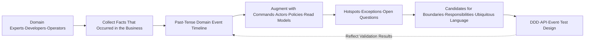
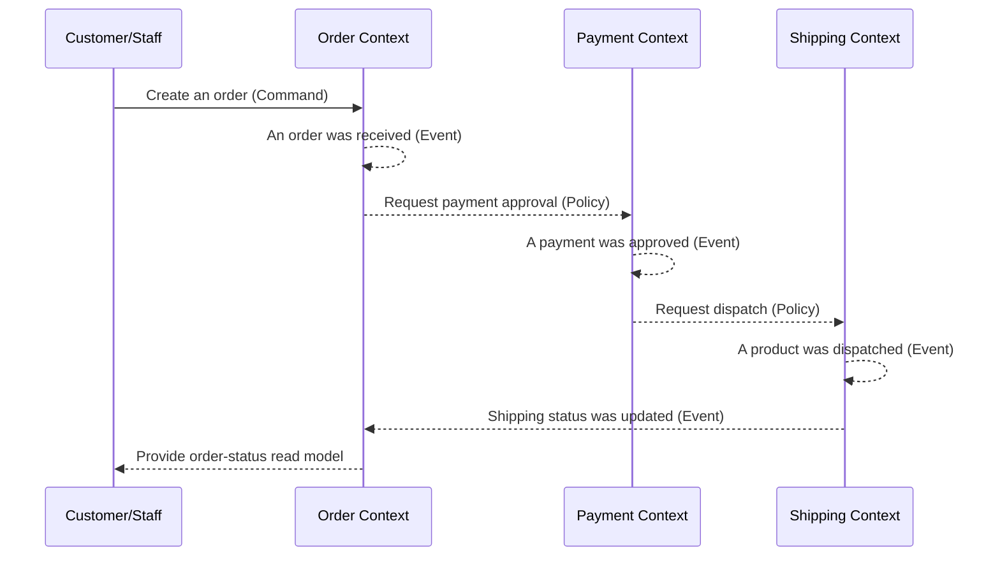

# Domain Exploration and Design Based on EventStorming

## 1. Overview

> **Definition**: EventStorming is a collaborative modeling workshop in which stakeholders and developers spread out domain events in chronological order in one shared space and jointly explore the facts, rules, responsibilities, and boundaries of a complex business domain.

The failure of a software project does not arise only from choosing the wrong technology stack.
When the terms used by business staff differ in meaning from the objects designers create, or when different departments understand the same task with different sequences and responsibilities, requirements are already shaken before they are fixed in documents.
In particular, tasks that entangle multiple departments and external systems—like ordering, payment, shipping, and refunds—are hard to explain in their entirety with a mere list of screens or CRUD tables.

EventStorming is a method that first exposes such knowledge disconnects through conversation and a visual model.
Participants do not begin by deciding what the system stores; they write down facts that have already occurred in the business as past-tense sentences.
For example, when events such as `an order was received`, `a payment was approved`, and `a product was dispatched` are placed on a timeline, the commonalities and conflicts in the business flow as understood by different people become visible at the same time.

The core of this approach is that a correct design is not handed down by one person; rather, domain experts and technologists build the model together, performing **collective learning**.
Therefore the deliverable is not mere meeting minutes but a starting point for ubiquitous-language candidates, business rules, open questions, boundary candidates, and subsequent design.
EventStorming supports Domain-Driven Design (DDD) but does not replace all of DDD's activities, nor is it a technique that discards UML, BPMN, or data models.

### 1.1 Background and Necessity

Traditional analysis takes a linear flow: interview for requirements, have the analyst organize the content, and then hand documents to developers.
In this process, the tacit knowledge held by the people who actually perform the work is dropped during documentation, and when questions arise, a meeting must be scheduled again.
If errors are not found until the document is completed, the cost of rework surges at the implementation stage.

By contrast, in EventStorming, everyone simultaneously puts up and moves cards on a large wall or digital board.
Rapid visualization instantly exposes mismatches that existed only in words, and because the cost of changing a card's position and wording is low, initial hypotheses can be safely broken.
Developers hear the business rules directly, and business people are asked about technical constraints and data flows, so each side corrects the other's perspective.

This technique is particularly effective under the following conditions.
First, when business terms differ by department and the responsibility boundaries between systems are unclear.
Second, when modernizing a legacy system requires understanding both current behavior and the target business together.
Third, when the problem domain of a new service must be explored in a short time and the scope of an MVP decided.
Fourth, when exceptions that cannot be explained by the normal flow alone—such as incidents, complaints, and regulatory responses—are important.

### 1.2 Goals and Non-Goals

The goal of EventStorming is **to understand the same event by the same name** for a complex domain.
When the workshop ends, not every detailed design need be decided, but what happened, who caused it, which policies react automatically, and where uncertainty lies must be exposed.
Through these results, the team can set investigation priorities and design decisions.

Conversely, EventStorming is not an activity for producing a finalized database schema, a completed API specification, executable test code, or a final organizational chart.
A card's position is the model's current hypothesis, and rules and boundaries can change through subsequent validation.
Therefore, copying the deliverable directly into an implementation specification has the side effect of hiding the uncertainty of the discovery phase.

## 2. Core Principles and Overall Structure

### 2.1 Event-Centered Thinking

A domain event is a fact that is meaningful from a business perspective and has already occurred.
Events are generally expressed with a past-tense verb and a noun, representing a result rather than someone's intent or command.
`The customer pressed the order button` is closer to an action or command, but `an order was received` is an observable fact in the domain.

When events are placed first, participants focus on business changes rather than on database tables or service names.
In the process of debating the order of events, preconditions, subsequent reactions, delays, cancellations, retries, and compensation flows naturally emerge.
It is also possible to check whether the same event is used in multiple places, which helps explore inter-service coupling and boundary candidates.

Event names should prioritize business terms over implementation technology.
For example, `OrderStatus = 3` is a database status value, but `a payment was approved` is a fact business people can also understand.
Do not force perfect names at first; mark disputed expressions as separate hotspots and refine them into the ubiquitous language after the workshop.

The structure above shows that analysis does not end with a single deliverable.
Questions surfaced on the timeline are validated through additional interviews or log analysis, and the validation results in turn change event names and order.
Exceptions found at the design stage must also be fed back into the domain model, so EventStorming is closer to an iterative learning loop.

### 2.2 Colors and Model Elements

Color is not a grammar enforced like an international standard but a visual convention that aids conversation among participants.
It is fine for a team to use a different color scheme, but it should agree on a color key and examples at the start and not change their meanings midway.
The table below organizes the widely used default palette and its questions.

|Element|Representative Color|Sentence Form|Question to Confirm|
|---|---|---|---|
|Domain Event|Orange|`was ~ed`|What fact occurred?|
|Command|Blue|`do ~`|What triggered the event?|
|Actor|Yellow|User·System·Role|Who issued the command?|
|Policy|Purple|`if ~ then ~`|What rule fires after the event?|
|Read Model|Green|Query screen·decision data|What must be read before the command?|
|Aggregate|Light pink|Unit of business responsibility|What consistency must be maintained together?|
|Hotspot|Red or pink|Question·conflict·risk|What do we not yet know?|
|Boundary|Line or pink label|Bounded-context candidate|Where do terms and rules change?|

More important than the colors in the table are the causal relationships among the elements.
A command is some actor's intent, and when a command succeeds, one or more events occur.
An event triggers a policy or updates a read model and can be delivered to another context as a message.
Therefore, do not merely list the cards; use arrows and conversation to explain "why did this event occur."

An actor does not mean only a person.
A customer, a support agent, a batch job, a payment gateway, an external regulator, and another bounded context can also be the subject of a command or the consumer of an event.
Representing an external system as if it were a person is a modeling device for finding responsibilities and integration points; it does not mean it actually has the same level of trust.

A policy expresses an automatic reaction such as "whenever an event occurs, always do something."
For example, the policy `when a payment is approved, request shipping preparation` explains the coupling between payment and shipping.
But whether the policy is a synchronous call or asynchronous event consumption, and whether there is retry and compensation on failure, must be left as separate design questions.

### 2.3 The Role of Hotspots

A hotspot is not a gap in the model but a first-class deliverable for learning.
If participants use `refund completed` and `refund approved` with different meanings, or if the owner of a partial refund is undecided, mark it with a red card.
Rather than forcibly ending a dispute and adopting an arbitrary term, making the uncertainty visible improves the quality of the next decision.

Hotspots can have priorities.
Investigate first the questions with high legal risk, those that directly affect monetary settlement, and those tied to recurring incidents, and place simple wording differences later.
Connecting each hotspot to an owner and a confirmation deadline turns the workshop from an idea board into an actionable discovery backlog.

## 3. Workshop Procedure

### 3.1 Preparation Stage

The facilitator first sets the scope of exploration and the start and end conditions of the timeline.
Something like `from after payment of an online order to delivery` should describe one business purpose and its start and end; a scope like "model the entire company" is too broad.
The needed participants are domain experts, product owners, developers, architects, and operations/customer-support staff, and, as much as possible, the parties to external integrations are also invited.

In a physical workshop, secure ample wall space and prepare several sticky notes and thick pens per participant.
In a digital workshop, check in advance the permissions on the infinite canvas, the color template, the audio quality of the video conference, time zones, and a method for collecting anonymous opinions.
Even if a tool is flashy, if moving cards and concurrent editing are difficult, the discussion slows down, so prioritize flow over features.

Before starting, announce the following operating principles.
First, prioritize domain facts over rank, and anyone may put up a card.
Second, write only one meaning per card.
Third, do not hide uncertain content; mark it as a hotspot.
Fourth, even when implementation terms come up, retranslate them into business events.
Fifth, do not try to resolve every disagreement immediately; keep to the time box.

### 3.2 Big Picture EventStorming

The Big Picture stage is the stage for quickly spreading out the whole flow.
Participants first write the domain events they know on orange cards in the past tense and stick them on the wall without trying to perfectly align the chronological order.
It is fine for cards to be duplicated or contradictory at first, because the duplication and contradiction themselves reveal differences in knowledge.

Next, participants read the cards to group similar flows and question the gaps and conflicts between events.
In this process, they write down not only the normal flow of the business but also cancellation, failure, reprocessing, expiration, holding, and compensation events.
For example, recording only payment approval will miss real operational issues such as approval failure, partial cancellation, and duplicate approval.

The deliverable of the Big Picture is not a single completed design.
The goal is to find the rough domain terrain, the complex sections, the disputed terms, and the hotspots needing further exploration.
Usually, even when starting with a broad scope, you should be able to pick a high-value flow and expand it into the Process stage.

### 3.3 Process Level EventStorming

The Process stage is the stage of selecting one specific flow and attaching commands, actors, policies, and read models.
Place the command `create an order` and the actor customer before the event `an order was received`, and mark the needed cart lookup as a read model.
This way, events are not merely listed in chronological order but are fleshed out into a flow with intent and responsibility.

A policy is written as a rule that makes the next command with an event as its cause.
Given a policy `when a payment is approved, request dispatch`, participants debate whether it is an automatic reaction or requires staff approval, and whether a retry interval and an idempotency key are needed.
This conversation connects the business model to distributed-system design, but the facilitator must keep balance so that the technical implementation is not decided hastily.

At the Process stage, time, responsibility, and exceptions are asked about more precisely.
Whether the order was created when the customer closed the payment screen, how duplicate payment is prevented when the approval response is late, and who notifies the customer when the carrier rejects a cancellation—these are recorded as events and hotspots.
Placing the normal path and the exception path on one screen makes it easier to judge whether the business flow is operable.

The sequence above does not imply a specific technology stack.
Whether it is a synchronous API or a message broker, and whether it is one database or multiple stores, is decided by additionally analyzing reliability, latency, and organizational structure.
That said, separating events and policies creates a common language for discussing coupling points, fault propagation, and the design of retries and compensation.

### 3.4 Software Design Stage

At the Software Design stage, the section chosen in the Process stage is expanded into candidates for aggregates, bounded contexts, and services·events·read models.
An aggregate is not the concept of bundling all data into one table but a unit of business responsibility that must maintain consistency within a single transaction.
Do not assume that `order` and `payment` must always be one transaction; first check each one's invariants and failure boundaries.

A bounded context becomes a candidate at the point where the same word begins to have a different meaning.
The "customer" of the order context may be an entity with a purchasing subject and a delivery address, while the "customer" of the marketing context may be a target with campaign responses and segments.
Merging the two models into one giant customer object mixes reasons for change and forces the reconciliation of different rules.

Events between contexts are managed like public contracts.
An event's name, fields, time of occurrence, possibility of duplication, ordering guarantees, whether it contains personal data, and its retention period must be defined.
The cards of the workshop are not immediately the event schema, but they become the input for deciding which facts to expose externally and which responsibilities to separate.

## 4. Relationships Among Model Elements and Design Interpretation

### 4.1 The Difference Among Events, Commands, and Policies

A command is an intent that has not yet occurred, while an event is a fact that has already occurred.
A command can be rejected, but an event is the fact of an occurrence, so it is recorded in the past tense.
A policy is a rule that observes an event and generates a subsequent command; if the policy's conditions change, the subsequent action for the same event can also change.

For example, the command `apply a coupon` is an intent requested by the customer or the system.
If validation succeeds, the event `a coupon was applied` occurs, and a policy that sees the event can make the subsequent command `recalculate the discount amount`.
Conversely, if the coupon has expired, the command is rejected, and a failure fact such as `coupon application was rejected` can be recorded separately.

|Category|Meaning|Temporal Perspective|Practical Deliverable|
|---|---|---|---|
|Command|A request for a desired action|A future possibility|API request, work-queue message|
|Event|A business fact that has already occurred|A past fact|Domain event, audit record|
|Policy|A business rule reacting to an event|A conditional subsequent action|Process manager, automation rule|
|Read Model|Lookup information needed for a decision|A current observation|Screen, search index, dashboard|

The reason this distinction matters is that responsibility and reprocessing methods differ.
A command must check authorization·validity·idempotency, and an event must consider duplicate reception and order reversal.
A policy must be designed for retry·compensation·human intervention on failure, and a read model must decide how to present delayed eventual consistency to the user.

### 4.2 Boundaries and Cohesion

A boundary is a process of observing the cohesion of rules and language rather than the act of drawing a line between cards.
Elements whose reasons for change move together, which the same team is responsible for, and which must maintain the same invariant are likely to remain within one boundary.
Conversely, if they have different terms, different speeds, and different regulatory responsibilities, there is reason to separate them into a distinct context even if there is integration.

Making too many boundaries increases the messaging and operational burden.
Conversely, bundling everything into one context loses independent deployment and clarity of the model.
Therefore, boundaries should be decided by looking at business capability, team structure, data ownership, and fault isolation together—not by the number of cards or the microservices fad.

### 4.3 Exceptions and Compensation

In real-world systems, the cost of exceptions is greater than that of normal events.
Delivery stock may be insufficient after payment approval, an external courier API may be temporarily down after a shipping request, and a user may refund a product already received.
Such flows cannot be handled by the single sentence "roll back on failure"; they require compensation events that undo facts already exposed externally.

In the workshop, do not hide exceptions on a separate line; place them near the normal timeline.
Explicitly state events customers and operators can observe, such as `a payment was not approved`, `the dispatch request expired`, and `a refund was completed`.
Then ask about each event's owner, retry count, manual-handling criteria, customer notification, and audit trail.

## 5. Comparison and Usage Context

### 5.1 Comparison with BPMN·UML·User Story

BPMN is strong at expressing the flow, gateways, roles, and messages of a business process with formal symbols.
UML sequence diagrams clearly show interactions between objects, and class diagrams show structure and relationships.
User Stories are good for managing user value and acceptance criteria.
EventStorming prioritizes rapid joint exploration and the exposure of knowledge conflicts over notation more precise than these.

Therefore it is more appropriate to view EventStorming not as a replacement for BPMN but as a front-end activity leading from discovery to formalization.
Based on the events and hotspots agreed upon in EventStorming, one can flesh out BPMN approval flows, UML interactions, and User Story acceptance criteria.
Conversely, if formal control evidence of an already heavily regulated process is needed, formal documents must be the final deliverable.

|Perspective|EventStorming|BPMN/UML|User Story|
|---|---|---|---|
|Main purpose|Joint domain exploration|Formal process·structure expression|Managing user value and requirements|
|Mode of participation|Concurrent collaboration·speech-centered|Tends to center on the model author|Product·development discussion-centered|
|Handling uncertainty|Made visible as hotspots|May remain as notes outside the diagram|Separated as backlog·questions|
|Strength|Rapid shared understanding and boundary discovery|Accurate review·traceability·automation|Managing priorities and acceptance criteria|
|Limitation|Formality·reproducibility may be low|Heavy for early exploration|May miss the whole business flow|

When connecting the three methods, conversion rules must be made explicit.
For example, mechanically copying an event's name into a BPMN state can confuse events with states.
Also, non-functional requirements not on the cards, the legal basis for handling personal data, performance targets, and retention periods must be augmented with a separate quality-attribute list.

### 5.2 Connection with DDD·EDA·CQRS

EventStorming is useful for discovering bounded contexts and the ubiquitous language in DDD's strategic design.
It can also produce candidates for aggregates and domain events in tactical design, but the size of an aggregate and its transaction boundary must be re-confirmed through code and invariant validation.

Event-Driven Architecture (EDA) and Event Sourcing can also leverage EventStorming's concept of an event.
However, not every card called an "event" in the workshop means an integration event published to a broker.
Domain events for business records, integration events between systems, and event-sourcing events for storage can have different purposes, contracts, and retention policies.

In CQRS, the command model and the read model can be separated, but as read models increase, update latency and regeneration cost grow.
When marking a read model in EventStorming, do not merely make a list of screens; record what data is needed for what decision, together with the freshness requirement.

### 5.3 A Legacy Modernization Case

Assume a hypothetical retail company is modernizing a 15-year-old order system.
The existing documents record order status as `READY`, `PAYED`, `DELIVERY`, and `DONE`, but the business distinguishes more states: orders before payment approval, partial dispatch, return receipt, and refund pending.
If the team first splits the tables into services, there is a risk of replicating the meaning of the existing status values as is.

In EventStorming, operators, support agents, and developers bring real customer cases and place events in chronological order.
As a result, it may be revealed that `payment approved` and `payment settled` are different events, and that `delivery completed` splits into the courier's notification and confirmation of the customer's receipt.
This difference is a business question that must be resolved before designing service boundaries and data contracts.

In subsequent design, order·payment·shipping·returns are treated as candidates for independent responsibility, but they are not decomposed into four microservices from the start.
After validating each context's change frequency, team ownership, fault isolation, and data-consistency requirements, they are separated incrementally.
Thus EventStorming is a tool that reveals the gap between the current facts and the target model, not one that splits the legacy as is.

## 6. Facilitation and Quality Management

### 6.1 The Facilitator's Role

The facilitator is not a person who presents the domain's correct answer but one who designs the flow so that participants speak facts and handle conflicts safely.
When technical terms dominate the conversation early on, return the question to "what actually happens in this business."
Give quiet participants time to write cards, and use anonymous hotspots so that the opinion of a high-ranking person does not immediately become consensus.

Operate time boxes by stage.
For example, set an end time each for collecting all events, organizing the timeline, augmenting commands·actors, classifying hotspots, and selecting the next stage.
Move long-disputed items to a separate question backlog so that the learning of the whole flow does not stop.

### 6.2 Common Failure Patterns

The first failure is having only developers participate and writing technical events as if they were business events.
`API call succeeded` and `Kafka publish completed` can be system-observation facts, but since the business purpose and customer value are not visible, they must be distinguished from domain events.
The second failure is executives or planners forcing a predetermined answer onto the cards.
In this case, the workshop retains only the form of consensus while the real uncertainty is hidden.

The third failure is converting all cards immediately into microservices.
Because a card's color and boundary are discovery hypotheses, finalizing service boundaries by traffic or team count alone increases distributed transactions and operational burden.
The fourth failure is keeping only the normal flow and "handling later" the exceptions.
Adding fault·cancellation·compensation flows late omits real quality requirements and pushes operational design into the back half of implementation.

### 6.3 Sustained Management of Deliverables

The workshop board does not end with a single photo.
Extract the needed parts into an event dictionary, a term-decision log, a hotspot backlog, a context map, decision records (ADRs), and API·event contracts.
Leave in the deliverable the creation date, scope, participants, unresolved assumptions, and the next validation task so that new team members understand the model's level of trust.

During operations, check whether real incidents and changes are reflected in the model.
If a new exception is discovered but the board is not updated, the model separates from the current system.
Conversely, moving every log onto a card blurs the business meaning, so distinguish facts worth observing by a domain expert from technical telemetry.

## 7. Advanced: Answer Composition and Exam Linkage

In a professional-engineer answer, defining EventStorming merely as a "sticky-note meeting technique" lacks depth.
After the definition, present the causes of complexity—knowledge silos, term mismatch, and mixed legacy responsibilities—and explain how event-centered exploration makes these visible.
Then connecting the Big Picture→Process→Software Design stages, the color elements, hotspots, and boundary discovery with a concept diagram and a case makes the essay flow natural.

For comparison questions, do not end the difference from BPMN·UML·User Story with a simple table; present the context that "the discovery stage and the formalization stage are different."
When linking with EDA·DDD·CQRS, include the caveat of not equating workshop events with integration events.
Finally, organize as considerations the facilitation bias, missing exceptions, keeping deliverables current, and the separate management of privacy·security requirements.

For the expected case, use a familiar flow such as ordering·payment, but add payment delay, partial refunds, and external-integration failures to show the realism of a distributed system.
When numbers are needed, present them as general operational examples—such as a small-scale Process session of 6–10 participants over 2–3 hours—and do not exaggerate them as a specific organization's achievement.
The answer's conclusion should converge on "the effect is sustained when boundaries are discovered through collective learning and connected to formal deliverables and operational governance."

## 8. Considerations and Implications

### 8.1 Controlling Scope and Purpose

If the scope is too broad, cards merely pile up and no decisions emerge.
Choose one of a customer journey, a business capability, or a specific incident flow, and clearly set the start and end conditions.
Conversely, if the scope is too narrow, responsibilities between contexts and external effects are invisible, so a hierarchical approach—seeing broadly in the Big Picture and narrowing in the Process—is needed.

### 8.2 Participants and Psychological Safety

Domain knowledge is not monopolized by one job function.
Support agents know exceptions and complaints, operators know incidents and manual actions, and developers know system constraints, so they must all participate together.
So that the remarks of high-ranking people do not harden into the model's truth, distinguish facts·assumptions·opinions, and it is important to operate in a way that safely leaves disagreements as hotspots.

### 8.3 Consistency and Traceability

The card model is fast but low in formality, so agreed terms and decisions must be traced into an event dictionary·ADRs·requirements·tests.
If an event name changed in an API or a log, check the scope of impact, and set a single source of truth in the repository for which model is current.
Do not hide the difference between the model and the implementation; record the reason for the difference and its valid period.

### 8.4 Distributed-System Quality

If it leads to event-based design, you must check duplication, order reversal, latency, partial failure, reprocessing, and idempotency.
Even if the workshop explains the business meaning, it does not automatically solve the network's delivery guarantees or a broker's failures.
Design per-policy retry·DLQ·compensation·observability·audit logs, and decide how to communicate eventual consistency to the customer.

### 8.5 Privacy and Security

Writing customer identifiers, health information, or payment information as real values on a card makes the workshop board itself a personal-data store.
Use pseudonyms·example values instead of real data, and apply access permissions·retention periods·download policies for the digital board.
The event contract must separately link non-functional requirements such as minimal collection, purpose limitation, access control, encryption, and audit trails.

### 8.6 Sustainable Improvement

Do not expect the model to be completed by a single workshop.
Investigate hotspots, reflect actual operational metrics and customer feedback, and run short re-exploration sessions at important changes.
Even as teams change, connecting onboarding materials and a repository so that knowledge is maintained through the ubiquitous language and decision records is the governance from a professional engineer's perspective.

## References

- EventStorming official site, Alberto Brandolini: https://www.eventstorming.com/
- EventStorming official resources: https://www.eventstorming.com/resources/
- Avanscoperta, Introducing EventStorming: https://blog.avanscoperta.it/2014/02/12/introducing-event-storming/
- Open Group Open Agile Architecture, Event Storming Workshop: https://pubs.opengroup.org/architecture/o-aa-standard/event-storming-workshop.html
- VMware Tanzu, Event Storming: https://blogs.vmware.com/tanzu/event-storming/

---

> **In one line**: EventStorming is a collaborative exploration method that jointly spreads domain events along a timeline to discover the language, rules, exceptions, and boundaries of a complex business, and connects the results to DDD·EDA·formal models·operational governance.
