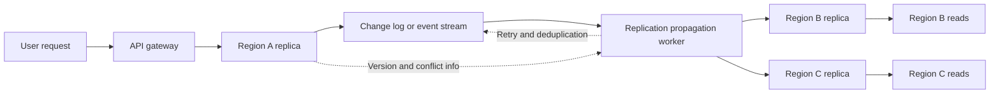
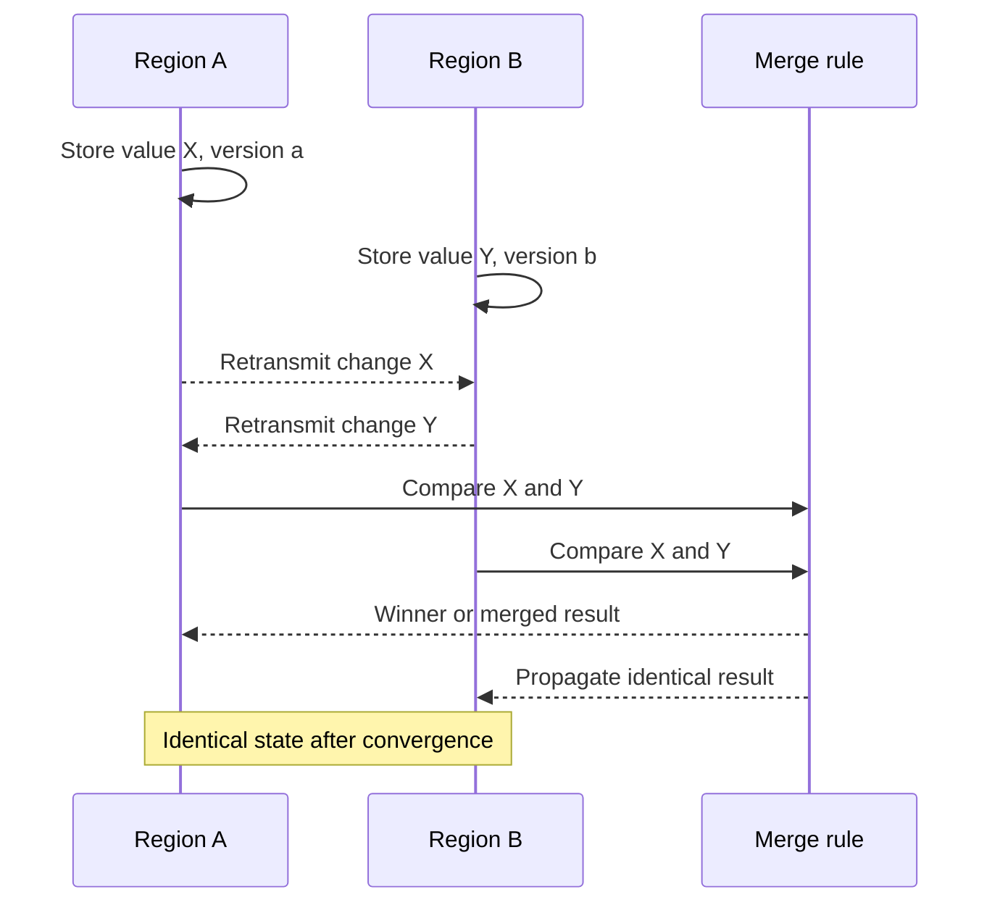

# Eventual Consistency and Consistency Models in Distributed Systems

## 1. Overview

### A. Definition

> **Eventual Consistency** is a distributed data consistency model stating that once no new updates occur and propagation between replicas completes normally, all replicas converge to the same value over time.

Eventual consistency is not a promise that every read immediately returns the latest value. At any given moment, different values may be observed due to network latency between regional replicas, asynchronous replication, and differences in retry order.

Instead, the system prioritizes availability and latency while being designed so that results converge to a single value once failures are resolved and update propagation finishes.

This model is frequently used in services that must respond quickly to users worldwide, such as key-value stores that replicate data across multiple regions, DNS, CDN caches, social feeds, shopping carts, and recommendation results.

### B. Background and Necessity

In a single database, the latest state can be defined relatively easily with one transaction log and locking scheme.

In multi-region services, however, users connect to the replica in the nearest region, and communication between regions may be delayed or temporarily cut off.

Sending all writes to a central leader and making all reads wait for the result yields strong consistency, but regional failures and long round-trip times translate directly into service latency and reduced availability.

Eventual consistency makes it possible at this point to choose "we may briefly show a different value, but the service keeps responding."

For example, if a user changes their profile name in Seoul and immediately views their profile in the Tokyo region, the old name may briefly be visible.

If a service can tolerate this phenomenon, it can narrow the scope it waits on for a write-success response, improving user experience and geographic scalability.

Conversely, in areas where tolerating stale values causes direct losses or security incidents — such as transfer balances, inventory deductions, or permission revocation — eventual consistency alone is not sufficient.

Therefore, a consistency model should be understood not as a property of the storage but as a design decision reflecting business meaning, cost of error, and user expectations.

### C. Relationship with CAP and Latency

Distributed systems, on the premise that network partitions can occur, require a choice between Consistency and Availability.

The C in CAP is close to consistency in the strong sense that all nodes see the same latest value, and A is the property of responding to requests even when some nodes are isolated.

Eventually consistent systems can take on an AP character in which each replica responds to writes or reads even during a network partition, but this does not mean that such results are always accepted unconditionally.

Real products combine per-key conditional writes, quorum reads, session guarantees, and conflict resolution policies to create compromises per business function.

CAP is a theoretical framework explaining choices under failure; it does not automatically determine normal-time latency, throughput, cost, or operational complexity.

## 2. Meaning and Hierarchy of Consistency

### A. Strong Consistency and Weak Consistency

Strong consistency requires that after a write succeeds, a read from any node returns the latest value or a later one.

Linearizability makes each operation appear to occur atomically at a single instant between its invocation and response, and it also preserves real-time order.

This property suits operations where order and freshness are essential, such as account balances or distributed locks, but because it must wait for agreement across multiple regions, the costs of latency and failure propagation grow.

Weak consistency does not guarantee the latest value at read time. However, it is divided into several sub-models depending on "by when must it converge" and "what order is guaranteed across one user's consecutive requests."

Eventual consistency is a model among weak consistency models that specifies a convergence condition; it does not mean that different values may be served indefinitely.

### B. Major Consistency Models

| Model | Core guarantee | Typical use | Main cost |
|---|---|---|---|
| Linearizability | All operations appear in a single global order | Balances, leader election, locks | Consensus latency, reduced availability |
| Sequential consistency | A single order preserving per-process order | Shared memory abstraction | Global ordering coordination |
| Causal consistency | All nodes preserve cause-effect relationships | Comments and replies, messages | Managing causal metadata |
| Session consistency | Read/write order guaranteed within a session | User profiles, shopping carts | Session pinning or tokens |
| Eventual consistency | Replicas converge once updates stop | DNS, feeds, caches | Temporarily stale values, conflicts |
| Read-your-writes | Values you wrote are visible in later reads | User setting changes | Session routing, version passing |
| Monotonic reads | The same user's reads never go back in time | Status inquiry screens | Replica selection control |

The models in this table are less mutually exclusive product categories than combinations of observability that a system provides to users.

For example, the overall system may be eventually consistent while read-your-writes and monotonic reads are applied to user sessions.

This way, not every user waits for the global latest value, yet the confusion of one's own just-made change disappearing from the screen is reduced.

### C. Distinguishing Consistency from Durability and Correctness

Consistency refers to the order and timing in which values are observed across replicas.

Durability is the property of whether a successful write is not lost after a failure, and integrity refers to whether values do not violate business rules.

Choosing eventual consistency does not mean that losing data is acceptable.

For example, order events can be stored durably, while search indexes and recommendation results are updated asynchronously and served with eventual consistency.

Without this distinction, incorrect designs arise such as "it's asynchronous replication, so it's fine if data disappears."

## 3. Operating Principles and Components

### A. Asynchronous Replication Structure

When a write succeeds in Region A, the database first completes local storage and log recording, and the replication worker sends the change to Regions B and C.

Separating the client response from remote replication completion reduces round-trip latency, but values differ by region during the failure window before remote replication.

Therefore, the log must be not a simple network message buffer but a durable record of facts needed for restart, retransmission, order tracking, and auditing.

The replication worker must withstand transient failures using timeouts and exponential backoff, and guarantee idempotency so that the result is applied only once even if the same event is delivered multiple times.

### B. Version and Order Tracking

The simplest conflict resolution method is last-writer-wins (LWW). Each update is tagged with a logical or physical time, and the larger value is kept.

However, if clocks on different nodes drift, a change that is actually more recent may be discarded, and it is also difficult to distinguish concurrent writes at the same time.

A logical clock tracks the causal order of messages instead of physical time. A Lamport clock expresses the order "A happened before B," but does not distinguish mutually independent concurrent events.

A vector clock maintains a counter per node to compare the relationship between two versions. If every entry of one vector is less than or equal to the other's, it is a happened-before relationship; if neither contains the other, it can be judged a concurrent update.

Since vector metadata grows with the number of nodes, in practice partition-level versions, hybrid logical clocks, server-generated sequence numbers, and the like are chosen according to requirements.

### C. Conflict Resolution

A conflict occurs when two replicas update the same key with different values and then exchange their changes.

LWW is easy to implement and uses little storage, but because the meaning of the losing value disappears, information important to users may be lost.

Per-field merging can preserve independently modified fields such as name and address, but may break business rules spanning fields.

A multi-value register preserves all conflicting values and lets the application or user make a subsequent choice.

CRDTs, which merge the operations themselves — such as counters, sets, and maps — are designed to converge to the same result even when message order differs, using commutative, associative, and idempotent properties.

However, not every domain state can be expressed as a CRDT. Constraints such as inventory that must not drop below 0, or global invariants such as "only one winner," require separate reservation, consensus, or compensation procedures.

### D. Retries and Idempotency

Because a response may be lost, a sender may resend the same replication event.

If the receiver simply adds the event, a counter increments twice and the same order is created twice.

To prevent this, duplicates are detected using event IDs, source partitions and offsets, and business keys, and processing results are recorded.

An idempotent assignment yields the same result no matter how many times the same value is applied, but incremental operations such as "increase the balance by 100" must record the event ID or be wrapped in an atomic operation applied only once.

The retry policy must include the maximum number of retries, a parking queue, poison message isolation, and an operator reprocessing procedure.

## 4. Consistency Level Design and Implementation Procedure

### A. Requirements Analysis

The first step is not to demand "the latest value" abstractly but to define the range of staleness that users and the business can tolerate.

It is acceptable for product search results to be reflected a few seconds late, but price and inventory right before payment may require separate verification.

As quantitative criteria, define the target percentile of convergence latency, the maximum allowed time for stale reads, the conflict rate, and the reprocessing rate.

Without these metrics, you can only confirm that replication is running, but cannot verify by when things must appear correctly to users.

It is realistic to separate combinations of reads and writes by business function and mix "global strong consistency," "region-local eventual consistency," and "session guarantees."

### B. Data Classification

| Data type | Acceptable model | Design example |
|---|---|---|
| Accounts / payment authorization | Strong consistency or single authority | Ledger service and conditional updates |
| Product search index | Eventual consistency | Source DB and asynchronous indexing |
| Shopping cart | Session / read-your-writes | Per-user partitions and merging |
| Likes / view counts | Mergeable eventual consistency | CRDT counters or event aggregation |
| Permissions / token revocation | Rapid propagation, at least short TTL | Central policy and cache invalidation |
| Analytics / recommendation features | Delay-tolerant eventual consistency | Stream processing and recomputation |

The key to classification is evaluating the damage from misuse rather than the data itself.

For example, product descriptions can be seen late, but payment must not proceed by trusting only the search index's available inventory.

Even if the payment service refers to eventually consistent search results, it has a double check that queries the authoritative inventory and payment systems again at the time of final approval.

### C. Choosing a Replication Protocol

Synchronous replication provides high consistency by receiving write acknowledgments from multiple nodes, but failures in distant regions may propagate into write latency.

Asynchronous replication provides fast local responses, but replication lag, conflicts, and possible loss up to the recovery point must be managed operationally.

Leader-based replication simplifies ordering, but election on leader failure and concentration of traffic in the leader's region become problems.

A multi-leader structure reduces per-region write latency, but the application must take responsibility for concurrent conflicts and merge policies.

In structures that tune read and write quorums, with the total number of replicas as N, the read quorum as R, and the write quorum as W, the relation R+W>N can be used.

This relation increases the likelihood of reading the latest write via overlapping replicas, but does not automatically resolve failures, delays, concurrent writes, or version selection policies.

### D. Application-Level Supplements

If the client receives a version token in the write response and passes it on the next read, the server can route to a replica holding that version or later.

This method can create read-your-writes without session pinning, but waiting/fallback responses must be defined for when the token expires or the version has not yet arrived in that region.

User screens can display "processing," "syncing," or "need to confirm latest state" to convey temporary inconsistency meaningfully rather than hiding it.

Recording business commands as events rather than state overwrites, and passing conflicts to compensating transactions or a manual review queue, makes root-cause tracking and recovery easier.

## 5. Comparison with Strong Consistency

### A. Why the Differences Arise

Strong consistency simplifies users' reasoning about read results. Code can assume that once a write succeeds, reading from any location afterwards gives the same result.

However, this guarantee delays requests until communication and coordination between replicas complete, and during a network partition it can lead to the choice of refusing to respond.

Eventual consistency can process locally without waiting for communication, which favors latency and regional availability.

Instead, the application must explicitly handle stale data, duplicate events, conflicts, order inversion, and reprocessing.

| Comparison item | Strong consistency | Eventual consistency |
|---|---|---|
| Read semantics | Close to the latest global state | Previous state briefly possible |
| Write latency | Increases with coordination scope | Can be lowered with local responses |
| Choice under failure | Greater chance of errors/blocking | Regional service can continue |
| Conflict handling | Reduced by the protocol | Requires domain rules |
| Operational difficulty | Managing consensus and leader failures | Managing replication lag and reprocessing |
| Suitable workloads | Ledgers, permissions, inventory confirmation | Feeds, search, analytics, caches |

### B. Practical Meaning of Hybrid Models

There is no need to decide that an entire system is all strongly consistent or all eventually consistent.

A CQRS structure can be used in which the ledger and order status are kept strongly consistent, while order search, notifications, and dashboards receive events and are updated later.

For instance, it is acceptable for a dashboard viewed right after an order to still show "processing," while the detail screen checks directly with the ledger service.

Separating authoritative data from derived data this way lets you pay the high cost of consistency only at the boundaries where it is truly needed.

## 6. Industry Application Cases

### A. Global Social Feed

A post can be stored first in the region nearest the author, and followers' timelines generated through asynchronous fan-out.

It is generally acceptable for some followers to see a new post late during propagation delay.

However, deletion requests and blocking must apply faster propagation and cache invalidation than regular posts, and recollection work is also needed so that no already-propagated copies remain.

### B. E-commerce Inventory

Product detail and search indexes can be operated with eventual consistency to distribute read load.

However, at the payment stage, the inventory quantity in the search index is not used as a confirmed value; instead, a reservation command is sent to the authoritative inventory service.

The reservation command includes the order ID as an idempotency key, with reservation expiry and compensating return on payment failure.

This structure accepts the issue of on-screen quantities appearing slightly late while blocking overselling at the critical boundary.

### C. DNS and CDN Caches

DNS and CDNs replicate values to edges worldwide to respond quickly, and propagate changes through TTL and invalidation requests.

Some users receiving the old IP or old content while the TTL remains is a typical example of eventual consistency.

For security patches or failover, you cannot simply wait out the TTL, so short TTLs, aggressive invalidation, health checks, and alternative origins must be designed together.

## 7. Verification, Observability, and Incident Response

### A. Key Observability Metrics

Replication lag is measured as the difference between the time of the source event and the time it is applied at the target replica, looking at p95 and p99 along with the average.

The conflict rate must be aggregated per key or business type to find phenomena occurring only in specific customer groups or regions.

Also record the stale read ratio, retry rate, deduplication rate, parking queue length, and reconvergence time after recovery.

Metrics should carry tenant, region, and data criticality tags so that the overall average does not hide risky segments.

### B. Testing Strategy

Fault injection testing is needed that injects network latency, packet loss, order inversion, duplicate delivery, clock skew, and region disconnection.

In tests that update the same key concurrently, clearly verify whether the expected result is a simple "last value," a field merge, or user confirmation.

After replication stops and resumes, find missing events and confirm that the final state is identical even when events are replayed multiple times.

Session guarantees such as read-your-writes and monotonic reads must be tested by moving users across multiple regions.

### C. Incident Response

When replication lag exceeds a threshold, traffic for low-priority derived tasks can be reduced and read paths to the authoritative system temporarily increased.

When conflicts spike, a safe mode is needed that stops automatic merging and requires approval from business owners via a parking queue.

Resynchronization narrows the missing interval using checkpoints and change logs rather than full copies, and during resynchronization, version verification prevents stale data from overwriting the latest data.

## 8. Advanced: CRDTs and Event-Driven Architecture

CRDTs (Conflict-free Replicated Data Types) design data structures and operations so that merge results converge across distributed replicas even when operation order and arrival times differ.

Set add/remove, counter increment, registers, and maps can be combined, and mathematical associativity and idempotency simplify network retransmission.

However, the semantics of deletion and re-addition, metadata growth, garbage collection, and manipulation by malicious clients must be handled separately.

In an event-driven architecture, source events are preserved and multiple consumers independently update search indexes, notifications, and analytics models.

Here, backward compatibility of event schemas, the scope of ordering guarantees, event replay, isolation of consumer lag, and propagation policies for personal data deletion are included in the consistency design.

The fact that events eventually arrive does not mean consumer screens are always up to date, so it is important to provide users with processing status and a reference time.

## 9. Considerations and Implications

### A. Business Invariants First

Do not decide the consistency model by technology trends or database defaults; first identify invariants whose violation causes major financial, legal, or safety damage.

Resources that must exist only once globally get strong boundaries such as reservation tokens, leaders, or consensus services, while the remaining query models scale asynchronously.

### B. User Experience and Contracts

If stale values may be visible, the reference time, processing status, and how to re-query must be stated on screens and in API documentation.

Contracts with API consumers must distinguish whether "write success" means completion of source storage or reflection in all derived systems.

### C. Security and Personal Data Propagation

Permission revocation and personal data deletion must have stricter propagation targets than general content.

Track whether deletion requests reach caches, search indexes, backups, and analytics stores, and operate audit logs that can verify any remaining copies.

### D. Cost and Operational Complexity

Eventual consistency can reduce network costs and user latency, but it creates new costs for event storage, reprocessing, conflict review, and observability platforms.

Therefore, the convergence latency budget, conflict-handling staff, and parking queue operating costs must be included in the total cost of ownership.

### E. Roadmap from a Professional Engineer's Perspective

Initially, define data classification and convergence metrics, then supplement the session experience with version tokens and idempotent events.

As the service scales, standardize per-region failure drills, automatic resynchronization, conflict auditing, and data lineage as platform capabilities.

Ultimately, authoritative data, derived data, user experience guarantees, and recovery procedures must be connected into a single data governance framework.

## References

- Amazon Web Services, “Dynamo: Amazon’s Highly Available Key-value Store” — https://www.allthingsdistributed.com/files/amazon-dynamo-sosp2007.pdf
- Eric Brewer, “Towards Robust Distributed Systems” — https://www.cs.berkeley.edu/~brewer/cs262b-2004/PODC-keynote.pdf
- Martin Fowler, “Patterns of Distributed Systems: Eventual Consistency” — https://martinfowler.com/articles/patterns-of-distributed-systems/eventual-consistency.html

---

> **In one line**: Eventual consistency raises latency performance and availability through asynchronous replication at the cost of accepting stale reads, conflicts, and reprocessing, so guarantee levels per data criticality must be designed together with convergence and recovery operations.
