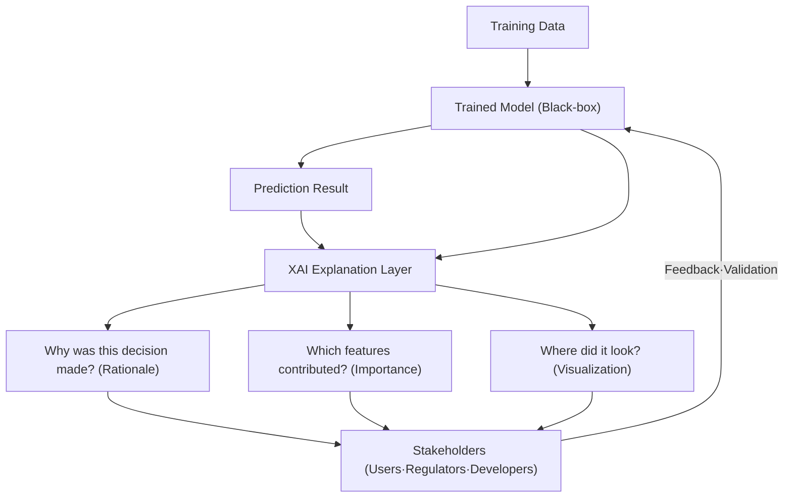
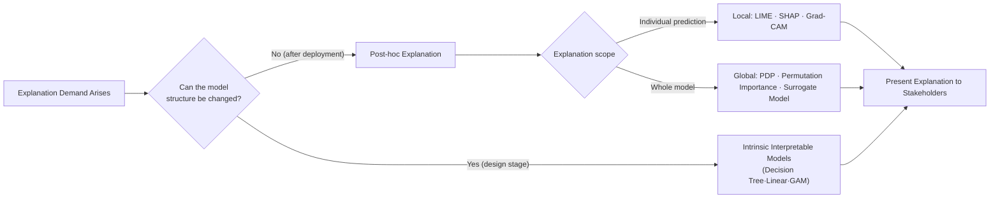

# Explainable Artificial Intelligence (XAI, eXplainable AI)

## 1. Overview

> **Definition**: Explainable Artificial Intelligence (XAI) is a collective term for the technologies and methodologies that present, in a form humans can understand, the rationale, contributing factors, and decision-making process behind the predictions of **black-box models** whose internal workings are opaque—such as deep learning—thereby securing the model's **transparency, trust, and accountability**.

Behind XAI's rise lies a **fundamental trade-off** between deep learning's performance gains and interpretability. Structurally simple models like linear regression or decision trees allow a person to read their rules directly, but their expressiveness is limited. Conversely, deep neural networks with hundreds of millions to hundreds of billions of parameters achieve high accuracy, yet it is hard to explain why they reached a given conclusion from the internal weights alone. This inverse correlation—the higher the performance, the lower the interpretability—was the primary driver that triggered XAI research.

The second driver is **regulation and institutions**. The EU's GDPR stipulates the right of a data subject to demand an explanation of automated decision-making (the so-called "right to explanation"), and the **EU AI Act**, which took effect in 2024, imposes obligations of transparency, record-keeping, and human oversight on high-risk AI systems. Domestically as well, in fields with significant impact on individuals' rights—such as finance, healthcare, and hiring—the trend is toward strengthening algorithmic accountability. In other words, XAI has established itself not as a technical convenience but as **an essential requirement for satisfying legal and ethical demands**.

The third driver is **practical need**. In medical diagnosis, a number alone like "92% probability of cancer" makes it hard for a physician to adopt that judgment; clinical adoption becomes possible only when it is presented together with which lesion area in the image was the basis. In loan screening, failing to present a reason for rejection cannot avoid consumer disputes and discrimination controversies. Therefore, XAI becomes the trust foundation of **decision support (Human-in-the-loop)** systems in which humans and AI collaborate. In an exam answer, it is appropriate to define XAI not as a mere visualization tool but as **"a core pillar for implementing Trustworthy AI."**

## 2. The Overall Structure and Concept of XAI

XAI can be understood as a layer that takes a trained model and its predictions as input and produces explanations in the form demanded by stakeholders—users, regulators, developers, and so on. The concept diagram below shows the overall skeleton flowing from data·model·explanation·stakeholders.

The questions XAI seeks to answer fall broadly into three. The first is **"why was this decision made,"** a local explanation presenting the rationale for a specific prediction. The second is **"what did the model learn overall,"** a global explanation summarizing the model's behavior as a whole. The third is **"how can the outcome be changed,"** a counterfactual explanation presenting how changing the input would yield a different conclusion.

Here it is necessary to distinguish **interpretability** from **explainability**. The former refers to the property whereby the model's structure itself is transparent so that a person can directly grasp the internal causality (e.g., a decision tree), while the latter is closer to the activity of reconstructing and presenting a rationale post-hoc for the output of a black-box model. In practice, the post-hoc approach—leaving an already-deployed high-performance model as is and attaching explanations to it—is widely used, and for this reason XAI takes on a compromising character of "securing trust without sacrificing accuracy."

## 3. Types of XAI Techniques and Operating Procedures

XAI techniques are classified by the time of application (intrinsic/post-hoc), the scope of application (local/global), and model dependency (model-specific/model-agnostic). The diagram below shows, from a process perspective, how representative techniques are arranged along these axes.

**LIME (Local Interpretable Model-agnostic Explanations)** creates samples that slightly perturb the neighborhood of the data point to be explained, observes the black-box model's responses, and then approximates that local region with a linear model. The coefficients of the resulting linear model become each feature's local contribution. In principle it is a **model-agnostic** method that need not know the model's internals, so its applicability is broad, but it has the limitation of low reproducibility because the explanation wavers depending on the perturbation scheme and the definition of the neighborhood.

**SHAP (SHapley Additive exPlanations)** borrows the **Shapley Value** from cooperative game theory: it views each feature as a "player in the game" and computes contributions so that the features fairly share the reward, i.e., the prediction. Because it averages the marginal contribution of a feature—with and without it—across all feature subsets, it theoretically satisfies consistency and local accuracy. However, as the number of features grows, the combinations increase exponentially and the computation becomes heavy, so approximations such as a fast algorithm dedicated to tree models (TreeSHAP) are used alongside it.

**Grad-CAM (Gradient-weighted Class Activation Mapping)** uses, in an image-classification CNN, the gradients of the last convolutional layer with respect to the predicted class to display as a heatmap which region of the input image contributed to the judgment. It lets you visually confirm "when the model classifies a dog as a dog, did it look at the dog's actual body, or at the grass in the background," and is especially useful for catching data bias or shortcut learning.

For global explanations, there are **Partial Dependence Plots (PDP)**, which plot the change in the average prediction as a feature's value is varied; **Permutation Importance**, which measures importance by the degree of performance drop when a specific feature is randomly shuffled; and **Surrogate Models**, which mimic a complex model's behavior with an interpretable simple model.

## 4. Comparison of Techniques and Application Cases

Each technique is not a cure-all; the choice varies according to the explanation target, data form, computational budget, and required level of trust. The comparison below organizes where the differences among representative techniques originate, together with their practical implications.

| Technique | Scope | Model Dependency | Core Principle | Strength | Limitation |
|------|------|-------------|-----------|------|------|
| LIME | Local | Agnostic | Local linear approximation | Applicable to any model | Low reproducibility·stability |
| SHAP | Local+Global | Agnostic (dedicated fast version exists) | Shapley value allocation | Theoretical consistency | High computational cost |
| Grad-CAM | Local | CNN-specific | Gradient-based activation region | Visual intuitiveness | Limited to images·CNNs |
| Decision Tree/GAM | Global | Intrinsic | Transparent structure | Fundamentally interpretable | Limited expressiveness·accuracy |

The core of the comparison is the **"accuracy–interpretability–computational cost" triangular trade-off**. Intrinsic interpretable models offer complete explanations but underperform on difficult problems; SHAP is theoretically superior but costly on large-scale data; LIME is cheap and general-purpose but low in reliability. Therefore a **purpose-based combination** is realistic: SHAP for domains where consistency of explanation matters (such as regulatory response), LIME for rapid exploratory diagnosis, and Grad-CAM for image interpretation.

A concrete case is **medical image diagnosis**. When Grad-CAM was applied to a CNN classifying pneumonia on chest X-rays, a research case reported that it revealed the model had learned, as its cue, not the lesion but an image watermark left by a specific hospital's imaging equipment. Looking only at the accuracy metric, it was excellent at over 90%, but without XAI it would have been deployed without discovering this **spurious correlation**. This shows that XAI is a **model-validation tool** that exposes risks hidden by performance metrics. In finance too, cases are spreading in which, upon loan rejection, reasons such as "the debt-to-income ratio and recent delinquency history contributed most to the decision" are presented on the basis of SHAP contributions, simultaneously satisfying regulatory compliance and consumer explanation.

## 5. Advanced: XAI in the LLM Era and Recent Trends

With the spread of large language models (LLMs), the targets and methods of XAI are also changing. Existing feature-importance techniques are optimized for structured data and have limits for explaining "why this answer was generated" by a generative model with hundreds of billions of parameters. Accordingly, approaches that draw attention include **Attention Visualization**, which shows reference relationships between tokens, and **Chain-of-Thought** prompting, which reveals the reasoning path in natural language by exposing the thought process step by step. However, it is actively debated (the problem of the explanation's faithfulness) that attention weights cannot be assumed to be the causal explanation, and there is no guarantee that CoT faithfully reflects the actual internal computation.

Another current is **Mechanistic Interpretability**, which dissects a neural network's internal representations at the circuit level. This is research that seeks to identify the functions handled by individual neurons and attention heads, a more fundamental approach than existing XAI that approximates a model after the fact. Internationally, the U.S. DARPA XAI program triggered systematic research in this field, and NIST's AI Risk Management Framework (AI RMF) and the ISO/IEC discussions on standardizing AI transparency are institutionalizing XAI as a requirement of trustworthiness governance.

From a professional engineer's perspective, the expected exam directions worth noting are ▲comparison of XAI techniques (LIME vs SHAP) and selection criteria ▲linkage with regulation such as AI trustworthiness·the EU AI Act ▲considerations when applying to high-risk domains such as healthcare·finance ▲XAI's own limitations such as the faithfulness·stability of explanations. When composing an answer, presenting the **trade-off and validation perspectives** together—rather than stopping at "listing techniques"—is a high-scoring strategy.

## 6. Considerations and Implications

From a professional engineer's perspective, the considerations when adopting XAI are as follows.

- **Verifying the faithfulness of explanations**: Whether a plausible-looking explanation matches the model's actual internal rationale must be verified separately. Since a wrong explanation can instead lead users to a mistaken conviction (the illusion of explanation), run in parallel a procedure that quantitatively evaluates the explanation's own stability and consistency.
- **Differentiating explanations by target audience**: The form and depth of explanation demanded by regulators, end users, and model developers differ. Feature contributions and circuit analysis suit developers, while counterfactual·natural-language explanations suit users, so **role-based explanation design** is needed.
- **Strategic management of the performance–interpretability trade-off**: Rather than unconditionally forcing an interpretable model, a **risk-based differentiated application**—placing intrinsic models or strong post-hoc explanations in high-risk areas and lightweight explanations in low-risk areas by risk grade—is reasonable.
- **Alignment with governance·regulation**: In linkage with the EU AI Act, NIST AI RMF, and domestic AI framework acts·trustworthiness certification, leave the explanation deliverables in a recordable and auditable form to secure **accountability**.
- **Pipeline integration and operational cost**: XAI is not a one-off output but must be integrated into the MLOps pipeline and updated at every retraining·data drift; run in parallel a sampling·approximation strategy that accounts for the computational burden of costly techniques such as SHAP.

XAI is a device that revives, across the entire AI lifecycle, the values of trust·transparency·responsibility that had been overshadowed by the single goal of accuracy. Going forward, it is expected to develop into next-generation AI that satisfies both performance and trust, as the direction of **interpretable-by-design**—designed to be explainable from the start, beyond post-hoc explanation—combines with mechanistic interpretability that identifies the internals of LLMs at the circuit level.

---
> **In one line**: XAI is a technology that presents the rationale for a black-box model's predictions in a human-understandable way (LIME·SHAP·Grad-CAM, etc.) to secure transparency·trust·accountability; it coordinates the accuracy-interpretability-cost trade-off on a purpose·risk basis and forms a core pillar of AI trustworthiness and regulatory response.
