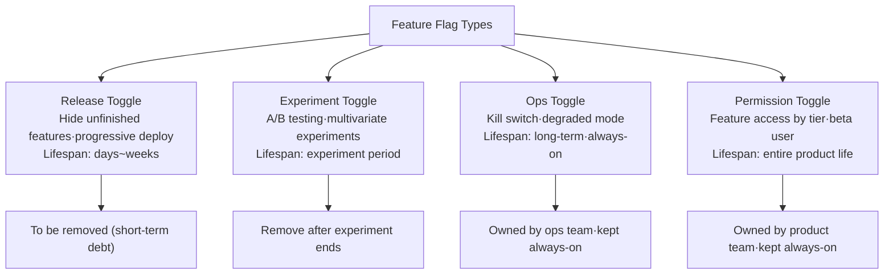
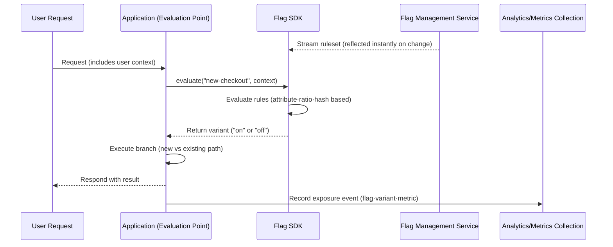

# Feature Flags and Progressive Delivery

## 1. Overview

### A. Definition

> A **feature flag (feature toggle)** is a software configuration technique that makes it possible to conditionally decide, at runtime, whether a particular feature is enabled, without redeploying code.

The essence of a feature flag lies in separating "deploy" from "release."
In the traditional approach, the moment code containing a new feature is deployed to a production server, that feature is immediately exposed to all users.
That is, since the time of deployment and the time of feature exposure are physically identical, if a problem is found, a rollback deployment reverting the code must be performed again, and a failure spreads in the meantime.
A feature flag embeds in the code a conditional branch wrapping the feature and controls that branch's true/false via external configuration.
Thus, even if the code is already deployed to production, the feature is invisible to users while the flag is off, and whether it is exposed is decided by a single switch independent of deployment.

This separation is not a mere convenience but a control device that governs release risk.
You can turn a feature on for only a small number of users to observe reactions (progressive exposure), immediately turn it off without redeployment if there is an anomaly (kill switch), and split user groups to compare option A and option B (A/B testing).
As a result, a feature flag becomes a means to independently adjust the breadth and speed of change exposed to users while accelerating the deployment pipeline.

### B. Background and Necessity

Behind the widespread use of feature flags is a shift in the way development is done.
In the old long-lived branch (feature branch) strategy, a feature was developed on a separate branch for several weeks and then merged all at once; at merge time, large-scale conflicts and integration defects piled up, repeating "merge hell."
To avoid this, trunk-based development—frequently integrating even unfinished code into the main branch—spread, and here feature flags became essential as a means of hiding unfinished features not yet ready to be released.
That is, the requirement "integrate the code but hide the feature" is the primary necessity of feature flags.

The second backdrop is the increase in release risk.
In microservices and large user bases, a single bad release propagates immediately to millions.
When a problem surfaces after a full deployment, the rollback deployment alone takes several to tens of minutes, and revenue and trust are damaged during that time.
For example, if you revamp the payment screen and expose it to all users at once and payment for a certain card issuer fails, payment abandonment accumulates during the time until the cause is identified and rolled back.
Had you exposed it to only 1% of users first with a feature flag, the scope of impact would shrink to 1/100, and the moment an anomalous metric is detected you can cut off the loss by turning off the flag without redeployment.

The third backdrop is the establishment of an experimentation culture.
Netflix, Booking.com, and others constantly validate UI·recommendation·pricing policies through experiments, and these experiments must provide different experiences by splitting user groups within the same code.
Feature flags make such experiments possible without code changes by evaluating branches differently according to user attributes (region·tier·device).

### C. Goals and Scope of Application

The goals of applying feature flags are, first, continuous integration through hiding unfinished features; second, reducing release risk through progressive exposure; third, immediate cutoff on failure (kill switch); and fourth, providing an experimentation foundation for data-driven decision-making.
However, if every conditional branch is turned into a flag, the code becomes a maze of branches and the paths to be verified explode, so the principle is to apply flags selectively only to "changes worth controlling the exposure of."

## 2. Types and Lifecycle

A feature flag looks like the same `if` branch on the surface, but its lifespan·owner·evaluation method differ entirely depending on purpose.
Failing to distinguish these leaves a temporary experiment flag neglected like a permanent setting, or removes an always-on operational flag prematurely and loses control.
The structure diagram below arranges the four representative types along axes of purpose and lifespan.

The most common **release toggle** is used in trunk-based development to hide unfinished features and separate deploy from release.
A release toggle is a short-term asset that must be removed immediately once the feature is fully released and stabilized; neglected, it becomes technical debt right away.
For instance, the textbook practice is to progressively expose a new search UI over two weeks and then, when it reaches 100%, delete the flag along with the old code path.

An **experiment toggle** randomly splits user groups for A/B testing and shows each group a different variant.
Unlike an ops toggle, it fixes the exposure ratio to secure statistical significance, and when the experiment period ends, it keeps only the winning variant and removes the rest.

An **ops toggle (kill switch)** is different in nature.
It is an always-on switch to immediately turn off a specific feature or a heavy computation during a failure situation to protect the system, and it is not removed but held long-term by the ops team.
A representative case is a graceful degradation mode that turns off recommendation widgets during a traffic surge and keeps only core features.

A **permission toggle** opens feature access according to user tier·beta participation, and it is a long-term flag that persists as long as the product exists.
Thus you must clarify the lifespan and owner by type and record for each flag its creation date·planned expiration·owner as metadata to manage the lifecycle.

| Category | Release Toggle | Experiment Toggle | Ops Toggle (Kill Switch) | Permission Toggle |
|------|-----------|----------|--------------------|----------|
| Main purpose | Separate deploy/release | A/B·multivariate experiments | Fault isolation·load control | Feature access by tier |
| Evaluation criterion | Exposure ratio·group | Random assignment | Operator manual/automatic | User attributes |
| Lifespan | Days~weeks (short) | Experiment period | Always-on (long) | Product life |
| Change frequency | Frequent (progressive expansion) | At experiment end | Immediate on incident | Rare |
| Owner | Development team | Data/product team | Ops/SRE team | Product team |

## 3. Architecture and Evaluation Flow

A feature-flag system consists largely of a **flag management service** that stores and manages flag rules, an **SDK/client** that injects the rules into the application, and the **evaluation points** that actually evaluate the branches.
The detailed diagram below shows how a flag is evaluated and different experiences are delivered to users when a request comes in.

The core of evaluation lies in **consistent hashing**.
If the same user receives a different variant each time they request the same flag, the screen changes with every request, breaking the user experience and also polluting the experiment data.
Therefore the SDK hashes `userID + flag key` and assigns it to a 0–99 bucket, and for "10% exposure" it turns on only for users in buckets 0–9.
This way, a given user always receives the same variant unless the rule changes (sticky bucketing), and progressive expansion is possible by adjusting only the exposure ratio.

An important principle from a performance perspective is that **evaluation must happen locally**.
Asking the remote management service on every request creates network latency and a single point of failure.
Therefore the management service streams or polls the ruleset down to the SDK, which keeps it in a local cache, and the SDK evaluates in memory at microsecond granularity.
A fail-safe design—operating safely with the last rule and the default variation specified in code even if the management service is temporarily disconnected—is essential.

Progressive delivery takes place on top of this structure.
After deploying a new feature, the operator raises the exposure ratio in stages such as 1% → 5% → 25% → 50% → 100%.
At each stage they observe core metrics such as error rate·latency·conversion rate, and if a metric worsens, they immediately revert to the previous stage or turn it off to 0%.
This is like performing canary deployment at the user (traffic unit) level rather than the infrastructure (server unit) level, with the advantage of finer control without replacing servers.

## 4. Comparison: Feature Flags vs. Branches·Environment Separation

The problem feature flags aim to solve can also be partly approached by other techniques, but each differs in the timing of control and the cost of reverting.
A long-lived branch physically separates code to hide unfinished features, but integration verification is deferred until merge, so defects surface late and all at once.
Staging environment separation is valid for pre-deployment verification but cannot catch problems that surface only under real production traffic·data and cannot finely adjust production exposure.
By contrast, a feature flag adjusts the breadth of exposure in real time against real users in the production environment, so the cost of reverting is lowest.

| Technique | Timing of Control | Hide Unfinished | Progressive Exposure in Prod | Revert Cost | Main Weakness |
|------|----------|-----------|-----------------|-----------|----------|
| Long-lived branch | At merge | Possible | No | High (redeploy) | Merge hell·late integration |
| Environment separation (staging) | Before deploy | Possible | No | Medium | Production traffic not reflected |
| Blue/Green·Canary deployment | At deploy | Limited | Server unit | Medium (traffic shift) | Hard to segment per user |
| Feature flag | At runtime | Possible | Per user | Low (switch) | Flag debt·branch complexity |

The fundamental reason for the difference is "when the control is exercised."
Branches·environments make one decision before the code reaches users, but a feature flag makes the decision at each request point after the code has already reached them.
The practical implication is large.
Flags can respond to failures without stopping the deployment pipeline, greatly reducing mean time to recovery (MTTR), but at the cost of leaving in the code the burden that "the verification burden increases by the number of on combinations."
For example, with 10 independent flags there are theoretically 2^10 = 1024 combinations, so in practice you must group interdependent flags and restrict combinations to keep them within a verifiable scope.

## 5. Advanced: Practical Application and Managing Flag Technical Debt

The biggest practical risk of feature flags is not the feature but **the accumulation of flags that were not removed**.
A release toggle should originally be removed within a few weeks, but if left "just in case," dead branches pile up throughout the code.
The 2017 Knight Capital incident is cited as a case where a reused old flag revived a retired code path and produced a loss of about USD 440 million in 45 minutes, showing how fatal a neglected flag can be.
Therefore mature organizations assign an expiration date to each flag, continuously track expired flags with static analysis·dashboards, and incorporate cleanup work as a regular sprint activity.

From a governance perspective, one must recognize that a flag is a "configuration change" that alters production behavior.
Leave an audit log of who changed which flag when, and apply change approval·role-based access control (RBAC) to high-impact flags such as kill switches.
Since a flag change can be as risky as a code deployment, it is desirable to control it through a dedicated management tool (LaunchDarkly, Unleash, Flagsmith, or an in-house build) equipped with change history·rollback buttons·change notifications.

Combination with measurement is also an advanced point.
For progressive delivery to be meaningful, observability integration is needed that automatically compares metrics at each exposure stage to detect anomalies and connects even to automatic rollback.
Flowing flag exposure events into the metrics-collection pipeline and automatically judging that "variant A's error rate is statistically significantly higher than B's" allows safe expansion·cutoff without a person watching a dashboard.
This is the complete form of progressive delivery, beyond a mere toggle.

## 6. Considerations and Implications

From a professional engineer's perspective, adopting feature flags is not a mere library choice but a decision encompassing release governance·organizational process·technical-debt management.

- **Adoption strategy (selective adoption):** Do not turn every branch into a flag; apply flags only to changes worth controlling exposure of (externally exposed features, risky migrations, experiment targets). Indiscriminate flagging causes combinatorial explosion and verification cost, so establish, at the start of adoption, standards for naming conventions·type classification·owner assignment.
- **Trade-off (speed vs. complexity):** Flags separate deploy and release to raise release speed and safety, but they leave conditional branches and dead paths in the code, increasing complexity and testing burden. This trade-off is decided by "how disciplined the flag expiration·removal is," so a process that enforces removal as much as creation is a key success factor.
- **Fault-isolation design:** Since the flag management service can become a new single point of failure, always design local-cache evaluation·default specification·retention of the last rule on service disconnection (fail-safe). If the kill switch itself becomes inoperable due to a failure, you lose the last line of defense in a disaster.
- **Security·governance:** Since a flag change is a privileged act that alters production behavior, apply RBAC·approval processes·audit logs, and require dual approval for sensitive flags (payment·authentication related). Experiment toggles must also be reviewed for compliance with privacy regulations when targeting based on personal data.
- **Related technologies and outlook:** Feature flags maximize value when combined with trunk-based development·CI/CD·canary deployment·A/B testing·observability. Going forward, they are expected to develop toward progressive delivery combining automatic metric judgment and automatic rollback, and toward version-managing the rules themselves as policy as code.

## References
- Martin Fowler, "Feature Toggles (aka Feature Flags)", https://martinfowler.com/articles/feature-toggles.html
- Pete Hodgson, "Feature Flags Best Practices", https://featureflags.io/
- OpenFeature (CNCF) official documentation, https://openfeature.dev/
- Unleash Documentation, https://docs.getunleash.io/

---
> **In one line**: A feature flag is a technique that separates deploy from release to control feature exposure at runtime, enabling progressive delivery·kill switches·A/B experiments without redeployment, while disciplined removal of flag debt is the key to success.
