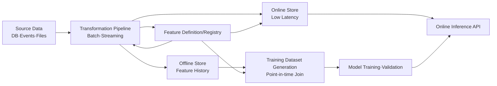
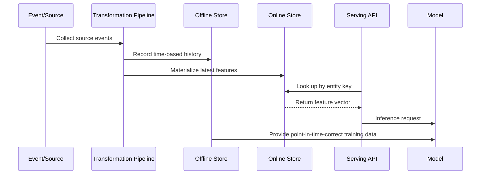

# Feature Store and Machine Learning Data Operations

## 1. Overview

> **Definition**: A feature store is a common platform that generates, validates, stores, discovers, and serves features usable by machine learning models from source data; it is a data-operations system that lets training (offline) and inference (online) reuse the same feature definitions and quality.

When a machine learning project expands beyond a PoC into a service, the recurring cost of data preparation and operations grows larger than that of the model algorithm.
When each team recomputes the same customer·product·transaction metrics in SQL and Python, definitions diverge, and the distribution of training data and that of production inference data drift apart.
In batch training, an aggregation that takes several hours is acceptable, but real-time fraud detection or personalized recommendation must return features within tens of milliseconds.
Therefore, features must be managed not as mere columns but as reproducible and observable data products.

A feature store divides this problem into centralizing feature definitions, separating offline and online stores, point-in-time-correct training, low-latency online lookup, and lineage and quality management.
Model developers can focus on which transformation of which period's data to apply to which entity, rather than on the implementation details of storage.
Platform operators connect the same definition to batch and streaming pipelines to raise the reproducibility of training and inference.

The core of this topic is not memorizing product names but placing the feature lifecycle within data governance and MLOps.
You must explain, as a single logical model, the whole process by which source events are collected, transformed features are validated, and they are served to offline training and online inference.
In particular, you must jointly control data leakage where future information mixes into training, mismatch between online and offline values, degradation of feature freshness, and excessive exposure of personal data.

## 2. Background and Necessity

### 2.1 The Bottleneck of Traditional Model Development

Early models build features directly in a notebook or analytical SQL.
This approach is advantageous for quickly validating hypotheses, but as multiple models and teams copy the same transformation, code and definitions become scattered.
When a developer changes, the meaning and formula of a metric, its available time, and the rules for handling missing values must be traced again.

For example, even with a name like 'number of purchases in the last 30 days', one team may exclude canceled orders while another aggregates by payment-approval time.
When two models use different features under the same name, it is hard to compare experiment results and hard to find the cause of an operational incident.
A feature store makes you register not only the name but also the definition, entity key, time basis, owner, and quality rules together.

At the production-deployment stage, another problem arises.
During training, features are joined from the data warehouse, but the service must query the database multiple times per request, increasing latency and load.
Keeping precomputed values in the online store can simplify the lookup path, but if batch computation is late or events are missing, stale values may be returned.
Therefore a feature store is not a tool for unifying storage into one but a structure that separates paths by purpose and manages consistency.

### 2.2 Adoption Objectives

First, reduce development lead time through feature reuse.
Features that many models use in common—such as customer activity level, product popularity, and device risk—are defined once and served to multiple models.
Reuse means not only reducing code duplication but also turning validated formulas into standard assets of the organization.

Second, mitigate training-serving skew.
Using the same transformation logic and definitions in training data and online inference can reduce the semantic gap between the development and production environments.
To guarantee complete identity, one must specify even the policies for processing time, rounding, missing values, and late events.

Third, connect model operations to data operations.
Monitoring each feature's freshness, missing rate, distribution change, and lookup errors lets you quickly isolate the cause of a model's performance degradation from a data perspective.
This shifts from a way of looking only at model accuracy to a way of looking at service-level objectives and data-quality objectives together.

## 3. Core Concepts and Components

### 3.1 Overall Structure

In the structure above, the registry is not a list storing only feature names.
It is a metadata layer describing which entity a feature is keyed on, which time window and aggregation formula it uses, which team owns it, and to which store it is materialized.
Even though definition and data are separated, at execution time they must be connected by the same contract.

Source data consists of transaction tables, application logs, message events, sensor streams, external data, and so on.
When the source schema changes or events are delayed, it affects the meaning and freshness of features, so a schema contract and change management are needed.
The transformation pipeline does not pass the source directly to the model but turns it into a reusable feature set.

### 3.2 Key Terms

An entity is the business object to which a feature belongs.
There must be an entity key such as customer ID, product ID, account ID, or vehicle ID to join values from multiple sources onto the same object.
If one feature belongs to a combination of multiple keys, like customer and product, the composite entity and key-generation rules must be made clear.

A feature is a numeric·categorical·vector·time-based attribute used as model input.
'Number of logins in the last 7 days', 'a product's average views over 1 hour', and 'a customer's average payment amount' are not source attributes but derived features that have undergone transformation.
The result of encoding a categorical value or an embedding vector can also be treated as a feature if its serving method and version are managed.

A feature view is a logical serving unit that bundles one or more features with an entity, a time basis, and transformation logic.
Serving the last 1-day·7-day·30-day activity based on the same customer entity together lets the model use the needed time windows consistently.
A change to a feature view is a change to the model-input contract, so backward compatibility, versions, and a deprecation schedule are managed together.

The offline store keeps past feature values together with time.
Since model training, backtesting, reproducibility validation, and data exploration must restore values at a specific point in time, a large-scale analytical store and a columnar format are suitable.
The online store returns the latest or a specific effective-time value with low latency.
It is optimized for key-value lookup, and storage capacity·TTL·replication·failover policies are important.

The registry manages feature definitions, descriptions, types, tags, owners, approval status, versions, and lineage.
Without a catalog, unused features keep piling up, and features containing personal data may be reused beyond their purpose.
The registry provides discoverability and controllability but does not itself guarantee the quality of the actual values, so it must be operated together with pipeline validation.

### 3.3 Online·Offline Storage Paths

The batch path recomputes past data on a fixed cycle and loads it into the offline store.
It is strong at bulk reprocessing and restoring past points in time, but values lag by the computation cycle.
The streaming path updates state as events arrive, so it has high real-time responsiveness, but it must handle out-of-order·duplicate·missing·late events.

Online materialization can be split into a method that copies the offline store's validated values into the online store and a method that writes stream-computation results directly to the online store.
The former makes it easy to align the definitions of training and inference but incurs latency, while the latter has good freshness but makes reprocessing and consistency design hard.
The path for each feature should be decided based on the allowable latency and accuracy requirements of the business.

## 4. The Feature Lifecycle and Data Operations

### 4.1 Definition and Contract

A feature definition includes at minimum the name, description, data type, entity key, event time, aggregation period, default value, missing-value rule, owner, and security classification.
For 'number of transactions in the last 24 hours', you must record even as a contract whether it includes the current time, how canceled transactions are handled, and what the time zone is.
If the contract is ambiguous, even the same pipeline may yield different values when rerun.

A feature's name should reveal its business meaning and not be made from team-internal abbreviations alone.
For example, even when using a technical name like `cust_7d_txn_cnt`, register a human-readable description and the unit together.
Specifying a numeric value's unit, scale, allowable range, and the set of categorical values enables input validation and outlier detection.

Feature definitions are best version-managed as code.
Reviewing the transformation code, schema, tests, and registry metadata together lets you trace the reason for a change.
Simply editing a value on a screen weakens reproducibility and approval history, so it should be avoided in a production environment.

### 4.2 Point-in-Time Correctness and Data Leakage

Point-in-time correctness is the principle of including in training only data that was actually knowable at the prediction time.
If the prediction time is June 30 at 12:00, a payment result confirmed on July 1 or a status corrected after the fact must not be used as a June 30 feature.
If future information mixes in, validation accuracy rises but performance plummets in the actual service.

The time column must distinguish the time the event occurred from the time it arrived at the system.
Sensors or messages can arrive late, so define the allowable range for late events and a correction policy.
In a training-data join, you must select the most recent record whose entity key is the same and whose feature time is earlier than the observation time.

The following are checkpoint questions to reduce leakage risk.

| Check Area | Question to Confirm | Response Example |
|---|---|---|
| Time | Was the feature value not finalized after the prediction time? | Join by event time, exclude future rows |
| Label | Was information used to generate the label not reused in the feature? | Separate label·feature sources, review approval |
| Aggregation | Does the window's right boundary not exceed the prediction time? | Apply half-open interval `[t-window, t)` |
| Correction | Do post-hoc corrections·cancellations not overwrite past training values? | Preserve history, separate effective time and processing time |
| Missing | Do missing values filled only in the future not enter training? | Handle missing based on observation time |

Point-in-time correctness is a core test item of the offline dataset generator.
Create an arbitrary reference time and automatically check that events generated after it are not reflected in the training rows.
Without this test, leakage is hard to detect from model evaluation numbers alone.

### 4.3 Quality·Freshness·Distribution Management

Feature quality is measured by dividing it into accuracy, completeness, validity, consistency, and timeliness.
Accuracy concerns whether the value matches the business source, completeness whether missing and omitted values are within an acceptable level, and timeliness whether the latest value arrives within the defined SLA.
Even for the same feature, the quality threshold and alert priority differ according to business risk.

Freshness can be managed by the difference between the last normal update time and the current time.
The allowable delay for a real-time fraud score may be in minutes, but a monthly customer tier may tolerate even a day of delay.
Set metrics such as `freshness_sla`, `null_rate`, `range_violation`, and `row_count` for each feature and connect them to the model service's SLO.

Distribution change is hard to judge by mean and variance alone.
Look at the categorical distribution, quantiles, missing patterns, and per-entity bias together, and compare the training-baseline distribution with the inference distribution.
When a change is found, distinguish whether it is a source-event change, a pipeline error, or an actual business-environment change before deciding whether to retrain.

### 4.4 Transformation Methods and Reuse

Transformations can be split into pre-transformation, which computes derived values from the source, and on-demand transformation, which computes right before model execution.
Pre-transformation reduces lookup latency and inference cost but requires storage cost and update management.
On-demand transformation makes it easy to reflect the latest source but increases the risk of external-dependency latency and online·offline logic mismatch.

You can set a boundary in which the platform provides common transformations and model teams own model-specific transformations.
However, if ownership is split, input-schema and version contracts are essential.
If a transformation function is nondeterministic or depends on the current time, regenerating the same training data is hard, so pass the reference time explicitly.

## 5. Implementation Procedure and Operational Architecture

### 5.1 Adoption Procedure

The first step is not making a list of models but classifying business decisions and latency requirements.
Distinguish cases with different judgment times and allowable errors, such as fraud blocking, recommendation ranking, churn prediction, and equipment-anomaly detection.
For each case, derive the entity, prediction time, feature update cycle, lookup latency, and retention period.

Second, investigate source events and schemas.
Confirm the data's owner, meaning, change cycle, quality issues, and personal-data classification, and connect feature candidates and lineage.
If the source does not provide both event time and processing time, you must first supplement the collection design for point-in-time-correct training.

Third, validate the offline training path first.
Reproduce a dataset at a past reference time, test for leakage·duplication·missing·distribution, and then confirm the effect with a small model.
Building the online store first and organizing the data's meaning later produces production traffic but does not secure feature reliability.

Fourth, open the online path incrementally.
Decide the lookup API's timeout, cache, default value, failure fallback, feature version, and access control, and compare offline·online values with shadow traffic.
You must observe not only the model's prediction results but also the feature-lookup success rate and freshness.

### 5.2 Online Serving Patterns

Online lookup is generally a batch lookup that fetches multiple features of a single entity at once.
If the model calls individual APIs for the features it needs, network round-trips increase and a mixed snapshot in which only some values are current may be produced.
When possible, provide a feature vector of the same effective time and version atomically.

A cache reduces response latency and store load, but the TTL must not exceed the freshness requirement.
If cache invalidation keeps failing, the model uses stale values even though it receives normal responses.
For highly sensitive transaction-risk features, review whether the cache key and retention time carry any personal-data and security risk.

On a store failure, you can substitute a default value, but replacing all missing values with 0 can change the model's meaning.
Distinguish each feature's default value from the 'no value' state, and record fallback occurrences with separate metrics and logs.
When a business-safe cutoff or conservative judgment is needed, also consider a policy of halting the model call itself.

### 5.3 Integrating Batch·Streaming Processing

Batch processing is suitable for large-scale recomputation and restoring the past.
Streaming processing quickly reflects recent events but requires deduplication, ordering guarantees, state storage, watermarks, and a reprocessing strategy.
If two paths produce the same feature, they must share the formula and boundary conditions and continuously compare the difference in results.

A representative integration method is a lambda-type structure in which batch builds the baseline history and the stream corrects the most recent segment.
This method can obtain both fast updates and reproducibility, but incurs the cost of managing the duplication and consistency of the two computation paths.
A single-stream processing structure can simplify the logic but must separately design long-term history regeneration and large-scale backfill costs.

## 6. Comparison and Cases

### 6.1 Comparison with Direct Data-Warehouse Lookup

Direct data-warehouse lookup can leverage the SQL and store already owned, so initial cost is low.
But running complex joins and aggregations on every model-API request causes latency and concurrency problems, and query definitions are replicated per model team.
A feature store materializes online values in advance and shares definitions to reduce recurring cost.

On the other hand, a feature store requires a separate platform and operational staff.
Storing all features online increases storage cost and synchronization complexity, so it may be reasonable to leave models with low latency requirements to warehouse batch inference.
The selection criterion should be a combination of inference latency, reuse rate, quality control, and personal-data risk—not a trendy product.

| Category | Direct Warehouse Lookup | Feature Store |
|---|---|---|
| Main purpose | Analytical·batch data processing | Serving features for training·inference |
| Online latency | Varies with joins and load | Can be designed low via pre-loading |
| Reuse | Possibility of query replication | Registry-based sharing |
| Point-in-time correctness | Requires separate implementation | Standardized via training-data generation feature |
| Operational burden | Leverages existing platform | Adds store·pipeline·serving operations |
| Suitable cases | Batch scoring, exploration, reports | Real-time recommendation, fraud detection, personalization |

### 6.2 A Recommendation Service Case

Assume an online shopping mall's recommendation model uses per-customer recent viewed-product count and per-product recent purchase conversion rate.
View events come in as a stream, and product conversion rate can be computed over a recent 1-hour window and a 7-day window respectively.
Since the customer key and product key differ, the two feature sets are joined at recommendation-request time or combined into a model-input vector.

The feature store deduplicates view events and updates the recent activity level in the online store.
The 7-day conversion rate can be precisely recomputed by the batch path, while the recent 1-hour value can be separated so that the stream path updates it.
Recording the feature version and update time in the recommendation response lets you explain from which data state a particular result was made.

A new product lacks purchase history, so its conversion rate becomes missing.
Substituting the global average here can create a cold-start problem where new-product exposure decreases, so consider category averages, content features, and an exploration policy together.
This case shows that a feature store connects not only storage technology but also product policy and model operations.

### 6.3 A Fraud Detection Case

Assume that at payment-approval time you look up the account's transaction count in the last 10 minutes, failure count in the last 24 hours, and the number of relationships between the device and the account.
In this task, stale values can let fraudulent transactions through or block normal customers, so freshness and availability are given high priority.
When a feature lookup times out, you must agree with the business on which policy to choose among conservative blocking, additional authentication, and manual review.

Training data must include only values observed up to the approval time.
Including a chargeback result finalized after the fact in a feature just before the transaction overestimates the validation results.
Also, since the account·device relationship graph can be combined with personal data, apply minimal collection, access control, retention period, and restriction on use beyond purpose.

## 7. Advanced: MLOps·Governance and Directions of Expansion

### 7.1 Managing Features as Data Products

The users of features are not only model developers but also data engineers, risk managers, and auditors.
Therefore, do not store only technical metadata in the registry; manage the business definition, quality metrics, approver, affected models, and deprecation plan together.
The more a feature is used by multiple models, the more important change-impact analysis and consumer notification become.

Feature contract tests automatically confirm the expectations between provider and consumer.
The provider guarantees the schema and range, and the consumer declares the version it needs and the allowable missing rate.
When a contract breaks, halt the deployment or isolate the relevant model so that a failure does not propagate to the whole service.

### 7.2 Connecting Model Performance and Feature Drift

Immediately retraining a model when accuracy drops is not always the right answer.
You must first isolate whether the feature distribution changed, whether there is label delay, whether the source schema changed, or whether user behavior itself changed.
Connecting feature lineage and monitoring lets you trace the impact path from source events to model metrics.

Do not apply the same drift threshold to all features.
Amount·risk-score·regulatory-reporting features can matter even with small changes, while a visit-count feature with strong seasonality must account for normal cyclical fluctuations.
It is advantageous to operate the baseline divided into the training period, the recent normal period, and the business-event period.

### 7.3 Linkage with Streaming·Vector·Generative AI

Real-time features expand through the combination of event streams and stateful technologies.
When a model uses the order or frequency of recent behavior, state management that preserves the time window and event order becomes more important than a simple latest value.
Here, specify the event key and the processing guarantee level so that the same result can be obtained on reprocessing.

In generative-AI applications that need embeddings and vector search, operational features such as document freshness, access permissions, and evaluation results are also needed.
However, since an embedding vector can contain sensitive information in a form different from the original text, do not unconditionally integrate the vector store with the feature store.
Separate or connect the lifecycle of metadata and vectors based on search quality·security·deletion requirements.

## 8. Considerations and Implications

### 8.1 Accuracy and Reproducibility

Feature values must be regenerable at any time.
The reference time, code version, source snapshot, parameters, and time zone must remain to reproduce the same training data and model evaluation.
A feature without reproducibility struggles to fulfill accountability in audits and incident analysis.

### 8.2 Balancing Performance and Cost

Computing all features in real time raises freshness but increases stream-processing·storage·observation costs.
Quantify the maximum latency and accuracy loss the business allows, and choose batch·micro-batch·stream per feature.
Decide the online store's replication and high-availability cost by looking at model call volume and failure cost together.

### 8.3 Security and Privacy

A feature, even if not the original text, is derived information from which an individual's behavior and risk can be inferred.
Apply sensitive-information classification, least privilege, encryption, row·column-level access control, lookup audit logs, and purpose-based tags.
When a deletion request arises, decide in advance to what scope it will be handled across the offline history, online cache, backups, and derived models.

### 8.4 Consistency and Failure Response

If online·offline values differ, model performance and explanation results waver.
Flow the same input into both paths and compare value differences, and place a validation that blocks deployment if the allowable error is exceeded.
For store failures and late events, design the priority of default value·cache·retry·circuit breaker·manual judgment.

### 8.5 Organization and Responsibility

A structure in which the platform team provides common infrastructure and standards and domain teams are responsible for features' business meaning and quality is appropriate.
Since a shared feature with no owner is hard to change or deprecate, designate a responsible person per data product and a consumer agreement.
The model-approval process must include feature lineage, personal-data classification, leakage tests, and online performance.

### 8.6 Implications from a Professional Engineer's Perspective

A feature store is not an accessory store of MLOps but an integration layer connecting data architecture·AI governance·service operations.
The adoption order should be one that first establishes business priorities, data contracts, point-in-time correctness, quality SLOs, and security controls—rather than product installation.

Going forward, coding of feature definitions, automatic quality validation, real-time·batch integration, and connection of model explanation and lineage will strengthen.
A professional engineer should present an architecture that designs features as reproducible data products and jointly optimizes cost·performance·regulation·organizational responsibility—rather than a feature list of a specific platform.

## References

- Feast official documentation: https://docs.feast.dev/
- TensorFlow Transform and TFX Feature Engineering: https://www.tensorflow.org/tfx/guide/transform
- Google Cloud Vertex AI Feature Store overview: https://cloud.google.com/vertex-ai/docs/featurestore/overview
- AWS SageMaker Feature Store Developer Guide: https://docs.aws.amazon.com/sagemaker/latest/dg/feature-store.html
- MLflow official documentation: https://mlflow.org/docs/latest/

---

> **In one line**: A feature store is a data platform that manages feature definition·point-in-time correctness·offline training·online low-latency serving·quality·security as a single lifecycle, raising the reproducibility and operational reliability of machine learning.
