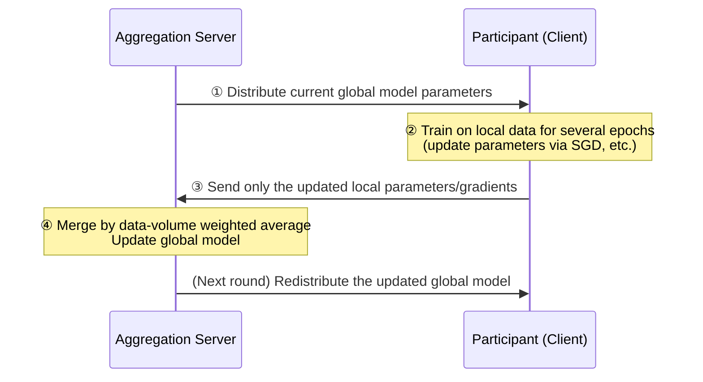

# Federated Learning

## 1. Overview

### A. Definition
> **Federated Learning** is a distributed AI training technique that, without gathering training data in one place, **keeps raw data in place on each device or institution, trains a model locally, and gathers only the models (parameters·gradients) centrally to integrate them into a single global model**. Because the raw data does not physically move, it protects privacy while obtaining performance similar to training on the data of multiple parties.

The core idea of federated learning can be summed up as '**do not send the data to the model; send the model to the data (bring the model to the data)**'. Traditional centralized AI training copies and collects data scattered in many places to a central server and then trains on it. This approach incurs the risk of massive leakage and misuse the moment data gathers in one place, and sensitive data such as medical records, financial transactions, and personal conversations cannot be taken outside the institution in the first place due to legal and privacy issues. As a result, a dilemma arose in which data was locked inside each institution (data silos) and could not actually be used for AI training.

Federated learning solves this by flipping the setup entirely. Instead of moving data, it **sends the very model to be trained down to each device or institution and trains it there on local data**, then retrieves only the training results—weights and gradients—to the center and merges them into a single global model. Since raw data never leaves a participant's boundary, it complies with regulation while enjoying the effect of multi-institution collaborative training. In 2017, Google popularized the concept by training the next-word prediction model of a smartphone keyboard (Gboard) on user devices, after which it rapidly spread to the medical field, where multiple hospitals jointly train diagnostic AI without sharing patient data.

### B. Background and Necessity
Behind federated learning's rise, three currents interlock. The first is **strengthened regulation**. The EU's GDPR, the domestic Personal Information Protection Act (the three data laws), and medical·finance-related laws strictly limit the transfer of personally identifiable data across borders and outside institutions. Federated learning, which does not move data, provides a realistic compromise of 'using data without exporting it' in this regulatory environment.

The second is **the spread of edge·mobile computing**. As the computing power of smartphones·IoT·wearable devices improved, the infrastructure to perform training directly on the terminals where data is generated fell into place. It became possible to build personalized models while reducing the communication cost and latency of uploading data to the cloud.

The third is **the economic inefficiency of data silos**. With only the data one hospital or one bank holds, it is hard to sufficiently train problems with few instances, such as rare diseases or anomalous transactions. If multiple institutions could combine their 'knowledge' without physically merging data, each could resolve its data-shortage problem through collaboration. It is precisely at this point that federated learning draws attention as a technology that simultaneously satisfies the two conflicting goals of privacy protection and data utilization.

## 2. Overall Structure and Operating Principle

Federated learning consists of a central **aggregator** and many **clients**, and it repeats training cycles called rounds to progressively improve the global model. The structure diagram below shows the overall relationship in which data does not move and only parameters travel back and forth.

```mermaid
flowchart TB
  S["Central Aggregation Server<br/>(stores·merges global model)"] -->|① Distribute global model| C1["Device/Institution 1<br/>(local data D1)"]
  S -->|① Distribute global model| C2["Device/Institution 2<br/>(local data D2)"]
  S -->|① Distribute global model| C3["Device/Institution N<br/>(local data DN)"]
  C1 -->|③ Local training result (parameters)| S
  C2 -->|③ Local training result (parameters)| S
  C3 -->|③ Local training result (parameters)| S
  S --> A["④ Aggregation<br/>Update global model by weighted average"]
  A -.->|repeat| S
  style A fill:#e8f0fe,stroke:#2f6fed,stroke-width:2px
```

The most important principle in this structure is that **the raw data (D1, D2 … DN) is never transmitted to the server**. What travels between the server and participants is only model parameters, and data is used only within each participant's local store. Thanks to this, even the server operator cannot see participants' raw data.

The detailed procedure of one round proceeds as in the sequence below. As this iterative process continues until convergence, the global model improves in performance as if it had seen all the data in one place.



In the **① distribution stage**, the server sends the current global model down to the clients that will participate in this round. In a mobile environment, only some of millions of devices are chosen as a sample (e.g., devices that are charging and connected to Wi-Fi). In the **② local training stage**, each client trains the model on its own data for several epochs to update parameters. This stage is the core of privacy, since data does not leave the device. In the **③ transmission stage**, only the parameters (or their deltas) changed by training—not the raw data—are sent to the server. In the **④ aggregation stage**, the server merges the results of multiple clients to make a new global model. The completed model is then distributed again at ①, and the round repeats.

## 3. Types and Key Algorithms

### A. Types by Data Partitioning Method
Federated learning is divided broadly into three types according to how data is partitioned among participants. This distinction is not mere classification but the starting point of practical design, because it determines 'what kind of collaboration is possible.'

**Horizontal FL** is the case where participants **have the same features but different samples**. For example, multiple regional hospitals hold the same test items (blood pressure, blood sugar, etc.) for different patient groups. Smartphone keyboard prediction is a representative case, where all users hold data of the same form, 'input history', with different contents.

**Vertical FL** is the case where participants **hold different features for the same samples (customers)**. In a situation where a bank has a customer's financial-transaction information and a telecom has the same customer's communication-usage pattern, the two institutions make a richer model of the same customers without merging data. Here, Privacy-Preserving Set Intersection (PSI) technology is used together to find which customers are common without exposing personal information.

**Federated Transfer Learning** is a method that combines transfer learning to transfer knowledge when there is little overlap in either samples or features.

### B. Aggregation Algorithms
An aggregation algorithm is the 'merge rule' that combines scattered local training results into one. The table below organizes representative algorithms; each chooses a different balance point between the conflicting goals of reducing communication volume and coping with data heterogeneity.

| Algorithm | Core Idea | Strength | Limitation |
|---|---|---|---|
| **FedSGD** | The server aggregates gradients at every step | Theoretically simple·accurate | Very frequent communication rounds, high cost |
| **FedAvg** | Each client trains for several epochs, then parameters are averaged weighted by data volume | Greatly reduces communication rounds (representative algorithm) | Unstable convergence on non-IID data |
| **FedProx** | Adds a proximal term to FedAvg to constrain the local model from deviating too far from the global | Compensates for data·system heterogeneity | Requires hyperparameter tuning |
| **FedOpt (FedAdam, etc.)** | Applies adaptive optimization (momentum·Adam) to server-side aggregation | Improves convergence speed·stability | Complex server-state management |

The most widely used **FedAvg** has, as its core, having each client train for several epochs at once, dramatically reducing the number of communications exchanged with the server compared to FedSGD. However, if the data distribution differs greatly per participant (non-IID), the local models skew in different directions and the average wavers. **FedProx** mitigates this problem by imposing a penalty so that local training does not stray too far from the global model, and it also addresses differences in per-participant compute power (a situation where a slow device trains less).

## 4. Security·Privacy-Enhancing Technologies

The mere fact that federated learning does not move raw data does not guarantee complete privacy. The transmitted parameters·gradients retain traces of the training data, so if a malicious server or participant reverse-exploits them, they can restore the original data or infer whether a specific individual participated. These are called **gradient inversion attacks** and **membership inference attacks**. Therefore, real-world federated learning must combine the privacy-enhancing technologies (PETs) below.

| Technology | Operating Method | Threat It Protects Against | Cost/Trade-off |
|---|---|---|---|
| **Differential Privacy (DP)** | Hides individual contributions by adding statistical noise to parameters·gradients | Membership·attribute inference | Larger noise lowers accuracy |
| **Homomorphic Encryption (HE)** | Adds·merges parameters while still encrypted | Server reading of parameters | Sharp increase in computation·communication |
| **Secure Multi-Party Computation (MPC)** | Multiple servers·participants jointly aggregate via distributed secrets | Sole-party monopoly reading of parameters | Communication·protocol complexity |
| **Secure Aggregation** | Individual parameters cancel out and only the sum is restored by the server | Server reading of individual parameters | Requires readjustment when participants drop out |

**Differential privacy** lowers, below a mathematically bounded level, the effect that the participation of a single data item has on the result, making it hard to know even whether a specific person's data was used in training. The larger the noise, the stronger the privacy but the lower the model accuracy, so the balance point is adjusted through the privacy budget (ε). **Homomorphic encryption** and **secure aggregation** focus on preventing the server from peering into individual parameters. In particular, secure aggregation is a practical technique in which participants transmit parameters covered with mutually canceling masks, so the server can restore only the total sum and cannot know individual values. In practice, these are combined to compose 'defense in depth.'

## 5. Advanced — Industry Applications and Standards·Trends

Federated learning has already entered the commercial stage in several industries. In the **mobile** field, Google Gboard is cited as a representative case that continuously improved next-word·emoji prediction models without sending users' actual typing data to the server. Apple is also known to have taken an approach combining on-device training and privacy-preserving aggregation in its voice assistant·QuickType and elsewhere.

Representative cases in the **medical** field include large-scale collaboration projects reported to have jointly trained image-diagnosis models for conditions such as brain tumors, with multiple hospitals·research institutions participating. Each hospital trained only locally without exporting patient images and shared only the model, securing generalization performance hard to obtain from a single institution's data. In the **finance** field, attempts continue for multiple banks·card companies to collaboratively train fraud detection (FDS)·credit-scoring models without merging data, which is especially effective for problems like fraud patterns where a single institution's data lacks instances.

Adoption is also spreading in **manufacturing·telecommunications**. Multiple factories jointly train predictive-maintenance (failure prediction) models without exporting equipment-sensor data, or a telecom operator improves a network-optimization model by locally training on the traffic patterns of base stations·terminals. What these cases have in common is that the data is sensitive or so voluminous that central collection is impractical, and federated learning circumvents this constraint with the principle of 'data on-site, knowledge shared.'

On the technology·standards side, open-source frameworks (TensorFlow Federated, PySyft, Flower, NVIDIA FLARE, etc.) support experimentation·deployment, and standardization discussions addressing federated learning's interoperability and security requirements have proceeded at ITU-T, ISO/IEC, and elsewhere. However, since detailed standard versions·adoption status keep changing, concrete figures should be confirmed against the latest documents. Recently, coupled with the demand to fine-tune large language models (LLMs) without privacy infringement, a trend is observed of active research combining federated learning with parameter-efficient fine-tuning (PEFT)·differential privacy.

## 6. Considerations and Implications

1. **The premise must be the recognition that the parameters themselves are an attack surface.** You cannot rest easy on the mere fact that the raw data is not moved; you must combine PETs such as differential privacy·secure aggregation·homomorphic encryption to prepare against gradient inversion·membership inference, achieving both 'data non-movement' and 'information non-leakage.'

2. **Data heterogeneity (non-IID) and system heterogeneity are decisive performance variables.** Because the data distribution·volume·device performance differs per participant, the convergence and fairness of the global model can waver. A design is required that absorbs heterogeneity via FedProx·personalized federated learning and manages fairness metrics together so that no participant is marginalized.

3. **The trade-off among communication cost·accuracy·privacy must be designed quantitatively.** Reducing the number of rounds saves communication but slows convergence, and increasing noise strengthens privacy but lowers accuracy. Balancing the privacy budget (ε), participant sampling ratio, and number of local epochs against the service's required level is a core decision from a professional engineer's perspective.

4. **Linkage with governance·incentives·legal systems governs sustainability.** Multi-institution collaboration is not established by data non-movement alone; it is sustained only if the parties agree in advance on how to reward participating institutions' contributions (incentives), how to allocate model ownership·responsibility, and how to align with regulation (Personal Information Protection Act·GDPR). Federated learning is not pure technology but also a governance problem for the privacy-preserving AI ecosystem.

5. **Defense against model-integrity·poisoning attacks is essential.** The structure in which the server cannot see the raw data is, conversely, an environment where a malicious participant can easily inject manipulated parameters to poison the global model. Robust aggregation·anomaly detection that filters out abnormal updates and participant-trust management must be designed together with privacy protection.

6. **It is establishing itself as a foundational technology of next-generation privacy-preserving AI.** It is a key means of enabling multi-institution collaboration in medical·financial·public fields where data cannot be gathered, and it is expected to keep expanding its scope of use as it combines with edge AI·on-device training·privacy-preserving fine-tuning of large language models.

## References
- Google AI Blog, "Federated Learning: Collaborative Machine Learning without Centralized Training Data" — https://ai.googleblog.com/2017/04/federated-learning-collaborative.html
- McMahan et al., "Communication-Efficient Learning of Deep Networks from Decentralized Data (FedAvg)" — https://arxiv.org/abs/1602.05629
- Li et al., "Federated Optimization in Heterogeneous Networks (FedProx)" — https://arxiv.org/abs/1812.06127
- Flower: A Friendly Federated Learning Framework — https://flower.ai/

---

> **In one line**: Federated learning is distributed AI training that *aggregates only the model parameters trained locally on each device·institution without gathering data*; it integrates heterogeneous data via FedAvg·FedProx and combines differential privacy·secure aggregation·homomorphic encryption to simultaneously realize privacy protection and data utilization.
