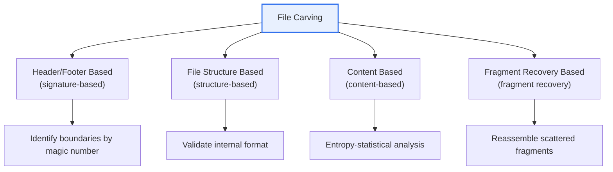
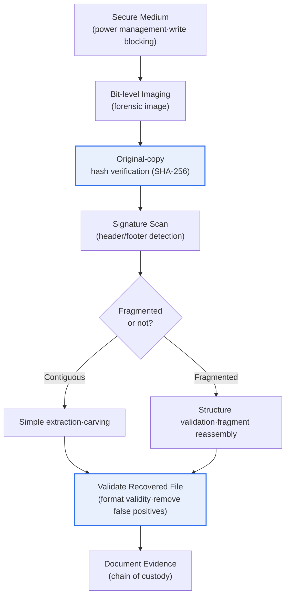

# File Carving

## 1. Overview

### A. Definition

> **File Carving** is a digital-forensics evidence-collection technique that **recovers files from the raw data of a storage medium based on files' inherent characteristics (signatures·internal structure), without relying on the file system's metadata (a file's location·size·name information)**.

The reason file carving is a powerful weapon in forensics lies in the fact that '**even if the file system is erased, files are revived from data fragments**'. To understand this, one must first note how an operating system manages files. When we open a file, in reality the metadata maintained by the file system (NTFS's MFT, ext4's inode, etc.) tells it "this file is stored from which block of the disk over how many bytes." The file system follows this 'index' of metadata to gather scattered data blocks and assemble them into a single file to show us.

Yet here lies a decisive clue for forensics. When a file is deleted or a medium is (quick-)formatted, for performance reasons the system usually **erases only the metadata (index) or changes it to a 'available' mark, while leaving the actual data blocks intact.** From the file system's perspective it is a 'nonexistent file', but the physical data itself remains intact on the disk until new data overwrites that spot. File carving digs into precisely this gap. Since the index is gone, it cannot follow the index, but taking as direct clues the **start marker (header) and end marker (footer)** that each file type uniquely has, and the internal structure, it finds and carves the file out of the raw byte stream.

The most classic example is a JPEG image. Every JPEG file starts with the sequence `FF D8 FF` (SOI, Start Of Image) and ends with `FF D9` (EOI, End Of Image). Therefore, while scanning the entire disk byte by byte, upon encountering `FF D8 FF` you regard that point as the file's start and carve out, as a single file, everything up to the first `FF D9` that appears afterward, recovering a deleted photo. Thus file carving becomes a core means of finding evidence on deleted·damaged·formatted media and plays a decisive role in reviving photos·documents·videos a suspect deleted at a crime scene. [[digital-forensics]]

### B. Background and Characteristics

Behind file carving's development into an independent technique lie two realities. First, **the ubiquity of anti-forensics**. Those attempting to destroy evidence try to erase traces by deleting files or formatting the disk, and in this case ordinary file-system-based recovery tools (undelete) are powerless if the metadata is also damaged. Only carving, which does not rely on the file system, can break through this situation. Second, the evidentiary value of **residual data remaining in unallocated space and slack space**. A disk has a vast region not currently allocated to any file, and, due to the nature of cluster-unit allocation, leftover space between a file's end and the cluster boundary, and fragments of past files often remain there.

The characteristics of file carving can be summed up in three. **File-system independence** — it works regardless of the file-system type (FAT·NTFS·ext4, etc.) and even when the file system itself is damaged. **Raw-data based** — it is based on physical byte patterns, not logical structure. And **vulnerable to fragmentation** — if a file is not stored contiguously on the disk but scattered across several fragments, other files' data interposes between the header and footer, making accurate recovery difficult. This fragmentation problem is file carving's greatest challenge and the reason several advanced techniques emerged.

## 2. Types of File Carving (Four Techniques)

File carving is divided broadly into four techniques according to what it takes as a clue. Below is its overall classification structure.

### A. Header/Footer-Based Technique (Signature-based)

This is the most basic and widely used method. This technique maintains, as a database, the inherent **signature (magic number)** defined per file type, and scans the storage medium from start to finish, carving out the region between the header pattern and the footer pattern. Representative examples are JPEG's `FF D8 FF`~`FF D9` seen earlier, PNG's `89 50 4E 47` (‰PNG), PDF's `25 50 44 46` (%PDF)~`%%EOF`, and ZIP's `50 4B 03 04` (PK).

The advantage of this method is that it is simple and fast, and if you know only the signature you can attempt any file. However, it has two fundamental limitations. First, for file formats with no footer (e.g., some text·executable files), it is hard to judge how far to carve, so using a method that carves up to a set maximum size attaches unnecessary data at the end. Second, and more serious, if a file is **not stored contiguously but fragmented**, unrelated data interposes between the header and footer, and the recovered file is corrupted. For this reason, the header/footer-based approach is reliable only for non-fragmented (contiguous) files.

### B. File-Structure-Based Technique (Structure-based)

To compensate for the limits of header/footer, this technique actively uses the format and structural information inside a file. Many file formats hold, within the header, meta information such as the file size, the offsets of internal sections, and a chunk structure. For example, PNG consists of multiple chunks, and each chunk has a length field and a CRC checksum. Structure-based carving reads this information to compute the file's actual size, validates the chunks' validity, and confirms whether the checksums match, greatly raising recovery accuracy.

The core value of this technique lies in **validation**. It does not merely carve out bytes but confirms "is the carved-out result really a valid file?" against the format specification, reducing false positives and being able to handle even fragmented files to some extent. However, since a separate structure parser must be implemented per file format, the development burden is heavy, and there is the constraint that it cannot be applied to files of an unknown format.

### C. Content-Based Technique (Content-based)

When there is no signature or explicit structure, or when it is damaged, this technique analyzes the content characteristics of the data itself. A representative example is **entropy** analysis. Encrypted·compressed data has high entropy (close to random), plain text has low entropy, and data of a specific format shows an inherent statistical distribution. Based on such statistics·character patterns·byte distributions, it estimates the type of a data region and discriminates boundaries.

The content-based technique has the strength of being able to gauge the rough data type even when the signature is damaged, but it is relatively low in precision and relies on estimation, so it is often used in parallel to assist other techniques. Recently, research using machine learning to classify the file type of a fragment is being actively pursued in this category.

### D. Fragment Recovery Carving

This is the most advanced technique that directly confronts fragmentation, file carving's greatest challenge. When a single file is stored scattered across multiple non-contiguous regions of the disk, one must find the start point with the header and then reassemble the scattered fragments in the correct order. To judge which fragment belongs to which file and in what order they connect, it comprehensively evaluates structure validation·content similarity·continuity between fragments (e.g., the continuity of an image's pixels).

This problem has the nature of combinatorial explosion, so its computational cost is high. Techniques that efficiently handle the common case split into two fragments—such as the '**bifragment gap carving**' proposed by Garfinkel—and methods that use a file format's decoder to validate the validity of reassembly candidates are being researched·applied. In practice, since perfect automatic reassembly is difficult, it is often used in combination with an analyst's manual review.

| Technique | Clue | Strength | Limitation |
|---|---|---|---|
| **Header/Footer based** | Magic number (signature) | Simple·fast, general-purpose | Vulnerable to fragmentation·footerless files |
| **File-structure based** | Internal format·size·checksum | ↑Accuracy via validation, ↓false positives | Requires per-format parser |
| **Content based** | Entropy·statistics·pattern | Can estimate even when signature is damaged | Low precision, auxiliary |
| **Fragment recovery based** | Continuity·similarity between fragments | Recovers fragmented files | High computational cost, hard to fully automate |

## 3. The File Carving Procedure (Process)

Actual carving work is not merely running a tool but a procedure that proceeds step by step while preserving the integrity of evidence. Below is the standard flow from securing the medium to validating the evidence.

Two stages are especially emphasized in this procedure. The first is **hash verification (blue C above)**, which, prior to carving, confirms that the hash values of the original and the copy match, thereby guaranteeing that all subsequent analysis was performed on the same data as the original. The second is **recovered-file validation (H)**, which confirms whether the carved-out result is actually a valid, openable file against the format specification and filters out false positives caused by coincidental signature matches. Only by passing these two gates does the recovered result secure reliability as evidence.

## 4. Uses, Tools, and Limitations

File carving is used in several phases of digital forensics. First, recovery of files a suspect deliberately deleted. Many cases are reported in which deleted images·documents were revived by carving in child-sexual-exploitation cases or corporate-secret-leak cases and used as decisive evidence. Second, securing residual evidence remaining in unallocated space·slack space. Third, data recovery from media with a damaged file system (physical damage, ransomware, etc.).

Representative open-source tools include **Foremost** (developed by the U.S. Air Force Office of Special Investigations), **Scalpel** (a derivative tool that improved the performance of Foremost), and **PhotoRec**, specialized in recovering deleted photos. These can carve various file formats by defining signatures in a configuration file, and commercial integrated forensics tools (EnCase, FTK, X-Ways) also have carving functions built in.

The limitations are also clear. If data has been **overwritten**, physical recovery is impossible (the SSD's TRIM command physically erases data immediately upon deletion, making recovery difficult), and severe fragmentation or applied encryption greatly constrains recovery. Also, **false positives** can occur that mistake data whose signature pattern coincidentally matches as a file, so validation of the recovered result must always follow.

## 5. Advanced — SSD·TRIM Environments and Integrity Issues, Recent Trends

File carving technology faces new challenges as storage media change. In the past HDD era, deleted data remained for a long time until overwritten, so carving's success rate was high. However, **the spread of SSDs** changed the game. SSDs use the **TRIM** command for performance and lifespan management, which physically empties the relevant block in the background (garbage collection) immediately when a file is deleted. As a result, even a short time after deletion, the data often disappears completely and can no longer be recovered by traditional carving. This has further raised the importance of the procedure of cutting power immediately upon discovering a medium in a forensic investigation and imaging it quickly.

Another advanced issue is **integrity and chain of custody**. For data recovered by carving to be admitted as evidence in court, one must prove that the original medium was acquired without change. To this end, a write blocker is used to protect the original, a bit-level copy (forensic image) is made, and the **hash values (MD5/SHA-256) of the original and the copy are confirmed to match**. All carving work is performed on this verified copy, and the recovery process·person in charge·time are recorded to guarantee the evidence's reliability. If integrity procedures are not observed, however important a file is recovered, it can lose admissibility.

Among recent trends, **machine-learning-based fragment classification** draws attention. Research is active on discriminating the file type of a signatureless fragment via deep learning to raise reassembly accuracy. Also, target media are diversifying—carving in cloud·virtualization environments, and flash-memory carving of smartphones·IoT devices—and on the international-standard side, **ISO/IEC 27037** (identification·collection·acquisition·preservation of evidence), which prescribes procedures for handling digital evidence, is referenced as a reliability standard for forensic activities including carving.

## 6. Considerations and Implications

When applying file carving to actual investigation·audit, one must comprehensively consider the following from a professional engineer's perspective.

1. **Coping with fragmentation is the technical core.** If a file is stored scattered across several fragments, accurate recovery is impossible with header/footer-based methods alone. Therefore, run file-structure validation·content analysis·fragment reassembly techniques in parallel and, depending on the situation, cross-use several tools to raise both the recovery success rate and accuracy.

2. **Securing integrity and chain of custody is the premise of legal effect.** No matter how elaborately recovered, without procedural legitimacy it cannot be used as evidence. Strictly observe integrity and chain of custody through the use of write blockers, bit-level imaging, hash-based original-copy identity verification, and work-history recording. [[file-slack]]

3. **You must respond proactively to changes in media characteristics.** Since the SSD's TRIM immediately erases deleted data, the promptness of securing the medium and power management at the time of acquisition govern recovery success. Beyond the traditional HDD-centered approach, you must prepare collection·analysis strategies suited to the characteristics of SSD·flash·cloud respectively.

4. **Composite analysis prepared for anti-forensics·encryption is needed.** Against anti-forensic techniques such as complete deletion (wiping)·encryption·data hiding (steganography), file carving alone has limits. A multifaceted approach is required that combines other techniques—memory forensics·network forensics·log analysis—to secure evidentiary force. [[anti-forensic]]

5. **You must have false-positive management and a validation system.** Since false positives due to coincidental signature matches are unavoidable, standardize a procedure that validates the recovered result by format specification·hash·manual review to prevent adopting wrong evidence.

## References

- Simson Garfinkel, "Carving contiguous and fragmented files with fast object validation", DFRWS, https://www.dfrws.org/
- ForensicsWiki, "File Carving", https://forensics.wiki/file_carving/
- CGSecurity, "PhotoRec", https://www.cgsecurity.org/wiki/PhotoRec
- ISO/IEC 27037, Guidelines for identification, collection, acquisition and preservation of digital evidence

---

> **In one line**: File carving is a forensic technique that *recovers files from the signatures·structure of raw data without file-system metadata*; it has four techniques—header/footer·file structure·content·fragment recovery—and is used to recover deleted·formatted media, with coping with fragmentation·securing integrity·responding to SSD TRIM environments being the key.
