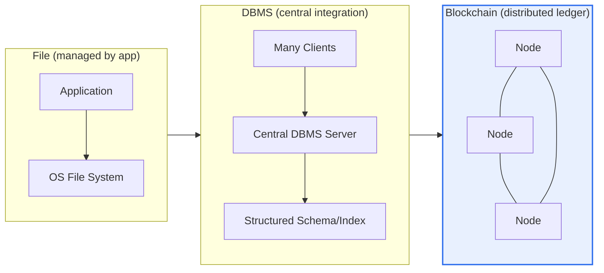
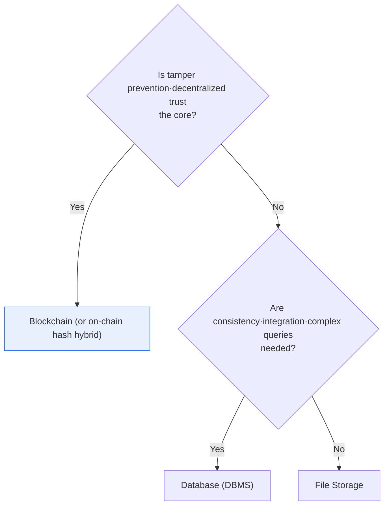

# Data Storage: File · Database · Blockchain Comparison

## 1. Overview

### A. Definition

> Three representative ways to store and manage data: a **file** is file-unit storage by the operating system, a **database (DBMS)** is the integrated·centralized management of schema-structured data, and a **blockchain** is an immutable distributed ledger that stores blocks chained together across many distributed nodes.

The core distinction running through the three methods is '**where the trust of the data is placed**'. In a file, the application manages the format·consistency on its own, so the responsibility for trust lies entirely with the app. In a database, the central DBMS server (and the administrator who operates it) controls the data through access control·transactions·constraints and guarantees trust. By contrast, a blockchain is fundamentally different in that it creates trust through the **consensus of many nodes** without a central administrator. No one can tamper with a record alone, and data once finalized (finality) cannot practically be reverted.

This difference in the 'subject of trust' divides the three properties of integrity·performance·availability differently. Entrusting trust to the app is simple and fast but weak in consistency; entrusting it to a central server obtains strong consistency and optimized performance but makes that server a single point of trust and a potential single point of failure; and entrusting it to the consensus of many nodes obtains tamper resistance and transparency but pays heavily in performance·cost through the overhead of the consensus process. So which method to use always comes down to the requirements question "what level of trust·performance·transparency does this data need?"

### B. Background and Necessity

The nature of data varies. There is data with simple structure and low consistency requirements, such as system configuration files or server logs; there is transaction data where not even the slightest inconsistency is allowed, such as bank account balances·inventory quantities; and there is data whose value arises precisely from 'no one being able to secretly alter it', such as degree·qualification credentials or supply-chain history. The reason the three methods coexist is this diversity. Since no single all-purpose store can optimally satisfy all requirements, one must choose the method suited to the data's nature to simultaneously optimize cost·performance·trust. This selection problem goes beyond a simple conceptual comparison and directly affects the early decisions of system-architecture design, so it is important from a professional engineer's perspective.

Historically too, these three methods emerged sequentially 'to overcome the limits of the previous method.' Early information systems managed data with a file system but hit problems of duplication·inconsistency·concurrency (the so-called data-dependency·redundancy problems) and moved to DBMS after the 1970s. DBMS solved these problems through central integration, but in an environment where multiple parties find it hard to trust one another (multi-party transactions·decentralized services), the new trust problem of 'whom to trust as the center' remained, and after Bitcoin in 2009, blockchain rose as an attempt to solve this with consensus-based decentralization. In other words, the three methods are less substitutes for one another than accumulated options for satisfying different trust·scale requirements.

## 2. The Structure of the Three Methods

The three storage methods differ from the physical·logical structure that holds the data. The structure diagram below shows the flow in which the locus of trust (app → central server → distributed network) becomes more distributed toward the right.

The **file method** stores data in file units, and the format of its content (CSV·JSON·binary, etc.) and its integrity are the responsibility of the application that reads and writes it. Without an intermediate layer called a DBMS, the structure is light and access is direct, but the same data is easily duplicated across many files, and consistency easily breaks if multiple programs modify it simultaneously. With no device to enforce relationships·constraints between data, management cost surges as scale grows. The history of early information systems experiencing 'the limits of the file system' and moving to DBMS originates at this point.

A **database (DBMS)** manages data in an integrated manner in a schema-defined structure (tables·rows·columns for the relational type), and a central server collectively controls transactions·concurrency control·access permissions·backups. Designed to eliminate duplication (normalization) and maintain consistency while many applications share the same data, it has become the de facto standard in most enterprise tasks where consistency matters. However, since all trust is concentrated in this central server, the server administrator has the authority to modify data, and a server failure can lead directly to a service outage, so availability measures such as redundancy·replication are essential.

A **blockchain** holds data in blocks and chains each block together like a chain by including the hash value of the immediately preceding block. Many nodes replicate·store this ledger identically, and a new block can be added only if it passes a consensus algorithm (PoW·PoS, etc.). If you alter the content of any block, its hash changes and the linkage of all subsequent blocks breaks, and to legitimize this you must seize the compute power·stake of the network majority, so tampering is practically impossible. Without a central administrator, it is strong against a specific party's control·censorship, but since all nodes must store the same data and participate in consensus, its storage cost·processing latency is high.

## 3. Detailed Comparison of Integrity·Performance·Availability

Placing the three methods side by side in terms of structure·management subject·integrity·performance·availability makes each one's position clear. The table below is the skeleton of the comparison, and the prose beneath it explains 'why such differences arise.'

| Category | File | Database | Blockchain |
|---|---|---|---|
| **Structure** | File unit | Schema·relational | Block chain (distributed ledger) |
| **Management subject** | Application | Central DBMS | Distributed nodes (decentralized) |
| **Integrity** | Low (duplication·inconsistency) | Transactions (ACID) | Immutability·tamper prevention |
| **Concurrency·integration** | Weak | Strong (concurrency control) | Consensus latency |
| **Performance** | Simple·fast | Optimized via indexes | Slow (consensus overhead) |
| **Availability** | Single point of failure | Handled by redundancy | Decentralized·high availability |
| **Transparency·audit** | Low | Depends on logs | Very high (public verification) |
| **Suitable for** | Simple·small volume | Structured·integrated tasks | Trust-needed·decentralized (transactions·history) |

**The difference in integrity arises from where the device enforcing consistency is.** A file has no enforcing device, so an app's mistake·concurrent access leads directly to inconsistency. A DBMS guarantees consistency at the system level through transactions' ACID (Atomicity·Consistency·Isolation·Durability) and constraints·concurrency control. For example, in an account transfer, it bundles withdrawal and deposit into one transaction to enforce 'all reflected or all canceled.' A blockchain provides a form of integrity via consensus and the hash chain—'a record once finalized does not change'—which is closer to 'post-hoc tamper resistance' of a different grain than a DBMS's consistency.

**The difference in performance splits at the cost of creating trust.** A file reads and writes directly without an intermediate layer, so simple access is fastest. A DBMS quickly processes complex queries even on large volumes of data via indexes·query optimization·caches. A blockchain must have every transaction validated·agreed·replicated by many nodes, so throughput is low. The gap is large even in actual numbers — traditional relational DBs and commercial payment networks process thousands to tens of thousands or more per second, whereas Bitcoin is known to be about 7 per second and Ethereum on the order of tens per second (being improved by layer 2·upgrades), so they are hard to use as is for high-volume·real-time processing.

**The difference in availability is directly tied to the locus of trust.** For a file, the store where the file sits is itself the single point of failure. A DBMS is centralized but copes with failures via replication·clustering·redundancy — though this preparation demands additional design·cost. A blockchain, since many nodes hold the same ledger, has structurally high availability in which the network keeps operating even if some nodes die. That is, the design that 'removed the single point of trust' returns as a strength in terms of availability.

**The transparency·audit characteristics also differ greatly among the three methods.** For a file, it is hard to trace who changed what and when without a separate device; a DBMS can leave a change history if you set an audit log, but that log itself has the limitation that it can be modified with administrator privileges. In a blockchain, all transactions are publicly recorded in the ledger and validated by many nodes, so it is practically impossible for a specific party to secretly erase or alter history after the fact. This 'verifiable transparency' becomes a differentiated value unique to blockchain in situations where 'facts must be shared even with untrustworthy counterparts', such as multi-party transactions·regulatory reporting.

## 4. Selection Criteria and Hybrid Cases

What to use is decided by data requirements. The decision flow below is the judgment order frequently used in practice.

If tamper prevention·transparency·decentralized trust is the core, blockchain is suitable, but performance·storage cost·regulatory response are burdens. If consistency·integration·complex queries·transactions matter, DBMS is optimal, and most enterprise tasks (accounting·ordering·inventory·customer management) fall here. For simple configuration·logs·large-media storage, files (or object storage) are most economical. Real systems use these three in combination.

A point to be especially careful about when judging the choice is not confusing the requirement 'decentralization is needed' with the requirement 'the data is important.' No matter how important the data, if the party managing it is a single trusted institution (a bank·institution server), a DBMS is usually sufficient, and blockchain's benefits instead manifest when 'many participants who find it hard to trust one another' must share one ledger. Conversely, if there is a single participant or it is inside an organization where trust is already established, blockchain easily becomes over-engineering. Missing this distinction leads to choosing the wrong store while chasing only the hype.

Looking at combinations of the three methods in concrete cases makes it clearer. First, in **supply-chain history tracking** (e.g., distribution·food history), original documents·images are kept off-chain (files·object storage) and only the verification hash of each step is put on the blockchain to prove 'who recorded what and when' without tampering. Second, in **authenticity verification of electronic documents·certificates** (graduation certificates·contracts), the document body is kept in the institution's DBMS and its hash (fingerprint) is recorded on the blockchain, catching forgery by later comparing the original and the hash. Third, **logs·media of large-scale services** are stored in file/object storage, while their metadata·index is managed by a DBMS to secure search·aggregation performance. Thus, the role division of 'heavy originals in a cheap·fast place, trust evidence in a tamper-free place' is a realistic design.

## 5. Advanced — On-chain/Off-chain Hybrid and Recent Trends

Squarely acknowledging blockchain's performance·storage limits while taking only its trust characteristics is the **on-chain/off-chain hybrid** pattern. Large original data (documents·images·bulk records) is stored off-chain (DBMS·files·the distributed file system IPFS, etc.), and **only the data's hash value (fingerprint) is put on-chain**. If the original changes even slightly, the hash differs, so merely comparing the on-chain hash with the off-chain original lets you verify whether it was tampered with. This way, you avoid the cost·latency of putting large volumes on a blockchain while preserving the core value of 'provability.'

This hybrid thinking has recently permeated databases themselves. Some commercial·open-source DBMSs build in 'immutable ledger tables' or cryptographic verification (hash chain) functions, seeking to provide part of the 'tamper detection' characteristic within a central DB even without blockchain. This targets the middle demand of 'we do not need decentralization, but we want to leave tamper evidence' and shows that the boundaries of storage methods are not fixed but evolve by absorbing one another's strengths to suit requirements.

From a professional engineer's perspective, recent trends worth noting are as follows. First, **performance scaling (layer 2)** — the Ethereum camp raises throughput via layer 2 such as rollups (Optimistic·ZK-Rollup), processing many transactions off-chain and recording only summaries on-chain. Second, **enterprise permissioned blockchains** — private/consortium chains such as Hyperledger Fabric restrict participating nodes to reduce consensus overhead and meet regulatory·privacy requirements. Third, **conflict with data regulation** — blockchain's immutability conflicts with the 'right to be forgotten (right to erasure)' of privacy law, so a design that never puts personal-data originals on-chain and keeps only hashes·references has become the de facto standard recommendation. Fourth, **Polyglot Persistence** — an approach of using relational DB·NoSQL·files·blockchain separately by data nature, even within a single system, is becoming common. (Since the latest throughput·standard figures of individual projects change quickly, it is desirable to confirm against each platform's latest official documents in actual design.)

## 6. Considerations and Implications

From a professional engineer's perspective, the comparison of the three storage methods should be read not as 'the technology itself' but as the problem of designing 'a balance of trust·performance·cost that fits the requirements.'

1. **Blockchain is not a panacea.** It has value only when tamper prevention·transparency·decentralized trust are truly needed (supply-chain tracking, certificates, multi-party transaction history). Using blockchain for general business data that does not need this yields only performance degradation·storage cost·operational complexity—an inferior alternative to a DBMS. Coolly judging 'is blockchain needed' first is the starting point of design.

2. **A hybrid is the realistic solution.** The compromise of keeping large originals off-chain (DBMS·files) and only the verification hash on-chain is the de facto standard that catches performance·cost and trust at once. Rather than insisting on pure on-chain storage, the design sense of minimizing 'what to put on-chain' is important.

3. **Data-nature-based design (polyglot) should be a principle.** Even a single system uses files·DB·blockchain separately according to data type, taking only each method's strengths and avoiding its weaknesses. Here, data governance that classifies the data's consistency·lifespan·access pattern·regulatory requirements must come first.

4. **Regulation·compliance must be treated as a first-class requirement of storage-method selection.** In particular, blockchain's immutability conflicts with the right to erasure of personal data, so the principle of excluding personally identifiable information from on-chain and keeping only hashes·references must be nailed down at the architecture stage. Domestic and international privacy regulation and financial-supervision requirements are strong constraints that govern store selection.

5. **You must also consider total cost of ownership (TCO) and operational maturity.** Blockchain·distributed systems have high development·operations·staffing costs, and their technical maturity·standards are still fluid. Rather than adopting a new technology by looking only at its hype, a trade-off judgment is needed that weighs the organization's operational capability and long-term maintenance cost together.

## References

- AWS, "File·Block·Object Storage and Database Concepts" — https://aws.amazon.com/products/storage/
- Hyperledger Foundation, "Hyperledger Fabric Documentation" — https://hyperledger-fabric.readthedocs.io/
- Ethereum, "Scaling / Layer 2" — https://ethereum.org/en/developers/docs/scaling/

---

> **In one line**: File (app-managed·simple·fast)·DBMS (central integration·ACID·optimized)·blockchain (distributed ledger·immutability·decentralized) diverge in integrity·performance·availability according to 'where trust is placed'; DBMS suits integration·consistency·complex queries and blockchain suits tamper prevention·transparency·decentralized trust, but in reality one compromises with an on-chain-hash + off-chain-original hybrid and data-nature-based polyglot storage.
