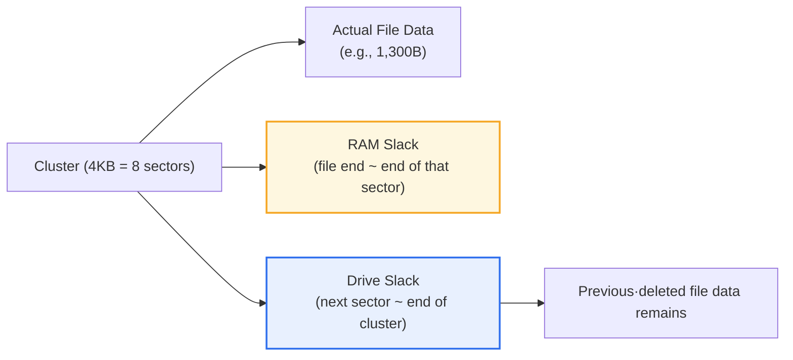
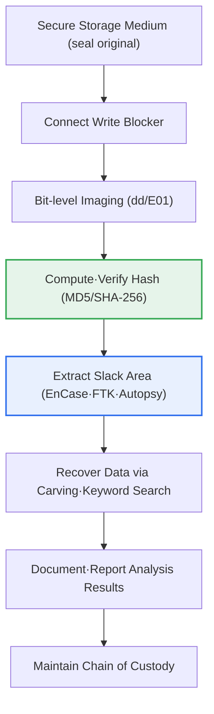

# File Slack

## 1. Overview

### A. Definition
> **File slack** is the **unused empty area** left in the last allocated space when a file does not exactly fill its storage unit (cluster); in digital forensics it is an evidence space where deleted·hidden past data may remain, and at the same time a vulnerable space that can be abused for anti-forensics (data hiding).

The meaning file slack holds in forensics lies in the fact that '**past data lies hidden intact in a discarded gap**'. A storage device does not manage data densely byte by byte but allocates space in fixed-size blocks called **clusters (allocation units, e.g., NTFS's default 4KB)** that the file system sets. The minimum allocation unit is set large for performance and management efficiency, but the problem is that real-world file sizes are almost never an integer multiple of this unit. For example, if you store a 1KB text file in a 4KB cluster, the space the file actually uses is only 1KB, and **the remaining 3KB becomes wasted space that this file occupies but does not use**. This leftover space is precisely file slack.

The key is that this wasted space is **not completely initialized** at the time the file is stored. The operating system often overwrites only the region the new file's data occupies and does not touch the slack area after it. As a result, data fragments of another file that previously existed in that cluster, or, in the past, residual contents of memory (RAM), can remain intact. The user thinks they deleted the file or overwrote it with a new one, but unerased traces of the past remain in the slack space. A forensic investigator precisely analyzes this area to recover deleted document fragments, hidden information, and clues to past activity, while conversely an attacker abuses this 'invisible space' in an anti-forensic technique of hiding malware or leaked data.

### B. Background and Principle of Occurrence
File slack is not some special defect but a **structural by-product that inevitably occurs in block-based storage structures**. Leftover space arises when the size difference between the **sector** (the physical minimum recording unit of a storage device—traditionally 512 bytes, in the latest disks a 4K sector = Advanced Format) and the **cluster** (a bundle of several sectors, the logical unit by which the file system manages space) overlaps with the mismatch between the cluster size and the actual file size. That is, file slack is space that is 'physically allocated to a file but logically not used by the file', and this definitional gap preserves previous data, giving it value as evidence.

The occasion this phenomenon came to receive special attention from a forensic perspective is the fact that information remains in an area that users and ordinary deletion tools cannot access. Even if you delete a file in the file explorer or do an ordinary (quick) format, the residual data left in slack physically remains, so it can be recovered if you read down to the low-bit level with a dedicated tool. For this reason, file slack is treated, along with **unallocated space** and **deleted-file recovery**, as one of the three core analysis targets of storage-medium forensics.

## 2. The Layered Structure of File Slack

To understand file slack accurately, you must follow the layers of storage space (sector → cluster → file system → volume) and distinguish at which layer slack arises. The structure diagram below shows how the actual file data, RAM slack, and drive slack are arranged inside a single cluster.

File slack is subdivided broadly into four types according to where it occurs and what fills it. **The most frequently discussed are RAM slack and drive slack**, and from an expanded perspective it includes file-system slack·volume slack. Below, each is described centering on its principle of occurrence and forensic implication.

### A. RAM Slack (Sector Slack)
RAM slack is the space from the point where the file's actual data ends to **the end of the last sector that data spans**. Since a storage device can record data only in sector (512-byte) units, if, for example, the file's last fragment is 200 bytes, the remaining 312 bytes must be filled with something to complete one sector. In the days of MS-DOS·early Windows, the contents of the memory buffer (RAM) just before the disk write were recorded in this spot as is, which is why it was named 'RAM slack', and there were actual cases in which sensitive information such as passwords·just-edited content was accidentally exposed here.

That said, the latest operating systems, recognizing this risk, generally **zero-fill (pad with 0x00)** the RAM slack area so that residual memory contents are not leaked. Therefore it is accurate to understand that today the possibility of recovering past memory data from RAM slack has become lower than in old systems. Nevertheless, RAM slack still has analytical value as a reference point for **determining the file's exact end position (EOF)** and distinguishing the boundary between the drive slack that follows and the actual data.

RAM slack is also called 'sector slack'. Its size is the sector size minus the file's usage of the last sector, arising up to a maximum of 511 bytes (for a 512B sector). Individual sizes are small, but for an entire real-world system with hundreds of thousands of files, it becomes an analysis target that cannot be ignored.

### B. Drive Slack
Drive slack is the space remaining from the sector after the file's last sector (i.e., the point where RAM slack ends) to **the end of the cluster**. The most important slack in forensics is precisely this area, and the reason is that **the data of a deleted file that previously used that cluster remains almost intact here**. When the operating system places a new file in a cluster, it does not bother erasing the trailing sectors that the file data does not reach, so the contents of the past file are preserved 'like a ghost.'

For example, suppose a 1,300-byte file was stored in a 4KB cluster (8 sectors). The file spans the first 3 sectors (1,536 bytes), and the trailing 236 bytes of the third sector become RAM slack (padded with 0). And **the fourth through eighth sectors (2,560 bytes) all become drive slack**, where text·image fragments of another file that used to be there can remain. From this 2,560 bytes, an investigator recovers deleted email phrases, parts of documents, log fragments, and the like, obtaining decisive clues to a case.

Drive slack is also a target of anti-forensics. An attacker can deliberately record data in this space after a normal file, creating a hidden channel that does not appear in an ordinary file listing. For this reason, slack hiding is classified, along with steganography, as a representative data-hiding technique.

### C. File-System Slack and Volume Slack
Slack occurs not only inside a cluster but also at larger units. **File-system slack** is the leftover area at the end of a partition that the file system cannot manage in clusters and leaves behind when the partition's total size does not divide evenly by an integer multiple of the cluster size. **Volume slack** refers to space that is not allocated to partitions and remains at the volume (disk) level. Because both areas are not normally accessed by the file system, deletion traces can be preserved for a long time or abused for data hiding, so they must always be examined together when imaging and analyzing the entire storage medium.

Thus, slack occurs by a different principle at each layer, and forensic analysis is completed only by comprehensively scanning the medium's entire slack layers—not by looking only at the slack of a specific file. The table below compares the four kinds of slack, but do not understand it from the table alone; read it together with the prose above so that it becomes clear 'why' each area occurs where it does.

| Category | Location of Occurrence | Content That Fills It | Forensic Perspective |
|---|---|---|---|
| **RAM slack** | File end ~ end of that sector | (Past) residual memory / (Present) 0 padding | Determine file-end boundary; sensitive-info exposure in old systems |
| **Drive slack** | Next sector ~ end of cluster | Previous·deleted file data | Core of deleted-data recovery, hiding target |
| **File-system slack** | Leftover at partition end | Previous format·residual data | Examine when imaging the whole medium |
| **Volume slack** | Unallocated volume area | Partition-deletion traces, etc. | Target for hiding·recovery |

## 3. The Forensic Analysis Procedure and Anti-Forensic Threats

File slack analysis is not done on the fly but is performed on top of a **formalized procedure to guarantee the legal effect of evidence**. The process diagram below shows the flow from securing the storage medium to slack analysis·reporting.

The starting point of the procedure is **preserving the integrity of the original**. Once the storage medium is secured, a write blocker is immediately attached so no change can be made to the original, and analysis is performed on its **bit-level copy image (dd·E01 format)** rather than the original. Right after imaging, the MD5·SHA-256 hash values are computed and kept, and at the end of analysis they are recomputed to show that the values match, thereby proving that 'the evidence was not damaged during the analysis process.' Without this integrity verification, however decisive the data recovered from slack, it is hard to have its admissibility recognized in court.

Thereafter, using tools such as EnCase, FTK, the open-source Autopsy (The Sleuth Kit), and Foremost, the slack area is pinpointed·extracted, and **file carving** and keyword search are run in parallel to reconstruct deleted file fragments using header/footer signatures as clues. For example, finding a JPEG's start signature (FF D8 FF) in the slack area to recover part of an image, or searching a specific account-number·name string across the slack to confirm leakage circumstances.

On the opposite side lies the **anti-forensic** threat. An attacker hides data in slack to evade detection and, conversely, to obstruct investigation, overwrites even the slack with a wiping tool to destroy evidence. Therefore forensics and anti-forensics are in a spear-and-shield relationship contesting the same space, slack, and an organization's security officer must consider both complete deletion (wiping) of sensitive information and slack inspection.

| Perspective | Content |
|---|---|
| **Evidence recovery** | Recover deleted·previous file fragments, discover hidden data, carving·keyword search |
| **Data-hiding threat** | Attacker hides information in drive slack·volume slack (anti-forensics) |
| **Evidence-destruction threat** | Remove traces by wiping that overwrites even the slack |
| **Analysis tools** | Extract·analyze slack with EnCase, FTK, Autopsy (TSK), Foremost, etc. |

## 4. Advanced — The Impact of Changes in Storage Media·Environment on Slack Analysis

File slack is an old concept, but its analytical value and methods change with shifts in storage technology and computing environments, so from a professional engineer's perspective it is worth noting the latest currents.

First, the spread of **SSDs and the TRIM command** shakes the premise of slack analysis. An HDD physically retains deleted data until overwritten, but an SSD tends to empty deleted blocks in advance in the background (garbage collection) via the TRIM command for performance·lifespan management. As a result, on an SSD, residual data in slack·unallocated areas may be erased within a short time after deletion, so the possibility of recovery can be much lower than on an HDD. This does not mean 'deletion = unrecoverable', but it shows that analysis strategy must differ according to medium characteristics.

Second, the **cluster-size setting** governs the total amount of slack. In a system with many small files, setting the cluster large (e.g., 64KB) creates large slack per file, lowering storage efficiency but forensically increasing residual data. Conversely, setting the cluster small reduces slack waste but increases management overhead. In an actual large-scale server handling millions of small files, this trade-off directly affects storage cost and performance.

Third, the expansion of **encryption·cloud environments**. A medium to which full-disk encryption (BitLocker, FileVault) is applied has its entire area, including slack, in ciphertext even if imaged, so without the decryption key slack analysis itself is meaningless. Also, when data is stored distributed in cloud storage, it is hard to apply the traditional concept of slack per physical medium as is, so forensics is trending toward a log·API·snapshot focus.

Fourth, as a **practical application case**, slack analysis often plays a decisive role in corporate information-leak·insider investigations. For example, if a departing employee deletes a trade-secret document and overwrites that spot with a harmless file to attempt concealment, text fragments of the original document are recovered from the new file's drive slack, proving the leakage circumstances. This is a passage that vividly shows the perception gap between 'the person who believes they deleted it' and 'the investigator who looks for traces', and it explains why an organization must have both a complete-deletion policy and media-export control.

## 5. Considerations and Implications

File slack is not mere 'leftover space' but a topic connected to the whole of lifecycle management—data creation·deletion·residue. From a professional engineer's perspective, one must comprehensively consider the following.

1. **'Deletion' and 'sanitization' are different.** File deletion or an ordinary format merely tidies the file system's metadata and leaves the actual data of slack·unallocated areas. To surely eliminate sensitive information, you must choose a method suited to the data's sensitivity among overwriting-type wiping (e.g., DoD 5220.22-M multiple overwrites, NIST SP 800-88 Purge), encrypt-then-destroy-key (Crypto Erase), and physical destruction. [[anti-forensic]]

2. **Since slack can become a hidden channel, it must be included among security-control targets.** So that DLP (data-leakage prevention)·EDR do not monitor only file units and miss slack hiding, it is desirable to run full-medium inspection and anomalous-storage-pattern detection in parallel. In particular, an inspection system that considers the possibility of slack hiding is needed in insider-leak response.

3. **Procedural legitimacy for securing admissibility is as important as technical recovery.** However decisive the data recovered from slack, if the procedures of write blocking·imaging·hash verification·chain of custody are not observed, it loses legal effect. The reliability of the tool (verified commercial/open-source) and the analyst's qualifications must also be guaranteed together. [[digital-forensics]]

4. **An analysis strategy tailored to medium·environment characteristics is needed.** Since the validity of traditional slack analysis changes with the SSD's TRIM, full-disk encryption, cloud distributed storage, and the like, you must, immediately upon securing a medium, judge the power state·whether it is encrypted·the medium type and adjust priorities—such as securing volatile evidence (memory) first.

5. **The trade-off between storage efficiency and forensic value must be recognized at the design stage.** Since the cluster-size setting simultaneously affects storage waste (total slack amount) and performance·recoverability, it is desirable to decide it by considering together the system's file characteristics (whether there are many small files) and the data-retention/destruction policy.

## References
- Korea University Digital Forensic Research Center, Digital Forensic WIKI — Slack: http://forensic.korea.ac.kr/DFWIKI/index.php/Slack
- NIST SP 800-88 Rev.1, Guidelines for Media Sanitization: https://csrc.nist.gov/publications/detail/sp/800-88/rev-1/final

---

> **In one line**: File slack is *the space left when a file does not fully fill a cluster*, divided into RAM slack·drive slack·file-system slack·volume slack; deleted·previous data remains in it, making it core forensic evidence for recovering deleted files while also being abusable for anti-forensic hiding, so complete deletion (wiping) and integrity-procedure-based slack analysis are both required.
